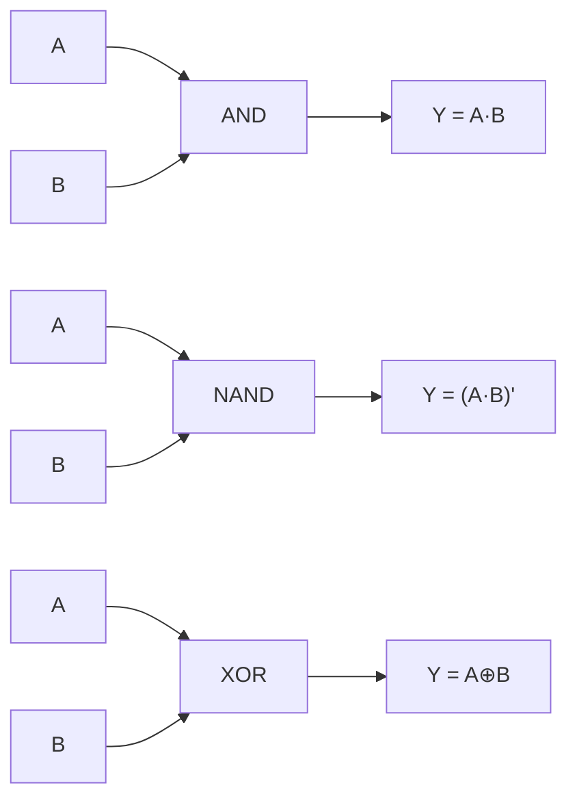
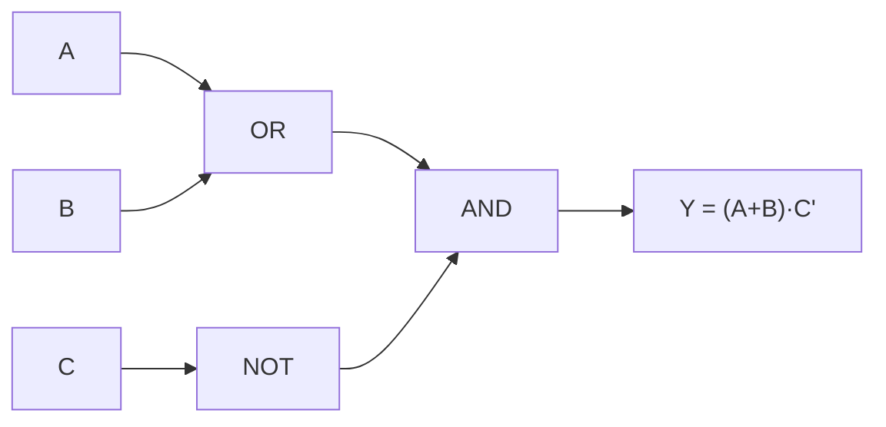

## Objetivos de Aprendizagem

- Definir uma porta lógica como a realização física, em hardware, de um único conectivo booleano, e explicar o que significa uma tabela verdade servir ao mesmo tempo de especificação e de teste de aceitação de uma porta.
- Desenhar e interpretar os símbolos esquemáticos padrão e as tabelas verdade de AND, OR, NOT, buffer, NAND, NOR, XOR e XNOR.
- Escrever a expressão booleana correspondente a cada uma das oito portas padrão, e vice-versa.
- Estender uma porta AND, OR, NAND e NOR de 2 entradas para 3 ou mais entradas, e construir a tabela verdade correspondente.
- Derivar a tabela verdade do XOR a partir dos primeiros princípios e mostrar que o XOR é equivalente a A·B′ + A′·B.
- Explicar, em nível conceitual, por que NAND e NOR são construídos com menos transistores que AND e OR na tecnologia CMOS, sem precisar de detalhes em nível de transistor.

## Contexto e Motivação

O conceito anterior tratou AND, OR e NOT puramente como operadores algébricos, sujeitos a leis como comutatividade, associatividade e o teorema de De Morgan, manipulados inteiramente no papel. Este conceito dá o salto do símbolo para o circuito: uma **porta lógica** é um pequeno pedaço de hardware (historicamente um relé, depois uma válvula, e hoje um punhado de transistores) que recebe uma ou mais entradas elétricas de dois valores (0/1) e produz uma saída de dois valores segundo exatamente uma função booleana. Onde a álgebra booleana deixa você reescrever `¬(A ∧ B)` como `¬A ∨ ¬B` no papel com total liberdade, uma porta fica comprometida no momento em que é fabricada: uma porta NAND fisicamente *é* a função ¬(A∧B), ligada em silício, e não calcula mais nada. A álgebra diz quais reescritas são válidas; as portas são o que de fato existe no chip quando você para de reescrever e começa a construir.

Essa distinção importa porque é o primeiro lugar da disciplina em que um objeto matemático abstrato (uma função booleana) é pareado com uma implementação física concreta e com uma forma de testar que a implementação está correta. Uma tabela verdade não é só um recurso didático para raciocinar sobre um conectivo: para uma porta real, fabricada, a tabela verdade *é* a especificação que o chip deve cumprir por contrato, e é exatamente o teste de aceitação que um engenheiro rodaria (aplicar toda combinação de entrada, conferir toda saída) para verificar um lote de peças fabricadas. Essa relação de especificação igual a teste reaparece em toda escala maior desta disciplina: uma tabela verdade especifica uma porta, e mais tarde uma ISA completa especifica uma CPU, cada uma conferida tentando entradas de forma exaustiva e confirmando as saídas prometidas.

Com a biblioteca padrão de portas fixada (AND, OR, NOT, NAND, NOR, XOR, XNOR e o buffer simples), o próximo conceito desta disciplina faz uma pergunta bem mais afiada: você precisa mesmo de sete tipos distintos de porta, ou um deles sozinho consegue construir todos os outros? A resposta, vista em "NAND como Porta Universal", é que um único tipo de porta basta para tudo, e é esse o motivo inteiro de chips reais serem fabricados com um único bloco de construção repetido, e não com sete diferentes. Nada desse argumento faz sentido, porém, antes que as portas individuais e suas tabelas verdade (o assunto deste conceito) estejam definidas com precisão.

## Teoria Central

### Uma porta como hardware físico de um conectivo booleano

Uma **porta lógica** é um dispositivo físico com uma ou mais entradas binárias e exatamente uma saída binária, em que a saída é uma função fixa das entradas em todo instante (ignorando o minúsculo atraso de propagação que o hardware real sempre tem). As portas são a encarnação física dos conectivos booleanos (∧, ∨, ¬, ⊕) estudados algebricamente no conceito anterior. Nos diagramas de lógica digital, cada tipo de porta tem um símbolo esquemático padronizado, e cada porta é totalmente descrita pela sua **tabela verdade**: uma lista exaustiva de toda combinação de entrada possível pareada com a saída correspondente.

Duas propriedades tornam a tabela verdade especial, além de ser uma referência conveniente:

1. **Ela é a especificação.** A tabela verdade de uma porta é a definição completa e sem ambiguidade do que a porta deve fazer; não é preciso nenhuma informação adicional para descrever o comportamento de uma porta ideal.
2. **Ela é o teste de aceitação.** Para uma porta de N entradas há exatamente `2^N` combinações de entrada, um número finito e normalmente pequeno; testar uma porta fabricada tentando cada linha da sua tabela verdade e conferindo a saída é uma verificação completa e exaustiva, não uma amostra.

As portas modernas são construídas com transistores (a tecnologia CMOS usa redes de transistores PMOS e NMOS), mas esta disciplina trata as portas como **primitivas** daqui em diante: blocos de construção atômicos cuja estrutura interna de transistores não é necessária para raciocinar sobre os circuitos construídos por cima delas, do mesmo jeito que um programador trata uma instrução de CPU como primitiva sem precisar conhecer sua implementação microarquitetural.

### As portas padrão de uma e duas entradas

O **buffer** (ou "driver") é a porta trivial de uma entrada: a saída é igual à entrada, `Y = A`. Ele não é uma operação lógica no sentido da álgebra booleana (calcula a função identidade), mas existe fisicamente para restaurar a intensidade do sinal ou acrescentar um atraso controlado.

| A | Y = A |
|---|---|
| 0 | 0 |
| 1 | 1 |

O **NOT** (inversor) é a porta de uma entrada que realiza a negação, `Y = A′` (também escrito ¬A).

| A | Y = A′ |
|---|---|
| 0 | 1 |
| 1 | 0 |

O **AND** realiza a conjunção, `Y = A · B`, verdadeira só quando toda entrada é verdadeira.

| A | B | Y = A·B |
|---|---|---|
| 0 | 0 | 0 |
| 0 | 1 | 0 |
| 1 | 0 | 0 |
| 1 | 1 | 1 |

O **OR** realiza a disjunção, `Y = A + B`, verdadeira quando pelo menos uma entrada é verdadeira.

| A | B | Y = A+B |
|---|---|---|
| 0 | 0 | 0 |
| 0 | 1 | 1 |
| 1 | 0 | 1 |
| 1 | 1 | 1 |

O **NAND** ("NOT AND") é a composição Y = (A·B)′: inverte o que o AND produziria.

| A | B | Y = (A·B)′ |
|---|---|---|
| 0 | 0 | 1 |
| 0 | 1 | 1 |
| 1 | 0 | 1 |
| 1 | 1 | 0 |

O **NOR** ("NOT OR") é Y = (A+B)′: inverte o que o OR produziria.

| A | B | Y = (A+B)′ |
|---|---|---|
| 0 | 0 | 1 |
| 0 | 1 | 0 |
| 1 | 0 | 0 |
| 1 | 1 | 0 |

O **XOR** ("OU exclusivo") é verdadeiro exatamente quando suas entradas diferem, Y = A ⊕ B.

| A | B | Y = A⊕B |
|---|---|---|
| 0 | 0 | 0 |
| 0 | 1 | 1 |
| 1 | 0 | 1 |
| 1 | 1 | 0 |

O **XNOR** ("NOR exclusivo") é verdadeiro exatamente quando suas entradas concordam, Y = (A⊕B)′, o complemento do XOR.

| A | B | Y = (A⊕B)′ |
|---|---|---|
| 0 | 0 | 1 |
| 0 | 1 | 0 |
| 1 | 0 | 0 |
| 1 | 1 | 1 |

### Portas de várias entradas

AND, OR, NAND e NOR se generalizam naturalmente para além de duas entradas porque ∧ e ∨ são associativos: uma porta AND de 3 entradas dá saída 1 só quando as três entradas valem 1 (`Y = A·B·C`), e uma porta OR de 3 entradas dá saída 1 quando pelo menos uma entrada vale 1 (`Y = A+B+C`). Suas tabelas verdade simplesmente crescem para `2^N` linhas com N entradas, mas a regra definidora continua sendo "todas as entradas verdadeiras" (AND) ou "pelo menos uma entrada verdadeira" (OR). Um NAND de 3 entradas é o complemento do AND de 3 entradas, `Y = (A·B·C)′`, e o mesmo vale para um NOR de 3 entradas. Bibliotecas de portas reais costumam incluir variantes de 2, 3, 4 e 8 entradas de AND, OR, NAND e NOR, porque é mais barato fabricar uma porta larga do que encadear várias estreitas quando só a saída final importa. XOR e XNOR costumam ser mantidos com 2 entradas na maioria das bibliotecas de portas; funções de paridade mais largas são mais frequentemente construídas encadeando XORs de 2 entradas do que como uma única porta física.

### Por que NAND e NOR são as portas "baratas" em CMOS

Na fabricação CMOS, NAND e NOR são construídas diretamente com um único estágio de transistores (uma rede de pull-up de transistores PMOS e uma rede de pull-down de transistores NMOS), enquanto AND e OR exigem um estágio inversor adicional acrescentado a um núcleo NAND ou NOR (AND = NAND seguido de NOT; OR = NOR seguido de NOT). Uma porta NAND ou NOR, portanto, usa menos transistores e chaveia mais rápido que a porta AND ou OR correspondente construída a partir dela. Esse fato (de que as portas "invertidas" são as fisicamente primitivas, e não as portas "positivas" que a maioria das pessoas acha mais intuitivas para raciocinar primeiro) é a semente física da afirmação central do próximo conceito: que chips reais padronizam o NAND (ou o NOR) como seu único bloco de construção universal, em vez de AND, OR e NOT como três peças separadas.

## Exemplos Resolvidos

### Exemplo 1: derivando a tabela verdade do XOR e mostrando que XOR = A·B′ + A′·B

**Passo 1: construa a tabela verdade a partir da definição** "verdadeiro exatamente quando as duas entradas diferem":

| A | B | A⊕B |
|---|---|---|
| 0 | 0 | 0 |
| 0 | 1 | 1 |
| 1 | 0 | 1 |
| 1 | 1 | 0 |

**Passo 2: leia a expressão a partir das linhas em que a saída vale 1.** A linha 2 (A=0, B=1) contribui com o termo A′·B (A vale 0, então A′ vale 1; B vale 1). A linha 3 (A=1, B=0) contribui com o termo A·B′. Somando as linhas que contribuem (é exatamente a construção soma de produtos): `Y = A·B′ + A′·B`.

**Passo 3: verifique a expressão derivada contra cada linha da tabela verdade original.**

- A=0, B=0: `A·B′ = 0·1 = 0`; `A′·B = 1·0 = 0`; soma = 0. Bate com a tabela (0). ✓
- A=0, B=1: `A·B′ = 0·0 = 0`; `A′·B = 1·1 = 1`; soma = 1. Bate com a tabela (1). ✓
- A=1, B=0: `A·B′ = 1·1 = 1`; `A′·B = 0·0 = 0`; soma = 1. Bate com a tabela (1). ✓
- A=1, B=1: `A·B′ = 1·0 = 0`; `A′·B = 0·1 = 0`; soma = 0. Bate com a tabela (0). ✓

As quatro linhas concordam, então `A⊕B = A·B′ + A′·B` está confirmado, uma identidade usada de novo mais adiante na construção de somadores com XOR.

### Exemplo 2: listando as portas e a tabela verdade de Y = (A + B) · C′

**Passo 1: identifique as portas necessárias, na ordem em que o sinal flui.** A expressão tem três operações: um OR de A e B, um NOT de C e um AND que combina esses dois resultados. Então o circuito precisa de: uma porta OR de 2 entradas, uma porta NOT (inversor) e uma porta AND de 2 entradas, três portas no total.

**Passo 2: ligue-as.** A e B alimentam a porta OR, produzindo um sinal intermediário `A+B`. C alimenta a porta NOT, produzindo `C′`. A saída da porta OR e a saída da porta NOT alimentam ambas a porta AND final, produzindo `Y = (A+B)·C′`.

**Passo 3: construa a tabela verdade.** Há 3 entradas, portanto 8 linhas.

| A | B | C | A+B | C′ | Y=(A+B)·C′ |
|---|---|---|---|---|---|
| 0 | 0 | 0 | 0 | 1 | 0 |
| 0 | 0 | 1 | 0 | 0 | 0 |
| 0 | 1 | 0 | 1 | 1 | 1 |
| 0 | 1 | 1 | 1 | 0 | 0 |
| 1 | 0 | 0 | 1 | 1 | 1 |
| 1 | 0 | 1 | 1 | 0 | 0 |
| 1 | 1 | 0 | 1 | 1 | 1 |
| 1 | 1 | 1 | 1 | 0 | 0 |

Lendo a última coluna: Y vale 1 exatamente nas três linhas em que (A+B) vale 1 e C vale 0, batendo com a intuição: a saída vale 1 sempre que pelo menos um entre A e B está ligado e C não está.

### Exemplo 3: mostrando que a tabela verdade do NAND é exatamente NOT(AND)

**Passo 1: escreva a tabela verdade do AND** e, ao lado, inverta cada valor de saída.

| A | B | A·B | (A·B)′ |
|---|---|---|---|
| 0 | 0 | 0 | 1 |
| 0 | 1 | 0 | 1 |
| 1 | 0 | 0 | 1 |
| 1 | 1 | 1 | 0 |

**Passo 2: compare coluna a coluna com a tabela verdade padrão do NAND dada antes** na Teoria Central: as linhas leem (0,1), (1,1), (1,1), (0,0) para (A·B, NAND) nas quatro combinações de entrada, idêntico ao pareamento (A·B, (A·B)′) acima em cada linha.

**Passo 3: conclua.** Como as duas tabelas verdade concordam em cada uma das 4 linhas (uma checagem exaustiva, não uma amostra, pela propriedade de teste de aceitação da Teoria Central), NAND(A,B) = (A·B)′ = ¬(A∧B) fica verificado como identidade, e não só como convenção de nome. A mesma comparação linha a linha, aplicada à tabela do OR com cada saída invertida, verificaria igualmente que NOR(A,B) = (A+B)′.

## Equívocos Comuns e Armadilhas

- **"Uma porta e um conectivo booleano são a mesma coisa."** São muito relacionados, mas não idênticos: ∧, ∨, ¬ são operadores matemáticos que existem independentemente de qualquer realização física, enquanto uma porta é um pedaço específico de hardware construído para calcular um deles. A distinção importa quando entram em cena o atraso de propagação, o fan-out e o consumo de energia, propriedades que um conectivo matemático simplesmente não tem.
- **"NAND e NOR são portas exóticas e secundárias, já que AND/OR/NOT parecem mais fundamentais."** No hardware CMOS é o contrário: NAND e NOR são construídas diretamente com um estágio de transistores, enquanto AND e OR exigem um inversor extra acrescentado a um núcleo NAND ou NOR, o que torna NAND/NOR as primitivas fisicamente mais baratas e mais rápidas. Tratar AND/OR como "básicas" é um hábito trazido da aula de matemática, não do processo de fabricação.
- **"XOR significa só 'ou', de forma solta."** O OR simples é verdadeiro quando pelo menos uma entrada vale 1, incluindo quando ambas valem 1; o XOR é verdadeiro só quando as entradas diferem, então XOR(1,1) = 0, enquanto OR(1,1) = 1. Confundir os dois é uma fonte comum de bugs lógicos quando o XOR deveria testar "exatamente uma destas condições vale".
- **"Uma tabela verdade com N entradas precisa de N linhas."** Ela precisa de `2^N` linhas: toda combinação possível das N entradas binárias, não uma linha por entrada. Uma porta de 3 entradas tem 8 linhas, não 3; esquecer isso é uma fonte comum de tabelas verdade incompletas.
- **"O XNOR é a mesma coisa que aplicar NOT a cada entrada do XOR, ou seja, XNOR(A,B) = XOR(A′,B′)."** O XNOR é o complemento da *saída* do XOR, `(A⊕B)′`, e não o XOR aplicado a entradas complementadas. Acontece que `XOR(A′,B′) = XOR(A,B)` (complementar as duas entradas não muda se elas diferem), então isso pode parecer acidentalmente consistente no caso de 2 entradas, mas não é a mesma construção e não se generaliza para outras portas.
- **"Uma porta buffer é inútil, já que Y=A não faz nada."** Um buffer não faz nenhuma transformação booleana, mas fisicamente pode restaurar os níveis de tensão de um sinal enfraquecido e acrescentar um atraso controlado e previsível, funções de hardware reais e necessárias que a fórmula booleana sozinha não captura.

## Resumo

Uma porta lógica é a realização física, em hardware, de um único conectivo booleano, e sua tabela verdade serve ao mesmo tempo de especificação completa e de teste exaustivo usado para verificá-la, um padrão (especificar com uma tabela, testar tentando cada linha) que se repete em toda escala maior desta disciplina. A biblioteca padrão cobre o buffer e o NOT como portas de uma entrada, e AND/OR/NAND/NOR/XOR/XNOR como portas de duas entradas (e, no caso de AND/OR/NAND/NOR, extensíveis livremente para N entradas), cada uma com uma tabela verdade e uma expressão booleana fixas, e cada uma tratada daqui em diante como uma primitiva atômica cuja estrutura interna de transistores não precisa ser revisitada. O fato talvez surpreendente do CMOS de que NAND e NOR são mais baratas de fabricar que AND e OR (porque AND e OR são literalmente uma porta NAND ou NOR mais um inversor extra) prepara o próximo conceito, "NAND como Porta Universal", que mostra que esse único tipo de porta, fisicamente barato, basta sozinho para construir todas as outras portas da biblioteca.

## Documentation Links

- [MIT 6.004: Combinational Logic Unit](https://ocw.mit.edu/courses/6-004-computation-structures-spring-2017/pages/c4/): unidade do curso que cobre lógica combinacional, portas e tabelas verdade como a realização em hardware de funções booleanas.
- [Nand2Tetris: Build a Modern Computer from First Principles](https://www.coursera.org/learn/build-a-computer): curso que constrói um computador a partir de portas lógicas elementares, começando exatamente pela biblioteca de portas vista neste conceito.
