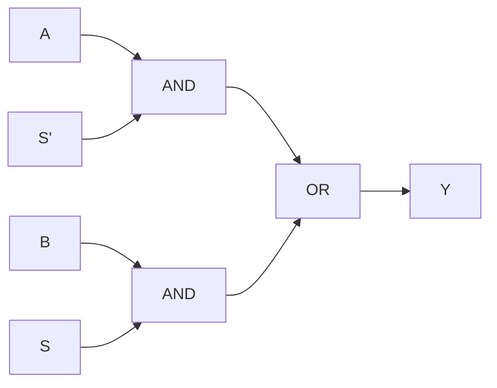

## Learning Objectives

- Derive the boolean expression for a 2:1 multiplexer, output = S′·A + S·B, and explain why it behaves like a hardware "if/select" statement.
- Build a 4:1 multiplexer out of three 2:1 multiplexers and specify its two-bit select logic.
- Design an n:2ⁿ decoder from AND gates and inverters, and produce its complete truth table.
- Explain why any boolean function of n variables can be implemented directly by a 2ⁿ:1 multiplexer whose data inputs are the function's truth-table column.
- Distinguish a decoder from a demultiplexer, and identify where multiplexers and decoders appear inside a CPU datapath (operand routing, register selection, ALU control).

## Context & Motivation

The previous concept, building circuits from gates, established that any combinational function can in principle be written as a sum of products or realized from a universal gate set such as NAND. But "in principle possible" is not the same as "convenient to reuse." Real digital designs, from a single register file entry up to an entire single-cycle CPU, rely on a small number of standardized, reusable building blocks rather than re-deriving a fresh sum-of-products circuit for every situation. Two of the most important such blocks are the multiplexer, which selects one signal out of several based on a control input, and the decoder, which does the structural opposite: it takes a binary-encoded address and activates exactly one of many output lines. Karnaugh maps and gate minimization tell you how to squeeze a specific function down to a small circuit; multiplexers and decoders instead give you off-the-shelf, general-purpose components that you compose to build entire systems without re-deriving gate-level equations each time.

The motivation is architectural, not merely convenient. Every time a CPU decides which register to read, which ALU operation to perform, or which memory word to write, it is making a routing decision among many candidates based on a binary control code. A CPU could not function without a systematic way to say "route these 32 possible register values to a single output wire, chosen by a 5-bit register number" or "given this 3-bit opcode, activate exactly one control signal out of eight." That is precisely the job of the multiplexer and the decoder, respectively. MIT 6.004's Combinational Logic Unit treats them as first-class, standardized components for exactly this reason — they recur so often in real designs that hardware description languages provide dedicated syntax for them.

Looking forward, this concept is a direct prerequisite for two important structures still to come: the register file (concept 16), where a multiplexer selects which of many registers' values reaches the ALU, and ALU operation selection (concept 19), where a multiplexer chooses which arithmetic or logical result the ALU outputs on a given cycle. The binary adder, the very next concept, is itself often paired with a multiplexer to build the ALU's add/subtract selection. Mastering the mux and the decoder here means that later concepts can simply say "a multiplexer selects..." without re-deriving what that means at the gate level.

## Core Theory

### The 2:1 multiplexer as a hardware if/select

A multiplexer ("mux") is a combinational circuit that routes exactly one of several data inputs to a single output, based on the value of one or more select inputs. The simplest case, the 2:1 mux, has two data inputs A and B, one select line S, and one output Y:

| S | A | B | Y |
|---|---|---|---|
| 0 | 0 | 0 | 0 |
| 0 | 0 | 1 | 0 |
| 0 | 1 | 0 | 1 |
| 0 | 1 | 1 | 1 |
| 1 | 0 | 0 | 0 |
| 1 | 0 | 1 | 1 |
| 1 | 1 | 0 | 0 |
| 1 | 1 | 1 | 1 |

Reading the table, Y equals A whenever S = 0, and Y equals B whenever S = 1. The boolean expression that captures this is:

```
Y = S′·A + S·B
```

This is exactly a hardware realization of the conditional expression `Y = S ? B : A` found in C-family languages: the select line plays the role of the condition, and the two data inputs play the role of the two branches. At the gate level, the expression S′·A + S·B is realized directly with two AND gates, one inverter (to form S′), and one OR gate — four gates total, regardless of the widths of A and B, since the same select logic is replicated once per bit for a multi-bit bus.



### Generalizing to 2ⁿ:1 multiplexers

A 2:1 mux selects between 2¹ = 2 inputs using 1 select line. The pattern generalizes directly: a 2ⁿ:1 multiplexer selects one of 2ⁿ data inputs using n select lines, and its output equals the single data input whose index matches the binary value on the select lines. Formally, if the data inputs are D₀, D₁, ..., D_(2ⁿ−1) and the select lines form the binary number S = s_(n−1)...s₁s₀, then:

```
Y = Σ (D_i · m_i)   for i = 0 .. 2ⁿ − 1
```

where m_i is the i-th minterm of the select variables (the product term that is 1 exactly when S = i). Each minterm activates an AND gate gating one data input through to a shared OR gate — the same S′·A + S·B structure of the 2:1 mux, just with 2ⁿ AND gates instead of 2, each gated by an n-variable minterm instead of a single select literal.

Larger multiplexers are almost always built hierarchically from smaller ones rather than as one flat 2ⁿ-input structure, because hierarchical construction reuses the same 2:1 mux cell repeatedly and keeps the select-decoding logic simple — this is exactly the construction carried out in Worked Example 1 below.

### Multiplexers implement any boolean function

Because a 2ⁿ:1 mux's output is Y = Σ D_i·m_i, summed over every possible assignment of n select variables, and because the minterms m_i already partition all 2ⁿ input combinations exhaustively and mutually exclusively, any boolean function f of n variables can be realized by wiring the select lines to the n variables and setting each data input D_i to the truth-table value of f at row i (a hardwired 0 or 1). This is a universal implementation technique: a full 2ⁿ:1 mux realizes any function of n variables with no minimization step required, at the cost of needing 2ⁿ data inputs rather than a minimized gate count. Worked Example 3 demonstrates this construction for a 3-variable function using an 8:1 mux.

### Decoders: activating exactly one output line

A decoder is the structural counterpart to the multiplexer. An n-to-2ⁿ decoder takes an n-bit binary input and produces 2ⁿ output lines, of which exactly one is asserted (driven to 1) for any given input — output line i is asserted if and only if the input equals the binary value i. Each output line is the corresponding minterm of the input variables, realized with one AND gate per output plus shared inverters for the complemented literals. A decoder with an enable input adds one more AND-gate term per output, so no output is asserted unless the decoder is enabled — this is what lets a decoder be gated by a higher-level control signal such as a memory chip-select.

Decoders are the natural circuit for turning a binary-encoded selector — an opcode, a register number, a memory address — into a single, isolated control signal that some other piece of hardware can react to directly, without itself having to interpret multi-bit binary values.

### The demultiplexer: routing one input to many outputs

A demultiplexer ("demux") is the mirror image of a multiplexer: it takes a single data input and routes it to exactly one of 2ⁿ outputs, chosen by n select lines, while all other outputs are held at 0. Structurally, a demux is a decoder in which each AND gate's minterm term is additionally ANDed with the single data input, rather than being asserted directly from a constant enable signal — so a decoder is simply a demux whose data input is permanently tied to 1. This relationship is why decoders and demultiplexers are so often described together: identical select/enable logic, differing only in whether the thing being gated through is a constant "enable" or an arbitrary data signal.

### Where these appear in a CPU

Multiplexers and decoders are structural components of every stage of a real CPU datapath. A register file (concept 16) uses a multiplexer to select which of 32 (or however many) registers' contents appear on a read-data output, driven by the register-number field of an instruction. An ALU (concept 18) uses a multiplexer to choose which of several computed results (sum, AND, OR, comparison) becomes the ALU's final output, driven by an operation-select code decoded from the instruction's opcode/funct fields (concept 19). Memory decode logic uses decoders to turn an address into a single asserted chip-select or word-line signal, activating exactly one storage location among many. In every case, a multiplexer narrows many candidates down to the one that matters this cycle, and a decoder expands a compact binary code into a single, isolated activation signal.

## Worked Examples

### Example 1: Building a 4:1 multiplexer from 2:1 multiplexers

Goal: select one of four data inputs D0, D1, D2, D3 using two select lines S1 (the more significant select bit) and S0.

Step 1 — Pair up the inputs and use two 2:1 muxes as a first layer: mux M0 selects between D0 and D1 using S0, producing intermediate result P0 = S0′·D0 + S0·D1. Mux M1 selects between D2 and D3 using the same S0, producing P1 = S0′·D2 + S0·D3.

Step 2 — Use one more 2:1 mux, M2, to select between P0 and P1 using S1: Y = S1′·P0 + S1·P1.

Step 3 — Substitute to get the full expression:

```
Y = S1′·(S0′·D0 + S0·D1) + S1·(S0′·D2 + S0·D3)
```

Step 4 — Verify against the expected minterm form. Expanding gives:

```
Y = S1′S0′·D0 + S1′S0·D1 + S1S0′·D2 + S1S0·D3
```

Each term is exactly the minterm of (S1, S0) matching the binary index of the corresponding data input: S1S0 = 00 selects D0, 01 selects D1, 10 selects D2, 11 selects D3. This matches the general 2ⁿ:1 formula Y = Σ D_i·m_i with n = 2, confirming the hierarchical construction is correct and preferred in practice because it reuses a single standardized 2:1 mux cell three times.

### Example 2: Building a 2:4 decoder from gates and its truth table

Goal: given a 2-bit input (A1, A0), produce four outputs Y0, Y1, Y2, Y3, exactly one of which is 1.

Step 1 — Each output Yi is the minterm of (A1, A0) matching index i:

```
Y0 = A1′·A0′
Y1 = A1′·A0
Y2 = A1·A0′
Y3 = A1·A0
```

Step 2 — Each minterm needs one 2-input AND gate, fed by either the direct or inverted form of each address bit; two inverters (for A1′ and A0′) are shared across all four AND gates.

Step 3 — Truth table:

| A1 | A0 | Y3 | Y2 | Y1 | Y0 |
|---|---|---|---|---|---|
| 0 | 0 | 0 | 0 | 0 | 1 |
| 0 | 1 | 0 | 0 | 1 | 0 |
| 1 | 0 | 0 | 1 | 0 | 0 |
| 1 | 1 | 1 | 0 | 0 | 0 |

Step 4 — Verify: every row has exactly one output asserted, and the asserted output's index always equals the decimal value of (A1, A0) for that row (row A1A0=10 asserts Y2, i.e., index 2). This "exactly one hot" property, checked row by row, is the defining behavior of a decoder and is what makes it usable directly as a set of mutually exclusive activation signals.

### Example 3: Implementing a 3-variable function with an 8:1 multiplexer

Goal: implement f(A, B, C) = Σm(1, 3, 4, 6) — the function that is 1 exactly on minterms 1, 3, 4, and 6 — using a single 8:1 mux with no additional gates.

Step 1 — Tie the three select lines directly to the function's variables: S2 = A, S1 = B, S0 = C, so that select value i (in binary, S2S1S0) always corresponds to input row (A, B, C) = i.

Step 2 — Build the full truth table for f across all 8 rows (index = 4A + 2B + C):

| Index | A | B | C | f |
|---|---|---|---|---|
| 0 | 0 | 0 | 0 | 0 |
| 1 | 0 | 0 | 1 | 1 |
| 2 | 0 | 1 | 0 | 0 |
| 3 | 0 | 1 | 1 | 1 |
| 4 | 1 | 0 | 0 | 1 |
| 5 | 1 | 0 | 1 | 0 |
| 6 | 1 | 1 | 0 | 1 |
| 7 | 1 | 1 | 1 | 0 |

Step 3 — Set each mux data input D_i to the truth-table value of f at row i: D0=0, D1=1, D2=0, D3=1, D4=1, D5=0, D6=1, D7=0 — hardwired constants, no gates required beyond the mux itself.

Step 4 — Verify with the mux's own selection rule Y = D_(select value): for (A,B,C) = (1,0,0), select value = 100₂ = 4, so Y = D4 = 1, matching f(1,0,0) = 1 from the table. For (A,B,C) = (1,1,1), select value = 7, Y = D7 = 0, matching f(1,1,1) = 0. Because the mux's data inputs are exactly the truth-table column of f, and the mux's built-in select logic already implements every possible minterm-selection pattern, no Karnaugh-map minimization is needed at all — this is the general technique referenced in Core Theory for realizing any n-variable function with a single 2ⁿ:1 mux.

## Common Misconceptions & Pitfalls

- **"A multiplexer performs computation on its inputs."** It does not — a mux only routes one of its existing inputs to the output unchanged; it never combines A and B arithmetically or logically. Any apparent "computation" (such as implementing a boolean function in Worked Example 3) comes entirely from how the data inputs are pre-wired, not from anything the mux itself computes.
- **"A decoder and a demultiplexer are the same circuit under different names."** They share identical select/AND-gate structure, but a decoder's outputs come from a constant enable signal while a demux's outputs come from an actual data signal being routed. A decoder is simply a demux with the data input tied to 1 — related, not interchangeable, when a genuine data signal needs to be routed.
- **"Building a 2ⁿ:1 mux always means one giant OR gate over 2ⁿ AND gates."** That flat structure works logically, but real designs almost always build large muxes hierarchically out of smaller ones (Worked Example 1), because it reuses a single standardized cell and keeps wiring local, often with better timing than one huge fan-in OR gate.
- **"A mux-based function implementation is automatically the smallest circuit for that function."** It is not — a 2ⁿ:1 mux implementation of an n-variable function always uses 2ⁿ data-input wires regardless of how "simple" the function's minimized sum-of-products form is. Karnaugh-map minimization can produce a smaller gate-level circuit; the mux technique instead trades gate savings for a uniform, table-driven construction needing no minimization step.
- **"An n:2ⁿ decoder needs select-style inputs feeding a single output, like a mux."** A decoder has no single output the way a mux does — its whole point is 2ⁿ separate output lines, of which exactly one is asserted per input combination. Confusing decoder outputs with a mux's single selected output is a common wiring mistake when composing the two component types together.

## Summary

The multiplexer (a hardware if/select, Y = S′·A + S·B for the 2:1 case, generalizing to Y = Σ D_i·m_i for 2ⁿ:1) and the decoder (a circuit that turns an n-bit binary code into exactly one asserted output line among 2ⁿ, with the demultiplexer as its data-routing counterpart) are two of the most widely reused combinational building blocks in digital design, because a 2ⁿ:1 mux can realize any boolean function of n variables directly from its truth table with no minimization required, and a decoder can turn any binary-encoded selector — an opcode, a register number, an address — into an isolated activation signal. These two components recur throughout the datapath still to come: register-file read selection, ALU operation and result selection, and memory address decoding all reduce, structurally, to a mux or a decoder. The next concept, binary adders, builds the first genuinely arithmetic combinational component — the full adder and the ripple-carry adder — which is itself frequently paired with a multiplexer to implement combined add/subtract selection inside an ALU.

## Documentation Links

- [MIT 6.004 — Combinational Logic Unit](https://ocw.mit.edu/courses/6-004-computation-structures-spring-2017/pages/c4/) — course unit covering multiplexers, decoders, and other standardized combinational building blocks.
- [Harris & Harris — Digital Design and Computer Architecture, RISC-V Edition](https://shop.elsevier.com/books/digital-design-and-computer-architecture-risc-v-edition/harris/978-0-12-820064-3) — textbook treatment of multiplexer and decoder design and their use in datapath construction.
