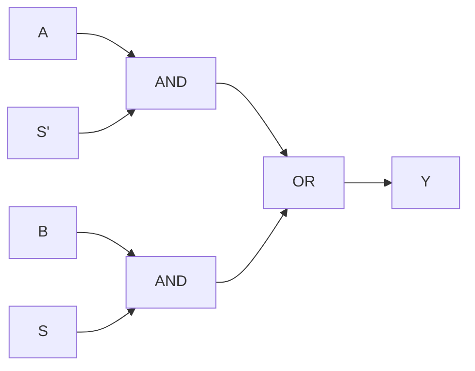

## Objetivos de Aprendizagem

- Derivar a expressão booleana de um multiplexador 2:1, saída = S′·A + S·B, e explicar por que ele se comporta como uma instrução "if/select" em hardware.
- Construir um multiplexador 4:1 com três multiplexadores 2:1 e especificar sua lógica de seleção de dois bits.
- Projetar um decodificador n:2ⁿ com portas AND e inversores, e produzir sua tabela verdade completa.
- Explicar por que qualquer função booleana de n variáveis pode ser implementada diretamente por um multiplexador 2ⁿ:1 cujas entradas de dados são a coluna da tabela verdade da função.
- Distinguir um decodificador de um demultiplexador, e identificar onde multiplexadores e decodificadores aparecem dentro do datapath de uma CPU (roteamento de operandos, seleção de registradores, controle da ULA).

## Contexto e Motivação

O conceito anterior, construindo circuitos a partir de portas, estabeleceu que qualquer função combinacional pode, em princípio, ser escrita como soma de produtos ou realizada a partir de um conjunto universal de portas como o NAND. Mas "possível em princípio" não é o mesmo que "conveniente de reutilizar". Projetos digitais reais, de uma única entrada de banco de registradores até uma CPU monociclo inteira, dependem de um pequeno número de blocos de construção padronizados e reutilizáveis, em vez de rederivar um circuito soma de produtos novo para cada situação. Dois dos blocos mais importantes desse tipo são o multiplexador, que seleciona um sinal entre vários com base numa entrada de controle, e o decodificador, que faz o oposto estrutural: recebe um endereço codificado em binário e ativa exatamente uma entre muitas linhas de saída. Os mapas de Karnaugh e a minimização de portas dizem como espremer uma função específica num circuito pequeno; multiplexadores e decodificadores, em vez disso, oferecem componentes prontos e de propósito geral que você compõe para construir sistemas inteiros sem rederivar equações em nível de portas toda vez.

A motivação é arquitetural, e não só de conveniência. Toda vez que uma CPU decide qual registrador ler, qual operação da ULA fazer ou qual palavra de memória escrever, ela está tomando uma decisão de roteamento entre muitos candidatos com base num código de controle binário. Uma CPU não funcionaria sem uma forma sistemática de dizer "leve estes 32 valores possíveis de registradores a um único fio de saída, escolhido por um número de registrador de 5 bits" ou "dado este opcode de 3 bits, ative exatamente um sinal de controle entre oito". Esse é precisamente o trabalho do multiplexador e do decodificador, respectivamente. A unidade de Lógica Combinacional do MIT 6.004 os trata como componentes padronizados de primeira classe exatamente por esse motivo: eles se repetem tanto em projetos reais que as linguagens de descrição de hardware oferecem sintaxe dedicada para eles.

Olhando adiante, este conceito é pré-requisito direto de duas estruturas importantes que ainda vêm: o banco de registradores (conceito 16), em que um multiplexador seleciona qual dos valores dos muitos registradores chega à ULA, e a seleção de operação da ULA (conceito 19), em que um multiplexador escolhe qual resultado aritmético ou lógico a ULA emite num dado ciclo. O somador binário, o conceito logo a seguir, é ele mesmo muitas vezes pareado com um multiplexador para construir a seleção de soma/subtração da ULA. Dominar aqui o mux e o decodificador significa que conceitos posteriores podem simplesmente dizer "um multiplexador seleciona..." sem rederivar o que isso significa em nível de portas.

## Teoria Central

### O multiplexador 2:1 como um if/select em hardware

Um multiplexador ("mux") é um circuito combinacional que encaminha exatamente uma entre várias entradas de dados para uma única saída, com base no valor de uma ou mais entradas de seleção. O caso mais simples, o mux 2:1, tem duas entradas de dados A e B, uma linha de seleção S e uma saída Y:

| S | A | B | Y |
|---|---|---|---|
| 0 | 0 | 0 | 0 |
| 0 | 0 | 1 | 0 |
| 0 | 1 | 0 | 1 |
| 0 | 1 | 1 | 1 |
| 1 | 0 | 0 | 0 |
| 1 | 0 | 1 | 1 |
| 1 | 1 | 0 | 0 |
| 1 | 1 | 1 | 1 |

Lendo a tabela, Y é igual a A sempre que S = 0, e Y é igual a B sempre que S = 1. A expressão booleana que captura isso é:

```
Y = S′·A + S·B
```

Isso é exatamente uma realização em hardware da expressão condicional `Y = S ? B : A` das linguagens da família C: a linha de seleção faz o papel da condição, e as duas entradas de dados fazem o papel dos dois ramos. Em nível de portas, a expressão S′·A + S·B é realizada diretamente com duas portas AND, um inversor (para formar S′) e uma porta OR, quatro portas no total, sejam quais forem as larguras de A e B, já que a mesma lógica de seleção é replicada uma vez por bit num barramento de vários bits.



### Generalizando para multiplexadores 2ⁿ:1

Um mux 2:1 seleciona entre 2¹ = 2 entradas usando 1 linha de seleção. O padrão se generaliza diretamente: um multiplexador 2ⁿ:1 seleciona uma entre 2ⁿ entradas de dados usando n linhas de seleção, e sua saída é igual à única entrada de dados cujo índice bate com o valor binário nas linhas de seleção. Formalmente, se as entradas de dados são D₀, D₁, ..., D_(2ⁿ−1) e as linhas de seleção formam o número binário S = s_(n−1)...s₁s₀, então:

```
Y = Σ (D_i · m_i)   para i = 0 .. 2ⁿ − 1
```

em que m_i é o i-ésimo mintermo das variáveis de seleção (o termo produto que vale 1 exatamente quando S = i). Cada mintermo ativa uma porta AND que deixa passar uma entrada de dados para uma porta OR compartilhada: a mesma estrutura S′·A + S·B do mux 2:1, só que com 2ⁿ portas AND em vez de 2, cada uma controlada por um mintermo de n variáveis em vez de um único literal de seleção.

Multiplexadores maiores quase sempre são construídos de forma hierárquica a partir de menores, em vez de como uma estrutura plana de 2ⁿ entradas, porque a construção hierárquica reaproveita a mesma célula de mux 2:1 repetidamente e mantém simples a lógica de decodificação da seleção; é exatamente a construção feita no Exemplo Resolvido 1 abaixo.

### Multiplexadores implementam qualquer função booleana

Como a saída de um mux 2ⁿ:1 é Y = Σ D_i·m_i, somada sobre toda atribuição possível das n variáveis de seleção, e como os mintermos m_i já particionam todas as 2ⁿ combinações de entrada de forma exaustiva e mutuamente exclusiva, qualquer função booleana f de n variáveis pode ser realizada ligando as linhas de seleção às n variáveis e colocando cada entrada de dados D_i no valor da tabela verdade de f na linha i (um 0 ou 1 fixo). Essa é uma técnica de implementação universal: um mux 2ⁿ:1 completo realiza qualquer função de n variáveis sem precisar de passo de minimização, ao custo de precisar de 2ⁿ entradas de dados em vez de um número minimizado de portas. O Exemplo Resolvido 3 demonstra essa construção para uma função de 3 variáveis usando um mux 8:1.

### Decodificadores: ativando exatamente uma linha de saída

Um decodificador é a contraparte estrutural do multiplexador. Um decodificador de n para 2ⁿ recebe uma entrada binária de n bits e produz 2ⁿ linhas de saída, das quais exatamente uma é ativada (levada a 1) para qualquer entrada dada: a linha de saída i é ativada se e somente se a entrada for igual ao valor binário i. Cada linha de saída é o mintermo correspondente das variáveis de entrada, realizado com uma porta AND por saída mais inversores compartilhados para os literais complementados. Um decodificador com entrada de habilitação acrescenta mais um termo de porta AND por saída, de modo que nenhuma saída é ativada a não ser que o decodificador esteja habilitado; é isso que permite controlar um decodificador por um sinal de controle de nível mais alto, como o chip-select de uma memória.

Os decodificadores são o circuito natural para transformar um seletor codificado em binário (um opcode, um número de registrador, um endereço de memória) num único sinal de controle isolado ao qual algum outro pedaço de hardware pode reagir diretamente, sem precisar ele mesmo interpretar valores binários de vários bits.

### O demultiplexador: encaminhando uma entrada para muitas saídas

Um demultiplexador ("demux") é a imagem espelhada de um multiplexador: ele recebe uma única entrada de dados e a encaminha para exatamente uma entre 2ⁿ saídas, escolhida por n linhas de seleção, enquanto todas as outras saídas ficam em 0. Estruturalmente, um demux é um decodificador em que o termo mintermo de cada porta AND passa também por um AND com a única entrada de dados, em vez de ser ativado diretamente a partir de um sinal de habilitação constante; então um decodificador é simplesmente um demux cuja entrada de dados está permanentemente ligada em 1. Essa relação é o motivo de decodificadores e demultiplexadores serem descritos tantas vezes juntos: lógica de seleção/habilitação idêntica, diferindo só em se o que passa é uma "habilitação" constante ou um sinal de dados arbitrário.

### Onde eles aparecem numa CPU

Multiplexadores e decodificadores são componentes estruturais de todo estágio do datapath de uma CPU real. Um banco de registradores (conceito 16) usa um multiplexador para selecionar qual dos 32 (ou quantos forem) registradores aparece numa saída de dado lido, comandado pelo campo de número de registrador de uma instrução. Uma ULA (conceito 18) usa um multiplexador para escolher qual dos vários resultados calculados (soma, AND, OR, comparação) vira a saída final da ULA, comandado por um código de seleção de operação decodificado dos campos opcode/funct da instrução (conceito 19). A lógica de decodificação da memória usa decodificadores para transformar um endereço num único sinal ativado de chip-select ou de linha de palavra, ativando exatamente um local de armazenamento entre muitos. Em todos os casos, um multiplexador estreita muitos candidatos até aquele que importa neste ciclo, e um decodificador expande um código binário compacto num único sinal de ativação isolado.

## Exemplos Resolvidos

### Exemplo 1: construindo um multiplexador 4:1 com multiplexadores 2:1

Objetivo: selecionar uma entre quatro entradas de dados D0, D1, D2, D3 usando duas linhas de seleção, S1 (o bit de seleção mais significativo) e S0.

Passo 1: agrupe as entradas em pares e use dois muxes 2:1 como primeira camada: o mux M0 seleciona entre D0 e D1 usando S0, produzindo o resultado intermediário P0 = S0′·D0 + S0·D1. O mux M1 seleciona entre D2 e D3 usando o mesmo S0, produzindo P1 = S0′·D2 + S0·D3.

Passo 2: use mais um mux 2:1, M2, para selecionar entre P0 e P1 usando S1: Y = S1′·P0 + S1·P1.

Passo 3: substitua para obter a expressão completa:

```
Y = S1′·(S0′·D0 + S0·D1) + S1·(S0′·D2 + S0·D3)
```

Passo 4: verifique contra a forma em mintermos esperada. Expandindo, obtém-se:

```
Y = S1′S0′·D0 + S1′S0·D1 + S1S0′·D2 + S1S0·D3
```

Cada termo é exatamente o mintermo de (S1, S0) que bate com o índice binário da entrada de dados correspondente: S1S0 = 00 seleciona D0, 01 seleciona D1, 10 seleciona D2, 11 seleciona D3. Isso bate com a fórmula geral 2ⁿ:1, Y = Σ D_i·m_i com n = 2, confirmando que a construção hierárquica está correta, e ela é preferida na prática porque reaproveita uma única célula padronizada de mux 2:1 três vezes.

### Exemplo 2: construindo um decodificador 2:4 com portas e sua tabela verdade

Objetivo: dada uma entrada de 2 bits (A1, A0), produzir quatro saídas Y0, Y1, Y2, Y3, das quais exatamente uma vale 1.

Passo 1: cada saída Yi é o mintermo de (A1, A0) que corresponde ao índice i:

```
Y0 = A1′·A0′
Y1 = A1′·A0
Y2 = A1·A0′
Y3 = A1·A0
```

Passo 2: cada mintermo precisa de uma porta AND de 2 entradas, alimentada pela forma direta ou invertida de cada bit de endereço; dois inversores (para A1′ e A0′) são compartilhados pelas quatro portas AND.

Passo 3: tabela verdade:

| A1 | A0 | Y3 | Y2 | Y1 | Y0 |
|---|---|---|---|---|---|
| 0 | 0 | 0 | 0 | 0 | 1 |
| 0 | 1 | 0 | 0 | 1 | 0 |
| 1 | 0 | 0 | 1 | 0 | 0 |
| 1 | 1 | 1 | 0 | 0 | 0 |

Passo 4: verifique: toda linha tem exatamente uma saída ativada, e o índice da saída ativada é sempre igual ao valor decimal de (A1, A0) naquela linha (a linha A1A0=10 ativa Y2, ou seja, índice 2). Essa propriedade de "exatamente um ativo", conferida linha a linha, é o comportamento que define um decodificador, e é o que o torna utilizável diretamente como um conjunto de sinais de ativação mutuamente exclusivos.

### Exemplo 3: implementando uma função de 3 variáveis com um multiplexador 8:1

Objetivo: implementar f(A, B, C) = Σm(1, 3, 4, 6), a função que vale 1 exatamente nos mintermos 1, 3, 4 e 6, usando um único mux 8:1 sem portas adicionais.

Passo 1: ligue as três linhas de seleção diretamente às variáveis da função: S2 = A, S1 = B, S0 = C, de modo que o valor de seleção i (em binário, S2S1S0) sempre corresponda à linha de entrada (A, B, C) = i.

Passo 2: construa a tabela verdade completa de f nas 8 linhas (índice = 4A + 2B + C):

| Índice | A | B | C | f |
|---|---|---|---|---|
| 0 | 0 | 0 | 0 | 0 |
| 1 | 0 | 0 | 1 | 1 |
| 2 | 0 | 1 | 0 | 0 |
| 3 | 0 | 1 | 1 | 1 |
| 4 | 1 | 0 | 0 | 1 |
| 5 | 1 | 0 | 1 | 0 |
| 6 | 1 | 1 | 0 | 1 |
| 7 | 1 | 1 | 1 | 0 |

Passo 3: coloque cada entrada de dados D_i do mux no valor da tabela verdade de f na linha i: D0=0, D1=1, D2=0, D3=1, D4=1, D5=0, D6=1, D7=0, constantes fixas, sem precisar de portas além do próprio mux.

Passo 4: verifique com a própria regra de seleção do mux, Y = D_(valor de seleção): para (A,B,C) = (1,0,0), o valor de seleção = 100₂ = 4, então Y = D4 = 1, batendo com f(1,0,0) = 1 na tabela. Para (A,B,C) = (1,1,1), o valor de seleção = 7, Y = D7 = 0, batendo com f(1,1,1) = 0. Como as entradas de dados do mux são exatamente a coluna da tabela verdade de f, e a lógica de seleção embutida no mux já implementa todo padrão possível de seleção de mintermos, nenhuma minimização por mapa de Karnaugh é necessária; essa é a técnica geral mencionada na Teoria Central para realizar qualquer função de n variáveis com um único mux 2ⁿ:1.

## Equívocos Comuns e Armadilhas

- **"Um multiplexador faz cálculos com suas entradas."** Não faz: um mux só encaminha uma das suas entradas existentes para a saída, sem alterá-la; ele nunca combina A e B de forma aritmética ou lógica. Qualquer "cálculo" aparente (como implementar uma função booleana no Exemplo Resolvido 3) vem inteiramente de como as entradas de dados foram pré-ligadas, e não de algo que o próprio mux calcule.
- **"Um decodificador e um demultiplexador são o mesmo circuito com nomes diferentes."** Eles compartilham estrutura idêntica de seleção e portas AND, mas as saídas de um decodificador vêm de um sinal de habilitação constante, enquanto as de um demux vêm de um sinal de dados real sendo encaminhado. Um decodificador é simplesmente um demux com a entrada de dados ligada em 1: relacionados, mas não intercambiáveis, quando um sinal de dados genuíno precisa ser encaminhado.
- **"Construir um mux 2ⁿ:1 sempre significa uma porta OR gigante sobre 2ⁿ portas AND."** Essa estrutura plana funciona logicamente, mas projetos reais quase sempre constroem muxes grandes de forma hierárquica a partir de menores (Exemplo Resolvido 1), porque isso reaproveita uma única célula padronizada e mantém a fiação local, muitas vezes com temporização melhor que uma única porta OR enorme de fan-in alto.
- **"Uma implementação de função baseada em mux é automaticamente o menor circuito para aquela função."** Não é: uma implementação com mux 2ⁿ:1 de uma função de n variáveis sempre usa 2ⁿ fios de entrada de dados, não importa o quão "simples" seja a forma soma de produtos minimizada da função. A minimização por mapa de Karnaugh pode produzir um circuito em nível de portas menor; a técnica do mux troca economia de portas por uma construção uniforme, guiada por tabela, que não precisa de passo de minimização.
- **"Um decodificador n:2ⁿ precisa de entradas no estilo de seleção alimentando uma única saída, como um mux."** Um decodificador não tem uma única saída como um mux: seu objetivo todo são 2ⁿ linhas de saída separadas, das quais exatamente uma é ativada por combinação de entrada. Confundir as saídas de um decodificador com a única saída selecionada de um mux é um erro de fiação comum ao compor os dois tipos de componente.

## Resumo

O multiplexador (um if/select em hardware, Y = S′·A + S·B no caso 2:1, generalizando para Y = Σ D_i·m_i no caso 2ⁿ:1) e o decodificador (um circuito que transforma um código binário de n bits em exatamente uma linha de saída ativada entre 2ⁿ, tendo o demultiplexador como sua contraparte de encaminhamento de dados) são dois dos blocos de construção combinacionais mais reutilizados no projeto digital, porque um mux 2ⁿ:1 consegue realizar qualquer função booleana de n variáveis diretamente a partir da sua tabela verdade, sem minimização, e um decodificador consegue transformar qualquer seletor codificado em binário (um opcode, um número de registrador, um endereço) num sinal de ativação isolado. Esses dois componentes se repetem por todo o datapath que ainda vem: a seleção de leitura do banco de registradores, a seleção de operação e de resultado da ULA e a decodificação de endereços de memória se reduzem todas, estruturalmente, a um mux ou a um decodificador. O próximo conceito, somadores binários, constrói o primeiro componente combinacional genuinamente aritmético (o somador completo e o somador ripple-carry), que é ele mesmo frequentemente pareado com um multiplexador para implementar a seleção combinada de soma/subtração dentro de uma ULA.

## Documentation Links

- [MIT 6.004: Combinational Logic Unit](https://ocw.mit.edu/courses/6-004-computation-structures-spring-2017/pages/c4/): unidade do curso que cobre multiplexadores, decodificadores e outros blocos de construção combinacionais padronizados.
- [Harris & Harris: Digital Design and Computer Architecture, RISC-V Edition](https://shop.elsevier.com/books/digital-design-and-computer-architecture-risc-v-edition/harris/978-0-12-820064-3): tratamento de livro-texto do projeto de multiplexadores e decodificadores e do seu uso na construção de datapaths.
