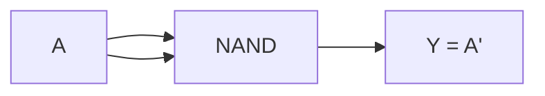
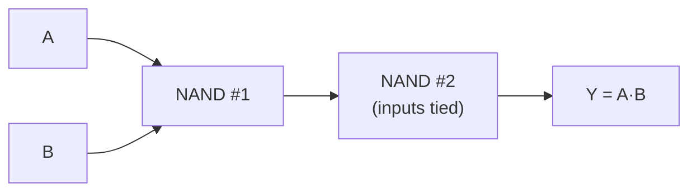
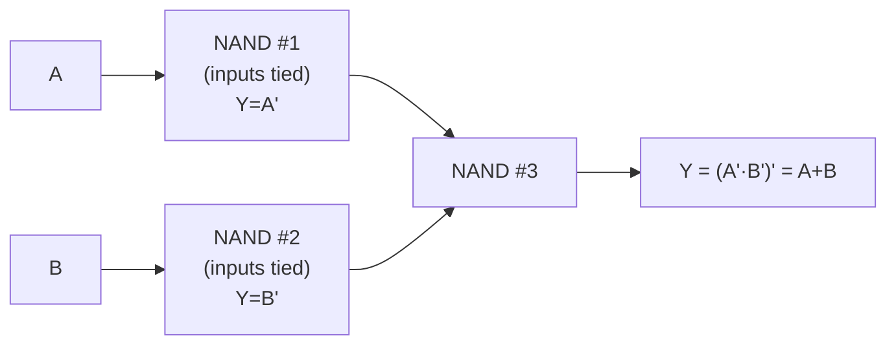

## Learning Objectives

- Define functional completeness (universality) for a set of gates, and state what it means to say NAND alone is a universal gate.
- Construct a NOT gate from a single NAND gate, and prove the construction correct with a truth table.
- Construct an AND gate from two NAND gates, and prove the construction correct with a truth table.
- Construct an OR gate from three NAND gates using De Morgan's law, and prove the construction correct with a truth table.
- Explain the two-step argument for why NAND is universal: NAND builds NOT and AND, and {NOT, AND} is already a complete set, with OR reachable via De Morgan's law.
- Explain the manufacturing motivation for standardizing on one repeated gate type (uniformity, yield, CMOS convenience), and state that NOR is an equally valid universal alternative.

## Context & Motivation

The previous concept fixed a library of eight standard gates — buffer, NOT, AND, OR, NAND, NOR, XOR, XNOR — each with its own truth table and its own tiny slice of CMOS transistors. It's natural to assume that building a real chip therefore means fabricating all eight (or at least several) of these distinct physical parts side by side, the way a carpenter's toolbox holds a hammer, a saw, and a screwdriver because no single tool does all three jobs. Digital logic breaks that intuition completely: it turns out that **one single gate type, repeated as many times as needed and wired cleverly, can compute absolutely any boolean function that any combination of AND, OR, and NOT could ever compute.** NAND is one such gate; NOR is another. This property is called **functional completeness**, or **universality**, and it is one of the most consequential facts in this entire discipline, because it directly explains a real, physical decision made in every modern chip fabrication plant.

The argument for NAND's universality is short and constructive, which is part of what makes it so satisfying: earlier work in propositional logic already established that the set {¬, ∧} (NOT and AND together) is functionally complete — any boolean function can be written using only negation and conjunction, since De Morgan's laws let disjunction (∨) be rewritten in terms of ¬ and ∧ whenever it's needed. So the entire universality argument for NAND reduces to a much smaller claim: can NAND alone build a NOT gate, and can NAND alone build an AND gate? If both are possible, then NAND can reach everything {¬, ∧} could reach, which is everything. This concept proves exactly those two small constructions, then extends the same idea to OR, and closes with the practical payoff: because one gate type suffices for arbitrary logic, a chip fabrication process can specialize in manufacturing one extremely well-optimized, uniform building block instead of juggling several different transistor layouts, which is a major reason why real digital chips are, underneath, oceans of NAND (or NOR) gates wired together rather than a patchwork of every gate type.

This concept is also a direct rehearsal for the next one, "Building Circuits from Gates," which generalizes the same idea — wiring small gates together to realize a larger function — from the tiny 1-, 2-, and 3-gate constructions covered here to full multi-gate combinational circuits like adders, multiplexers, and decoders. Everything from this point forward in the discipline, all the way up to the single-cycle CPU at the end of the arc, is ultimately just NAND gates (or an equivalent universal set) wired together at increasing scale; this concept is where that fact is first established and proven, rather than merely asserted.

## Core Theory

### Functional completeness (universality)

A set of gates (equivalently, a set of boolean operators) is **functionally complete** if every possible boolean function, of any number of variables, can be expressed using only gates from that set. The classical complete sets from boolean algebra are {¬, ∧, ∨} (the "textbook" set), and the smaller {¬, ∧} or {¬, ∨} (each sufficient on its own once De Morgan's laws are available to convert between ∧ and ∨). A gate is called **universal** if the single-element set containing just that gate is already functionally complete — meaning that gate, alone, repeated and wired arbitrarily, can realize every boolean function. NAND is universal. NOR is also universal (by a symmetric argument, swapping the roles of AND/OR and using De Morgan's law in the other direction). Notably, none of AND, OR, or XOR alone is universal — no amount of wiring together only AND gates, for instance, can ever produce a NOT gate, since AND (and OR) are both "monotonic" (increasing any input can never decrease the output), a property NOT itself violates.

### Step 1 — NOT from a single NAND gate

The NAND truth table (from the previous concept) is `Y = (A·B)′`. If both inputs of a NAND gate are tied together to the same signal A (so B = A), the expression collapses: `Y = (A·A)′ = A′`, using the boolean-algebra idempotent law `A·A = A`. So a single NAND gate, with its two inputs shorted together, is exactly a NOT gate.

### Step 2 — AND from two NAND gates

Since NAND already computes `(A·B)′`, applying NOT to that result recovers plain AND: `((A·B)′)′ = A·B` by the double-negation law. The first NAND gate produces `(A·B)′`; feeding that single output into a second NAND gate with both its inputs tied together (the NOT-from-NAND construction of Step 1) inverts it back to `A·B`.

This costs 2 NAND gates total.

### Step 3 — OR from three NAND gates, via De Morgan's law

De Morgan's law states `A + B = (A′·B′)′` — OR can be rewritten entirely in terms of NOT and AND (equivalently, "OR of A,B" equals "NOT AND of the complements of A and B"). Since Step 1 shows NOT costs one NAND gate, and the outer `(...)′` around the product is itself exactly a NAND (invert an AND), the construction is: invert A (1 NAND), invert B (1 NAND), then NAND those two inverted signals together (1 more NAND) — because NANDing `A′` and `B′` computes `(A′·B′)′`, which by De Morgan's law equals `A+B`.

This costs 3 NAND gates total: two to produce the complements, one to combine them.

### Why this proves NAND is universal

The full argument chains together as follows:

1. Propositional logic already established that {¬, ∧} is functionally complete — every boolean function of any number of variables can be written using only NOT and AND (with OR, when needed, expressed via De Morgan's law in terms of ¬ and ∧).
2. Step 1 shows NAND alone can realize NOT.
3. Step 2 shows NAND alone can realize AND.
4. Therefore NAND alone can realize every gate in the complete set {¬, ∧}, and by point 1, every boolean function whatsoever — NAND is universal.

Step 3's OR construction is not logically required by this argument (OR is already reachable through ¬ and ∧ per point 1), but it is included because OR is common enough in practice that its direct 3-NAND recipe is worth knowing explicitly, and because it doubles as an independent, concrete check of the whole argument: if NAND can really reach ¬ and ∧, then chaining those two constructions together via De Morgan's law had better also reproduce OR correctly — which Example 3 below verifies row-by-row.

### Extending to NOR, and building further gates

By a symmetric argument (swap the roles of AND and OR, and use the other half of De Morgan's law, `A·B = (A′+B′)′`), NOR is equally universal: a NOR gate with tied inputs computes NOT; NOR followed by another NOR-as-NOT computes OR; and NOR-ing the complements of A and B computes AND. Once NOT and AND (or NOT and OR) are available from either universal gate, every other gate in the standard library — including XOR and XNOR, which are themselves expressible as `A·B′ + A′·B` and its complement — can in turn be built purely from AND, OR, and NOT, and therefore purely from NAND alone (typically at a higher gate count, since XOR from NAND-only construction takes 4 NAND gates in the standard minimal circuit). The general principle — small universal gates compose into arbitrarily large boolean functions — is exactly what the next concept, "Building Circuits from Gates," develops into full multi-level combinational circuits.

### Why real fabrication favors one repeated gate

Functional completeness would be a cute theoretical curiosity if it had no bearing on how chips are actually built, but it has an enormous one. Semiconductor fabrication is a photolithographic process: a chip is manufactured by repeatedly imprinting a physical *pattern* (a transistor layout) onto a silicon wafer. If a design uses only one gate type, the fabrication process needs to perfect, characterize, and mass-produce only one transistor layout — one physical "cell" — and can devote all of its engineering effort to making that one cell as small, fast, low-power, and reliable as physically possible. Standardizing on a single repeated building block yields three concrete manufacturing benefits: **uniformity** (one cell design is verified and characterized once, then stamped down millions of times, instead of separately verifying many different cell types); **yield** (a manufacturing process tuned around a single, well-understood transistor pattern experiences fewer defects and variability issues than one juggling many different patterns); and **CMOS convenience** (NAND and NOR, as noted in the previous concept, are the gates CMOS builds most directly, each in a single transistor stage, so choosing NAND or NOR as the universal building block also happens to align with the physically cheapest gate CMOS naturally offers — there's no need to separately optimize a more expensive AND or OR cell at all).

## Worked Examples

### Example 1: NOT from one NAND gate

**Construction:** tie both inputs of a NAND gate to the same signal A.

**Truth table verification** (only two rows are possible, since B always equals A):

| A | B=A | (A·B)′ |
|---|---|---|
| 0 | 0 | 1 |
| 1 | 1 | 0 |

Comparing to the standard NOT truth table (A=0 → Y=1; A=1 → Y=0), the two match on both rows. The single-NAND construction is a verified NOT gate. Gate count: **1 NAND**.

### Example 2: AND from two NAND gates

**Construction:** NAND(A, B) produces `(A·B)′`; feed that output into a second NAND gate with its two inputs tied together (the Example 1 construction), producing `((A·B)′)′`.

**Truth table verification:**

| A | B | (A·B)′ [gate 1] | ((A·B)′)′ [gate 2] |
|---|---|---|---|
| 0 | 0 | 1 | 0 |
| 0 | 1 | 1 | 0 |
| 1 | 0 | 1 | 0 |
| 1 | 1 | 0 | 1 |

The final column reads 0, 0, 0, 1 across the four rows — exactly the standard AND truth table (1 only when both inputs are 1). Gate count: **2 NANDs**.

### Example 3: OR from three NAND gates (via De Morgan's law)

**Construction:** invert A using a tied-input NAND (call its output A′); invert B the same way (output B′); NAND those two inverted signals together, producing `(A′·B′)′`, which De Morgan's law says equals `A+B`.

**Truth table verification**, tracking every intermediate signal:

| A | B | A′ [gate 1] | B′ [gate 2] | (A′·B′)′ [gate 3] |
|---|---|---|---|---|
| 0 | 0 | 1 | 1 | 0 |
| 0 | 1 | 1 | 0 | 1 |
| 1 | 0 | 0 | 1 | 1 |
| 1 | 1 | 0 | 0 | 1 |

The final column reads 0, 1, 1, 1 — exactly the standard OR truth table (1 whenever at least one input is 1). Gate count: **3 NANDs** (two for the inversions, one for the final combining NAND). This confirms both the individual NOT/AND constructions from Examples 1–2 and the De Morgan-based reasoning used to chain them together into OR.

## Common Misconceptions & Pitfalls

- **"Universal means NAND can do things AND/OR/NOT together cannot."** Universality means the *opposite* direction of comparison: NAND alone can reach everything {AND, OR, NOT} together can reach — not something beyond it. No gate or gate set can compute more boolean functions than the full standard set already can; NAND's remarkable property is matching that full expressive power using only one gate type, not exceeding it.
- **"Tying both NAND inputs together is a hardware trick that doesn't really 'count' as a NAND gate being used."** It is a completely legitimate use of the gate — a NAND gate's contract is only about its truth table given whatever voltages appear on its input pins; nothing prohibits both pins from being driven by the same wire, and the resulting behavior (Example 1) is exactly, provably, a NOT gate.
- **"Since NAND is universal, NAND-built circuits are just as small as circuits built from mixed gate types."** Universality is about *what* can be computed, not about *efficiency*. Building AND from NAND costs 2 gates instead of 1, and OR from NAND costs 3 gates instead of 1 — NAND-only circuits are typically larger (more individual gates) than the same function built with a mixed gate library; the manufacturing benefit (Core Theory) comes from uniformity and yield, not from using fewer total gates.
- **"NAND is the only universal gate."** NOR is equally universal, by the symmetric De Morgan construction (NOT and OR from NOR, then AND via De Morgan's other half). Some real fabrication processes and some historical relay-based computers favored NOR-based designs instead; the choice between NAND and NOR is a technology decision, not a mathematical necessity.
- **"AND, OR, and XOR should each be universal too, since they're 'basic' gates."** None of AND, OR, or XOR alone is universal. AND and OR are both monotonic (increasing an input never decreases the output), so neither can ever produce NOT's behavior (which is explicitly non-monotonic) no matter how they're wired together; XOR alone is also not universal (repeated XOR/XNOR wiring stays within a restricted "linear" class of functions and can never produce, for example, plain AND).

## Summary

NAND is a universal (functionally complete) gate: because a NAND gate with its inputs tied together realizes NOT, and a NAND gate feeding a NOT-from-NAND realizes AND, NAND alone can reach the already-complete set {NOT, AND} — and from there, via De Morgan's law, OR and every other boolean function as well, as verified concretely by the 1-NAND NOT, 2-NAND AND, and 3-NAND OR constructions worked through above. NOR is an equally valid universal alternative by the symmetric argument. This is not merely a theoretical curiosity: because photolithographic chip fabrication strongly rewards perfecting and stamping down one uniform transistor pattern rather than juggling several, and because NAND/NOR are already the cheapest gates CMOS technology builds directly, real chips are manufactured as vast fields of one repeated gate rather than a mixed toolbox of AND, OR, and NOT parts. The next concept, "Building Circuits from Gates," takes this same compositional idea — small gates wired together to realize a larger boolean function — and scales it up from the 1-, 2-, and 3-gate constructions seen here to genuine multi-gate combinational circuits like adders, multiplexers, and decoders.

## Documentation Links

- [Nand2Tetris — Build a Modern Computer from First Principles](https://www.coursera.org/learn/build-a-computer) — course whose foundational chapter builds NOT, AND, OR, and the rest of the elementary gate set starting from NAND alone.
- [MIT 6.004 — Combinational Logic Unit](https://ocw.mit.edu/courses/6-004-computation-structures-spring-2017/pages/c4/) — course unit covering combinational logic and gate-level circuit construction, including universal gate sets.
