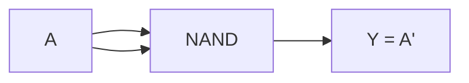
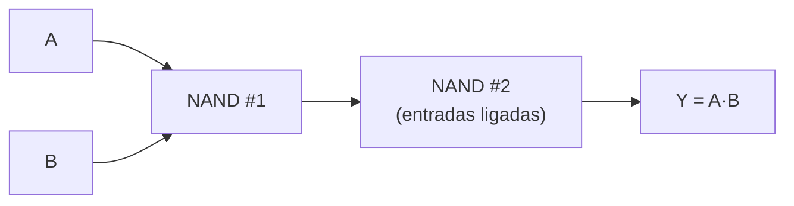
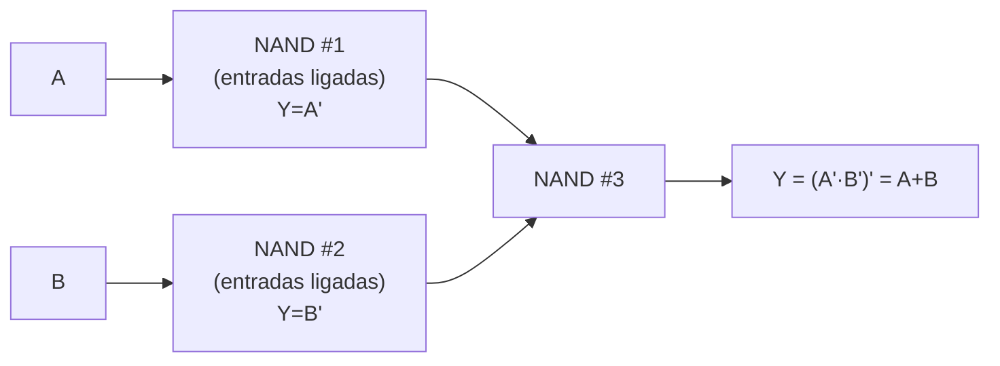

## Objetivos de Aprendizagem

- Definir completude funcional (universalidade) para um conjunto de portas, e dizer o que significa afirmar que o NAND sozinho é uma porta universal.
- Construir uma porta NOT com uma única porta NAND, e provar que a construção está correta com uma tabela verdade.
- Construir uma porta AND com duas portas NAND, e provar que a construção está correta com uma tabela verdade.
- Construir uma porta OR com três portas NAND usando a lei de De Morgan, e provar que a construção está correta com uma tabela verdade.
- Explicar o argumento de dois passos para a universalidade do NAND: o NAND constrói NOT e AND, e {NOT, AND} já é um conjunto completo, com o OR alcançável pela lei de De Morgan.
- Explicar a motivação de fabricação para padronizar um único tipo de porta repetido (uniformidade, rendimento, conveniência do CMOS), e dizer que o NOR é uma alternativa universal igualmente válida.

## Contexto e Motivação

O conceito anterior fixou uma biblioteca de oito portas padrão (buffer, NOT, AND, OR, NAND, NOR, XOR, XNOR), cada uma com sua própria tabela verdade e sua própria fatia minúscula de transistores CMOS. É natural supor que construir um chip real, portanto, significa fabricar todas as oito (ou pelo menos várias) dessas peças físicas distintas lado a lado, do jeito que a caixa de ferramentas de um marceneiro tem um martelo, um serrote e uma chave de fenda, porque nenhuma ferramenta sozinha faz os três trabalhos. A lógica digital quebra completamente essa intuição: acontece que **um único tipo de porta, repetido quantas vezes for preciso e ligado com esperteza, consegue calcular absolutamente qualquer função booleana que qualquer combinação de AND, OR e NOT jamais poderia calcular.** O NAND é uma dessas portas; o NOR é outra. Essa propriedade se chama **completude funcional**, ou **universalidade**, e é um dos fatos de maior consequência de toda esta disciplina, porque explica diretamente uma decisão física real tomada em toda fábrica de chips moderna.

O argumento da universalidade do NAND é curto e construtivo, o que é parte do que o torna tão satisfatório: trabalhos anteriores em lógica proposicional já estabeleceram que o conjunto {¬, ∧} (NOT e AND juntos) é funcionalmente completo; qualquer função booleana pode ser escrita usando só negação e conjunção, já que as leis de De Morgan permitem reescrever a disjunção (∨) em termos de ¬ e ∧ sempre que necessário. Então todo o argumento de universalidade do NAND se reduz a uma afirmação bem menor: o NAND sozinho consegue construir uma porta NOT, e o NAND sozinho consegue construir uma porta AND? Se as duas coisas forem possíveis, o NAND alcança tudo o que {¬, ∧} alcançava, ou seja, tudo. Este conceito prova exatamente essas duas pequenas construções, depois estende a mesma ideia ao OR, e fecha com o retorno prático: como um único tipo de porta basta para lógica arbitrária, um processo de fabricação de chips pode se especializar em fabricar um bloco de construção uniforme e extremamente otimizado, em vez de equilibrar vários leiautes de transistores diferentes, e esse é um dos principais motivos de os chips digitais reais serem, por baixo, oceanos de portas NAND (ou NOR) ligadas entre si, e não uma colcha de retalhos de todos os tipos de porta.

Este conceito também é um ensaio direto do seguinte, "Construindo Circuitos a Partir de Portas", que generaliza a mesma ideia (ligar portas pequenas para realizar uma função maior) das minúsculas construções de 1, 2 e 3 portas vistas aqui para circuitos combinacionais completos de muitas portas, como somadores, multiplexadores e decodificadores. Tudo daqui em diante na disciplina, até a CPU monociclo no fim do arco, é no fundo só portas NAND (ou um conjunto universal equivalente) ligadas em escala crescente; este conceito é onde esse fato é estabelecido e provado pela primeira vez, e não só afirmado.

## Teoria Central

### Completude funcional (universalidade)

Um conjunto de portas (ou, de forma equivalente, um conjunto de operadores booleanos) é **funcionalmente completo** se toda função booleana possível, de qualquer número de variáveis, pode ser expressa usando só portas desse conjunto. Os conjuntos completos clássicos da álgebra booleana são {¬, ∧, ∨} (o conjunto "de livro") e os menores {¬, ∧} ou {¬, ∨} (cada um suficiente sozinho quando as leis de De Morgan estão disponíveis para converter entre ∧ e ∨). Uma porta é chamada de **universal** se o conjunto de um único elemento que contém só essa porta já é funcionalmente completo, ou seja, se essa porta, sozinha, repetida e ligada de forma arbitrária, consegue realizar toda função booleana. O NAND é universal. O NOR também é universal (por um argumento simétrico, trocando os papéis de AND/OR e usando a lei de De Morgan no outro sentido). Vale notar que nem AND, nem OR, nem XOR sozinhos são universais: nenhuma quantidade de fiação usando só portas AND, por exemplo, consegue produzir uma porta NOT, já que AND (e OR) são ambos "monotônicos" (aumentar qualquer entrada nunca pode diminuir a saída), uma propriedade que o próprio NOT viola.

### Passo 1: NOT a partir de uma única porta NAND

A tabela verdade do NAND (do conceito anterior) é `Y = (A·B)′`. Se as duas entradas de uma porta NAND forem ligadas juntas ao mesmo sinal A (então B = A), a expressão se reduz: `Y = (A·A)′ = A′`, usando a lei de idempotência da álgebra booleana `A·A = A`. Então uma única porta NAND, com suas duas entradas curto-circuitadas, é exatamente uma porta NOT.

### Passo 2: AND a partir de duas portas NAND

Como o NAND já calcula `(A·B)′`, aplicar NOT a esse resultado recupera o AND simples: `((A·B)′)′ = A·B` pela lei da dupla negação. A primeira porta NAND produz `(A·B)′`; alimentar essa única saída numa segunda porta NAND com as duas entradas ligadas juntas (a construção de NOT a partir de NAND do Passo 1) a inverte de volta para `A·B`.

Isso custa 2 portas NAND no total.

### Passo 3: OR a partir de três portas NAND, pela lei de De Morgan

A lei de De Morgan diz que `A + B = (A′·B′)′`: o OR pode ser reescrito inteiramente em termos de NOT e AND (de forma equivalente, "o OR de A,B" é igual a "o NOT do AND dos complementos de A e B"). Como o Passo 1 mostra que o NOT custa uma porta NAND, e o `(...)′` externo em volta do produto é ele mesmo exatamente um NAND (inverter um AND), a construção é: inverter A (1 NAND), inverter B (1 NAND), e então fazer o NAND desses dois sinais invertidos (mais 1 NAND), porque o NAND de `A′` e `B′` calcula `(A′·B′)′`, que pela lei de De Morgan é igual a `A+B`.

Isso custa 3 portas NAND no total: duas para produzir os complementos, uma para combiná-los.

### Por que isso prova que o NAND é universal

O argumento completo se encadeia assim:

1. A lógica proposicional já estabeleceu que {¬, ∧} é funcionalmente completo: toda função booleana de qualquer número de variáveis pode ser escrita usando só NOT e AND (com o OR, quando necessário, expresso pela lei de De Morgan em termos de ¬ e ∧).
2. O Passo 1 mostra que o NAND sozinho consegue realizar o NOT.
3. O Passo 2 mostra que o NAND sozinho consegue realizar o AND.
4. Portanto, o NAND sozinho consegue realizar toda porta do conjunto completo {¬, ∧} e, pelo item 1, toda função booleana: o NAND é universal.

A construção do OR no Passo 3 não é logicamente exigida por esse argumento (o OR já é alcançável por ¬ e ∧, conforme o item 1), mas foi incluída porque o OR é comum o bastante na prática para valer a pena conhecer explicitamente sua receita direta com 3 NANDs, e porque ela serve também de verificação concreta e independente do argumento inteiro: se o NAND de fato alcança ¬ e ∧, encadear essas duas construções pela lei de De Morgan também precisa reproduzir o OR corretamente, o que o Exemplo 3 abaixo verifica linha a linha.

### Estendendo ao NOR, e construindo outras portas

Por um argumento simétrico (troque os papéis de AND e OR e use a outra metade da lei de De Morgan, `A·B = (A′+B′)′`), o NOR é igualmente universal: uma porta NOR com entradas ligadas calcula o NOT; um NOR seguido de outro NOR usado como NOT calcula o OR; e o NOR dos complementos de A e B calcula o AND. Quando NOT e AND (ou NOT e OR) estão disponíveis a partir de qualquer uma das portas universais, todas as outras portas da biblioteca padrão (incluindo XOR e XNOR, que podem ser expressas como `A·B′ + A′·B` e seu complemento) podem por sua vez ser construídas só com AND, OR e NOT, e portanto só com NAND (normalmente com mais portas, já que o XOR construído só com NAND leva 4 portas NAND no circuito mínimo padrão). O princípio geral (portas universais pequenas se compõem em funções booleanas arbitrariamente grandes) é exatamente o que o próximo conceito, "Construindo Circuitos a Partir de Portas", desenvolve em circuitos combinacionais completos de vários níveis.

### Por que a fabricação real favorece uma única porta repetida

A completude funcional seria uma curiosidade teórica simpática se não tivesse relação com a forma como os chips são de fato construídos, mas tem uma relação enorme. A fabricação de semicondutores é um processo fotolitográfico: um chip é fabricado imprimindo repetidamente um *padrão* físico (um leiaute de transistores) numa lâmina de silício. Se um projeto usa um único tipo de porta, o processo de fabricação precisa aperfeiçoar, caracterizar e produzir em massa um único leiaute de transistores (uma única "célula" física) e pode dedicar todo o seu esforço de engenharia a tornar essa célula tão pequena, rápida, econômica em energia e confiável quanto fisicamente possível. Padronizar um único bloco de construção repetido traz três benefícios concretos de fabricação: **uniformidade** (um projeto de célula é verificado e caracterizado uma vez e então estampado milhões de vezes, em vez de verificar separadamente muitos tipos de célula diferentes); **rendimento** (um processo de fabricação ajustado em torno de um único padrão de transistores bem compreendido sofre menos defeitos e problemas de variabilidade do que um que equilibra muitos padrões diferentes); e **conveniência do CMOS** (NAND e NOR, como observado no conceito anterior, são as portas que o CMOS constrói mais diretamente, cada uma num único estágio de transistores, então escolher NAND ou NOR como o bloco de construção universal também coincide com a porta fisicamente mais barata que o CMOS oferece naturalmente; não há necessidade nenhuma de otimizar separadamente uma célula AND ou OR mais cara).

## Exemplos Resolvidos

### Exemplo 1: NOT a partir de uma porta NAND

**Construção:** ligue as duas entradas de uma porta NAND ao mesmo sinal A.

**Verificação por tabela verdade** (só duas linhas são possíveis, já que B é sempre igual a A):

| A | B=A | (A·B)′ |
|---|---|---|
| 0 | 0 | 1 |
| 1 | 1 | 0 |

Comparando com a tabela verdade padrão do NOT (A=0 → Y=1; A=1 → Y=0), as duas batem nas duas linhas. A construção com um único NAND é uma porta NOT verificada. Número de portas: **1 NAND**.

### Exemplo 2: AND a partir de duas portas NAND

**Construção:** NAND(A, B) produz `(A·B)′`; alimente essa saída numa segunda porta NAND com as duas entradas ligadas juntas (a construção do Exemplo 1), produzindo `((A·B)′)′`.

**Verificação por tabela verdade:**

| A | B | (A·B)′ [porta 1] | ((A·B)′)′ [porta 2] |
|---|---|---|---|
| 0 | 0 | 1 | 0 |
| 0 | 1 | 1 | 0 |
| 1 | 0 | 1 | 0 |
| 1 | 1 | 0 | 1 |

A coluna final lê 0, 0, 0, 1 nas quatro linhas, exatamente a tabela verdade padrão do AND (1 só quando as duas entradas valem 1). Número de portas: **2 NANDs**.

### Exemplo 3: OR a partir de três portas NAND (pela lei de De Morgan)

**Construção:** inverta A usando um NAND com entradas ligadas (chame sua saída de A′); inverta B do mesmo jeito (saída B′); faça o NAND desses dois sinais invertidos, produzindo `(A′·B′)′`, que pela lei de De Morgan é igual a `A+B`.

**Verificação por tabela verdade**, acompanhando cada sinal intermediário:

| A | B | A′ [porta 1] | B′ [porta 2] | (A′·B′)′ [porta 3] |
|---|---|---|---|---|
| 0 | 0 | 1 | 1 | 0 |
| 0 | 1 | 1 | 0 | 1 |
| 1 | 0 | 0 | 1 | 1 |
| 1 | 1 | 0 | 0 | 1 |

A coluna final lê 0, 1, 1, 1, exatamente a tabela verdade padrão do OR (1 sempre que pelo menos uma entrada vale 1). Número de portas: **3 NANDs** (duas para as inversões, uma para o NAND final que combina). Isso confirma tanto as construções individuais de NOT e AND dos Exemplos 1 e 2 quanto o raciocínio baseado em De Morgan usado para encadeá-las no OR.

## Equívocos Comuns e Armadilhas

- **"Universal significa que o NAND consegue fazer coisas que AND/OR/NOT juntos não conseguem."** Universalidade significa a comparação no sentido *oposto*: o NAND sozinho alcança tudo o que {AND, OR, NOT} juntos alcançam, e não algo além disso. Nenhuma porta ou conjunto de portas consegue calcular mais funções booleanas do que o conjunto padrão completo já consegue; a propriedade notável do NAND é igualar esse poder expressivo completo usando um único tipo de porta, não superá-lo.
- **"Ligar as duas entradas do NAND juntas é um truque de hardware que não 'conta' de verdade como usar uma porta NAND."** É um uso completamente legítimo da porta: o contrato de uma porta NAND diz respeito só à sua tabela verdade, dadas as tensões que aparecem nos seus pinos de entrada; nada proíbe que os dois pinos sejam comandados pelo mesmo fio, e o comportamento resultante (Exemplo 1) é exatamente, de forma comprovável, uma porta NOT.
- **"Como o NAND é universal, circuitos construídos com NAND são tão pequenos quanto circuitos construídos com tipos de porta misturados."** A universalidade é sobre *o que* pode ser calculado, não sobre *eficiência*. Construir um AND com NAND custa 2 portas em vez de 1, e um OR com NAND custa 3 portas em vez de 1; circuitos só de NAND costumam ser maiores (mais portas individuais) que a mesma função construída com uma biblioteca de portas mista; o benefício de fabricação (Teoria Central) vem da uniformidade e do rendimento, não de usar menos portas no total.
- **"O NAND é a única porta universal."** O NOR é igualmente universal, pela construção simétrica de De Morgan (NOT e OR a partir do NOR, e depois o AND pela outra metade de De Morgan). Alguns processos de fabricação reais e alguns computadores históricos baseados em relés preferiram projetos baseados em NOR; a escolha entre NAND e NOR é uma decisão de tecnologia, não uma necessidade matemática.
- **"AND, OR e XOR também deveriam ser universais, já que são portas 'básicas'."** Nem AND, nem OR, nem XOR sozinhos são universais. AND e OR são ambos monotônicos (aumentar uma entrada nunca diminui a saída), então nenhum dos dois consegue jamais produzir o comportamento do NOT (que é explicitamente não monotônico), não importa como sejam ligados; o XOR sozinho também não é universal (fiação repetida de XOR/XNOR fica dentro de uma classe restrita de funções "lineares" e nunca consegue produzir, por exemplo, um AND simples).

## Resumo

O NAND é uma porta universal (funcionalmente completa): como uma porta NAND com as entradas ligadas juntas realiza o NOT, e uma porta NAND alimentando um NOT feito de NAND realiza o AND, o NAND sozinho alcança o conjunto já completo {NOT, AND} e, a partir daí, pela lei de De Morgan, o OR e toda outra função booleana também, como verificado concretamente pelas construções de NOT com 1 NAND, AND com 2 NANDs e OR com 3 NANDs trabalhadas acima. O NOR é uma alternativa universal igualmente válida, pelo argumento simétrico. Isso não é só uma curiosidade teórica: como a fabricação fotolitográfica de chips recompensa fortemente aperfeiçoar e estampar um único padrão de transistores uniforme em vez de equilibrar vários, e como NAND/NOR já são as portas mais baratas que a tecnologia CMOS constrói diretamente, os chips reais são fabricados como vastos campos de uma única porta repetida, e não como uma caixa de ferramentas mista de peças AND, OR e NOT. O próximo conceito, "Construindo Circuitos a Partir de Portas", pega essa mesma ideia composicional (portas pequenas ligadas para realizar uma função booleana maior) e a escala das construções de 1, 2 e 3 portas vistas aqui para circuitos combinacionais genuínos de muitas portas, como somadores, multiplexadores e decodificadores.

## Documentation Links

- [Nand2Tetris: Build a Modern Computer from First Principles](https://www.coursera.org/learn/build-a-computer): curso cujo capítulo fundamental constrói NOT, AND, OR e o resto do conjunto de portas elementares partindo só do NAND.
- [MIT 6.004: Combinational Logic Unit](https://ocw.mit.edu/courses/6-004-computation-structures-spring-2017/pages/c4/): unidade do curso que cobre lógica combinacional e construção de circuitos em nível de portas, incluindo conjuntos universais de portas.
