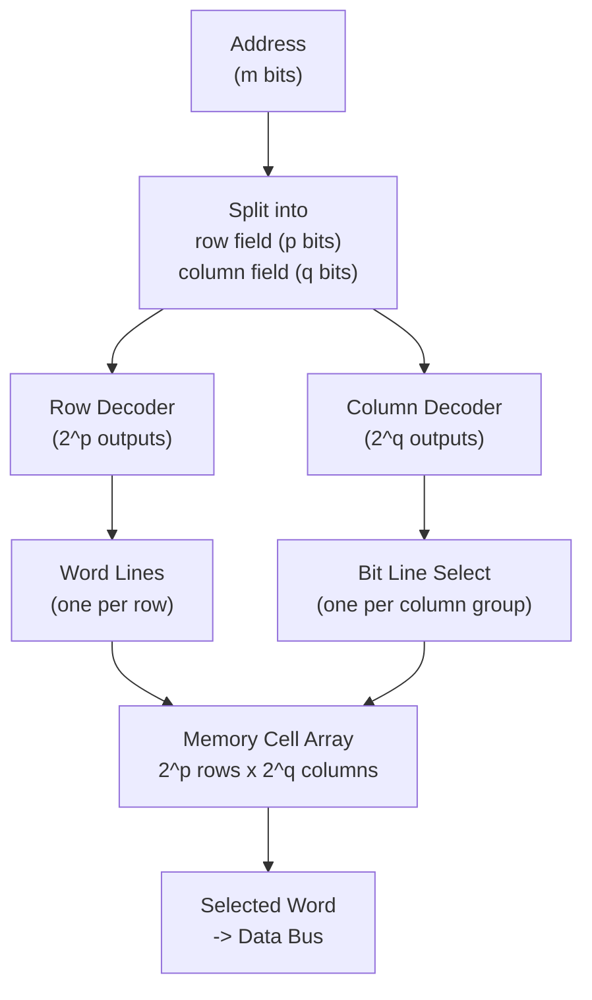

## Learning Objectives

- Explain why a register file's flat decoder-plus-mux design does not scale to the size of main memory, and identify the specific resource that grows unmanageably.
- Compute the number of address bits needed to uniquely select one of 2^m words, and describe what a decoder outputs for a given address.
- Describe the 2D row/column (matrix) organization of a memory array and explain how row and column decoders divide the decoding work between them.
- Distinguish word lines from bit lines and explain the role each plays during a read and during a write.
- Trace a specific address through a 2D-organized memory to identify which single row and column — and therefore which single word — it selects.
- Connect the O(1) random-access guarantee of an array data structure to the specific address-decoder circuit that realizes it in hardware.

## Context & Motivation

The register file from the previous concept solves addressed storage beautifully for a handful of registers — sixteen or thirty-two entries, decoded and multiplexed with only a few levels of gates. But a real computer's main memory holds not dozens but billions of addressable words, and the same flat approach, extended naively, collapses under its own size. A flat decoder for 2^20 (roughly a million) addresses would need over a million output lines, each one individually wired to gate a load-enable, and a read multiplexer would need over a million data inputs converging on a single selector — both numbers utterly impractical to route on a chip, let alone operate at any usable speed. Scaling storage by many orders of magnitude therefore cannot be a matter of simply building a bigger version of the register file; it requires a fundamentally different internal organization that keeps decoding fast and wiring manageable even as capacity grows enormously.

The answer, used in essentially every real RAM chip, is to arrange the memory as a two-dimensional matrix of storage cells rather than a flat list, and to split address decoding correspondingly into a row decoder and a column decoder. This halves (roughly) the exponent that either decoder alone has to handle, because a memory of 2^m words organized as 2^p rows by 2^q columns (with p + q = m) needs a decoder with only 2^p outputs and another with only 2^q outputs, instead of one decoder with 2^m outputs. This single organizational idea — decompose one big decoding problem into two much smaller ones operating on orthogonal axes — is what makes gigabyte- and terabyte-scale memory physically buildable at all, and it is worth understanding in its own right because it recurs throughout computer architecture wherever something must be selected quickly out of an enormous space of possibilities.

This concept is also where a fact taken for granted in every introductory data structures course gets its physical explanation. An array's defining property is that `array[i]` is retrieved in constant time, O(1), regardless of how large the array is or how far into it the index `i` points — no traversal, no comparison chain, just direct arrival at the element. That guarantee is not a convention adopted by programming language designers; it is a direct consequence of the address-decoder circuit described in this concept. Computing an address activates one specific row and one specific column combination, in a bounded number of gate delays that does not grow with the size of the memory (beyond the modest logarithmic growth of decoder depth) — the hardware genuinely does reach the target word directly, and that is precisely why the abstraction built on top of it is allowed to promise O(1) access.

## Core Theory

### From a flat address space to a decoder tree

An address, in this context, is simply an unsigned binary integer that names one storage location among 2^m possibilities, using m address bits. A **decoder** is a combinational circuit that converts an m-bit binary input into 2^m mutually-exclusive ("one-hot") output lines: for any given input pattern, exactly one output line is asserted (1) and all others are 0 — exactly the same decoder used to gate register-file writes in the previous concept, just built for a much larger m.

Building a single decoder directly for large m is what becomes impractical, not the concept of decoding itself. A decoder for m address bits can be constructed as a tree of smaller decoders (for instance, cascading 2-to-4 stages), but the underlying gate count and wiring complexity of any single flat decoder still grows on the order of 2^m outputs, each requiring its own physical wire routed across the chip. Beyond a fairly modest m, this wire count and the capacitive loading on the address input lines (fanning out to every stage of a deep decoder tree) become the binding constraints, not raw gate count. Practical memory arrays sidestep this by never building one flat 2^m-output decoder at all.

### Two-dimensional (row/column) memory organization

Instead of a flat list of 2^m words, a memory array is organized as a matrix: 2^p rows and 2^q columns, with p + q = m, so the array holds 2^p × 2^q = 2^m storage locations. The m-bit address splits into two fields: the high-order p bits select a row, the low-order q bits select a column (or a group of columns, in memories storing multiple bits per addressed word — see below). Two independent, much smaller decoders do the work one giant decoder would otherwise have to do: a **row decoder** takes the p-bit row field and asserts exactly one of 2^p row lines; a **column decoder** takes the q-bit column field and asserts exactly one of 2^q column lines (or selects one group of columns via a column multiplexer).

| Organization | Decoder count | Decoder size(s) | Total decoder outputs |
|---|---|---|---|
| Flat (1D) | 1 | 2^m-output decoder | 2^m |
| 2D row/column | 2 | 2^p-output + 2^q-output | 2^p + 2^q |

For a concrete sense of the saving: a memory of 2^20 (about a million) words organized flatly needs a single decoder with roughly a million outputs. Organized as 2^10 rows by 2^10 columns (p = q = 10), it needs two decoders with only 2^10 = 1024 outputs each — a combined 2048 outputs instead of over a million, at the cost of needing both a row and a column select to agree before any single cell is reached.

### Word lines and bit lines

Inside the physical array, each row of storage cells shares a single horizontal wire called a **word line**: when the row decoder asserts row r's line, every cell in row r is simultaneously enabled for access (its stored bit becomes readable onto, or writable from, its column's wiring). Each column of storage cells shares a vertical wire called a **bit line**, along which a single bit travels into or out of whichever cell in that column currently has its word line asserted. Asserting one word line together with the column decoder selecting one (or one group of) bit line(s) is the "AND of a row match and a column match" that picks out exactly one memory cell — or, when a word line activates a whole row storing one multi-bit word, it selects exactly one addressable word, with every bit line carrying one bit of that word to the data bus.

### Read versus write in a 2D-organized memory

During a **read**, the address is decoded as described, one word line and the appropriate bit lines are selected, and the stored values in the enabled row flow out along the bit lines to a data-output bus — no cell outside the selected row is disturbed, since only the selected row's cells drive their bit lines. During a **write**, the same row and column decoding selects the identical target location, but a write-enable signal, together with data supplied on the bit lines from a data-input bus, causes the selected cell(s) to load the new value instead of driving their old one outward — mirroring the load-enable-gated write already seen in the register file, gated additionally by the column decoder's selection rather than a single one-hot line per register.

### Why this yields O(1) random access

The crucial property is that decoding an address — splitting it into row and column fields, feeding each through its own decoder — takes a fixed, bounded number of gate delays depending only on the address width m (specifically on p and q), not on how many words the memory holds beyond that. Doubling capacity by adding one more address bit adds at most one more level of decoding logic — a vastly sublinear cost compared to the exponential growth in capacity. This is the exact circuit-level reason an array data structure is defined to offer O(1) random access: reaching `array[i]` in hardware means decoding address `i` into a row and column select and reading directly off the corresponding word line and bit lines, with no traversal of intervening elements, unlike a linked structure where reaching element `i` genuinely requires walking through `i` predecessors.

## Worked Examples

### Example 1: Address width and decoder outputs for 4096 words

How many address bits are needed to uniquely select one of 4096 words, and what does the resulting decoder produce?

Step 1 — express 4096 as a power of 2: 4096 = 2^12, so m = 12 address bits are required (2^12 = 4096 distinct patterns, exactly enough to name each word with none left over and none missing).

Step 2 — with m = 12, a flat decoder would need 2^12 = 4096 output lines, one per word, each one-hot with respect to the others.

Step 3 — organizing as a 2D array instead, split m = 12 into p + q = 12, for instance p = 6 (row field) and q = 6 (column field). The row decoder then has 2^6 = 64 outputs and the column decoder also has 2^6 = 64 outputs — a combined 128 decoder outputs instead of 4096, while still uniquely reaching every one of the 64 × 64 = 4096 locations via one row line and one column line asserted together.

### Example 2: Decoding a specific address into row and column select

Given a memory organized as 64 rows by 64 columns (as in Example 1, p = q = 6, m = 12), decode the address 000010 100001 (space added only for readability; this is a single 12-bit address) into its row and column selection.

Step 1 — split the 12-bit address into its high-order 6 bits (row field) and low-order 6 bits (column field): row field = 000010, column field = 100001.

Step 2 — convert the row field to decimal: 000010₂ = 2, so row 2 is selected; the row decoder asserts output line 2, all others stay 0.

Step 3 — convert the column field to decimal: 100001₂ = 33, so column 33 is selected; the column decoder asserts output line 33, all others stay 0.

Step 4 — the cell (or word) physically located at row 2, column 33 is the unique location activated by this address — its word line (row 2) and its bit line selection (column 33) are both asserted, and no other cell in the array has both conditions true simultaneously.

### Example 3: Tracing a read at a given address through to the output bus

Continuing Example 2's 64×64 memory, trace a read at address 000010 100001 from address input to data output.

Step 1 — the read-enable control signal is asserted (write-enable held low, since this is a read).

Step 2 — the 12-bit address arrives at the address-splitting logic, routing bits 000010 to the row decoder and bits 100001 to the column decoder, exactly as in Example 2.

Step 3 — the row decoder asserts word line 2; every cell in row 2 now drives its stored bit onto its column's bit line, while every other row's cells remain electrically isolated from the bit lines.

Step 4 — the column decoder selects column 33's bit line specifically, routing the value just driven onto it — the stored bit, or for a word-oriented memory, a word's worth of bits from row 2's designated word-position — onto the data-output bus.

Step 5 — the data-output bus now carries exactly the value stored at address 000010 100001, unaffected by any other stored value in the 4096-location array, because every other row was never enabled to drive the bit lines and every other column was never selected onto the output bus.

## Common Misconceptions & Pitfalls

- **"A bigger memory just needs a bigger version of the same flat decoder used for a register file."** It does not scale that way — a flat decoder's output count grows as 2^m, which becomes physically unroutable well before reaching main-memory-sized capacities; real memories switch to a 2D row/column organization specifically to keep both decoders' output counts small (2^p and 2^q instead of 2^(p+q)).
- **"The row decoder and column decoder do redundant work."** They decode entirely different, non-overlapping bit fields of the same address and must both agree (one row line AND one column line) to reach a single cell; neither decoder alone identifies a unique storage location.
- **"A word line and a bit line are two names for the same kind of wire."** They are orthogonal: a word line, driven by the row decoder, is shared horizontally across a row and enables that row's cells to interact with the bit lines at all; a bit line, running vertically through one column, carries a single bit into or out of whichever cell in that column is currently enabled.
- **"O(1) array access is a property of the programming language or compiler, not the hardware."** The constant-time guarantee originates in the address-decoder circuit described here: decoding an address takes a bounded number of gate delays independent of how many elements the array holds, which is the actual physical reason a compiled array-indexing operation does not slow down as the array grows.
- **"Splitting an address into row and column fields loses information or requires extra address bits."** It does not — the row and column fields are simply the high-order and low-order bits of the same m-bit address, partitioned rather than duplicated; p + q = m always, so the two decoders together consume precisely the same address bits one flat decoder would have consumed.
- **"Reading a memory location disturbs neighboring locations because they share the same array."** A properly decoded read only asserts one word line, so only the addressed row's cells ever drive the bit lines; every other row stays electrically disconnected, and the column decoder further ensures only the addressed column's data reaches the output bus.

## Summary

Scaling storage from a handful of register-file entries to millions of memory words breaks the flat decoder-plus-mux approach, because a single decoder's output count grows as 2^m and becomes unroutable at realistic memory sizes. The fix is a two-dimensional matrix organization: an m-bit address splits into a p-bit row field and a q-bit column field (p + q = m), decoded independently by a row decoder (2^p outputs, driving word lines shared across each row) and a column decoder (2^q outputs, selecting bit lines shared down each column), so that only a row-and-column combination together — never one decoder alone — activates a single storage location, keeping total decoder hardware on the order of 2^p + 2^q rather than 2^m. This is the literal physical mechanism behind the O(1) random access already taken for granted as an array's defining property in software: computing an address selects one row and one column directly, in a bounded number of gate delays that does not grow with capacity, with no traversal of any other stored value whatsoever — the exact circuit realization behind Static Arrays and Random Access. With addressable memory now understood down to the gate level, the discipline moves next to designing an arithmetic logic unit, the circuit that computes the values this memory and the register file will store.

## Documentation Links

- [Nand2Tetris — Build a Modern Computer from First Principles](https://www.coursera.org/learn/build-a-computer) — course covering the construction of RAM chips from registers and multiplexers, including the address-decoding structure used to select a single word.
- [ACM/IEEE CS2013 — Architecture and Organization Knowledge Area](https://csed.acm.org/knowledge-areas-architecture-and-organization-ar-cs2013-version/) — curriculum guidelines covering memory hierarchy and organization, including addressing and decoding, as core Architecture and Organization topics.
