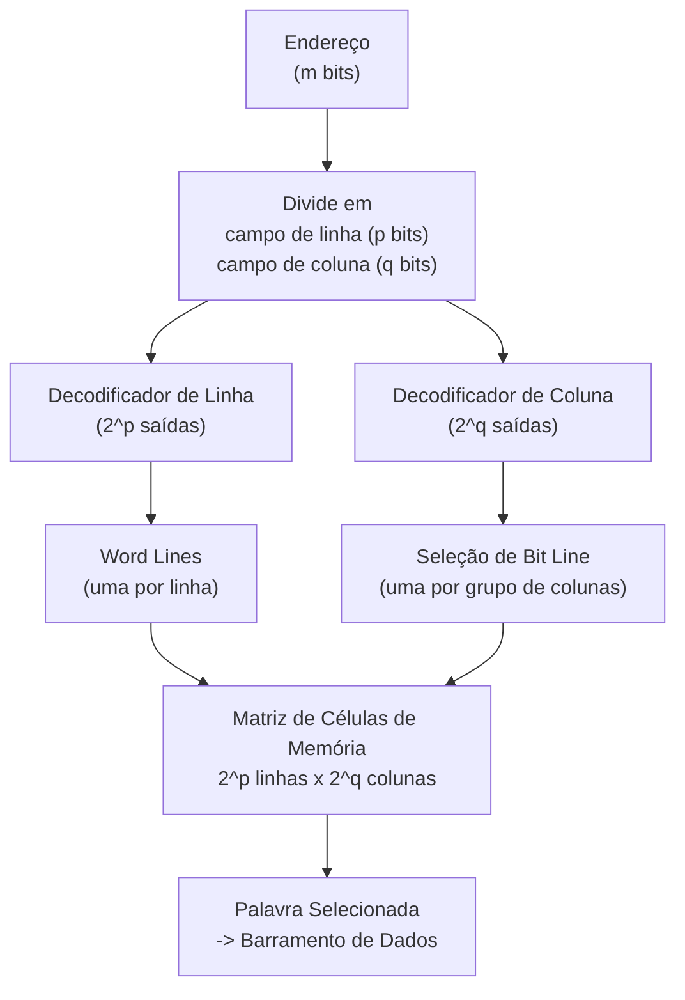

## Objetivos de Aprendizagem

- Explicar por que o projeto plano de decodificador mais mux de um banco de registradores não escala para o tamanho da memória principal, e identificar o recurso específico que cresce de forma incontrolável.
- Calcular o número de bits de endereço necessários para selecionar de forma única uma entre 2^m palavras, e descrever o que um decodificador produz para um dado endereço.
- Descrever a organização 2D de linhas e colunas (em matriz) de uma memória e explicar como os decodificadores de linha e de coluna dividem entre si o trabalho de decodificação.
- Distinguir word lines de bit lines e explicar o papel de cada uma durante uma leitura e durante uma escrita.
- Acompanhar um endereço específico numa memória organizada em 2D para identificar qual linha e qual coluna (e, portanto, qual palavra) ele seleciona.
- Ligar a garantia de acesso aleatório O(1) da estrutura de dados array ao circuito decodificador de endereços específico que a realiza em hardware.

## Contexto e Motivação

O banco de registradores do conceito anterior resolve lindamente o armazenamento endereçado para um punhado de registradores: dezesseis ou trinta e duas entradas, decodificadas e multiplexadas com poucos níveis de portas. Mas a memória principal de um computador real guarda não dezenas, mas bilhões de palavras endereçáveis, e a mesma abordagem plana, estendida de forma ingênua, desaba sob o próprio tamanho. Um decodificador plano para 2^20 (cerca de um milhão de) endereços precisaria de mais de um milhão de linhas de saída, cada uma ligada individualmente para controlar uma habilitação de carga, e um multiplexador de leitura precisaria de mais de um milhão de entradas de dados convergindo num único seletor; os dois números são completamente impraticáveis de rotear num chip, quanto mais de operar a uma velocidade utilizável. Ampliar o armazenamento em muitas ordens de grandeza, portanto, não pode ser só uma questão de construir uma versão maior do banco de registradores; exige uma organização interna fundamentalmente diferente, que mantenha a decodificação rápida e a fiação controlável mesmo com a capacidade crescendo enormemente.

A resposta, usada em praticamente todo chip de RAM real, é arranjar a memória como uma matriz bidimensional de células de armazenamento em vez de uma lista plana, e dividir a decodificação de endereços de forma correspondente entre um decodificador de linha e um decodificador de coluna. Isso corta (aproximadamente) pela metade o expoente com que cada decodificador sozinho precisa lidar, porque uma memória de 2^m palavras organizada como 2^p linhas por 2^q colunas (com p + q = m) precisa de um decodificador com só 2^p saídas e de outro com só 2^q saídas, em vez de um decodificador com 2^m saídas. Essa única ideia de organização (decompor um grande problema de decodificação em dois muito menores, operando em eixos ortogonais) é o que torna a memória na escala de gigabytes e terabytes fisicamente construível, e vale a pena entendê-la por si só, porque ela se repete em toda a arquitetura de computadores onde quer que algo precise ser selecionado rapidamente num espaço enorme de possibilidades.

Este conceito também é onde um fato tomado como certo em todo curso introdutório de estruturas de dados ganha sua explicação física. A propriedade que define um array é que `array[i]` é obtido em tempo constante, O(1), não importa o tamanho do array nem quão longe nele o índice `i` aponte: sem percurso, sem cadeia de comparações, só chegada direta ao elemento. Essa garantia não é uma convenção adotada pelos projetistas de linguagens de programação; é uma consequência direta do circuito decodificador de endereços descrito neste conceito. Calcular um endereço ativa uma combinação específica de uma linha e uma coluna, num número limitado de atrasos de porta que não cresce com o tamanho da memória (além do modesto crescimento logarítmico da profundidade do decodificador); o hardware de fato chega diretamente à palavra alvo, e é precisamente por isso que a abstração construída sobre ele pode prometer acesso O(1).

## Teoria Central

### De um espaço de endereços plano a uma árvore de decodificadores

Um endereço, neste contexto, é simplesmente um inteiro binário sem sinal que nomeia um local de armazenamento entre 2^m possibilidades, usando m bits de endereço. Um **decodificador** é um circuito combinacional que converte uma entrada binária de m bits em 2^m linhas de saída mutuamente exclusivas ("one-hot"): para qualquer padrão de entrada dado, exatamente uma linha de saída é ativada (1) e todas as outras ficam em 0. É exatamente o mesmo decodificador usado para controlar as escritas no banco de registradores no conceito anterior, só que construído para um m muito maior.

O que se torna impraticável é construir diretamente um único decodificador para m grande, e não o conceito de decodificação em si. Um decodificador para m bits de endereço pode ser construído como uma árvore de decodificadores menores (por exemplo, cascateando estágios de 2 para 4), mas o número de portas subjacente e a complexidade de fiação de qualquer decodificador plano único ainda crescem na ordem de 2^m saídas, cada uma exigindo seu próprio fio físico roteado pelo chip. Além de um m bem modesto, esse número de fios e a carga capacitiva nas linhas de entrada de endereço (espalhadas para cada estágio de uma árvore de decodificadores profunda) viram as restrições determinantes, e não o número bruto de portas. As matrizes de memória práticas contornam isso nunca construindo um decodificador plano de 2^m saídas.

### Organização bidimensional (linhas/colunas) da memória

Em vez de uma lista plana de 2^m palavras, uma matriz de memória é organizada como uma matriz: 2^p linhas e 2^q colunas, com p + q = m, de modo que a matriz guarda 2^p × 2^q = 2^m locais de armazenamento. O endereço de m bits se divide em dois campos: os p bits de ordem mais alta selecionam uma linha, os q bits de ordem mais baixa selecionam uma coluna (ou um grupo de colunas, em memórias que guardam vários bits por palavra endereçada; veja abaixo). Dois decodificadores independentes e muito menores fazem o trabalho que um decodificador gigante teria de fazer: um **decodificador de linha** recebe o campo de linha de p bits e ativa exatamente uma entre 2^p linhas de linha; um **decodificador de coluna** recebe o campo de coluna de q bits e ativa exatamente uma entre 2^q linhas de coluna (ou seleciona um grupo de colunas por meio de um multiplexador de coluna).

| Organização | Número de decodificadores | Tamanho(s) dos decodificadores | Total de saídas de decodificador |
|---|---|---|---|
| Plana (1D) | 1 | decodificador de 2^m saídas | 2^m |
| 2D linhas/colunas | 2 | 2^p saídas + 2^q saídas | 2^p + 2^q |

Para ter uma noção concreta da economia: uma memória de 2^20 (cerca de um milhão de) palavras organizada de forma plana precisa de um único decodificador com cerca de um milhão de saídas. Organizada como 2^10 linhas por 2^10 colunas (p = q = 10), ela precisa de dois decodificadores com só 2^10 = 1024 saídas cada, 2048 saídas combinadas em vez de mais de um milhão, ao custo de precisar que uma seleção de linha e uma de coluna concordem antes de alcançar qualquer célula.

### Word lines e bit lines

Dentro da matriz física, cada linha de células de armazenamento compartilha um único fio horizontal chamado **word line**: quando o decodificador de linha ativa a linha r, todas as células da linha r são habilitadas ao mesmo tempo para acesso (seu bit guardado pode ser lido na fiação da sua coluna, ou escrito a partir dela). Cada coluna de células de armazenamento compartilha um fio vertical chamado **bit line**, pelo qual um único bit entra ou sai da célula daquela coluna que estiver com a word line ativada no momento. Ativar uma word line junto com o decodificador de coluna selecionando uma (ou um grupo de) bit line(s) é o "AND de uma coincidência de linha com uma coincidência de coluna" que escolhe exatamente uma célula de memória; ou, quando uma word line ativa uma linha inteira que guarda uma palavra de vários bits, seleciona exatamente uma palavra endereçável, com cada bit line levando um bit dessa palavra ao barramento de dados.

### Leitura versus escrita numa memória organizada em 2D

Numa **leitura**, o endereço é decodificado como descrito, uma word line e as bit lines apropriadas são selecionadas, e os valores guardados na linha habilitada saem pelas bit lines para um barramento de saída de dados; nenhuma célula fora da linha selecionada é perturbada, já que só as células da linha selecionada comandam suas bit lines. Numa **escrita**, a mesma decodificação de linha e coluna seleciona exatamente o mesmo local alvo, mas um sinal de habilitação de escrita, junto com dados fornecidos nas bit lines a partir de um barramento de entrada de dados, faz a(s) célula(s) selecionada(s) carregar(em) o novo valor em vez de comandar o valor antigo para fora, espelhando a escrita controlada por habilitação de carga já vista no banco de registradores, controlada aqui também pela seleção do decodificador de coluna em vez de uma única linha one-hot por registrador.

### Por que isso dá acesso aleatório O(1)

A propriedade crucial é que decodificar um endereço (dividi-lo em campos de linha e coluna e passar cada um pelo seu próprio decodificador) leva um número fixo e limitado de atrasos de porta, que depende só da largura do endereço m (especificamente de p e q), e não de quantas palavras a memória guarda além disso. Dobrar a capacidade acrescentando mais um bit de endereço acrescenta no máximo mais um nível de lógica de decodificação, um custo muito sublinear comparado ao crescimento exponencial da capacidade. Esse é o motivo exato, em nível de circuito, de a estrutura de dados array ser definida como oferecendo acesso aleatório O(1): chegar a `array[i]` em hardware significa decodificar o endereço `i` numa seleção de linha e coluna e ler diretamente da word line e das bit lines correspondentes, sem percorrer elementos intermediários, ao contrário de uma estrutura encadeada, em que chegar ao elemento `i` de fato exige passar pelos `i` antecessores.

## Exemplos Resolvidos

### Exemplo 1: largura de endereço e saídas de decodificador para 4096 palavras

Quantos bits de endereço são necessários para selecionar de forma única uma entre 4096 palavras, e o que o decodificador resultante produz?

Passo 1: expresse 4096 como potência de 2: 4096 = 2^12, então são necessários m = 12 bits de endereço (2^12 = 4096 padrões distintos, exatamente o suficiente para nomear cada palavra, sem sobrar nem faltar nenhum).

Passo 2: com m = 12, um decodificador plano precisaria de 2^12 = 4096 linhas de saída, uma por palavra, cada uma one-hot em relação às outras.

Passo 3: organizando como uma matriz 2D, divida m = 12 em p + q = 12, por exemplo p = 6 (campo de linha) e q = 6 (campo de coluna). O decodificador de linha então tem 2^6 = 64 saídas e o decodificador de coluna também tem 2^6 = 64 saídas, 128 saídas de decodificador combinadas em vez de 4096, ainda alcançando de forma única cada um dos 64 × 64 = 4096 locais por meio de uma linha de linha e uma linha de coluna ativadas juntas.

### Exemplo 2: decodificando um endereço específico em seleção de linha e coluna

Dada uma memória organizada como 64 linhas por 64 colunas (como no Exemplo 1, p = q = 6, m = 12), decodifique o endereço 000010 100001 (o espaço foi acrescentado só para facilitar a leitura; é um único endereço de 12 bits) na sua seleção de linha e coluna.

Passo 1: divida o endereço de 12 bits nos seus 6 bits de ordem mais alta (campo de linha) e 6 bits de ordem mais baixa (campo de coluna): campo de linha = 000010, campo de coluna = 100001.

Passo 2: converta o campo de linha para decimal: 000010₂ = 2, então a linha 2 é selecionada; o decodificador de linha ativa a linha de saída 2, e todas as outras ficam em 0.

Passo 3: converta o campo de coluna para decimal: 100001₂ = 33, então a coluna 33 é selecionada; o decodificador de coluna ativa a linha de saída 33, e todas as outras ficam em 0.

Passo 4: a célula (ou palavra) localizada fisicamente na linha 2, coluna 33 é o único local ativado por esse endereço: sua word line (linha 2) e sua seleção de bit line (coluna 33) estão ambas ativadas, e nenhuma outra célula da matriz tem as duas condições verdadeiras ao mesmo tempo.

### Exemplo 3: acompanhando uma leitura num dado endereço até o barramento de saída

Continuando com a memória 64×64 do Exemplo 2, acompanhe uma leitura no endereço 000010 100001, da entrada de endereço até a saída de dados.

Passo 1: o sinal de controle de habilitação de leitura é ativado (a habilitação de escrita fica baixa, já que isto é uma leitura).

Passo 2: o endereço de 12 bits chega à lógica de divisão de endereços, que encaminha os bits 000010 ao decodificador de linha e os bits 100001 ao decodificador de coluna, exatamente como no Exemplo 2.

Passo 3: o decodificador de linha ativa a word line 2; todas as células da linha 2 agora comandam seu bit guardado na bit line da sua coluna, enquanto as células de todas as outras linhas continuam eletricamente isoladas das bit lines.

Passo 4: o decodificador de coluna seleciona especificamente a bit line da coluna 33, encaminhando o valor recém-comandado nela (o bit guardado ou, numa memória orientada a palavras, os bits de uma palavra da posição de palavra designada na linha 2) para o barramento de saída de dados.

Passo 5: o barramento de saída de dados agora leva exatamente o valor guardado no endereço 000010 100001, sem influência de nenhum outro valor guardado na matriz de 4096 locais, porque nenhuma outra linha foi habilitada para comandar as bit lines e nenhuma outra coluna foi selecionada para o barramento de saída.

## Equívocos Comuns e Armadilhas

- **"Uma memória maior só precisa de uma versão maior do mesmo decodificador plano usado num banco de registradores."** Não escala assim: o número de saídas de um decodificador plano cresce como 2^m, o que fica fisicamente impossível de rotear bem antes de chegar a capacidades do tamanho da memória principal; memórias reais passam para uma organização 2D de linhas e colunas justamente para manter pequeno o número de saídas dos dois decodificadores (2^p e 2^q em vez de 2^(p+q)).
- **"O decodificador de linha e o decodificador de coluna fazem trabalho redundante."** Eles decodificam campos de bits totalmente diferentes e sem sobreposição do mesmo endereço, e precisam concordar (uma linha de linha E uma linha de coluna) para chegar a uma única célula; nenhum decodificador sozinho identifica um local de armazenamento único.
- **"Word line e bit line são dois nomes para o mesmo tipo de fio."** Elas são ortogonais: uma word line, comandada pelo decodificador de linha, é compartilhada na horizontal ao longo de uma linha e habilita as células dessa linha a interagir com as bit lines; uma bit line, correndo na vertical por uma coluna, leva um único bit para dentro ou para fora da célula daquela coluna que estiver habilitada no momento.
- **"O acesso O(1) a arrays é uma propriedade da linguagem de programação ou do compilador, não do hardware."** A garantia de tempo constante tem origem no circuito decodificador de endereços descrito aqui: decodificar um endereço leva um número limitado de atrasos de porta, independente de quantos elementos o array tem, e esse é o motivo físico real de uma operação compilada de indexação de array não ficar mais lenta à medida que o array cresce.
- **"Dividir um endereço em campos de linha e coluna perde informação ou exige bits de endereço extras."** Não: os campos de linha e coluna são simplesmente os bits de ordem mais alta e de ordem mais baixa do mesmo endereço de m bits, particionados, e não duplicados; p + q = m sempre, então os dois decodificadores juntos consomem precisamente os mesmos bits de endereço que um decodificador plano consumiria.
- **"Ler um local de memória perturba os locais vizinhos porque eles compartilham a mesma matriz."** Uma leitura decodificada corretamente ativa só uma word line, então só as células da linha endereçada comandam as bit lines; todas as outras linhas ficam eletricamente desconectadas, e o decodificador de coluna garante ainda que só os dados da coluna endereçada cheguem ao barramento de saída.

## Resumo

Ampliar o armazenamento de um punhado de entradas de banco de registradores para milhões de palavras de memória quebra a abordagem plana de decodificador mais mux, porque o número de saídas de um único decodificador cresce como 2^m e fica impossível de rotear em tamanhos de memória realistas. A correção é uma organização em matriz bidimensional: um endereço de m bits se divide num campo de linha de p bits e num campo de coluna de q bits (p + q = m), decodificados de forma independente por um decodificador de linha (2^p saídas, comandando word lines compartilhadas ao longo de cada linha) e um decodificador de coluna (2^q saídas, selecionando bit lines compartilhadas ao longo de cada coluna), de modo que só uma combinação de linha e coluna juntas (nunca um decodificador sozinho) ativa um único local de armazenamento, mantendo o hardware total de decodificação na ordem de 2^p + 2^q em vez de 2^m. Esse é o mecanismo físico literal por trás do acesso aleatório O(1) já tomado como certo como a propriedade que define um array em software: calcular um endereço seleciona uma linha e uma coluna diretamente, num número limitado de atrasos de porta que não cresce com a capacidade, sem percorrer nenhum outro valor guardado; é a realização exata, em circuito, por trás de Arrays Estáticos e Acesso Aleatório. Com a memória endereçável agora entendida até o nível de portas, a disciplina segue para o projeto de uma unidade lógica e aritmética, o circuito que calcula os valores que esta memória e o banco de registradores vão guardar.

## Documentation Links

- [Nand2Tetris: Build a Modern Computer from First Principles](https://www.coursera.org/learn/build-a-computer): curso que cobre a construção de chips de RAM a partir de registradores e multiplexadores, incluindo a estrutura de decodificação de endereços usada para selecionar uma única palavra.
- [ACM/IEEE CS2013: Architecture and Organization Knowledge Area](https://csed.acm.org/knowledge-areas-architecture-and-organization-ar-cs2013-version/): diretrizes curriculares que cobrem hierarquia e organização de memória, incluindo endereçamento e decodificação, como tópicos centrais de Arquitetura e Organização.
