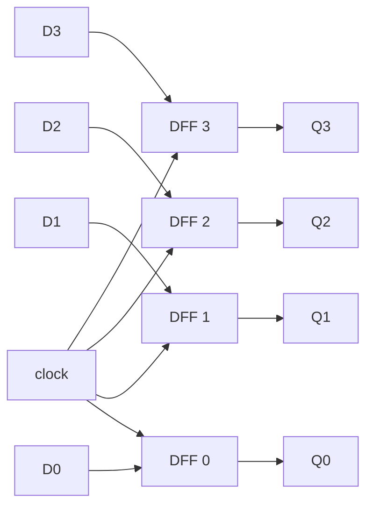
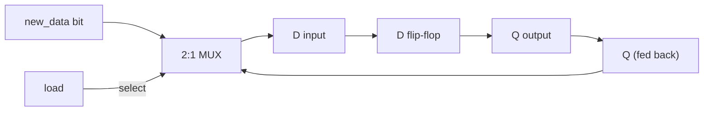

## Learning Objectives

- Explain why an N-bit register is built from N D flip-flops sharing a single clock signal, and why that sharing lets it store a whole word "at once."
- Describe how a load-enable line is implemented with a 2-to-1 multiplexer on each flip-flop's D input, recirculating the stored value when the register should hold rather than load.
- Trace a register's contents across a rising clock edge, given its D inputs and enable signal, for several consecutive cycles.
- Distinguish a parallel-load register (all bits updated together from external data) from a shift register (bits move between neighboring flip-flops each cycle), and state a use case for each.
- Explain why the register, not the individual flip-flop or bit, is the smallest unit of storage a CPU's datapath directly reads from and writes to.

## Context & Motivation

A single D flip-flop stores exactly one bit: on the active clock edge, whatever voltage is present at its D input is captured and held stable at its Q output until the next edge. That is enough machinery to store a bit, but no real computation deals in isolated bits — an integer, a memory address, an instruction, or a character is always a group of bits treated as one indivisible quantity. If a CPU is adding two 32-bit numbers, it needs somewhere to hold all 32 bits of each operand simultaneously, updated together on the same clock edge, so the datapath always sees a complete, consistent word rather than a partially updated jumble of old and new bits. The register answers this need: it is N D flip-flops, one per bit, all driven by the same clock signal, so an N-bit value can be captured and held as a single atomic unit.

This looks like a small step beyond the flip-flop covered in the clocking material, but it is the step that turns memory elements into something an architecture can use. Every quantity a CPU operates on while a program runs — the program counter, operand slots in the arithmetic unit, the contents of a general-purpose register like RISC-V's `x5` — lives in a register built from exactly this pattern. Nand2Tetris frames its memory hierarchy this way: start from a single bit of storage (the flip-flop, built from gates with feedback), widen it to a register holding a full word, then widen further into an addressable bank of registers and eventually RAM. MIT's 6.004 makes the same point from the direction of timing discipline — a register's job is not merely to hold bits, but to hold them predictably relative to a clock edge, so combinational logic reading from and writing back to it never sees a value mid-change.

Registers introduce a second refinement beyond "N flip-flops sharing a clock": the clock ticks continuously, but the register should not update its contents on every tick — it should hold its value unless told to load a new one. That "load" decision is itself logic, built from multiplexers, turning a register from a passive storage element into something a control unit can selectively write to on exactly the cycles it chooses. Understanding this load-enable circuit is the direct prerequisite for the finite state machine material that follows, since an FSM's state register is precisely a register whose load logic is driven by the FSM's next-state computation.

## Core Theory

### An N-bit register: N flip-flops, one shared clock

The simplest possible register is a parallel collection of D flip-flops, one per bit position, all sharing the identical clock input:

At every rising clock edge, each flip-flop independently captures whatever value is on its own D input. Because all four flip-flops share the same clock wire, all four captures happen at the same instant (up to the flip-flops' propagation delay, assumed identical for all bits of the same register in a well-designed circuit). The 4-bit value `D3 D2 D1 D0` is captured as one atomic unit, and the 4-bit value `Q3 Q2 Q1 Q0` — the register's contents — changes as one atomic unit on the next edge, never showing a mixture of old and new bits to anything reading it. This is the register's defining property: it behaves, from the outside, as a single N-bit storage cell, even though internally it is N independent 1-bit cells.

Without the shared clock, nothing would prevent one flip-flop from capturing its new value slightly before or after its neighbor, and downstream logic reading the register mid-update could briefly see a value that never actually existed as a valid data word — for example, reading `0111` when the register is transitioning from `0000` to `1000`, purely because bit 3 updated slightly later. The shared clock eliminates this hazard by design.

### Adding a load-enable: the multiplexer-recirculation pattern

A register that captures a new D input on every single clock edge is of limited use, because a CPU frequently needs to leave a register's value untouched for many consecutive cycles while other work happens, and only overwrite it on specific cycles chosen by the control logic. The standard way to add this "hold unless told to load" behavior is to place a 2-to-1 multiplexer in front of every flip-flop's D input, selecting between the new incoming data and the flip-flop's own current output fed back into itself:

The multiplexer's select line is the register's `load` (or `enable`) signal. When `load = 1`, the multiplexer routes `new_data` to the flip-flop's D input, so the next clock edge captures the new value. When `load = 0`, the multiplexer routes the flip-flop's own current `Q` back to its D input, so the next clock edge captures exactly the value already there — the flip-flop "recaptures" its own old state, and from the outside the register appears to hold unchanged, even though the clock is still ticking and the flip-flop is still actively capturing on every edge.

This is subtle but important: a register with load-enable does not stop the clock, and does not disable the flip-flop's clock input (an approach called clock gating that introduces its own timing hazards). Instead it keeps the clock running uniformly across the whole circuit and controls what data value is presented to be captured. This mirrors a general engineering principle emphasized throughout MIT 6.004's treatment of sequential circuits: a single, ungated clock distributed to every stateful element is far easier to reason about and verify than one where the clock itself is conditionally interrupted.

The following table summarizes the register's behavior as a function of `load`:

| load | D input driven by | Effect on next clock edge |
|---|---|---|
| 0 | Q (fed back) | Register holds its current value unchanged |
| 1 | new_data | Register captures new_data as its new value |

### Parallel-load registers vs. shift registers

The load-enable register above is a **parallel-load register**: on a load cycle, all N bits are overwritten simultaneously from N independent external data lines. This is the style used for the program counter, general-purpose registers, and pipeline latches, since a datapath typically needs to write an entire new word into a register in one cycle.

A **shift register** wires the flip-flops differently: each D input comes from the Q output of its neighbor rather than an independent line. On each clock edge (when shifting is enabled), every bit moves one position, a new bit enters at one end, and the bit at the other end is discarded. Shift registers are the natural circuit for serial-to-parallel or parallel-to-serial conversion. Some registers support both modes via a mode-select multiplexer, but conceptually parallel load and shift are distinct wiring patterns on the same flip-flop array.

| Register type | D input source (per bit) | Typical use |
|---|---|---|
| Parallel-load register | Independent external data line per bit | CPU registers, program counter, pipeline latches |
| Shift register | Neighboring flip-flop's Q output | Serial I/O, serial-to-parallel conversion, simple delay lines |

### The register as the CPU's fundamental storage unit

Every value a program manipulates must eventually sit in a register, because computation logic — an adder, a comparator, the ALU — has no memory of its own; it only produces outputs as an instantaneous function of its current inputs. A register holds a value stable across time so combinational logic can be given consistent inputs, and its output can, in turn, be captured back into a register for later use. This is exactly the pattern the next concept, finite state machines, formalizes: a state register holds a sequential system's "memory," combinational next-state logic computes what it should become, and combinational output logic computes the current outputs — the register supplies the "state" half of every sequential circuit built from here onward, including a full CPU's datapath and register file.

## Worked Examples

### Example 1: Building a 4-bit register from D flip-flops and loading a value

Suppose four D flip-flops, DFF3 through DFF0, each wired so its D input connects directly to an external data line (D3 through D0), all sharing one clock line. The register holds `Q3 Q2 Q1 Q0 = 0 0 0 0`. We present `D3 D2 D1 D0 = 1 0 1 1` on the external lines, and a clock edge occurs.

Before the edge, each D input is stable at its assigned value while the outputs still hold `0000`. The rising edge arrives simultaneously at all four flip-flops (shared clock wire), and each independently captures its own D input at that instant. Immediately after, Q3 Q2 Q1 Q0 = 1 0 1 1 — the register now holds `1011` (decimal 11) as a single atomic unit, all four bits changed together on the same edge, with no downstream logic ever observing a mixed old/new value.

If the external data lines now change to `0000` but no further clock edge occurs, the register's output remains `1011`; a flip-flop's output changes only at a clock edge, never in response to a D input change alone. This confirms the register truly stores the value rather than passing data through combinationally.

### Example 2: Adding load-enable with multiplexers and tracing hold vs. load

Extend the register from Example 1 by placing a 2:1 multiplexer in front of every flip-flop's D input: each multiplexer selects between `new_data[i]` (load=1) and `Q[i]` fed back (load=0), with one shared `load` signal controlling all four. The register holds `Q3 Q2 Q1 Q0 = 1 0 1 1` (the result of Example 1), and `new_data = 0100`.

Cycle A — `load = 0`. Each multiplexer routes Q back to its own flip-flop's D input, so at the clock edge each flip-flop recaptures exactly what it already held. After the edge: `1011` — unchanged, even though the clock ticked and every flip-flop actively re-captured its D input.

Cycle B — `load = 1`, `new_data = 0100`. Each multiplexer now routes `new_data[i]` through, captured at the edge. After the edge: `0100` — overwriting the previous `1011`.

Cycle C — `load = 0` again, with `new_data` now irrelevant (say it drifts to `1111`, perhaps driven by something else on the bus). Because load=0, every multiplexer ignores `new_data` and feeds back Q instead. After the edge: still `0100`. This demonstrates the essential safety property of load-enable: whatever garbage is on the data bus when load=0 can never corrupt the stored value, because the multiplexer physically disconnects that path from the flip-flops' inputs.

| Cycle | load | new_data | Q before edge | Q after edge |
|---|---|---|---|---|
| A | 0 | 0100 | 1011 | 1011 (held) |
| B | 1 | 0100 | 1011 | 0100 (loaded) |
| C | 0 | 1111 (ignored) | 0100 | 0100 (held) |

### Example 3: Tracing a 4-bit shift register over several clocks

Consider a 4-bit shift register, bits labeled Q3 (leftmost) down to Q0 (rightmost), wired so that on each active clock edge (shifting always enabled here), each flip-flop captures the value previously held by its left-hand neighbor, and Q3 captures an external serial-input bit `SIN`. That is: D3 = SIN, D2 = Q3(old), D1 = Q2(old), D0 = Q1(old); the old value of Q0 is discarded (shifted out). The register starts at `Q3 Q2 Q1 Q0 = 0 0 0 0`, and the serial input on successive edges is `SIN = 1, 0, 1, 1`.

| Edge | SIN | Q3 Q2 Q1 Q0 after edge |
|---|---|---|
| start | — | 0 0 0 0 |
| 1 | 1 | 1 0 0 0 |
| 2 | 0 | 0 1 0 0 |
| 3 | 1 | 1 0 1 0 |
| 4 | 1 | 1 1 0 1 |

At edge 1, D3=SIN=1 while D2, D1, D0 copy the (still-zero) neighbor values, giving `1000`. At edge 2, D3=0 (new SIN) and D2=Q3(old)=1 shifts rightward, giving `0100`. Edges 3 and 4 proceed the same way, each shifting the previous contents one position and admitting the new SIN bit at Q3. After four edges, the serial stream `1, 0, 1, 1` is fully assembled into the parallel value `1101` — exactly the serial-to-parallel role described in the Core Theory section: one bit enters per clock edge, and after N edges an N-bit register holds the full word.

## Common Misconceptions & Pitfalls

- **"A register is just a bigger flip-flop."** A register composes N independent 1-bit flip-flops; it behaves as one atomic N-bit unit only because every flip-flop shares the same clock signal, not because of any single "N-bit flip-flop" gate.
- **"Setting load=0 stops the clock or freezes the flip-flops."** It does not. The clock keeps ticking and every flip-flop keeps capturing its D input every edge; load=0 works by routing the flip-flop's own output back to its own input, so what gets recaptured equals what was already stored.
- **"When load=0, the data bus value doesn't matter, so it can be left undefined."** The bus is often driven by something else that cycle, and the multiplexer must actively ignore it via the select line — correctness of "holding" depends on the multiplexer's structure, not on the bus happening to be quiet.
- **"A shift register and a parallel-load register are different kinds of flip-flop."** Both use the identical flip-flop primitive; the only difference is D-input wiring — an independent external line (parallel load) versus a neighboring flip-flop's Q output (shift). The distinction is purely interconnection, not device type.
- **"All bits of a register update at slightly different times, and that's fine as long as they're close."** Synchronous design assumes the shared clock reaches every flip-flop close enough in time that no downstream logic samples a mixed old/new value; this real constraint (clock skew) must be verified by timing analysis, not assumed negligible.
- **"A register 'remembers' its value because it is somehow smart."** The persistence follows directly from the D flip-flop's bistable storage plus, when load=0, the feedback multiplexer supplying the same value back to D; nothing new about "memory" is introduced beyond composing that primitive N times with shared timing.

## Summary

An N-bit register is N D flip-flops sharing one clock signal, so that an entire word is captured and held as a single atomic unit rather than as N independently timed bits; adding a load-enable line via a 2-to-1 multiplexer on each flip-flop's D input — selecting new external data when load=1 and the flip-flop's own fed-back output when load=0 — lets the register hold its value indefinitely across many clock cycles while still clocking continuously, and lets external control logic choose exactly which cycles overwrite it. Parallel-load registers (independent data per bit, all written together) and shift registers (each bit fed from its neighbor) are two wiring patterns built from the identical flip-flop array, serving CPU-word storage and serial data conversion respectively. The register is the smallest unit of storage a CPU's datapath directly reads from and writes to, and it supplies exactly the "state" half of the general sequential-circuit pattern — state register plus combinational next-state and output logic — that the next concept, finite state machines, formalizes and that later concepts specialize into the register file, RAM, and ultimately the control unit itself.

## Documentation Links

- [Nand2Tetris — Build a Modern Computer from First Principles](https://www.coursera.org/learn/build-a-computer) — builds registers from flip-flops as the first step toward a full memory hierarchy, culminating in RAM and the CPU.
- [MIT 6.004 — OCW Syllabus](https://ocw.mit.edu/courses/6-004-computation-structures-spring-2017/pages/syllabus/) — course syllabus for Computation Structures, whose sequential-logic units cover register construction and synchronous timing discipline in depth.
