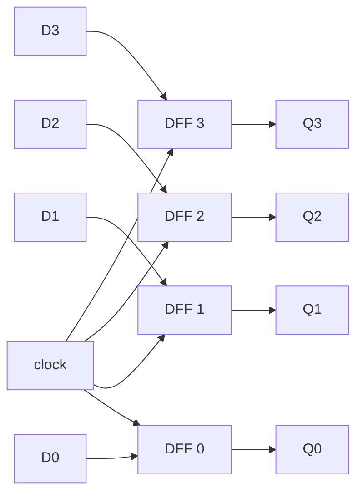
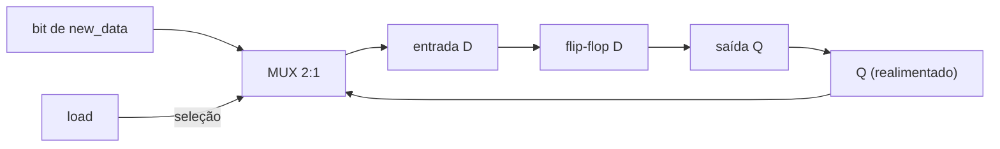

## Objetivos de Aprendizagem

- Explicar por que um registrador de N bits é construído com N flip-flops D compartilhando um único sinal de clock, e por que esse compartilhamento permite guardar uma palavra inteira "de uma vez".
- Descrever como uma linha de habilitação de carga é implementada com um multiplexador 2 para 1 na entrada D de cada flip-flop, recirculando o valor guardado quando o registrador deve manter, em vez de carregar.
- Acompanhar o conteúdo de um registrador através de uma borda de subida do clock, dadas suas entradas D e o sinal de habilitação, por vários ciclos consecutivos.
- Distinguir um registrador de carga paralela (todos os bits atualizados juntos a partir de dados externos) de um registrador de deslocamento (os bits passam entre flip-flops vizinhos a cada ciclo), e dar um caso de uso para cada um.
- Explicar por que o registrador, e não o flip-flop ou o bit individual, é a menor unidade de armazenamento que o datapath de uma CPU lê e escreve diretamente.

## Contexto e Motivação

Um único flip-flop D guarda exatamente um bit: na borda ativa do clock, a tensão presente na sua entrada D é capturada e mantida estável na sua saída Q até a próxima borda. Isso é maquinaria suficiente para guardar um bit, mas nenhuma computação real lida com bits isolados: um inteiro, um endereço de memória, uma instrução ou um caractere é sempre um grupo de bits tratado como uma grandeza indivisível. Se uma CPU está somando dois números de 32 bits, ela precisa de um lugar para guardar os 32 bits de cada operando ao mesmo tempo, atualizados juntos na mesma borda de clock, para que o datapath sempre veja uma palavra completa e consistente, e não uma mistura parcialmente atualizada de bits velhos e novos. O registrador atende a essa necessidade: são N flip-flops D, um por bit, todos comandados pelo mesmo sinal de clock, de modo que um valor de N bits possa ser capturado e mantido como uma única unidade atômica.

Isso parece um passo pequeno além do flip-flop visto no material de clock, mas é o passo que transforma elementos de memória em algo que uma arquitetura consegue usar. Toda grandeza com que uma CPU opera enquanto um programa roda (o contador de programa, as posições de operando na unidade aritmética, o conteúdo de um registrador de propósito geral como o `x5` do RISC-V) mora num registrador construído exatamente com este padrão. O Nand2Tetris enquadra sua hierarquia de memória assim: comece por um único bit de armazenamento (o flip-flop, construído com portas e realimentação), alargue-o para um registrador que guarda uma palavra completa, depois alargue mais para um banco endereçável de registradores e, por fim, para a RAM. O 6.004 do MIT faz o mesmo ponto pelo lado da disciplina de temporização: o trabalho de um registrador não é só guardar bits, mas guardá-los de forma previsível em relação a uma borda de clock, para que a lógica combinacional que lê dele e escreve de volta nele nunca veja um valor no meio de uma mudança.

Os registradores introduzem um segundo refinamento além de "N flip-flops compartilhando um clock": o clock bate continuamente, mas o registrador não deve atualizar seu conteúdo a cada batida; ele deve manter seu valor a não ser que seja mandado carregar um novo. Essa decisão de "carga" é ela mesma lógica, construída com multiplexadores, e transforma um registrador de um elemento de armazenamento passivo em algo em que uma unidade de controle pode escrever seletivamente, exatamente nos ciclos que escolher. Entender esse circuito de habilitação de carga é o pré-requisito direto do material de máquinas de estados finitos que vem a seguir, já que o registrador de estado de uma FSM é precisamente um registrador cuja lógica de carga é comandada pelo cálculo de próximo estado da FSM.

## Teoria Central

### Um registrador de N bits: N flip-flops, um clock compartilhado

O registrador mais simples possível é uma coleção paralela de flip-flops D, um por posição de bit, todos compartilhando a mesma entrada de clock:

Em toda borda de subida do clock, cada flip-flop captura de forma independente o valor que estiver na sua própria entrada D. Como os quatro flip-flops compartilham o mesmo fio de clock, as quatro capturas acontecem no mesmo instante (a menos do atraso de propagação dos flip-flops, suposto idêntico para todos os bits do mesmo registrador num circuito bem projetado). O valor de 4 bits `D3 D2 D1 D0` é capturado como uma unidade atômica, e o valor de 4 bits `Q3 Q2 Q1 Q0` (o conteúdo do registrador) muda como uma unidade atômica na próxima borda, nunca mostrando uma mistura de bits velhos e novos a quem o estiver lendo. Essa é a propriedade que define o registrador: visto de fora, ele se comporta como uma única célula de armazenamento de N bits, mesmo que internamente seja formado por N células independentes de 1 bit.

Sem o clock compartilhado, nada impediria um flip-flop de capturar seu novo valor um pouco antes ou um pouco depois do vizinho, e a lógica seguinte que lesse o registrador no meio da atualização poderia ver brevemente um valor que nunca existiu de fato como palavra de dados válida; por exemplo, ler `0111` quando o registrador está passando de `0000` para `1000`, só porque o bit 3 se atualizou um pouco mais tarde. O clock compartilhado elimina esse perigo por projeto.

### Acrescentando uma habilitação de carga: o padrão de recirculação por multiplexador

Um registrador que captura uma nova entrada D em toda borda de clock tem uso limitado, porque uma CPU frequentemente precisa deixar o valor de um registrador intocado por muitos ciclos consecutivos enquanto outro trabalho acontece, e só sobrescrevê-lo em ciclos específicos escolhidos pela lógica de controle. A forma padrão de acrescentar esse comportamento de "manter a não ser que mandem carregar" é colocar um multiplexador 2 para 1 na frente da entrada D de cada flip-flop, selecionando entre o novo dado que chega e a própria saída atual do flip-flop realimentada nele mesmo:

A linha de seleção do multiplexador é o sinal `load` (ou `enable`) do registrador. Quando `load = 1`, o multiplexador encaminha `new_data` para a entrada D do flip-flop, então a próxima borda de clock captura o novo valor. Quando `load = 0`, o multiplexador encaminha o próprio `Q` atual do flip-flop de volta para sua entrada D, então a próxima borda de clock captura exatamente o valor que já estava lá: o flip-flop "recaptura" seu próprio estado antigo e, visto de fora, o registrador parece manter o valor inalterado, mesmo que o clock continue batendo e o flip-flop continue capturando ativamente em toda borda.

Isso é sutil, mas importante: um registrador com habilitação de carga não para o clock e não desabilita a entrada de clock do flip-flop (uma abordagem chamada clock gating, que introduz seus próprios perigos de temporização). Em vez disso, ele mantém o clock rodando de forma uniforme pelo circuito inteiro e controla qual valor de dado é apresentado para ser capturado. Isso espelha um princípio geral de engenharia enfatizado em todo o tratamento de circuitos sequenciais do MIT 6.004: um único clock, sem gating, distribuído a todo elemento com estado, é muito mais fácil de raciocinar e verificar do que um em que o próprio clock é interrompido de forma condicional.

A tabela a seguir resume o comportamento do registrador em função de `load`:

| load | Entrada D comandada por | Efeito na próxima borda de clock |
|---|---|---|
| 0 | Q (realimentado) | O registrador mantém seu valor atual inalterado |
| 1 | new_data | O registrador captura new_data como seu novo valor |

### Registradores de carga paralela vs. registradores de deslocamento

O registrador com habilitação de carga acima é um **registrador de carga paralela**: num ciclo de carga, os N bits são sobrescritos ao mesmo tempo a partir de N linhas de dados externas independentes. É o estilo usado no contador de programa, nos registradores de propósito geral e nos latches de pipeline, já que um datapath normalmente precisa escrever uma palavra nova inteira num registrador num único ciclo.

Um **registrador de deslocamento** liga os flip-flops de outro jeito: cada entrada D vem da saída Q do seu vizinho, em vez de uma linha independente. Em cada borda de clock (quando o deslocamento está habilitado), cada bit anda uma posição, um bit novo entra por uma ponta, e o bit da outra ponta é descartado. Os registradores de deslocamento são o circuito natural para conversão de serial para paralelo ou de paralelo para serial. Alguns registradores suportam os dois modos por meio de um multiplexador de seleção de modo, mas conceitualmente a carga paralela e o deslocamento são padrões de fiação distintos sobre o mesmo arranjo de flip-flops.

| Tipo de registrador | Origem da entrada D (por bit) | Uso típico |
|---|---|---|
| Registrador de carga paralela | Linha de dados externa independente por bit | Registradores da CPU, contador de programa, latches de pipeline |
| Registrador de deslocamento | Saída Q do flip-flop vizinho | E/S serial, conversão de serial para paralelo, linhas de atraso simples |

### O registrador como unidade fundamental de armazenamento da CPU

Todo valor que um programa manipula precisa, em algum momento, estar num registrador, porque a lógica de cálculo (um somador, um comparador, a ULA) não tem memória própria; ela só produz saídas como função instantânea das suas entradas atuais. Um registrador mantém um valor estável ao longo do tempo para que a lógica combinacional receba entradas consistentes, e a saída dela pode, por sua vez, ser capturada de volta num registrador para uso posterior. É exatamente esse padrão que o próximo conceito, máquinas de estados finitos, formaliza: um registrador de estado guarda a "memória" de um sistema sequencial, a lógica combinacional de próximo estado calcula o que ele deve virar, e a lógica combinacional de saída calcula as saídas atuais; o registrador fornece a metade de "estado" de todo circuito sequencial construído daqui em diante, incluindo o datapath e o banco de registradores de uma CPU completa.

## Exemplos Resolvidos

### Exemplo 1: construindo um registrador de 4 bits com flip-flops D e carregando um valor

Suponha quatro flip-flops D, de DFF3 a DFF0, cada um ligado de modo que sua entrada D se conecte diretamente a uma linha de dados externa (de D3 a D0), todos compartilhando uma linha de clock. O registrador guarda `Q3 Q2 Q1 Q0 = 0 0 0 0`. Apresentamos `D3 D2 D1 D0 = 1 0 1 1` nas linhas externas, e ocorre uma borda de clock.

Antes da borda, cada entrada D está estável no seu valor atribuído, enquanto as saídas ainda guardam `0000`. A borda de subida chega ao mesmo tempo aos quatro flip-flops (fio de clock compartilhado), e cada um captura de forma independente sua própria entrada D naquele instante. Logo em seguida, Q3 Q2 Q1 Q0 = 1 0 1 1: o registrador agora guarda `1011` (decimal 11) como uma única unidade atômica, com os quatro bits mudando juntos na mesma borda, sem que nenhuma lógica seguinte jamais observe um valor misturado de velho e novo.

Se as linhas de dados externas agora mudarem para `0000` sem nenhuma nova borda de clock, a saída do registrador continua `1011`; a saída de um flip-flop só muda numa borda de clock, nunca em resposta a uma mudança isolada na entrada D. Isso confirma que o registrador realmente guarda o valor, em vez de deixar os dados passarem de forma combinacional.

### Exemplo 2: acrescentando habilitação de carga com multiplexadores e acompanhando manter vs. carregar

Estenda o registrador do Exemplo 1 colocando um multiplexador 2:1 na frente da entrada D de cada flip-flop: cada multiplexador seleciona entre `new_data[i]` (load=1) e `Q[i]` realimentado (load=0), com um único sinal `load` compartilhado controlando os quatro. O registrador guarda `Q3 Q2 Q1 Q0 = 1 0 1 1` (o resultado do Exemplo 1), e `new_data = 0100`.

Ciclo A, com `load = 0`. Cada multiplexador encaminha Q de volta para a entrada D do seu próprio flip-flop, então na borda de clock cada flip-flop recaptura exatamente o que já guardava. Depois da borda: `1011`, inalterado, mesmo que o clock tenha batido e cada flip-flop tenha recapturado ativamente sua entrada D.

Ciclo B, com `load = 1` e `new_data = 0100`. Cada multiplexador agora deixa passar `new_data[i]`, capturado na borda. Depois da borda: `0100`, sobrescrevendo o `1011` anterior.

Ciclo C, com `load = 0` de novo, e `new_data` agora irrelevante (digamos que ele derive para `1111`, talvez comandado por outra coisa no barramento). Como load=0, cada multiplexador ignora `new_data` e realimenta Q. Depois da borda: ainda `0100`. Isso demonstra a propriedade de segurança essencial da habilitação de carga: qualquer lixo que estiver no barramento de dados quando load=0 nunca consegue corromper o valor guardado, porque o multiplexador desconecta fisicamente esse caminho das entradas dos flip-flops.

| Ciclo | load | new_data | Q antes da borda | Q depois da borda |
|---|---|---|---|---|
| A | 0 | 0100 | 1011 | 1011 (mantido) |
| B | 1 | 0100 | 1011 | 0100 (carregado) |
| C | 0 | 1111 (ignorado) | 0100 | 0100 (mantido) |

### Exemplo 3: acompanhando um registrador de deslocamento de 4 bits por vários clocks

Considere um registrador de deslocamento de 4 bits, com bits rotulados de Q3 (mais à esquerda) a Q0 (mais à direita), ligado de modo que, em cada borda ativa de clock (com deslocamento sempre habilitado aqui), cada flip-flop capture o valor que antes estava no seu vizinho da esquerda, e Q3 capture um bit externo de entrada serial `SIN`. Ou seja: D3 = SIN, D2 = Q3(antigo), D1 = Q2(antigo), D0 = Q1(antigo); o valor antigo de Q0 é descartado (deslocado para fora). O registrador começa em `Q3 Q2 Q1 Q0 = 0 0 0 0`, e a entrada serial em bordas sucessivas é `SIN = 1, 0, 1, 1`.

| Borda | SIN | Q3 Q2 Q1 Q0 depois da borda |
|---|---|---|
| início | (nenhum) | 0 0 0 0 |
| 1 | 1 | 1 0 0 0 |
| 2 | 0 | 0 1 0 0 |
| 3 | 1 | 1 0 1 0 |
| 4 | 1 | 1 1 0 1 |

Na borda 1, D3=SIN=1 enquanto D2, D1, D0 copiam os valores (ainda zero) dos vizinhos, dando `1000`. Na borda 2, D3=0 (o novo SIN) e D2=Q3(antigo)=1 se desloca para a direita, dando `0100`. As bordas 3 e 4 seguem do mesmo jeito, cada uma deslocando o conteúdo anterior uma posição e admitindo o novo bit SIN em Q3. Depois de quatro bordas, o fluxo serial `1, 0, 1, 1` está totalmente montado no valor paralelo `1101`: exatamente o papel de conversão de serial para paralelo descrito na Teoria Central, em que um bit entra por borda de clock e, depois de N bordas, um registrador de N bits guarda a palavra completa.

## Equívocos Comuns e Armadilhas

- **"Um registrador é só um flip-flop maior."** Um registrador compõe N flip-flops independentes de 1 bit; ele se comporta como uma unidade atômica de N bits só porque todos os flip-flops compartilham o mesmo sinal de clock, e não por causa de alguma porta única de "flip-flop de N bits".
- **"Colocar load=0 para o clock ou congela os flip-flops."** Não para. O clock continua batendo e todo flip-flop continua capturando sua entrada D em toda borda; o load=0 funciona encaminhando a própria saída do flip-flop de volta para sua própria entrada, de modo que o que é recapturado é igual ao que já estava guardado.
- **"Quando load=0, o valor do barramento de dados não importa, então pode ficar indefinido."** O barramento muitas vezes é comandado por outra coisa naquele ciclo, e o multiplexador precisa ignorá-lo ativamente pela linha de seleção; a correção do "manter" depende da estrutura do multiplexador, e não de o barramento estar por acaso quieto.
- **"Um registrador de deslocamento e um registrador de carga paralela são tipos diferentes de flip-flop."** Os dois usam a mesma primitiva de flip-flop; a única diferença é a fiação da entrada D: uma linha externa independente (carga paralela) versus a saída Q de um flip-flop vizinho (deslocamento). A distinção é puramente de interconexão, não de tipo de dispositivo.
- **"Todos os bits de um registrador se atualizam em momentos ligeiramente diferentes, e tudo bem, desde que sejam próximos."** O projeto síncrono supõe que o clock compartilhado chega a cada flip-flop em momentos próximos o bastante para que nenhuma lógica seguinte amostre um valor misturado de velho e novo; essa restrição real (o clock skew) precisa ser verificada por análise de temporização, e não suposta desprezível.
- **"Um registrador 'lembra' seu valor porque é de alguma forma inteligente."** A persistência decorre diretamente do armazenamento biestável do flip-flop D mais, quando load=0, o multiplexador de realimentação que devolve o mesmo valor para D; nada de novo sobre "memória" é introduzido além de compor essa primitiva N vezes com temporização compartilhada.

## Resumo

Um registrador de N bits é formado por N flip-flops D compartilhando um único sinal de clock, de modo que uma palavra inteira é capturada e mantida como uma única unidade atômica, e não como N bits com temporização independente; acrescentar uma linha de habilitação de carga por meio de um multiplexador 2 para 1 na entrada D de cada flip-flop (selecionando o novo dado externo quando load=1 e a própria saída realimentada do flip-flop quando load=0) permite que o registrador mantenha seu valor indefinidamente por muitos ciclos de clock enquanto o clock continua batendo, e permite que a lógica de controle externa escolha exatamente quais ciclos o sobrescrevem. Os registradores de carga paralela (dados independentes por bit, todos escritos juntos) e os registradores de deslocamento (cada bit alimentado pelo vizinho) são dois padrões de fiação construídos com o mesmo arranjo de flip-flops, servindo ao armazenamento de palavras da CPU e à conversão de dados seriais, respectivamente. O registrador é a menor unidade de armazenamento que o datapath de uma CPU lê e escreve diretamente, e fornece exatamente a metade de "estado" do padrão geral de circuito sequencial (registrador de estado mais lógica combinacional de próximo estado e de saída) que o próximo conceito, máquinas de estados finitos, formaliza, e que conceitos posteriores especializam no banco de registradores, na RAM e, no fim, na própria unidade de controle.

## Documentation Links

- [Nand2Tetris: Build a Modern Computer from First Principles](https://www.coursera.org/learn/build-a-computer): constrói registradores a partir de flip-flops como primeiro passo rumo a uma hierarquia de memória completa, culminando na RAM e na CPU.
- [MIT 6.004: OCW Syllabus](https://ocw.mit.edu/courses/6-004-computation-structures-spring-2017/pages/syllabus/): ementa do curso Computation Structures, cujas unidades de lógica sequencial cobrem em profundidade a construção de registradores e a disciplina de temporização síncrona.
