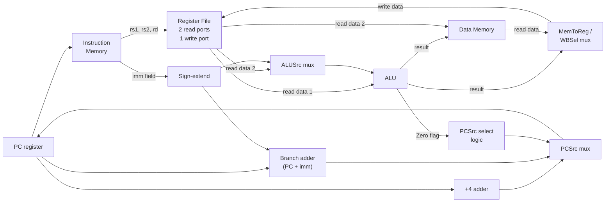

## Learning Objectives

- Identify the major datapath components — PC, instruction memory, register file, ALU, data memory — and the buses that connect them.
- Explain the purpose of each multiplexer in the single-cycle datapath (ALUSrc, MemToReg/WBSel, PCSrc) and what it selects between.
- Trace the physical path data takes through the datapath for an R-type instruction, an `addi`, a `lw`, an `sw`, and a `beq`, without yet deciding which mux setting each one needs.
- Explain why the datapath is purely passive wiring: every mux, read port, and enable line is a dead terminal until something outside the datapath drives it.
- Distinguish "what paths exist for data to flow through" (this concept) from "which path is selected for a given instruction" (the control unit).

## Context & Motivation

Every concept so far in "Building a CPU" has built one piece in isolation: a register file, an ALU, an instruction set assigning exact 32-bit encodings to `add`, `addi`, `lw`, `sw`, and `beq`. None of those pieces alone is a computer. A register file with nothing feeding its address inputs never changes; an ALU with nothing wired to its operand inputs computes nothing useful. The **datapath** is the wiring diagram of buses, muxes, and component connections that lets a fetched instruction's bits flow to the register file, through the ALU, possibly through data memory, and back to a destination register, all within one clock cycle.

This concept deliberately stops short of explaining how each instruction executes *correctly*. The datapath built here contains multiplexers — ALUSrc, MemToReg (WBSel), and PCSrc — each capable of selecting between already-available values, but a mux's select line still needs something to drive it. Here that "something" is left unconnected; every worked example traces which paths carry live data and which muxes exist, without yet claiming which position each mux is set to. Deciding correct mux settings for every instruction is the entire job of the next concept, the control unit. Separating the physical paths (datapath) from the decisions about which path to use (control) mirrors exactly how Harris & Harris's *Digital Design and Computer Architecture* and MIT 6.004's "Building the Beta" structure the construction of a single-cycle processor, and it is what makes the control unit tractable: once the datapath's muxes and enables are fixed and finite, control reduces to producing the right bit pattern from an instruction's opcode.

## Core Theory

### Fixed components, reused from earlier concepts

The datapath is built from a small, fixed set of components already designed earlier in this discipline: the **PC**, a register holding the current instruction's address; **instruction memory**, addressed by the PC, returning the 32-bit instruction word stored there; the **register file**, with two read ports (`rs1`, `rs2`) and one write port (`rd`), gated by `RegWrite`; the **ALU**, computing one of several candidate operations and reporting a `Zero` flag; and **data memory**, read/write, gated by separate `MemRead` and `MemWrite` enables. None of these is new here — what is new is the wiring connecting them.

### Buses carry combinational values within one cycle

A **bus** is simply a group of wires carrying one multi-bit value between two points. Buses in this datapath are purely combinational: a value at the register file's output appears, after propagation delay, at the ALU's input within the same clock cycle, with no clocked element in between. Nothing is queued mid-flight; the whole datapath must settle to correct values before the next clock edge, which is why the register file and the PC — the only clocked elements inside the loop — capture new state just once, at cycle's end.

### Instruction fields fan out to everything downstream

Once instruction memory returns the 32-bit word, it is split, by fixed wire position, into `opcode`, `rs1`, `rs2`, `rd`, `funct3`, `funct7`, and (format-dependent) an immediate. `rs1` and `rs2` wire directly into the register file's read-address inputs; `rd` wires into the write-address input; the immediate bits feed sign-extension logic producing a 32-bit sign-extended value, regardless of which format is actually present. All of this fans out unconditionally on every cycle — the wiring does not "know" which instruction is present; it simply routes whatever bits are there.

### The register file's two reads and one write

Read-data-1 (addressed by `rs1`) and read-data-2 (addressed by `rs2`) are always live outputs, whether or not an instruction actually needs both. Read-data-1 feeds the ALU's first operand directly — no mux, since every ALU-using instruction (R-type, `addi`, `lw`, `sw`, `beq`) uses `rs1` there. Read-data-2 feeds two destinations: one input of the ALUSrc mux, and, separately and unconditionally, data memory's write-data input, ready for `sw` whether or not `sw` is the instruction executing this cycle. The write port takes its address from `rd`, its data from the MemToReg/WBSel mux output, gated by `RegWrite`.

### ALUSrc: the ALU's second operand mux

R-type instructions and `beq` need the ALU's second operand to be `rs2`'s register value — R-type to compute an arithmetic result, `beq` to compare `rs1` against `rs2` by subtraction. `addi`, `lw`, and `sw` need the sign-extended immediate instead — `addi` to add a constant, `lw`/`sw` to compute a base-plus-offset address. The **ALUSrc mux** sits between read-data-2 and the sign-extension output on one side and the ALU's second operand input on the other. Both candidates are always present; only the select line, driven from outside the datapath, decides which reaches the ALU.

### The ALU, its Zero flag, and data memory's ports

The ALU takes its operands from read-data-1 and the ALUSrc mux's output, plus an `ALUControl` code selecting add, subtract, AND, OR, or SLT. Its result feeds data memory's address input and one MemToReg candidate; its `Zero` flag (asserted when the result is exactly zero) feeds forward toward the PC logic, since `beq` needs it to decide whether to redirect the PC. Data memory has one address input (unconditionally driven by the ALU result), one write-data input (unconditionally driven by read-data-2), one read-data output, and independent `MemRead`/`MemWrite` enables — only `lw` needs the former asserted, only `sw` the latter; every other instruction leaves both off even though an address and write-data value are still electrically present.

### MemToReg/WBSel: choosing the writeback value

R-type and `addi` write the ALU's result back to `rd`; `lw` writes data memory's read-data output instead (`sw` and `beq` write nothing back at all). The **MemToReg mux** — also called **WBSel**, two names for the identical hardware — sits between the ALU's result and data memory's read-data on its inputs, and the register file's write-data input on its output. Both candidates are always present; only the select line, and separately `RegWrite`, decide whether and what gets latched.

### PC logic: sequential and branch paths

A dedicated `+4` adder computes PC + 4 (the ordinary next address, since every instruction here is 4 bytes) on every cycle, unconditionally. A separate branch-target adder computes PC + (sign-extended immediate) on every cycle as well, whether or not the current instruction is even a branch. A **PCSrc mux** selects between these two candidates and feeds the winner back into the PC register at the next clock edge.

### Assembling the full single-cycle datapath

Put together, the datapath is one large combinational circuit bracketed by two clocked elements — the PC and the register file — that update only at the clock edge:

Every mux is drawn with both candidates always ready: ALUSrc always has a register value and an immediate ready, WBSel always has an ALU result and a memory value ready, PCSrc always has PC+4 and PC+offset ready. Nothing here yet says which candidate wins for a given instruction — that is exactly what the control unit's signals (RegWrite, ALUSrc, MemRead, MemWrite, MemToReg, Branch, PCSrc) are for, taken up in the next concept.

### The shape of each instruction's path, in outline

R-type instructions read two registers, route the second through ALUSrc toward the register-value side, compute an ALU result, and route that result through WBSel back to the register file — data memory is untouched. `addi` is identical except ALUSrc routes the immediate. `lw` also routes the immediate through ALUSrc to compute an address, but continues into data memory's read port, and WBSel must route data memory's output back to the register file instead of the ALU's. `sw` computes the same address as `lw`, but the destination is data memory's write port, so the register file's write port is simply never enabled. `beq` routes a register value (not the immediate) through ALUSrc so the ALU can subtract `rs2` from `rs1`; its result feeds only the Zero flag, which, together with the branch-target adder, determines the next PC rather than anything written back.

## Worked Examples

### Example 1: `add x5, x6, x7` — the R-type path

Fetch splits the word into `opcode = 0110011`, `rd = x5`, `funct3 = 000`, `rs1 = x6`, `rs2 = x7`, `funct7 = 0000000`. `rs1`/`rs2` address the register file; read-data-1 (x6) and read-data-2 (x7) both go live. Read-data-1 flows straight to the ALU's first operand. Read-data-2 flows into the ALUSrc mux alongside whatever the sign-extension logic happens to produce from this instruction's (semantically meaningless) immediate-field bit positions — the path this instruction needs is: ALUSrc outputs the register candidate, not the immediate. The ALU receives x6 and x7 and, with the correct ALUControl, computes their sum. The result reaches data memory's address input (unused this cycle) and one WBSel input — the path needed here is: WBSel outputs the ALU-result candidate, not the memory candidate. That value reaches the register file's write-data input, addressed by `rd = x5`, latched only if `RegWrite` is asserted. In parallel, PC + 4 is computed and (with no branch involved) wins at the PCSrc mux.

### Example 2: `lw x5, 8(x6)` — address, then read, then writeback

Fields: `opcode = 0000011`, `rd = x5`, `funct3 = 010`, `rs1 = x6`, immediate = 8. `rs1 = x6` addresses the first read port; read-data-1 (say, 1000) goes live. The `rs2` field position also addresses the second read port and produces some value, but `lw`'s I-type encoding never routes it anywhere useful. The immediate (8) flows through sign-extension — the path needed at ALUSrc: output the immediate candidate, not the register candidate. The ALU computes 1000 + 8 = 1008, which reaches data memory's address input; the path needed here is: data memory's read port is engaged (`MemRead` asserted), producing the stored word as data memory's output. That output flows into WBSel's second input — the path needed: WBSel outputs the memory candidate, not the ALU-result candidate, a genuinely different choice from Example 1 despite identical wiring. The selected (loaded) value reaches the register file's write-data input at `rd = x5`, latched with `RegWrite` asserted. PC advances by 4 exactly as before.

### Example 3: `beq x5, x6, offset` — comparison feeding the PC, not the register file

Fields: `opcode = 1100011`, `funct3 = 000`, `rs1 = x5`, `rs2 = x6`, plus the reassembled, sign-extended B-type offset. Both read ports go live: read-data-1 (x5) and read-data-2 (x6). Read-data-1 flows directly to the ALU's first operand as always. The path needed at ALUSrc here: output the register candidate (x6's value), not the immediate — `beq` compares two registers directly, it never adds an offset at the ALU. With ALUControl set to subtract, the ALU computes x5 − x6; its numeric result is unused downstream, but its `Zero` flag is asserted precisely when x5 equals x6. In parallel, the sign-extended offset and the current PC feed the branch-target adder, producing PC + offset unconditionally, exactly as every cycle for every instruction; the +4 adder also produces PC + 4 in parallel. Both candidates are now live at the PCSrc mux's inputs. The ALU's Zero flag is one of the signals that must ultimately steer that mux's select line, alongside the opcode-derived fact that this is a branch at all — but exactly how those two facts combine, and why non-branch instructions must never let a coincidentally-zero ALU result redirect their PC, is the control unit's job, taken up next. No register-file write happens for `beq`; `RegWrite` is simply never asserted on this path.

## Common Misconceptions & Pitfalls

- **"The datapath decides which instruction is running."** It does not — the datapath is fixed, passive wiring that behaves identically, electrically, on every cycle, for every instruction. Every mux computes both candidates; only signals arriving from outside the datapath decide which candidate passes through.
- **"ALUSrc always means 'use the immediate.'"** It is a two-way choice, and R-type and `beq` both need the *register-value* candidate — only `addi`, `lw`, and `sw` need the immediate. Assuming a fixed default conflates the mux's existence with a fixed setting.
- **"Every instruction touches data memory."** Only `lw` and `sw` do; R-type, `addi`, and `beq` never assert `MemRead` or `MemWrite`, even though an address and write-data value are still electrically present at data memory's inputs every cycle.
- **"MemToReg and WBSel are two different muxes."** They are two names, used by different textbooks, for the identical piece of hardware selecting between the ALU's result and data memory's read data.
- **"The branch-target adder only runs when a branch is taken."** It runs every cycle, for every instruction, exactly like the +4 adder and both ALUSrc candidates — the PCSrc mux simply discards its output on non-branch cycles. Nothing in this datapath computes conditionally; only what gets *selected* is conditional.
- **"Wiring the paths already makes the CPU execute correctly."** It only makes correct execution *possible* — every mux here currently has an unconnected select line. Without the control unit driving these signals correctly per instruction, this exact circuit computes nothing predictable.

## Summary

The single-cycle datapath wires the PC, instruction memory, a two-read-port/one-write-port register file, an ALU with a Zero flag, and data memory together with combinational buses, plus three key multiplexers — ALUSrc (register value vs. sign-extended immediate), MemToReg/WBSel (ALU result vs. memory data), and PCSrc (PC+4 vs. branch-target PC+offset) — each always holding both candidates ready. Tracing R-type, `addi`, `lw`, `sw`, and `beq` through this identical wiring shows each instruction class needs a different combination of mux settings and enable lines, yet the wiring itself never changes and never "knows" which instruction is present. Every mux's select line and every enable line has been left deliberately unconnected here; the next concept, the control unit, closes that gap by reading each instruction's opcode (and, where needed, funct3 and funct7) to generate exactly the RegWrite, ALUSrc, MemRead, MemWrite, MemToReg, Branch, and PCSrc signals this datapath needs.

## Documentation Links

- [MIT 6.004 — Building the Beta](https://computationstructures.org/lectures/beta/beta.html) — a complete worked construction of a single-cycle RISC datapath from registers, an ALU, and buses, using the compute-both-candidates/select-with-a-mux methodology covered in this concept.
- [Harris & Harris — Digital Design and Computer Architecture, RISC-V Edition](https://shop.elsevier.com/books/digital-design-and-computer-architecture-risc-v-edition/harris/978-0-12-820064-3) — the primary reference for the single-cycle RISC-V datapath, including the ALUSrc, MemToReg, and PCSrc multiplexers and their wiring, used throughout this concept.
