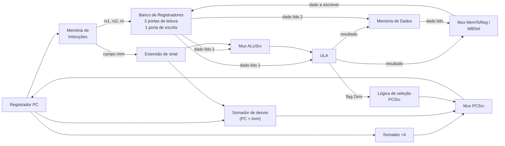

## Objetivos de Aprendizagem

- Identificar os principais componentes do datapath (PC, memória de instruções, banco de registradores, ULA, memória de dados) e os barramentos que os conectam.
- Explicar o propósito de cada multiplexador do datapath monociclo (ALUSrc, MemToReg/WBSel, PCSrc) e entre o que cada um seleciona.
- Acompanhar o caminho físico que os dados percorrem pelo datapath numa instrução tipo R, num `addi`, num `lw`, num `sw` e num `beq`, sem ainda decidir qual configuração de mux cada uma precisa.
- Explicar por que o datapath é fiação puramente passiva: cada mux, porta de leitura e linha de habilitação é um terminal morto até que algo fora do datapath o comande.
- Distinguir "quais caminhos existem para os dados fluírem" (este conceito) de "qual caminho é selecionado para uma dada instrução" (a unidade de controle).

## Contexto e Motivação

Cada conceito até aqui em "Construindo uma CPU" construiu uma peça isolada: um banco de registradores, uma ULA, um conjunto de instruções que atribui codificações exatas de 32 bits a `add`, `addi`, `lw`, `sw` e `beq`. Nenhuma dessas peças sozinha é um computador. Um banco de registradores sem nada alimentando suas entradas de endereço nunca muda; uma ULA sem nada ligado às suas entradas de operando não calcula nada útil. O **datapath** é o diagrama de fiação de barramentos, muxes e conexões entre componentes que permite que os bits de uma instrução buscada fluam até o banco de registradores, passem pela ULA, possivelmente pela memória de dados, e voltem a um registrador de destino, tudo dentro de um ciclo de clock.

Este conceito para de propósito antes de explicar como cada instrução executa *corretamente*. O datapath construído aqui contém multiplexadores (ALUSrc, MemToReg (WBSel) e PCSrc), cada um capaz de selecionar entre valores já disponíveis, mas a linha de seleção de um mux ainda precisa de algo que a comande. Aqui, esse "algo" fica desconectado; cada exemplo resolvido acompanha quais caminhos levam dados vivos e quais muxes existem, sem ainda afirmar em que posição cada mux está. Decidir as configurações corretas de mux para cada instrução é todo o trabalho do próximo conceito, a unidade de controle. Separar os caminhos físicos (datapath) das decisões sobre qual caminho usar (controle) espelha exatamente como o *Digital Design and Computer Architecture* de Harris & Harris e o "Building the Beta" do MIT 6.004 estruturam a construção de um processador monociclo, e é o que torna a unidade de controle tratável: quando os muxes e as habilitações do datapath estão fixos e são finitos, o controle se reduz a produzir o padrão de bits certo a partir do opcode de uma instrução.

## Teoria Central

### Componentes fixos, reaproveitados de conceitos anteriores

O datapath é construído com um pequeno conjunto fixo de componentes já projetados antes nesta disciplina: o **PC**, um registrador que guarda o endereço da instrução atual; a **memória de instruções**, endereçada pelo PC, que devolve a palavra de instrução de 32 bits guardada ali; o **banco de registradores**, com duas portas de leitura (`rs1`, `rs2`) e uma porta de escrita (`rd`), controlada por `RegWrite`; a **ULA**, que calcula uma entre várias operações candidatas e informa uma flag `Zero`; e a **memória de dados**, de leitura e escrita, controlada por habilitações separadas `MemRead` e `MemWrite`. Nenhum desses é novo aqui; o que é novo é a fiação que os conecta.

### Barramentos levam valores combinacionais dentro de um ciclo

Um **barramento** é simplesmente um grupo de fios que leva um valor de vários bits entre dois pontos. Os barramentos deste datapath são puramente combinacionais: um valor na saída do banco de registradores aparece, depois do atraso de propagação, na entrada da ULA dentro do mesmo ciclo de clock, sem nenhum elemento com clock no meio. Nada fica enfileirado no caminho; o datapath inteiro precisa se estabilizar em valores corretos antes da próxima borda de clock, e é por isso que o banco de registradores e o PC (os únicos elementos com clock dentro do laço) capturam o novo estado só uma vez, no fim do ciclo.

### Os campos da instrução se espalham para tudo o que vem depois

Depois que a memória de instruções devolve a palavra de 32 bits, ela é dividida, por posição fixa dos fios, em `opcode`, `rs1`, `rs2`, `rd`, `funct3`, `funct7` e (conforme o formato) um imediato. `rs1` e `rs2` vão diretamente para as entradas de endereço de leitura do banco de registradores; `rd` vai para a entrada de endereço de escrita; os bits de imediato alimentam a lógica de extensão de sinal, que produz um valor de 32 bits com extensão de sinal, seja qual for o formato de fato presente. Tudo isso se espalha incondicionalmente em todo ciclo: a fiação não "sabe" qual instrução está presente; ela simplesmente encaminha os bits que estiverem lá.

### As duas leituras e a escrita do banco de registradores

O dado lido 1 (endereçado por `rs1`) e o dado lido 2 (endereçado por `rs2`) são sempre saídas vivas, precise ou não uma instrução dos dois. O dado lido 1 alimenta diretamente o primeiro operando da ULA, sem mux, já que toda instrução que usa a ULA (tipo R, `addi`, `lw`, `sw`, `beq`) usa `rs1` ali. O dado lido 2 alimenta dois destinos: uma entrada do mux ALUSrc e, separadamente e de forma incondicional, a entrada de dado de escrita da memória de dados, pronto para o `sw`, seja ou não o `sw` a instrução executando neste ciclo. A porta de escrita pega seu endereço de `rd` e seu dado da saída do mux MemToReg/WBSel, controlada por `RegWrite`.

### ALUSrc: o mux do segundo operando da ULA

As instruções tipo R e o `beq` precisam que o segundo operando da ULA seja o valor do registrador `rs2`: o tipo R para calcular um resultado aritmético, o `beq` para comparar `rs1` com `rs2` por subtração. `addi`, `lw` e `sw` precisam, em vez disso, do imediato com extensão de sinal: o `addi` para somar uma constante, `lw`/`sw` para calcular um endereço base mais deslocamento. O **mux ALUSrc** fica entre o dado lido 2 e a saída da extensão de sinal, de um lado, e a entrada do segundo operando da ULA, do outro. Os dois candidatos estão sempre presentes; só a linha de seleção, comandada de fora do datapath, decide qual chega à ULA.

### A ULA, sua flag Zero e as portas da memória de dados

A ULA recebe seus operandos do dado lido 1 e da saída do mux ALUSrc, mais um código `ALUControl` que seleciona soma, subtração, AND, OR ou SLT. Seu resultado alimenta a entrada de endereço da memória de dados e um candidato do MemToReg; sua flag `Zero` (ativada quando o resultado é exatamente zero) segue adiante em direção à lógica do PC, já que o `beq` precisa dela para decidir se redireciona o PC. A memória de dados tem uma entrada de endereço (comandada incondicionalmente pelo resultado da ULA), uma entrada de dado de escrita (comandada incondicionalmente pelo dado lido 2), uma saída de dado lido e habilitações independentes `MemRead`/`MemWrite`: só o `lw` precisa da primeira ativada, só o `sw` da segunda; toda outra instrução deixa as duas desligadas, embora um endereço e um valor de dado de escrita continuem eletricamente presentes.

### MemToReg/WBSel: escolhendo o valor de write-back

As instruções tipo R e o `addi` escrevem o resultado da ULA de volta em `rd`; o `lw` escreve, em vez disso, a saída de dado lido da memória de dados (`sw` e `beq` não escrevem nada de volta). O **mux MemToReg** (também chamado de **WBSel**, dois nomes para o mesmo hardware) fica entre o resultado da ULA e o dado lido da memória de dados nas suas entradas, e a entrada de dado de escrita do banco de registradores na sua saída. Os dois candidatos estão sempre presentes; só a linha de seleção e, separadamente, o `RegWrite` decidem se algo é capturado e o quê.

### Lógica do PC: caminhos sequencial e de desvio

Um somador `+4` dedicado calcula PC + 4 (o próximo endereço comum, já que toda instrução aqui tem 4 bytes) em todo ciclo, incondicionalmente. Um somador de alvo de desvio separado calcula PC + (imediato com extensão de sinal) também em todo ciclo, seja a instrução atual um desvio ou não. Um **mux PCSrc** seleciona entre esses dois candidatos e alimenta o vencedor de volta no registrador PC na próxima borda de clock.

### Montando o datapath monociclo completo

Juntando tudo, o datapath é um grande circuito combinacional entre dois elementos com clock (o PC e o banco de registradores) que só se atualizam na borda de clock:

Cada mux é desenhado com os dois candidatos sempre prontos: o ALUSrc sempre tem um valor de registrador e um imediato prontos, o WBSel sempre tem um resultado da ULA e um valor da memória prontos, o PCSrc sempre tem PC+4 e PC+deslocamento prontos. Nada aqui ainda diz qual candidato vence numa dada instrução; é exatamente para isso que servem os sinais da unidade de controle (RegWrite, ALUSrc, MemRead, MemWrite, MemToReg, Branch, PCSrc), tratados no próximo conceito.

### O formato do caminho de cada instrução, em linhas gerais

As instruções tipo R leem dois registradores, encaminham o segundo pelo ALUSrc pelo lado do valor de registrador, calculam um resultado na ULA e encaminham esse resultado pelo WBSel de volta ao banco de registradores; a memória de dados não é tocada. O `addi` é idêntico, exceto que o ALUSrc encaminha o imediato. O `lw` também encaminha o imediato pelo ALUSrc para calcular um endereço, mas continua até a porta de leitura da memória de dados, e o WBSel precisa encaminhar a saída da memória de dados de volta ao banco de registradores, em vez da saída da ULA. O `sw` calcula o mesmo endereço que o `lw`, mas o destino é a porta de escrita da memória de dados, então a porta de escrita do banco de registradores simplesmente nunca é habilitada. O `beq` encaminha um valor de registrador (não o imediato) pelo ALUSrc para que a ULA possa subtrair `rs2` de `rs1`; seu resultado alimenta só a flag Zero, que, junto com o somador do alvo de desvio, determina o próximo PC, em vez de algo escrito de volta.

## Exemplos Resolvidos

### Exemplo 1: `add x5, x6, x7`, o caminho tipo R

A busca divide a palavra em `opcode = 0110011`, `rd = x5`, `funct3 = 000`, `rs1 = x6`, `rs2 = x7`, `funct7 = 0000000`. `rs1`/`rs2` endereçam o banco de registradores; o dado lido 1 (x6) e o dado lido 2 (x7) ficam ambos vivos. O dado lido 1 vai direto para o primeiro operando da ULA. O dado lido 2 entra no mux ALUSrc junto com o que a lógica de extensão de sinal produzir a partir das posições de bits de imediato desta instrução (sem significado semântico aqui); o caminho de que esta instrução precisa é: o ALUSrc emite o candidato registrador, não o imediato. A ULA recebe x6 e x7 e, com o ALUControl correto, calcula a soma. O resultado chega à entrada de endereço da memória de dados (sem uso neste ciclo) e a uma entrada do WBSel; o caminho necessário aqui é: o WBSel emite o candidato resultado da ULA, não o candidato da memória. Esse valor chega à entrada de dado de escrita do banco de registradores, endereçada por `rd = x5`, capturado só se `RegWrite` estiver ativado. Em paralelo, PC + 4 é calculado e (sem desvio envolvido) vence no mux PCSrc.

### Exemplo 2: `lw x5, 8(x6)`, endereço, depois leitura, depois write-back

Campos: `opcode = 0000011`, `rd = x5`, `funct3 = 010`, `rs1 = x6`, imediato = 8. `rs1 = x6` endereça a primeira porta de leitura; o dado lido 1 (digamos, 1000) fica vivo. A posição do campo `rs2` também endereça a segunda porta de leitura e produz algum valor, mas a codificação tipo I do `lw` nunca o encaminha para nenhum lugar útil. O imediato (8) passa pela extensão de sinal; o caminho necessário no ALUSrc: emitir o candidato imediato, não o candidato registrador. A ULA calcula 1000 + 8 = 1008, que chega à entrada de endereço da memória de dados; o caminho necessário aqui é: a porta de leitura da memória de dados é acionada (`MemRead` ativado), produzindo a palavra guardada como saída da memória de dados. Essa saída entra na segunda entrada do WBSel; o caminho necessário: o WBSel emite o candidato da memória, não o candidato resultado da ULA, uma escolha genuinamente diferente da do Exemplo 1, apesar da fiação idêntica. O valor selecionado (carregado) chega à entrada de dado de escrita do banco de registradores em `rd = x5`, capturado com `RegWrite` ativado. O PC avança 4, exatamente como antes.

### Exemplo 3: `beq x5, x6, offset`, comparação que alimenta o PC, não o banco de registradores

Campos: `opcode = 1100011`, `funct3 = 000`, `rs1 = x5`, `rs2 = x6`, mais o deslocamento tipo B remontado e com extensão de sinal. As duas portas de leitura ficam vivas: dado lido 1 (x5) e dado lido 2 (x6). O dado lido 1 vai direto para o primeiro operando da ULA, como sempre. O caminho necessário no ALUSrc aqui: emitir o candidato registrador (o valor de x6), não o imediato; o `beq` compara dois registradores diretamente, ele nunca soma um deslocamento na ULA. Com o ALUControl em subtração, a ULA calcula x5 − x6; seu resultado numérico não é usado adiante, mas sua flag `Zero` é ativada precisamente quando x5 é igual a x6. Em paralelo, o deslocamento com extensão de sinal e o PC atual alimentam o somador do alvo de desvio, produzindo PC + deslocamento incondicionalmente, exatamente como em todo ciclo para toda instrução; o somador +4 também produz PC + 4 em paralelo. Os dois candidatos estão agora vivos nas entradas do mux PCSrc. A flag Zero da ULA é um dos sinais que precisam, no fim, comandar a linha de seleção desse mux, junto com o fato, derivado do opcode, de que isto é um desvio; mas exatamente como esses dois fatos se combinam, e por que instruções que não são desvio nunca devem deixar um resultado da ULA que por acaso deu zero redirecionar seu PC, é trabalho da unidade de controle, tratado a seguir. Nenhuma escrita no banco de registradores acontece no `beq`; o `RegWrite` simplesmente nunca é ativado nesse caminho.

## Equívocos Comuns e Armadilhas

- **"O datapath decide qual instrução está rodando."** Não decide: o datapath é fiação fixa e passiva que se comporta de forma eletricamente idêntica em todo ciclo, para toda instrução. Cada mux calcula os dois candidatos; só sinais vindos de fora do datapath decidem qual candidato passa.
- **"ALUSrc sempre significa 'use o imediato'."** É uma escolha entre dois caminhos, e o tipo R e o `beq` precisam ambos do candidato *valor de registrador*; só `addi`, `lw` e `sw` precisam do imediato. Supor um padrão fixo confunde a existência do mux com uma configuração fixa.
- **"Toda instrução toca a memória de dados."** Só `lw` e `sw` tocam; tipo R, `addi` e `beq` nunca ativam `MemRead` nem `MemWrite`, embora um endereço e um valor de dado de escrita continuem eletricamente presentes nas entradas da memória de dados em todo ciclo.
- **"MemToReg e WBSel são dois muxes diferentes."** São dois nomes, usados por livros diferentes, para a mesma peça de hardware que seleciona entre o resultado da ULA e o dado lido da memória de dados.
- **"O somador do alvo de desvio só roda quando um desvio é tomado."** Ele roda em todo ciclo, para toda instrução, exatamente como o somador +4 e os dois candidatos do ALUSrc; o mux PCSrc simplesmente descarta sua saída nos ciclos sem desvio. Nada neste datapath calcula de forma condicional; só o que é *selecionado* é condicional.
- **"Ligar os caminhos já faz a CPU executar corretamente."** Só torna a execução correta *possível*: todo mux aqui está com a linha de seleção desconectada. Sem a unidade de controle comandando esses sinais corretamente para cada instrução, exatamente este circuito não calcula nada previsível.

## Resumo

O datapath monociclo liga o PC, a memória de instruções, um banco de registradores com duas portas de leitura e uma de escrita, uma ULA com flag Zero e a memória de dados com barramentos combinacionais, mais três multiplexadores-chave (ALUSrc: valor de registrador vs. imediato com extensão de sinal; MemToReg/WBSel: resultado da ULA vs. dado da memória; PCSrc: PC+4 vs. alvo de desvio PC+deslocamento), cada um sempre com os dois candidatos prontos. Acompanhar tipo R, `addi`, `lw`, `sw` e `beq` por essa mesma fiação mostra que cada classe de instrução precisa de uma combinação diferente de configurações de mux e linhas de habilitação, embora a fiação em si nunca mude e nunca "saiba" qual instrução está presente. A linha de seleção de cada mux e cada linha de habilitação foram deixadas de propósito desconectadas aqui; o próximo conceito, a unidade de controle, fecha essa lacuna lendo o opcode de cada instrução (e, onde necessário, o funct3 e o funct7) para gerar exatamente os sinais RegWrite, ALUSrc, MemRead, MemWrite, MemToReg, Branch e PCSrc de que este datapath precisa.

## Documentation Links

- [MIT 6.004: Building the Beta](https://computationstructures.org/lectures/beta/beta.html): uma construção completa e resolvida de um datapath RISC monociclo a partir de registradores, uma ULA e barramentos, usando a metodologia de calcular os dois candidatos e selecionar com um mux vista neste conceito.
- [Harris & Harris: Digital Design and Computer Architecture, RISC-V Edition](https://shop.elsevier.com/books/digital-design-and-computer-architecture-risc-v-edition/harris/978-0-12-820064-3): a referência principal para o datapath RISC-V monociclo, incluindo os multiplexadores ALUSrc, MemToReg e PCSrc e sua fiação, usados ao longo deste conceito.
