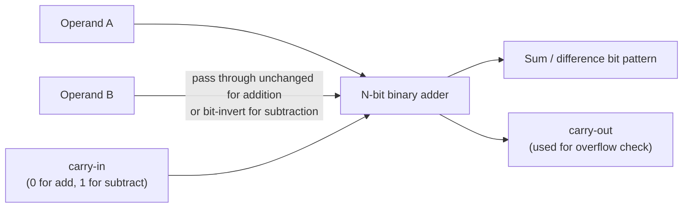

## Learning Objectives

- Define the two's-complement representation of a signed N-bit integer, both as "invert and add 1" and as a weighted positional sum where the most significant bit carries weight −2^(N−1).
- State the representable range of an N-bit two's-complement integer and explain why it is asymmetric (one more negative value than positive values).
- Explain, in terms of the underlying binary adder circuit, why two's complement lets addition and subtraction share exactly the same hardware, and why sign-magnitude and one's-complement do not.
- Convert a negative decimal integer to its N-bit two's-complement bit pattern, and convert a two's-complement bit pattern back to its signed decimal value.
- Sign-extend a two's-complement value from a narrower width to a wider width without changing its numeric value.
- Detect signed overflow from the carry into and out of the sign bit, and distinguish overflow from ordinary unsigned wraparound.

## Context & Motivation

The previous concept established that an N-bit field is just a string of bits, and that read as an unsigned quantity it denotes a weighted sum of powers of 2, ranging from 0 to 2^N − 1. But real programs constantly need negative numbers — a temperature below zero, a bank balance overdrawn, a loop counter walking backward, the difference between two unsigned quantities where the first is smaller. The hardware has no separate "negative" wire or extra symbol to spend; it still has only N bits, each still only 0 or 1. So the entire question this concept answers is: given that we are stuck with the same N bits we always had, which of the 2^N available bit patterns should we reinterpret as negative, and by what rule, so that the resulting arithmetic is both usable and cheap to build in hardware?

Historically, machines tried more than one answer. Sign-magnitude reserves one bit purely to mean "negative" and interprets the rest as a magnitude — intuitive for humans, but it produces two distinct bit patterns for zero (+0 and −0) and, worse, requires the adder to inspect the sign bits and branch into different behavior for addition versus subtraction. One's complement (negate a number by flipping every bit) is a half-step improvement but still produces two zeros and still needs an end-around carry correction that ordinary binary addition does not do on its own. Two's complement, the scheme covered here, is the representation every general-purpose CPU built since the 1970s actually uses (x86, ARM, RISC-V, MIPS, all of them), and Harris & Harris's Digital Design and Computer Architecture presents it as the standard precisely because it eliminates both problems at once: there is exactly one bit pattern for zero, and — critically — a plain binary adder, wired with no extra sign-checking logic whatsoever, produces the mathematically correct result whether the operands are meant as unsigned or as two's-complement signed values, and whether the operation is really an addition or a subtraction in disguise.

This is not a minor implementation detail; it is the reason two's complement won the historical competition among representations. The recurring lesson in the ACM/IEEE CS2013 Architecture and Organization knowledge area is that representations are chosen not for elegance in isolation but for how cheaply and uniformly they let you build the actual gates. Two's complement lets the binary-adder circuit (a concept still ahead in this curriculum) do double duty as both an adder and a subtractor with the addition of a single inverter and a carry-in wire — no separate subtractor circuit is ever built into a real CPU. Everything in this lesson — the invert-and-add-1 rule, the weighted-sum view, sign extension, overflow detection — exists to make that one hardware fact usable and predictable.

## Core Theory

### Recap: unsigned interpretation

An unsigned N-bit pattern `b_(N-1) b_(N-2) ... b_1 b_0` denotes the non-negative value:

```
value = b_(N-1)*2^(N-1) + b_(N-2)*2^(N-2) + ... + b_1*2^1 + b_0*2^0
```

with range 0 to 2^N − 1. Nothing in the bits themselves says "this is unsigned" — that is a decision made by the programmer, the compiler, or the instruction being executed. The identical bit pattern `1111 1111` is 255 if read as unsigned and, as shown below, −1 if read as two's complement. The bits never change; only the interpretation does.

### Why sign-magnitude and one's complement are rejected

**Sign-magnitude**: reserve the MSB as a sign flag (0 = positive, 1 = negative) and read the remaining N−1 bits as a magnitude. Problems: `0000 0000` and `1000 0000` both mean zero (+0 and −0), wasting a bit pattern and requiring extra logic to treat them as equal; and computing A − B requires comparing magnitudes and sign bits to decide whether to add or subtract the magnitudes and which sign to attach to the result — a genuinely different circuit from plain addition.

**One's complement**: negate a value by inverting every bit (`x` becomes `NOT x`). This still produces two zeros (`0000 0000` and `1111 1111`), and addition requires an "end-around carry": any carry out of the top bit must be added back into bit 0, which plain binary addition does not do by itself.

**Two's complement** fixes both defects simultaneously, as shown next.

### Two's complement: the invert-and-add-1 definition

To negate an N-bit two's-complement value `x`, invert every bit and add 1:

```
-x = (NOT x) + 1
```

Applying this twice returns the original value, and applying it to zero returns zero (with the extra carry out of the top bit simply discarded), so there is exactly one representation of zero. This is the standard operational definition: it tells you exactly what bit pattern to produce.

### Two's complement: the weighted-sum definition

The invert-and-add-1 recipe is mechanical but doesn't explain why the arithmetic works. The equivalent — and more illuminating — definition treats an N-bit two's-complement pattern as a weighted sum exactly like the unsigned case, except that the most significant bit is given a **negative** weight, −2^(N−1), instead of the positive weight 2^(N−1) it would have in the unsigned reading:

```
value = -b_(N-1)*2^(N-1) + b_(N-2)*2^(N-2) + ... + b_1*2^1 + b_0*2^0
```

Every other bit keeps its ordinary positive weight. This single sign flip on the top bit's weight is the entire difference between the unsigned and two's-complement interpretations of the same N bits, and it is why the two invert-and-add-1 and weighted-sum descriptions always agree.

### Representable range

With the MSB weighted −2^(N−1) and every other bit contributing its usual positive weight, the most negative value occurs when the MSB is 1 and every other bit is 0 (giving exactly −2^(N−1)), and the most positive value occurs when the MSB is 0 and every other bit is 1 (giving 2^(N−1) − 1). So the range of an N-bit two's-complement integer is:

```
[-2^(N-1), 2^(N-1) - 1]
```

For N = 8: [−128, 127] — 256 total patterns, matching the 2^8 = 256 available bit patterns exactly, but split asymmetrically because there is only one zero and the negative side "absorbs" the pattern that would otherwise have been −0.

| Width N | Minimum | Maximum |
|---|---|---|
| 8 | −128 | 127 |
| 16 | −32768 | 32767 |
| 32 | −2147483648 | 2147483647 |

### Why one adder circuit suffices for both addition and subtraction

This is the pivotal engineering payoff. A binary adder built from full-adder cells (covered later in this curriculum) computes the sum of two N-bit inputs and a carry-in, purely bit by bit, with no idea whether its inputs are "supposed to be" signed or unsigned. Two's complement is defined precisely so that this same circuit, unmodified, produces the correct signed result:

- **Unsigned addition**: feed the adder the two unsigned bit patterns directly; the bit-pattern result, taken modulo 2^N, is correct.
- **Signed addition**: feed the adder the two two's-complement bit patterns directly (no special-casing of the sign bit); the bit-pattern result, reinterpreted as two's complement, is correct — because the weighted-sum definition is linear, and ordinary binary addition already respects that linearity for every bit position including the negatively-weighted MSB.
- **Subtraction, A − B**: compute `A + (NOT B) + 1`, i.e., invert every bit of B and set the adder's carry-in to 1. This is exactly "negate B, then add," and it reuses the identical adder — subtraction is never a separate circuit, only addition with one input inverted and the carry-in wire tied to 1 instead of 0.



This is why two's complement displaced sign-magnitude and one's complement in every mainstream CPU: it is a direct reduction in gate count and design complexity, since the same adder module, reused with a small multiplexer and one XOR gate per bit on the B input, implements both operations.

### Sign extension

To widen a two's-complement value from M bits to a larger width N (M < N) without changing its numeric value, replicate the sign bit (the current MSB) into all the new upper bit positions, leaving the original M bits unchanged in the low-order positions. This works because, from the weighted-sum view, the new upper positions are simply spelling out, across more bits, the same sign contribution that was previously collapsed into the single MSB — the total value is unchanged. Zero-extension (padding with 0s) is correct only for unsigned values; applying it to a negative two's-complement value would silently turn it positive.

```
8-bit  -5  = 1111 1011
16-bit -5  = 1111 1111 1111 1011   (sign bit 1 replicated into all 8 new upper bits)
```

### Overflow detection

Signed overflow occurs when the mathematically correct result of an addition falls outside the representable range [−2^(N−1), 2^(N−1) − 1], so the bit pattern wraps and is misinterpreted. The standard hardware test compares the carry **into** the sign-bit position with the carry **out of** the sign-bit position:

```
overflow = carry_in_to_MSB XOR carry_out_of_MSB
```

If these two carries differ, the sign bit was corrupted by wraparound and the result is invalid as a signed value. If they agree, the signed result is correct, regardless of the adder's overall carry-out. This is a separate condition from unsigned wraparound (simply "carry-out of the whole adder is 1"); a single addition can overflow in the signed sense without overflowing in the unsigned sense, and vice versa, because the two interpretations of the same bit pattern have different valid ranges.

## Worked Examples

### Example 1: Representing −5 as an 8-bit two's-complement pattern

Step 1 — write +5 in 8-bit binary: `0000 0101`.

Step 2 — invert every bit: `1111 1010`.

Step 3 — add 1: `1111 1010 + 1 = 1111 1011`.

So −5 in 8-bit two's complement is `1111 1011`.

Cross-check with the weighted-sum definition: bits are `1 1 1 1 1 0 1 1` for positions 7 down to 0, MSB weighted −128:

```
-128 + 64 + 32 + 16 + 8 + 0 + 2 + 1 = -128 + 123 = -5
```

Both methods agree.

### Example 2: Computing 7 + (−3) in 8-bit binary, verifying the result is 4

+7 in 8-bit two's complement: `0000 0111`.

−3 in 8-bit two's complement: invert `0000 0011` → `1111 1100`, add 1 → `1111 1101`.

Add the two patterns with ordinary binary addition, bit by bit from the right:

```
  0000 0111
+ 1111 1101
-----------
  0000 0100    (carry out of bit 7 is 1, but it is discarded — the adder is only 8 bits wide)
```

Reinterpreting `0000 0100` with the weighted-sum rule (MSB is 0, so its negative weight contributes nothing): `4`. This matches 7 + (−3) = 4 exactly, and it was computed by the identical binary adder that would have computed unsigned 7 + 253 = 260 ≡ 4 (mod 256) — the same circuit, same bits, two valid interpretations.

Overflow check: carry into bit 7 is 1 (from bit 6's addition: 1+1=10, carry 1), carry out of bit 7 is also 1 (discarded above). `1 XOR 1 = 0`, so no overflow — consistent with 4 being well within [−128, 127].

### Example 3: Signed overflow — 100 + 50 in 8-bit two's complement

+100 in 8-bit binary: `0110 0100`. +50 in 8-bit binary: `0011 0010`. Both are valid positive 8-bit two's-complement values (MSB = 0 for each).

```
  0110 0100
+ 0011 0010
-----------
  1001 0110
```

Reinterpreting `1001 0110` as two's complement (MSB = 1, weight −128): `-128 + 16 + 4 + 2 = -128 + 22 = -106`. But the true mathematical sum is 100 + 50 = 150, which exceeds the maximum representable signed 8-bit value of 127 — the hardware produced −106, a nonsensical signed result for adding two positive numbers.

Overflow check: examine the addition of bit 6 into bit 7. Bit 6 column: `1 + 1 = 10`, so carry into bit 7 (the sign bit) is 1. Bit 7 column: `0 + 0 + carry-in 1 = 1`, producing sum bit 1 with carry-out of bit 7 equal to 0. Carry-in to MSB (1) XOR carry-out of MSB (0) = 1, correctly flagging overflow. Note that the unsigned interpretation of the same addition, 100 + 50 = 150, is perfectly valid within the unsigned 8-bit range [0, 255] — this addition overflows only under the signed interpretation, confirming that signed overflow and unsigned wraparound are independent conditions checked from different carry signals.

## Common Misconceptions & Pitfalls

- **"A bit pattern is inherently signed or unsigned; you can tell just by looking at it."** You cannot — `1111 1011` is 251 read as unsigned and −5 read as two's complement, and the bits are identical in both cases. Signedness is an interpretation applied by the instruction or type, not a property stored in the bits themselves.
- **"Negative numbers need a fundamentally different adder circuit than positive numbers."** They do not — the same binary adder, given no information about signedness, produces bit patterns that are simultaneously correct under both the unsigned and two's-complement readings. No CPU has a separate signed-addition circuit.
- **"Overflow is the same thing as the carry-out bit being 1."** Carry-out of the whole adder indicates unsigned overflow; signed overflow is detected by comparing the carry into the sign bit against the carry out of the sign bit. A single addition can set one of these flags without the other.
- **"The range of an N-bit signed integer is symmetric, from −2^(N−1) to +2^(N−1)."** It is [−2^(N−1), 2^(N−1) − 1], one value short on the positive side, because there is only one all-zero pattern (used for 0, not −0); the "extra" negative-side pattern that sign-magnitude would have wasted on −0 is instead used for the single most-negative value.
- **"Sign-extending just means padding with zeros on the left, same as for unsigned values."** Zero-extension is only correct for unsigned values. Sign-extension replicates the sign bit (0 or 1) into every new upper position; padding a negative value with zeros would silently change its value and sign.
- **"To subtract, hardware must implement a genuinely separate subtraction circuit."** It reuses the adder: A − B is computed as A + (NOT B) + 1 — no distinct subtractor circuit exists in a real ALU.

## Summary

Two's complement represents a negative N-bit integer either by inverting every bit of its positive counterpart and adding 1, or, equivalently, by treating the bit pattern as an ordinary weighted sum in which the most significant bit alone carries a negative weight, −2^(N−1); the two definitions always agree and together yield a range of [−2^(N−1), 2^(N−1) − 1] with exactly one representation of zero. Two's complement displaced sign-magnitude and one's complement in every real CPU for a concrete engineering reason, not an aesthetic one: it lets a single binary-adder circuit compute correct results for unsigned addition, signed addition, and (via bit-inversion of one operand plus a carry-in of 1) subtraction, with no sign-checking logic anywhere in the datapath. Sign extension preserves value across widths by replicating the sign bit, and signed overflow is detected by comparing the carry into the sign bit against the carry out of it — a condition entirely independent of ordinary unsigned wraparound. With integer representation now fully in hand, the next concept, IEEE 754 floating-point, reuses this same sign/magnitude machinery for fractional and very large or very small values, replacing the fixed positional weighting of integers with an explicit, biased exponent field.

## Documentation Links

- [ACM/IEEE CS2013 — Architecture and Organization Knowledge Area](https://csed.acm.org/knowledge-areas-architecture-and-organization-ar-cs2013-version/) — curriculum guidelines identifying signed number representation and integer arithmetic as core Architecture and Organization topics.
- [Harris & Harris — Digital Design and Computer Architecture, RISC-V Edition](https://shop.elsevier.com/books/digital-design-and-computer-architecture-risc-v-edition/harris/978-0-12-820064-3) — presents two's-complement representation and its adoption rationale (shared adder/subtractor hardware) as the standard signed-integer scheme in real processors.
