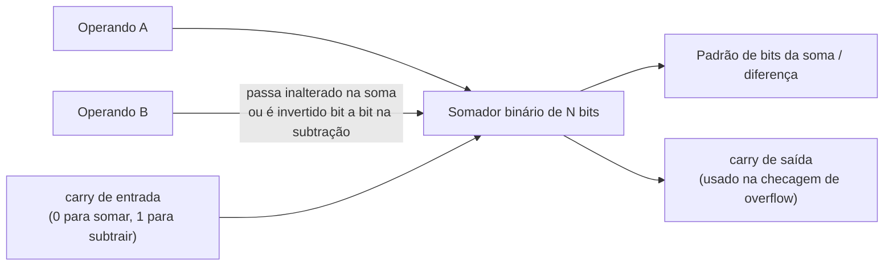

## Objetivos de Aprendizagem

- Definir a representação em complemento de dois de um inteiro com sinal de N bits, tanto como "inverter e somar 1" quanto como uma soma posicional ponderada em que o bit mais significativo tem peso −2^(N−1).
- Enunciar a faixa representável de um inteiro em complemento de dois de N bits e explicar por que ela é assimétrica (um valor negativo a mais que os positivos).
- Explicar, em termos do circuito somador binário subjacente, por que o complemento de dois permite que soma e subtração compartilhem exatamente o mesmo hardware, e por que sinal-magnitude e complemento de um não permitem.
- Converter um inteiro decimal negativo no seu padrão de bits em complemento de dois de N bits, e converter um padrão de bits em complemento de dois de volta no seu valor decimal com sinal.
- Fazer a extensão de sinal de um valor em complemento de dois de uma largura menor para uma maior sem mudar seu valor numérico.
- Detectar overflow com sinal a partir do carry que entra e do carry que sai do bit de sinal, e distinguir o overflow do estouro circular comum sem sinal.

## Contexto e Motivação

O conceito anterior estabeleceu que um campo de N bits é só uma sequência de bits e que, lido como grandeza sem sinal, denota uma soma ponderada de potências de 2, de 0 a 2^N − 1. Mas programas reais precisam o tempo todo de números negativos: uma temperatura abaixo de zero, um saldo bancário no vermelho, um contador de laço andando para trás, a diferença entre duas grandezas sem sinal em que a primeira é menor. O hardware não tem um fio de "negativo" separado nem um símbolo extra para gastar; ele continua tendo só N bits, cada um ainda só 0 ou 1. Então a pergunta inteira que este conceito responde é: dado que estamos presos aos mesmos N bits de sempre, quais dos 2^N padrões de bits disponíveis devemos reinterpretar como negativos, e por qual regra, para que a aritmética resultante seja ao mesmo tempo utilizável e barata de construir em hardware?

Historicamente, as máquinas tentaram mais de uma resposta. O sinal-magnitude reserva um bit só para dizer "negativo" e interpreta o resto como magnitude: intuitivo para humanos, mas produz dois padrões de bits distintos para o zero (+0 e −0) e, pior, exige que o somador inspecione os bits de sinal e se ramifique em comportamentos diferentes para soma e subtração. O complemento de um (negar um número invertendo todos os bits) é meio passo de melhora, mas ainda produz dois zeros e ainda precisa de uma correção de carry circular (end-around carry) que a soma binária comum não faz sozinha. O complemento de dois, o esquema visto aqui, é a representação que toda CPU de propósito geral construída desde os anos 1970 de fato usa (x86, ARM, RISC-V, MIPS, todas elas), e o Digital Design and Computer Architecture de Harris & Harris o apresenta como o padrão justamente porque elimina os dois problemas de uma vez: existe exatamente um padrão de bits para o zero e, de forma crucial, um somador binário simples, ligado sem nenhuma lógica extra de verificação de sinal, produz o resultado matematicamente correto, sejam os operandos entendidos como sem sinal ou como valores com sinal em complemento de dois, e seja a operação de fato uma soma ou uma subtração disfarçada.

Isso não é um detalhe menor de implementação; é o motivo de o complemento de dois ter vencido a competição histórica entre representações. A lição recorrente da área de conhecimento de Arquitetura e Organização do ACM/IEEE CS2013 é que as representações são escolhidas não pela elegância isolada, mas por quão barata e uniformemente permitem construir as portas de verdade. O complemento de dois permite que o circuito somador binário (um conceito ainda à frente neste currículo) trabalhe dobrado, como somador e como subtrator, com o acréscimo de um único inversor e de um fio de carry de entrada; nenhum circuito subtrator separado é jamais construído numa CPU real. Tudo nesta lição (a regra de inverter e somar 1, a visão de soma ponderada, a extensão de sinal, a detecção de overflow) existe para tornar esse único fato de hardware utilizável e previsível.

## Teoria Central

### Recapitulação: a interpretação sem sinal

Um padrão sem sinal de N bits `b_(N-1) b_(N-2) ... b_1 b_0` denota o valor não negativo:

```
valor = b_(N-1)*2^(N-1) + b_(N-2)*2^(N-2) + ... + b_1*2^1 + b_0*2^0
```

com faixa de 0 a 2^N − 1. Nada nos próprios bits diz "isto é sem sinal": essa é uma decisão do programador, do compilador ou da instrução em execução. O mesmíssimo padrão de bits `1111 1111` vale 255 se lido sem sinal e, como mostrado abaixo, −1 se lido em complemento de dois. Os bits nunca mudam; só a interpretação muda.

### Por que sinal-magnitude e complemento de um são rejeitados

**Sinal-magnitude**: reserve o MSB como flag de sinal (0 = positivo, 1 = negativo) e leia os N−1 bits restantes como magnitude. Problemas: `0000 0000` e `1000 0000` significam ambos zero (+0 e −0), desperdiçando um padrão de bits e exigindo lógica extra para tratá-los como iguais; e calcular A − B exige comparar magnitudes e bits de sinal para decidir se soma ou subtrai as magnitudes e qual sinal colocar no resultado, um circuito genuinamente diferente da soma simples.

**Complemento de um**: negue um valor invertendo todos os bits (`x` vira `NOT x`). Isso ainda produz dois zeros (`0000 0000` e `1111 1111`), e a soma exige um "carry circular": qualquer carry que saia do bit mais alto precisa ser somado de volta no bit 0, o que a soma binária simples não faz sozinha.

O **complemento de dois** corrige os dois defeitos ao mesmo tempo, como mostrado a seguir.

### Complemento de dois: a definição de inverter e somar 1

Para negar um valor `x` em complemento de dois de N bits, inverta todos os bits e some 1:

```
-x = (NOT x) + 1
```

Aplicar isso duas vezes devolve o valor original, e aplicá-lo ao zero devolve zero (com o carry extra que sai do bit mais alto simplesmente descartado), então há exatamente uma representação do zero. Essa é a definição operacional padrão: ela diz exatamente qual padrão de bits produzir.

### Complemento de dois: a definição por soma ponderada

A receita de inverter e somar 1 é mecânica, mas não explica por que a aritmética funciona. A definição equivalente, e mais esclarecedora, trata um padrão de N bits em complemento de dois como uma soma ponderada exatamente como no caso sem sinal, exceto que o bit mais significativo recebe um peso **negativo**, −2^(N−1), em vez do peso positivo 2^(N−1) que teria na leitura sem sinal:

```
valor = -b_(N-1)*2^(N-1) + b_(N-2)*2^(N-2) + ... + b_1*2^1 + b_0*2^0
```

Todos os outros bits mantêm seu peso positivo comum. Essa única troca de sinal no peso do bit mais alto é toda a diferença entre as interpretações sem sinal e em complemento de dois dos mesmos N bits, e é por isso que as duas descrições (inverter e somar 1, e soma ponderada) sempre concordam.

### Faixa representável

Com o MSB pesando −2^(N−1) e todos os outros bits contribuindo com seu peso positivo usual, o valor mais negativo ocorre quando o MSB vale 1 e todos os outros bits valem 0 (dando exatamente −2^(N−1)), e o valor mais positivo ocorre quando o MSB vale 0 e todos os outros bits valem 1 (dando 2^(N−1) − 1). Então a faixa de um inteiro em complemento de dois de N bits é:

```
[-2^(N-1), 2^(N-1) - 1]
```

Para N = 8: [−128, 127], 256 padrões no total, batendo exatamente com os 2^8 = 256 padrões de bits disponíveis, mas divididos de forma assimétrica, porque há só um zero e o lado negativo "absorve" o padrão que de outra forma seria o −0.

| Largura N | Mínimo | Máximo |
|---|---|---|
| 8 | −128 | 127 |
| 16 | −32768 | 32767 |
| 32 | −2147483648 | 2147483647 |

### Por que um único circuito somador basta para soma e subtração

Este é o retorno de engenharia decisivo. Um somador binário construído com células de somador completo (vistas mais adiante neste currículo) calcula a soma de duas entradas de N bits e um carry de entrada, puramente bit a bit, sem ideia se suas entradas "deveriam ser" com ou sem sinal. O complemento de dois é definido precisamente para que esse mesmo circuito, sem modificação, produza o resultado com sinal correto:

- **Soma sem sinal**: alimente o somador diretamente com os dois padrões de bits sem sinal; o padrão de bits resultante, tomado módulo 2^N, está correto.
- **Soma com sinal**: alimente o somador diretamente com os dois padrões de bits em complemento de dois (sem tratamento especial do bit de sinal); o padrão de bits resultante, reinterpretado em complemento de dois, está correto, porque a definição por soma ponderada é linear, e a soma binária comum já respeita essa linearidade em toda posição de bit, incluindo o MSB de peso negativo.
- **Subtração, A − B**: calcule `A + (NOT B) + 1`, ou seja, inverta todos os bits de B e coloque o carry de entrada do somador em 1. Isso é exatamente "negue B e depois some", e reaproveita o mesmo somador: a subtração nunca é um circuito separado, só uma soma com uma entrada invertida e o fio de carry de entrada ligado em 1 em vez de 0.



É por isso que o complemento de dois substituiu o sinal-magnitude e o complemento de um em toda CPU comercial: é uma redução direta no número de portas e na complexidade de projeto, já que o mesmo módulo somador, reaproveitado com um pequeno multiplexador e uma porta XOR por bit na entrada B, implementa as duas operações.

### Extensão de sinal

Para alargar um valor em complemento de dois de M bits para uma largura maior N (M < N) sem mudar seu valor numérico, replique o bit de sinal (o MSB atual) em todas as novas posições de bits superiores, deixando os M bits originais inalterados nas posições de ordem mais baixa. Isso funciona porque, pela visão de soma ponderada, as novas posições superiores estão simplesmente soletrando, em mais bits, a mesma contribuição de sinal que antes estava concentrada no único MSB; o valor total não muda. A extensão com zeros (completar com 0s) só é correta para valores sem sinal; aplicá-la a um valor negativo em complemento de dois o transformaria silenciosamente em positivo.

```
-5 em 8 bits  = 1111 1011
-5 em 16 bits = 1111 1111 1111 1011   (bit de sinal 1 replicado nos 8 novos bits superiores)
```

### Detecção de overflow

O overflow com sinal acontece quando o resultado matematicamente correto de uma soma cai fora da faixa representável [−2^(N−1), 2^(N−1) − 1], de modo que o padrão de bits dá a volta e é mal interpretado. O teste padrão em hardware compara o carry que **entra** na posição do bit de sinal com o carry que **sai** da posição do bit de sinal:

```
overflow = carry_que_entra_no_MSB XOR carry_que_sai_do_MSB
```

Se esses dois carries diferem, o bit de sinal foi corrompido pela volta e o resultado é inválido como valor com sinal. Se concordam, o resultado com sinal está correto, seja qual for o carry de saída geral do somador. Essa é uma condição separada do estouro circular sem sinal (simplesmente "o carry de saída do somador inteiro vale 1"); uma única soma pode dar overflow no sentido com sinal sem dar no sentido sem sinal, e vice-versa, porque as duas interpretações do mesmo padrão de bits têm faixas válidas diferentes.

## Exemplos Resolvidos

### Exemplo 1: representando −5 como padrão em complemento de dois de 8 bits

Passo 1: escreva +5 em binário de 8 bits: `0000 0101`.

Passo 2: inverta todos os bits: `1111 1010`.

Passo 3: some 1: `1111 1010 + 1 = 1111 1011`.

Então −5 em complemento de dois de 8 bits é `1111 1011`.

Conferindo com a definição por soma ponderada: os bits são `1 1 1 1 1 0 1 1` nas posições de 7 a 0, com o MSB pesando −128:

```
-128 + 64 + 32 + 16 + 8 + 0 + 2 + 1 = -128 + 123 = -5
```

Os dois métodos concordam.

### Exemplo 2: calculando 7 + (−3) em binário de 8 bits e verificando que o resultado é 4

+7 em complemento de dois de 8 bits: `0000 0111`.

−3 em complemento de dois de 8 bits: inverta `0000 0011` → `1111 1100`, some 1 → `1111 1101`.

Some os dois padrões com a soma binária comum, bit a bit a partir da direita:

```
  0000 0111
+ 1111 1101
-----------
  0000 0100    (o carry que sai do bit 7 vale 1, mas é descartado: o somador tem só 8 bits)
```

Reinterpretando `0000 0100` pela regra da soma ponderada (o MSB vale 0, então seu peso negativo não contribui nada): `4`. Isso bate exatamente com 7 + (−3) = 4, e foi calculado pelo mesmo somador binário que teria calculado o 7 + 253 = 260 ≡ 4 (mod 256) sem sinal: o mesmo circuito, os mesmos bits, duas interpretações válidas.

Checagem de overflow: o carry que entra no bit 7 vale 1 (da soma do bit 6: 1+1=10, vai 1), e o carry que sai do bit 7 também vale 1 (descartado acima). `1 XOR 1 = 0`, então não há overflow, o que é consistente com 4 estar bem dentro de [−128, 127].

### Exemplo 3: overflow com sinal, 100 + 50 em complemento de dois de 8 bits

+100 em binário de 8 bits: `0110 0100`. +50 em binário de 8 bits: `0011 0010`. Os dois são valores positivos válidos em complemento de dois de 8 bits (MSB = 0 em cada um).

```
  0110 0100
+ 0011 0010
-----------
  1001 0110
```

Reinterpretando `1001 0110` em complemento de dois (MSB = 1, peso −128): `-128 + 16 + 4 + 2 = -128 + 22 = -106`. Mas a soma matemática verdadeira é 100 + 50 = 150, que excede o valor máximo representável com sinal em 8 bits, 127; o hardware produziu −106, um resultado com sinal sem sentido para a soma de dois números positivos.

Checagem de overflow: examine a soma do bit 6 para o bit 7. Coluna do bit 6: `1 + 1 = 10`, então o carry que entra no bit 7 (o bit de sinal) vale 1. Coluna do bit 7: `0 + 0 + carry de entrada 1 = 1`, produzindo bit de soma 1 com carry de saída do bit 7 igual a 0. Carry que entra no MSB (1) XOR carry que sai do MSB (0) = 1, sinalizando corretamente o overflow. Repare que a interpretação sem sinal da mesma soma, 100 + 50 = 150, é perfeitamente válida dentro da faixa sem sinal de 8 bits [0, 255]: esta soma só dá overflow na interpretação com sinal, confirmando que o overflow com sinal e o estouro circular sem sinal são condições independentes, checadas a partir de sinais de carry diferentes.

## Equívocos Comuns e Armadilhas

- **"Um padrão de bits é inerentemente com ou sem sinal; dá para saber só de olhar."** Não dá: `1111 1011` vale 251 lido sem sinal e −5 lido em complemento de dois, e os bits são idênticos nos dois casos. Ter ou não sinal é uma interpretação aplicada pela instrução ou pelo tipo, e não uma propriedade guardada nos próprios bits.
- **"Números negativos precisam de um circuito somador fundamentalmente diferente dos positivos."** Não precisam: o mesmo somador binário, sem nenhuma informação sobre sinal, produz padrões de bits que estão corretos ao mesmo tempo nas leituras sem sinal e em complemento de dois. Nenhuma CPU tem um circuito separado de soma com sinal.
- **"Overflow é a mesma coisa que o bit de carry de saída valer 1."** O carry de saída do somador inteiro indica overflow sem sinal; o overflow com sinal é detectado comparando o carry que entra no bit de sinal com o carry que sai dele. Uma única soma pode ligar uma dessas flags sem ligar a outra.
- **"A faixa de um inteiro com sinal de N bits é simétrica, de −2^(N−1) a +2^(N−1)."** Ela é [−2^(N−1), 2^(N−1) − 1], um valor a menos do lado positivo, porque há só um padrão com tudo em zero (usado para o 0, não para o −0); o padrão "extra" do lado negativo que o sinal-magnitude desperdiçaria com o −0 é usado, em vez disso, para o único valor mais negativo.
- **"Fazer extensão de sinal é só completar com zeros à esquerda, como nos valores sem sinal."** A extensão com zeros só é correta para valores sem sinal. A extensão de sinal replica o bit de sinal (0 ou 1) em cada nova posição superior; completar um valor negativo com zeros mudaria silenciosamente seu valor e seu sinal.
- **"Para subtrair, o hardware precisa implementar um circuito de subtração genuinamente separado."** Ele reaproveita o somador: A − B é calculado como A + (NOT B) + 1; não existe circuito subtrator distinto numa ULA real.

## Resumo

O complemento de dois representa um inteiro negativo de N bits invertendo todos os bits do seu correspondente positivo e somando 1 ou, de forma equivalente, tratando o padrão de bits como uma soma ponderada comum em que só o bit mais significativo tem peso negativo, −2^(N−1); as duas definições sempre concordam e juntas dão uma faixa de [−2^(N−1), 2^(N−1) − 1] com exatamente uma representação do zero. O complemento de dois substituiu o sinal-magnitude e o complemento de um em toda CPU real por um motivo concreto de engenharia, e não estético: ele permite que um único circuito somador binário calcule resultados corretos para soma sem sinal, soma com sinal e (invertendo os bits de um operando e com carry de entrada 1) subtração, sem lógica de verificação de sinal em lugar nenhum do datapath. A extensão de sinal preserva o valor entre larguras replicando o bit de sinal, e o overflow com sinal é detectado comparando o carry que entra no bit de sinal com o carry que sai dele, uma condição totalmente independente do estouro circular comum sem sinal. Com a representação de inteiros agora completa, o próximo conceito, ponto flutuante IEEE 754, reaproveita esse mesmo maquinário de sinal/magnitude para valores fracionários e muito grandes ou muito pequenos, substituindo a ponderação posicional fixa dos inteiros por um campo de expoente explícito e enviesado.

## Documentation Links

- [ACM/IEEE CS2013: Architecture and Organization Knowledge Area](https://csed.acm.org/knowledge-areas-architecture-and-organization-ar-cs2013-version/): diretrizes curriculares que identificam a representação de números com sinal e a aritmética de inteiros como tópicos centrais de Arquitetura e Organização.
- [Harris & Harris: Digital Design and Computer Architecture, RISC-V Edition](https://shop.elsevier.com/books/digital-design-and-computer-architecture-risc-v-edition/harris/978-0-12-820064-3): apresenta a representação em complemento de dois e a justificativa da sua adoção (hardware somador/subtrator compartilhado) como o esquema padrão de inteiros com sinal em processadores reais.
