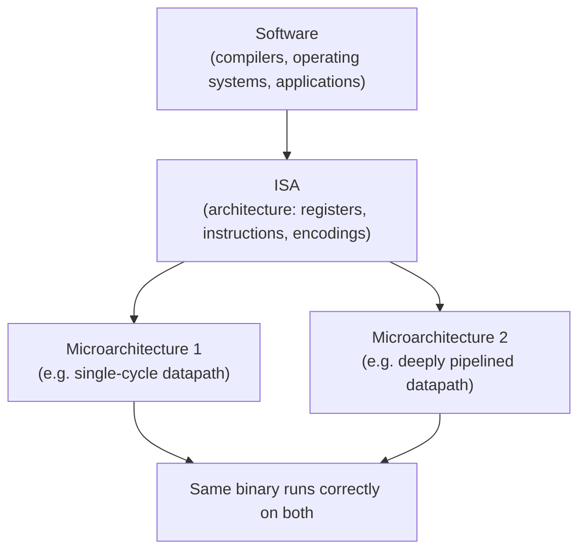

## Learning Objectives

- Define an instruction set architecture (ISA) as the precise contract between hardware and software, and list the three things it must specify: programmer-visible state, the instruction set, and binary encodings.
- Explain what an ISA deliberately does NOT specify, and why leaving implementation details unspecified is the source of its value.
- Distinguish architecture (ISA) from microarchitecture, and classify specific processor properties as belonging to one or the other.
- Explain how binary compatibility across chip generations follows directly from a stable ISA, and why this lets hardware and software teams evolve independently.
- Summarize the RISC vs CISC design philosophies as two different answers to how the ISA contract should be written, without treating either as strictly superior.
- Describe how this discipline's earlier topics (gates, the ALU, memory) exist to implement an ISA, while later topics (assemblers, compilers, operating systems) exist to target one.

## Context & Motivation

Every layer of a computer system, from a logic gate to a web application, is built on top of some agreed interface that lets the layers above it stop worrying about the layers below. The instruction set architecture is the single most consequential interface in this entire stack: it is the line drawn between hardware, which must physically implement every instruction using transistors, wires, and clocked storage, and software, which is written, compiled, and shipped with only a promise about what those instructions do — never a description of how they are carried out. Harris & Harris, in *Digital Design and Computer Architecture, RISC-V Edition*, frame this precisely as a contract: the ISA specifies everything a machine-language programmer needs to know to write a correct program, and nothing more. That "nothing more" is not a gap in the specification; it is the entire point of having one.

Why does a discipline that starts from Boolean gates and works upward through the ALU and memory need to pause and define a contract before building a CPU? Because without one, there is no way to answer the question "does this hardware correctly run this program?" A CPU design is only meaningful in reference to some ISA it claims to implement — you cannot verify a datapath or reason about performance without first fixing exactly which operations the machine promises to support and exactly what each one does. This concept explains why the contract exists and what shape it takes in general; the next concept pins down the exact, concrete teaching ISA — a small RISC-V-style instruction set — that every remaining datapath and control unit in this discipline will be built to execute.

The payoff of getting the ISA contract right is enormous and mostly invisible to end users. A program compiled for a given ISA in 1995 can, in principle, still run correctly on a chip manufactured decades later, even though the internal implementation has changed almost beyond recognition — different transistor counts, clock speeds, cache hierarchies, and pipeline depths. This is binary compatibility, and it is the reason hardware companies can sell "the same" processor family for decades while completely redesigning the silicon underneath every few years, and the reason software companies can ship a single binary that runs on millions of different physical machines they will never see or control.

## Core Theory

### The three things an ISA must specify

An ISA is a specification, and its value comes from being precise enough that two independent teams — one building hardware, one writing software — can each work from it without ever talking to each other and still produce a working system together. Concretely, an ISA specifies three things:

1. **Programmer-visible state.** The set of storage locations a program can read and write: the register file (how many registers, how wide each one is), the memory model (how memory is addressed, how big a word is, byte ordering), and the program counter (which instruction executes next). Anything a running program can observe or modify through ordinary instructions counts as programmer-visible state.
2. **The instruction set and its exact semantics.** The complete list of operations the machine promises to support — arithmetic, logic, data movement, control flow — along with an exact, unambiguous description of what each one does to the programmer-visible state. The specification must answer every edge case a compiler or assembly programmer could hit, including overflow, division by zero, and out-of-range memory access.
3. **Binary encodings.** Each instruction is assigned a specific bit pattern so a program can be stored in memory as pure numbers and correctly interpreted as instructions when fetched. The encoding is what lets an assembler translate mnemonic assembly text into the bytes actually loaded into memory and executed.

### What an ISA deliberately omits

Just as important as what an ISA specifies is what it leaves completely open. An ISA never specifies how many clock cycles an instruction takes, whether the machine executes instructions one at a time or several simultaneously, how big any internal cache is, how deep the pipeline is, or what clock frequency the chip runs at. These are all questions of implementation, and a correctly designed ISA is implementation-agnostic by construction: a program written against the ISA must produce the same programmer-visible results regardless of which of these implementation choices the chip designer made.

This omission is deliberate, not an oversight. If the ISA specified implementation details, any change to those details — say, a longer pipeline to run at a higher clock speed — would break every program that had come to depend on the old timing or internal structure. By refusing to specify implementation, the ISA gives hardware designers complete freedom to improve performance, reduce power, or shrink die size, generation after generation, without forcing existing software to be rewritten.

### Architecture vs microarchitecture

This distinction has a standard name: **architecture** (the ISA — the contract) versus **microarchitecture** (a specific hardware implementation of that contract). Two processors can implement the identical ISA with wildly different microarchitectures — different pipeline depths, different cache sizes and hierarchies, different clock speeds, different techniques for extracting instruction-level parallelism — and both will run exactly the same compiled binaries and produce exactly the same programmer-visible results, differing only in how fast or how efficiently they get there.



The CS2013 Architecture and Organization Knowledge Area treats this architecture/microarchitecture separation as one of the foundational ideas of the entire subject area, because nearly every subsequent topic — pipelining, caching, superscalar execution — is properly understood as a microarchitectural technique for implementing a fixed ISA faster, not as a change to the ISA itself.

### Why the contract pays off: binary compatibility and independent evolution

Because the ISA is the only thing software is allowed to depend on, hardware teams are free to redesign the microarchitecture in each new chip generation — deeper pipelines, bigger caches, smarter branch prediction — without breaking existing compiled software, as long as the new chip still correctly implements the same ISA. Symmetrically, software teams can target the ISA once and trust their output to run correctly on every current and future chip that implements it, without knowing anything about pipeline depth or cache size. This mutual independence is what lets the hardware and software industries function as separate businesses that nonetheless produce a single working system.

### RISC vs CISC: two answers to the same design question

Not every ISA answers the "how large and how regular should the instruction set be" question the same way. **CISC** (Complex Instruction Set Computer) designs, historically exemplified by x86, favor a large, irregular instruction set with variable-length encodings and instructions that can do a lot of work each — including instructions that can read from memory, compute, and write back to memory all in one step. **RISC** (Reduced Instruction Set Computer) designs, exemplified by RISC-V, MIPS, and ARM, favor a small, regular instruction set with fixed-length encodings and a strict load-store discipline, where ordinary arithmetic and logic instructions only ever operate on registers, and only dedicated load and store instructions ever touch memory.

Neither philosophy is simply "better" in the abstract; each represents a different tradeoff. A larger, richer instruction set can let a compiler emit fewer instructions for a given program, at the cost of a more complex decoder and control unit. A small, regular instruction set makes the fetch/decode/execute hardware dramatically simpler to design, verify, and pipeline efficiently, at the cost of sometimes needing more instructions per task. This discipline builds toward a small RISC-style teaching ISA specifically because its regularity makes it tractable to implement completely, from gates to a working datapath, within a single course.

### Everything below implements the ISA; everything above targets it

Every topic covered earlier in this discipline — logic gates, the ALU, memory organization — exists for one purpose: to provide the physical means to correctly implement an ISA's instructions and hold its programmer-visible state. Every topic that will come after the ISA is defined — instruction formats, the datapath, the control unit, and eventually assemblers, compilers, and operating systems — exists to either implement that same contract in hardware or to produce programs that correctly target it. The ISA is the pivot: it is the last purely hardware-facing concept and the first purely software-facing one, simultaneously.

## Worked Examples

### Example 1: Compiling `a = b + c` down to ISA-level operations

Consider a single line of C source code:

```text
a = b + c;
```

A compiler translating this statement does not need to know anything about the target machine's pipeline depth, cache size, or clock speed — it only needs to know the ISA. At the ISA level, before any concrete encoding is chosen, this statement decomposes into a short sequence of abstract operations:

```text
1. load the value of b from memory into a register
2. load the value of c from memory into a register
3. add the two register values together, producing a result
4. store the result into the memory location for a
```

Notice what is and is not decided at this level. It is decided that the machine has registers, that arithmetic happens on register values rather than directly on memory, and that separate load and store operations are needed to move data between memory and registers — this is the load-store discipline central to RISC-style ISAs, and it will be defined precisely as part of this discipline's teaching ISA. It is not decided which specific register numbers are used, how many clock cycles each step takes, or whether the underlying hardware executes these four steps one after another or overlapped with the surrounding instructions in a pipeline. That is exactly the architecture/microarchitecture boundary in action: the compiler's output is fixed by the ISA, while the timing and internal execution strategy are left entirely to whichever microarchitecture executes the resulting program.

### Example 2: Two microarchitectures, one ISA, one binary

Suppose two different processor designs both claim to implement the exact same ISA:

```text
Machine A: single-cycle datapath
  - Every instruction, regardless of type, takes exactly one (long) clock cycle
    to fetch, decode, execute, and write back its result.
  - Simple control logic; slow clock frequency because the cycle must be
    long enough for the slowest instruction to finish.

Machine B: pipelined datapath
  - Each instruction is broken into stages (fetch, decode, execute, memory,
    write-back) and multiple instructions are in different stages
    simultaneously, similar to an assembly line.
  - Much higher clock frequency, since each stage only needs to complete a
    small piece of work per cycle; more complex control logic to manage
    overlap and stalls.
```

Both machines implement the identical ISA: same registers, same instructions, same encodings. Compile a program once, and the resulting binary — a fixed sequence of instruction encodings — can be loaded into either machine's memory and executed correctly, producing identical final register and memory contents. Machine B will very likely finish faster, since pipelining lets it start new instructions before old ones fully complete. But that speed difference is entirely a microarchitectural property; nothing about the ISA or the binary needed to change between the two machines. This is precisely why a software company can ship one binary and trust it to run — correctly, if not always identically fast — on every conforming implementation of the ISA, present or future.

### Example 3: Classifying properties as ISA or microarchitecture

Given the following list of processor properties, classify each as belonging to the ISA (architecture) or to a specific implementation (microarchitecture):

```text
Property                                Classification
--------------------------------------  ------------------
Number of programmer-visible registers  ISA
Size of the instruction cache           Microarchitecture
Depth of the instruction pipeline       Microarchitecture
Bit pattern used to encode each         ISA
  instruction
Clock frequency (e.g. 3.2 GHz)          Microarchitecture
```

The pattern to notice: anything a machine-language program can directly observe through its instructions — how many registers exist, what bit pattern encodes `add`, what each instruction does — is part of the ISA and must be identical across every conforming implementation. Anything that only affects how fast or how efficiently the machine reaches the correct answer — cache size, pipeline depth, clock frequency — is a microarchitectural choice that can vary freely between implementations, even between chips sold under the same processor family name, without ever being visible to correctly written software.

## Common Misconceptions & Pitfalls

- **"A faster clock speed or more cache means a different, better ISA."** Clock speed and cache size are microarchitectural properties, not part of the ISA. Two chips can implement the exact same ISA while having completely different clock speeds and cache hierarchies; only the microarchitecture changed, and any correctly compiled binary still runs correctly on both.
- **"The ISA tells you how the hardware works internally."** It deliberately does not. The ISA specifies programmer-visible behavior only — what state exists and what each instruction does to it — and says nothing about pipelining, internal buses, or timing. Those questions belong entirely to microarchitecture, and different implementations of the same ISA are free to answer them differently.
- **"RISC is always faster than CISC, or vice versa."** Neither philosophy is unconditionally superior; each trades compiler simplicity and code density against decoder and control-unit complexity differently. Modern high-performance CISC chips typically translate complex instructions into simpler internal operations before execution, blurring the practical performance distinction.
- **"If two chips have the same ISA, their software must run identically fast."** Binary compatibility guarantees identical correctness of results, not identical performance. Two conforming implementations of the same ISA can differ enormously in speed, power consumption, and cost, since none of those properties are part of what the ISA specifies.
- **"An ISA is just an assembly language."** Assembly text and machine encoding are both part of the ISA specification, but the ISA is broader than either: it also specifies programmer-visible state (registers, memory model, program counter) and the precise semantics of every instruction, not merely how instructions are written or spelled out in binary.
- **"Every instruction the ISA describes must be directly implemented by dedicated hardware."** Some CISC ISAs specify instructions that a given implementation actually carries out internally as a short sequence of simpler micro-operations. What the ISA guarantees is the programmer-visible result, not that the hardware has one physical circuit per instruction.

## Summary

An instruction set architecture is the precise, implementation-agnostic contract between hardware and software: it fixes the programmer-visible state (registers, memory model, program counter), the complete instruction set with exact semantics, and the binary encodings used to store instructions in memory, while saying nothing about how any of it is implemented internally — a separation formalized as architecture versus microarchitecture, enabling binary compatibility across chip generations and letting hardware and software teams evolve independently. RISC and CISC represent two different, defensible answers to how rich or how minimal that instruction set should be, with this discipline choosing the RISC path for its regularity and buildability. Everything covered earlier in this discipline — gates, the ALU, memory — exists to implement an ISA; everything covered from here forward exists to target one. The next concept makes this concrete by defining the exact, small teaching ISA — a RISC-V-style instruction set with a fixed register file, a handful of arithmetic and logic instructions, loads, stores, and a conditional branch — that the rest of this discipline's datapath and control unit will be built to execute.

## Documentation Links

- [ACM/IEEE CS2013 — Architecture and Organization Knowledge Area](https://csed.acm.org/knowledge-areas-architecture-and-organization-ar-cs2013-version/) — curriculum guidelines that establish the architecture/microarchitecture distinction and instruction-set concepts as foundational to Architecture and Organization.
- [Harris & Harris — Digital Design and Computer Architecture, RISC-V Edition](https://shop.elsevier.com/books/digital-design-and-computer-architecture-risc-v-edition/harris/978-0-12-820064-3) — textbook framing the ISA as the hardware/software contract and building a complete RISC-V implementation from this starting point.
