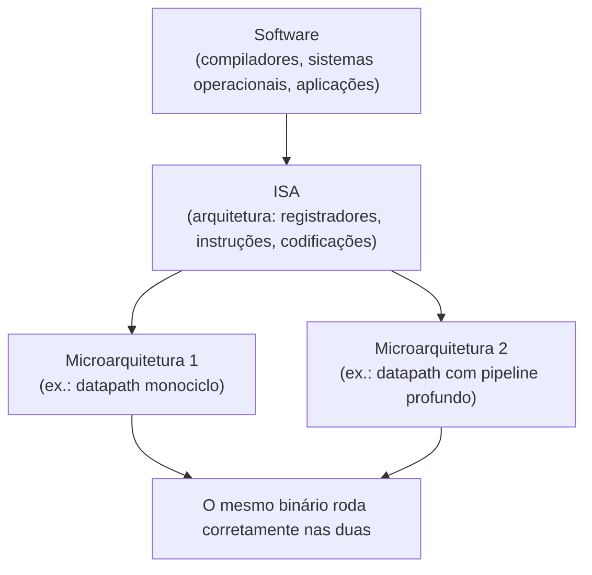

## Objetivos de Aprendizagem

- Definir uma arquitetura de conjunto de instruções (ISA) como o contrato preciso entre hardware e software, e listar as três coisas que ela precisa especificar: o estado visível ao programador, o conjunto de instruções e as codificações binárias.
- Explicar o que uma ISA deliberadamente NÃO especifica, e por que deixar os detalhes de implementação sem especificação é a fonte do seu valor.
- Distinguir arquitetura (ISA) de microarquitetura, e classificar propriedades específicas de processadores como pertencentes a uma ou à outra.
- Explicar como a compatibilidade binária entre gerações de chips decorre diretamente de uma ISA estável, e por que isso permite que as equipes de hardware e de software evoluam de forma independente.
- Resumir as filosofias de projeto RISC e CISC como duas respostas diferentes à pergunta de como o contrato da ISA deve ser escrito, sem tratar nenhuma delas como estritamente superior.
- Descrever como os tópicos anteriores desta disciplina (portas, a ULA, memória) existem para implementar uma ISA, enquanto os tópicos posteriores (montadores, compiladores, sistemas operacionais) existem para ter uma ISA como alvo.

## Contexto e Motivação

Toda camada de um sistema computacional, de uma porta lógica a uma aplicação web, é construída sobre alguma interface acordada que permite às camadas de cima parar de se preocupar com as de baixo. A arquitetura de conjunto de instruções é a interface de maior consequência de toda essa pilha: é a linha traçada entre o hardware, que precisa implementar fisicamente cada instrução com transistores, fios e armazenamento com clock, e o software, que é escrito, compilado e distribuído só com uma promessa sobre o que essas instruções fazem, nunca uma descrição de como elas são executadas. Harris & Harris, em *Digital Design and Computer Architecture, RISC-V Edition*, enquadram isso precisamente como um contrato: a ISA especifica tudo o que um programador de linguagem de máquina precisa saber para escrever um programa correto, e nada mais. Esse "nada mais" não é uma lacuna na especificação; é o motivo inteiro de existir uma.

Por que uma disciplina que começa pelas portas booleanas e sobe pela ULA e pela memória precisa parar e definir um contrato antes de construir uma CPU? Porque, sem ele, não há como responder à pergunta "este hardware roda corretamente este programa?". Um projeto de CPU só faz sentido em relação a alguma ISA que ele afirma implementar: você não consegue verificar um datapath nem raciocinar sobre desempenho sem antes fixar exatamente quais operações a máquina promete suportar e exatamente o que cada uma faz. Este conceito explica por que o contrato existe e que forma ele assume em geral; o próximo conceito fixa a ISA didática exata e concreta (um pequeno conjunto de instruções no estilo RISC-V) que todo datapath e toda unidade de controle restantes desta disciplina serão construídos para executar.

O retorno de acertar o contrato da ISA é enorme e quase invisível para os usuários finais. Um programa compilado para uma dada ISA em 1995 pode, em princípio, ainda rodar corretamente num chip fabricado décadas depois, mesmo que a implementação interna tenha mudado a ponto de ficar quase irreconhecível: números de transistores, velocidades de clock, hierarquias de cache e profundidades de pipeline diferentes. Isso é a compatibilidade binária, e é o motivo de as empresas de hardware conseguirem vender "a mesma" família de processadores por décadas enquanto reprojetam completamente o silício por baixo a cada poucos anos, e de as empresas de software conseguirem distribuir um único binário que roda em milhões de máquinas físicas diferentes que elas nunca vão ver nem controlar.

## Teoria Central

### As três coisas que uma ISA precisa especificar

Uma ISA é uma especificação, e seu valor vem de ser precisa o bastante para que duas equipes independentes (uma construindo hardware, outra escrevendo software) consigam trabalhar a partir dela sem nunca conversar entre si e ainda assim produzir juntas um sistema que funciona. Concretamente, uma ISA especifica três coisas:

1. **Estado visível ao programador.** O conjunto de locais de armazenamento que um programa pode ler e escrever: o banco de registradores (quantos registradores, qual a largura de cada um), o modelo de memória (como a memória é endereçada, qual o tamanho de uma palavra, a ordem dos bytes) e o contador de programa (qual instrução executa em seguida). Tudo o que um programa em execução consegue observar ou modificar por meio de instruções comuns conta como estado visível ao programador.
2. **O conjunto de instruções e sua semântica exata.** A lista completa de operações que a máquina promete suportar (aritmética, lógica, movimentação de dados, fluxo de controle), junto com uma descrição exata e sem ambiguidade do que cada uma faz com o estado visível ao programador. A especificação precisa responder a todo caso extremo em que um compilador ou um programador assembly possa esbarrar, incluindo overflow, divisão por zero e acesso a memória fora da faixa.
3. **Codificações binárias.** Cada instrução recebe um padrão de bits específico, para que um programa possa ser guardado na memória como números puros e interpretado corretamente como instruções quando buscado. A codificação é o que permite a um montador traduzir o texto assembly com mnemônicos nos bytes de fato carregados na memória e executados.

### O que uma ISA deliberadamente omite

Tão importante quanto o que uma ISA especifica é o que ela deixa completamente em aberto. Uma ISA nunca especifica quantos ciclos de clock uma instrução leva, se a máquina executa instruções uma de cada vez ou várias ao mesmo tempo, qual o tamanho de alguma cache interna, qual a profundidade do pipeline ou em que frequência de clock o chip roda. Tudo isso são questões de implementação, e uma ISA bem projetada é, por construção, indiferente à implementação: um programa escrito contra a ISA precisa produzir os mesmos resultados visíveis ao programador, sejam quais forem as escolhas de implementação do projetista do chip.

Essa omissão é deliberada, não um descuido. Se a ISA especificasse detalhes de implementação, qualquer mudança nesses detalhes (digamos, um pipeline mais longo para rodar a uma frequência de clock maior) quebraria todo programa que passasse a depender da temporização ou da estrutura interna antigas. Ao se recusar a especificar a implementação, a ISA dá aos projetistas de hardware liberdade total para melhorar o desempenho, reduzir o consumo de energia ou encolher o tamanho do chip, geração após geração, sem obrigar o software existente a ser reescrito.

### Arquitetura vs microarquitetura

Essa distinção tem um nome padrão: **arquitetura** (a ISA, o contrato) versus **microarquitetura** (uma implementação específica de hardware desse contrato). Dois processadores podem implementar exatamente a mesma ISA com microarquiteturas radicalmente diferentes (profundidades de pipeline, tamanhos e hierarquias de cache, velocidades de clock e técnicas diferentes para extrair paralelismo em nível de instrução), e os dois vão rodar exatamente os mesmos binários compilados e produzir exatamente os mesmos resultados visíveis ao programador, diferindo só em quão rápido ou quão eficientemente chegam lá.



A área de conhecimento de Arquitetura e Organização do CS2013 trata essa separação entre arquitetura e microarquitetura como uma das ideias fundamentais de toda a área, porque quase todo tópico subsequente (pipelining, caching, execução superescalar) é corretamente entendido como uma técnica microarquitetural para implementar uma ISA fixa mais rapidamente, e não como uma mudança na própria ISA.

### Por que o contrato compensa: compatibilidade binária e evolução independente

Como a ISA é a única coisa da qual o software pode depender, as equipes de hardware ficam livres para reprojetar a microarquitetura a cada nova geração de chip (pipelines mais profundos, caches maiores, predição de desvios mais esperta) sem quebrar o software compilado existente, desde que o novo chip continue implementando corretamente a mesma ISA. De forma simétrica, as equipes de software podem ter a ISA como alvo uma vez e confiar que seu resultado vai rodar corretamente em todo chip atual e futuro que a implemente, sem saber nada sobre profundidade de pipeline ou tamanho de cache. Essa independência mútua é o que permite que as indústrias de hardware e de software funcionem como negócios separados que, ainda assim, produzem um único sistema que funciona.

### RISC vs CISC: duas respostas para a mesma pergunta de projeto

Nem toda ISA responde do mesmo jeito à pergunta "quão grande e quão regular deve ser o conjunto de instruções". Os projetos **CISC** (Complex Instruction Set Computer), historicamente exemplificados pelo x86, favorecem um conjunto de instruções grande e irregular, com codificações de comprimento variável e instruções que fazem muito trabalho cada uma, incluindo instruções que conseguem ler da memória, calcular e escrever de volta na memória num único passo. Os projetos **RISC** (Reduced Instruction Set Computer), exemplificados por RISC-V, MIPS e ARM, favorecem um conjunto de instruções pequeno e regular, com codificações de comprimento fixo e uma disciplina load-store estrita, em que as instruções comuns de aritmética e lógica só operam sobre registradores, e só instruções dedicadas de load e store tocam a memória.

Nenhuma das filosofias é simplesmente "melhor" em abstrato; cada uma representa um trade-off diferente. Um conjunto de instruções maior e mais rico pode permitir que um compilador emita menos instruções para um dado programa, ao custo de um decodificador e de uma unidade de controle mais complexos. Um conjunto de instruções pequeno e regular torna o hardware de busca, decodificação e execução drasticamente mais simples de projetar, verificar e colocar em pipeline de forma eficiente, ao custo de às vezes precisar de mais instruções por tarefa. Esta disciplina caminha para uma pequena ISA didática no estilo RISC justamente porque sua regularidade torna viável implementá-la por completo, das portas até um datapath funcional, dentro de um único curso.

### Tudo abaixo implementa a ISA; tudo acima a tem como alvo

Todo tópico visto antes nesta disciplina (portas lógicas, a ULA, organização da memória) existe com um único propósito: fornecer os meios físicos para implementar corretamente as instruções de uma ISA e guardar seu estado visível ao programador. Todo tópico que virá depois que a ISA for definida (formatos de instrução, o datapath, a unidade de controle e, no fim, montadores, compiladores e sistemas operacionais) existe ou para implementar esse mesmo contrato em hardware, ou para produzir programas que o tenham corretamente como alvo. A ISA é o pivô: é ao mesmo tempo o último conceito voltado puramente para o hardware e o primeiro voltado puramente para o software.

## Exemplos Resolvidos

### Exemplo 1: compilando `a = b + c` até operações em nível de ISA

Considere uma única linha de código-fonte em C:

```text
a = b + c;
```

Um compilador que traduz essa instrução não precisa saber nada sobre a profundidade do pipeline, o tamanho da cache ou a velocidade de clock da máquina alvo; ele só precisa conhecer a ISA. No nível da ISA, antes de escolher qualquer codificação concreta, essa instrução se decompõe numa curta sequência de operações abstratas:

```text
1. carregue o valor de b da memória para um registrador
2. carregue o valor de c da memória para um registrador
3. some os dois valores de registrador, produzindo um resultado
4. guarde o resultado no local de memória de a
```

Repare no que está e no que não está decidido neste nível. Está decidido que a máquina tem registradores, que a aritmética acontece sobre valores de registradores e não diretamente sobre a memória, e que são necessárias operações separadas de load e store para mover dados entre memória e registradores; essa é a disciplina load-store central nas ISAs no estilo RISC, e ela será definida com precisão como parte da ISA didática desta disciplina. Não está decidido quais números de registradores específicos são usados, quantos ciclos de clock cada passo leva, nem se o hardware subjacente executa esses quatro passos um depois do outro ou sobrepostos com as instruções vizinhas num pipeline. É exatamente a fronteira entre arquitetura e microarquitetura em ação: a saída do compilador é fixada pela ISA, enquanto a temporização e a estratégia interna de execução ficam inteiramente a cargo da microarquitetura que executar o programa resultante.

### Exemplo 2: duas microarquiteturas, uma ISA, um binário

Suponha que dois projetos de processador diferentes afirmem implementar exatamente a mesma ISA:

```text
Máquina A: datapath monociclo
  - Toda instrução, seja qual for o tipo, leva exatamente um ciclo de clock (longo)
    para buscar, decodificar, executar e escrever de volta seu resultado.
  - Lógica de controle simples; frequência de clock baixa, porque o ciclo precisa
    ser longo o bastante para a instrução mais lenta terminar.

Máquina B: datapath com pipeline
  - Cada instrução é dividida em estágios (busca, decodificação, execução, memória,
    write-back) e várias instruções ficam em estágios diferentes ao mesmo tempo,
    como numa linha de montagem.
  - Frequência de clock muito maior, já que cada estágio só precisa completar um
    pequeno pedaço de trabalho por ciclo; lógica de controle mais complexa para
    gerenciar sobreposições e paradas.
```

As duas máquinas implementam exatamente a mesma ISA: mesmos registradores, mesmas instruções, mesmas codificações. Compile um programa uma vez, e o binário resultante (uma sequência fixa de codificações de instruções) pode ser carregado na memória de qualquer uma das máquinas e executado corretamente, produzindo conteúdos finais de registradores e memória idênticos. A Máquina B muito provavelmente vai terminar mais rápido, já que o pipeline permite começar instruções novas antes que as antigas terminem por completo. Mas essa diferença de velocidade é inteiramente uma propriedade microarquitetural; nada na ISA ou no binário precisou mudar entre as duas máquinas. É precisamente por isso que uma empresa de software consegue distribuir um único binário e confiar que ele vai rodar (corretamente, ainda que nem sempre com a mesma rapidez) em toda implementação conforme da ISA, presente ou futura.

### Exemplo 3: classificando propriedades como ISA ou microarquitetura

Dada a seguinte lista de propriedades de processadores, classifique cada uma como pertencente à ISA (arquitetura) ou a uma implementação específica (microarquitetura):

```text
Propriedade                              Classificação
---------------------------------------  ------------------
Número de registradores visíveis ao      ISA
  programador
Tamanho da cache de instruções           Microarquitetura
Profundidade do pipeline de instruções   Microarquitetura
Padrão de bits usado para codificar      ISA
  cada instrução
Frequência de clock (ex.: 3.2 GHz)       Microarquitetura
```

O padrão a notar: tudo o que um programa em linguagem de máquina consegue observar diretamente pelas suas instruções (quantos registradores existem, qual padrão de bits codifica o `add`, o que cada instrução faz) faz parte da ISA e precisa ser idêntico em toda implementação conforme. Tudo o que só afeta quão rápido ou quão eficientemente a máquina chega à resposta correta (tamanho de cache, profundidade de pipeline, frequência de clock) é uma escolha microarquitetural que pode variar livremente entre implementações, até entre chips vendidos sob o mesmo nome de família de processadores, sem jamais ser visível a um software escrito corretamente.

## Equívocos Comuns e Armadilhas

- **"Uma velocidade de clock maior ou mais cache significam uma ISA diferente e melhor."** Velocidade de clock e tamanho de cache são propriedades microarquiteturais, não fazem parte da ISA. Dois chips podem implementar exatamente a mesma ISA com velocidades de clock e hierarquias de cache completamente diferentes; só a microarquitetura mudou, e qualquer binário compilado corretamente continua rodando corretamente nos dois.
- **"A ISA diz como o hardware funciona por dentro."** Ela deliberadamente não diz. A ISA especifica só o comportamento visível ao programador (que estado existe e o que cada instrução faz com ele) e não diz nada sobre pipeline, barramentos internos ou temporização. Essas perguntas pertencem inteiramente à microarquitetura, e implementações diferentes da mesma ISA são livres para respondê-las de formas diferentes.
- **"RISC é sempre mais rápido que CISC, ou vice-versa."** Nenhuma das filosofias é incondicionalmente superior; cada uma troca simplicidade do compilador e densidade de código por complexidade do decodificador e da unidade de controle de um jeito diferente. Chips CISC modernos de alto desempenho costumam traduzir instruções complexas em operações internas mais simples antes da execução, borrando a distinção prática de desempenho.
- **"Se dois chips têm a mesma ISA, seu software precisa rodar com a mesma rapidez."** A compatibilidade binária garante correção idêntica dos resultados, não desempenho idêntico. Duas implementações conformes da mesma ISA podem diferir enormemente em velocidade, consumo de energia e custo, já que nenhuma dessas propriedades faz parte do que a ISA especifica.
- **"Uma ISA é só uma linguagem assembly."** O texto assembly e a codificação de máquina fazem ambos parte da especificação da ISA, mas a ISA é mais ampla que os dois: ela também especifica o estado visível ao programador (registradores, modelo de memória, contador de programa) e a semântica precisa de cada instrução, e não só como as instruções são escritas ou soletradas em binário.
- **"Toda instrução que a ISA descreve precisa ser implementada diretamente por hardware dedicado."** Algumas ISAs CISC especificam instruções que uma dada implementação de fato executa internamente como uma curta sequência de micro-operações mais simples. O que a ISA garante é o resultado visível ao programador, e não que o hardware tenha um circuito físico por instrução.

## Resumo

Uma arquitetura de conjunto de instruções é o contrato preciso, e indiferente à implementação, entre hardware e software: ela fixa o estado visível ao programador (registradores, modelo de memória, contador de programa), o conjunto completo de instruções com semântica exata e as codificações binárias usadas para guardar as instruções na memória, sem dizer nada sobre como qualquer parte disso é implementada internamente; essa separação, formalizada como arquitetura versus microarquitetura, viabiliza a compatibilidade binária entre gerações de chips e permite que as equipes de hardware e de software evoluam de forma independente. RISC e CISC representam duas respostas diferentes, e defensáveis, sobre quão rico ou quão mínimo esse conjunto de instruções deve ser, e esta disciplina escolhe o caminho RISC pela sua regularidade e facilidade de construção. Tudo o que foi visto antes nesta disciplina (portas, a ULA, memória) existe para implementar uma ISA; tudo o que for visto daqui em diante existe para ter uma como alvo. O próximo conceito torna isso concreto, definindo a ISA didática exata e pequena (um conjunto de instruções no estilo RISC-V com um banco de registradores fixo, um punhado de instruções aritméticas e lógicas, loads, stores e um desvio condicional) que o datapath e a unidade de controle do resto desta disciplina serão construídos para executar.

## Documentation Links

- [ACM/IEEE CS2013: Architecture and Organization Knowledge Area](https://csed.acm.org/knowledge-areas-architecture-and-organization-ar-cs2013-version/): diretrizes curriculares que estabelecem a distinção entre arquitetura e microarquitetura e os conceitos de conjunto de instruções como fundamentais para Arquitetura e Organização.
- [Harris & Harris: Digital Design and Computer Architecture, RISC-V Edition](https://shop.elsevier.com/books/digital-design-and-computer-architecture-risc-v-edition/harris/978-0-12-820064-3): livro que enquadra a ISA como o contrato entre hardware e software e constrói uma implementação RISC-V completa a partir desse ponto de partida.
