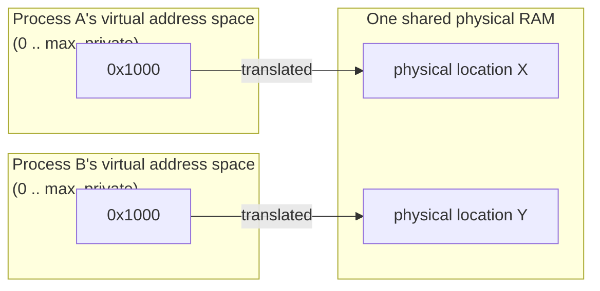

## Learning Objectives

- Define an address space as the OS-maintained illusion that each process has its own private, contiguous memory starting at address zero.
- Distinguish a virtual address (what a running program actually uses) from a physical address (where data actually lives in RAM).
- Explain why this illusion is what protects one process's memory from another's, and connect it to the process address space layout already covered in this platform's `c-and-assembly` discipline.
- Explain why virtualizing memory, alongside virtualizing the CPU already covered in this discipline, is one of the OS's two foundational jobs.

## Context & Motivation

This platform's `computer/c-and-assembly` discipline already walked through a process's address space from the inside — code, stack, heap, laid out as a single-process program would see it. That discipline treated this layout as a given fact about how a running C program's memory is organized. This concept asks the question that discipline deliberately left open: how does the OS actually make this private, seemingly exclusive layout exist for *every* process simultaneously, on the same shared physical RAM, without any process's memory colliding with another's?

The answer is **memory virtualization** — the second of the OS's two foundational virtualization jobs, alongside CPU virtualization already covered in this discipline's first cluster. Just as the OS gives each process the illusion of its own CPU by rapidly time-sharing one physical CPU among many processes, it gives each process the illusion of its own private, contiguous address space by translating that process's memory references onto whatever physical memory is actually available — and, critically, only onto memory that process is actually allowed to touch.

## Core Theory

### Virtual addresses vs. physical addresses

Every address a running program uses — the address of a local variable, the target of a pointer, the location of a heap-allocated block — is a **virtual address**: a location within that process's own private address space, starting conventionally at address 0 and extending up to some maximum, entirely independent of where the data actually lives in physical RAM. The OS (with hardware assistance, covered starting with the next concept) translates every virtual address into a **physical address** — the real location in RAM — transparently, so the running program never needs to know or care about the translation happening underneath it.



Notice that both processes can use the identical virtual address `0x1000` — each process's `0x1000` is translated independently, landing on entirely different physical memory. This is precisely how two processes can each believe they have exclusive access starting at address zero, while never actually colliding in real RAM.

### Why this is protection, not just convenience

Because a process only ever specifies virtual addresses, and the OS controls the translation from virtual to physical, a process has no way to construct a virtual address that maps to another process's physical memory — the translation mechanism itself is the enforcement boundary. A bug in one process (a wild pointer, an out-of-bounds array write — exactly the kind of bug this platform's `c-and-assembly` discipline covered as common memory bugs) can corrupt that process's *own* memory, but cannot reach across into a different process's physical memory, because the translation for that process's virtual addresses was never set up to reach there. This is the concrete mechanism behind an intuition every programmer eventually develops — "one program crashing doesn't usually crash unrelated programs" — made precise.

### Connecting back to the address space layout already covered

The `c-and-assembly` discipline's coverage of a process's code, stack, and heap segments described the layout *within* one process's private address space — this concept explains what makes that address space private and exclusive-seeming in the first place, even though the underlying physical RAM is shared among every process on the machine. Nothing about the earlier layout material changes; this concept supplies the missing piece underneath it: the OS-maintained illusion that makes "my own private address space starting at 0" true for every process at once.

### Memory virtualization as the second foundational job

Alongside CPU virtualization (time-sharing one CPU among many processes, covered earlier in this discipline), memory virtualization is the OS's other foundational responsibility — together, they are what make the process abstraction from this discipline's very first concept actually deliver on its promise: a process gets the illusion of its own CPU (via scheduling) and the illusion of its own private memory (via address translation), even though the underlying hardware is one shared CPU (or a handful of cores) and one shared bank of physical RAM.

## Worked Examples

### Example 1: Two processes, identical virtual addresses, different physical memory

```text
Process A's code has:  int *p = malloc(4);  // p happens to be 0x00401000
Process B's code has:  int *q = malloc(4);  // q also happens to be 0x00401000

Despite A's p and B's q holding the IDENTICAL virtual address value,
writing through p in process A and writing through q in process B
affect completely different physical memory locations -- the OS's
translation for A's 0x00401000 and B's 0x00401000 point to entirely
different physical RAM.
```

Neither process can observe the other's write, and neither process needs to know or care that the "same" address, numerically, is in use elsewhere — the illusion of an exclusive address space starting at 0 holds for both simultaneously.

### Example 2: Why a wild pointer in one process can't corrupt another

```c
// Process A, buggy code (the kind covered in c-and-assembly's
// "Common Memory Bugs" concept)
int *bad_ptr = (int *)0xDEADBEEF;   // some essentially arbitrary virtual address
*bad_ptr = 42;                       // dereference and write
```

This write uses the *virtual* address `0xDEADBEEF` — it is still subject to translation before touching any real memory. If that virtual address happens to fall outside any region the OS has actually mapped for process A, the hardware and OS detect this (an invalid access, typically resulting in a segmentation fault, terminating A) rather than allowing the write to land on some arbitrary, unrelated physical location that might belong to a different process. The bug can crash process A; it structurally cannot reach into process B's physical memory, because A's virtual addresses are never translated into B's physical region at all.

### Example 3: The illusion, stated precisely

```text
What each process believes:        What is actually true:
  "I have my own private memory      One shared physical RAM exists.
   starting at address 0, and         The OS decides which physical
   nothing else can touch it."        locations each process's virtual
                                       addresses translate to, and never
                                       lets two processes' translations
                                       overlap (barring deliberate,
                                       explicitly-requested sharing).
```

This is the exact same pattern as CPU virtualization from earlier in this discipline: an illusion of exclusive access to a shared physical resource, maintained by OS-controlled indirection (scheduling for the CPU, address translation for memory) rather than by the resource actually being partitioned into physically separate pieces per process.

## Common Misconceptions & Pitfalls

- **"A pointer's numeric value tells you where data actually lives in RAM."** A pointer holds a *virtual* address, meaningful only within its own process's address space — the same numeric value in two different processes almost certainly refers to two entirely different physical memory locations, as Example 1 shows.
- **"Memory virtualization is only about making programming more convenient (not needing to manage physical addresses by hand)."** It is also, and arguably primarily, a *protection* mechanism — the translation boundary is what prevents one process's bugs or malicious code from directly touching another process's physical memory, as Example 2 shows concretely.
- **"The address-space layout already covered in `c-and-assembly` (code, stack, heap) is a physical memory layout."** That layout describes the organization *within* one process's private virtual address space — this concept is what explains how that seemingly private, exclusive space is actually implemented on top of physical RAM shared among every process on the machine.
- **"CPU virtualization and memory virtualization are unrelated OS features."** They are the two halves of the same foundational job — together, they are precisely what makes the process abstraction (introduced at the very start of this discipline) deliver its promise of "each process gets its own CPU and its own memory," even though both are really shared, finite physical resources underneath.

## Summary

An address space is the OS-maintained illusion that each process has its own private, contiguous memory starting at address zero — achieved by translating every **virtual address** a process uses into a **physical address** in real, shared RAM, transparently and independently per process. This translation boundary is what makes two processes safely use identical-looking virtual addresses without colliding, and what prevents a buggy pointer in one process from ever reaching into another process's physical memory, since the buggy process's translations were simply never set up to reach there. This concept builds directly on the address-space layout (code, stack, heap) already covered from the inside in this platform's `c-and-assembly` discipline, now explaining the OS-level mechanism that makes that layout private and protected in the first place — memory virtualization, alongside the CPU virtualization already covered earlier in this discipline, together deliver on the process abstraction's original promise. The next several concepts open up exactly how this translation is actually implemented, starting with the simplest possible hardware support: a base and a bound.

## Documentation Links

- [Arpaci-Dusseau — Operating Systems: Three Easy Pieces, "Address Spaces"](https://pages.cs.wisc.edu/~remzi/OSTEP/vm-intro.pdf) — the canonical treatment of address spaces and memory virtualization this concept is built from.
- [ACM/IEEE CS2013 — Operating Systems Knowledge Area](https://csed.acm.org/knowledge-areas-operating-systems-os-cs2013-version/) — curriculum guidelines establishing virtual memory and address-space isolation as core Operating Systems content.
