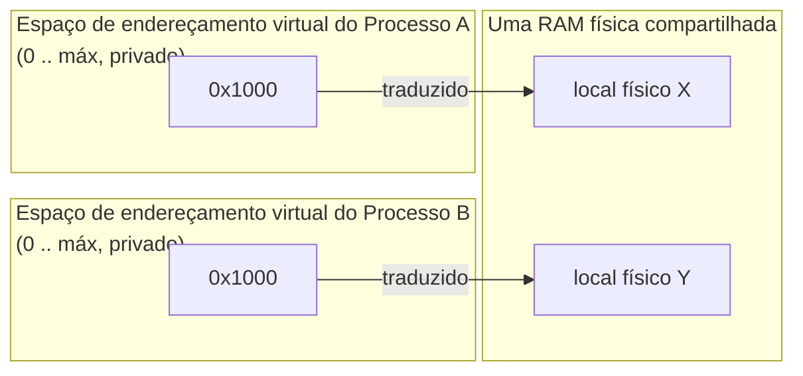

## Objetivos de Aprendizagem

- Definir um espaço de endereçamento como a ilusão, mantida pelo SO, de que cada processo tem sua própria memória privada e contígua começando no endereço zero.
- Distinguir um endereço virtual (o que um programa em execução de fato usa) de um endereço físico (onde os dados de fato ficam na RAM).
- Explicar por que essa ilusão é o que protege a memória de um processo da de outro, e ligá-la ao layout do espaço de endereçamento de um processo já visto na disciplina `c-and-assembly` desta plataforma.
- Explicar por que virtualizar a memória, junto com a virtualização da CPU já vista nesta disciplina, é um dos dois trabalhos fundamentais do SO.

## Contexto e Motivação

A disciplina `computer/c-and-assembly` desta plataforma já percorreu o espaço de endereçamento de um processo por dentro: código, pilha e heap, dispostos como um programa de um único processo os veria. Aquela disciplina tratou esse layout como um fato dado sobre como a memória de um programa C em execução é organizada. Este conceito faz a pergunta que aquela disciplina deixou em aberto de propósito: como o SO faz de fato esse layout privado e aparentemente exclusivo existir para *todo* processo ao mesmo tempo, na mesma RAM física compartilhada, sem que a memória de um processo colida com a de outro?

A resposta é a **virtualização de memória**: o segundo dos dois trabalhos fundamentais de virtualização do SO, ao lado da virtualização da CPU já vista no primeiro bloco desta disciplina. Assim como o SO dá a cada processo a ilusão de ter sua própria CPU, compartilhando rapidamente no tempo uma CPU física entre muitos processos, ele dá a cada processo a ilusão de ter seu próprio espaço de endereçamento privado e contíguo, traduzindo as referências de memória desse processo para a memória física que estiver de fato disponível e, crucialmente, só para memória que esse processo tem permissão de tocar.

## Teoria Central

### Endereços virtuais vs. endereços físicos

Todo endereço que um programa em execução usa (o endereço de uma variável local, o alvo de um ponteiro, a localização de um bloco alocado no heap) é um **endereço virtual**: um local dentro do espaço de endereçamento privado daquele processo, começando por convenção no endereço 0 e indo até algum máximo, totalmente independente de onde os dados de fato ficam na RAM física. O SO (com ajuda do hardware, vista a partir do próximo conceito) traduz todo endereço virtual num **endereço físico** (o local real na RAM) de forma transparente, de modo que o programa em execução nunca precisa saber nem se importar com a tradução acontecendo por baixo dele.



Repare que os dois processos podem usar o mesmíssimo endereço virtual `0x1000`: o `0x1000` de cada processo é traduzido de forma independente e cai em memória física totalmente diferente. É precisamente assim que dois processos podem cada um acreditar que têm acesso exclusivo a partir do endereço zero, sem nunca colidir de fato na RAM real.

### Por que isso é proteção, e não só conveniência

Como um processo só especifica endereços virtuais, e o SO controla a tradução de virtual para físico, um processo não tem como construir um endereço virtual que corresponda à memória física de outro processo: o próprio mecanismo de tradução é a fronteira de proteção. Um bug num processo (um ponteiro perdido, uma escrita fora dos limites de um array, exatamente o tipo de bug que a disciplina `c-and-assembly` desta plataforma tratou como bugs de memória comuns) pode corromper a *própria* memória desse processo, mas não consegue alcançar a memória física de outro processo, porque a tradução dos endereços virtuais daquele processo nunca foi configurada para chegar lá. Esse é o mecanismo concreto por trás de uma intuição que todo programador acaba desenvolvendo ("um programa travando normalmente não derruba programas não relacionados"), tornada precisa.

### Ligando de volta ao layout do espaço de endereçamento já visto

O tratamento dos segmentos de código, pilha e heap de um processo na disciplina `c-and-assembly` descreveu o layout *dentro* do espaço de endereçamento privado de um processo; este conceito explica o que torna esse espaço de endereçamento privado e aparentemente exclusivo, mesmo que a RAM física subjacente seja compartilhada entre todos os processos da máquina. Nada no material de layout anterior muda; este conceito fornece a peça que faltava por baixo dele: a ilusão, mantida pelo SO, que torna "meu próprio espaço de endereçamento privado começando em 0" verdade para todo processo ao mesmo tempo.

### A virtualização de memória como o segundo trabalho fundamental

Ao lado da virtualização da CPU (compartilhar no tempo uma CPU entre muitos processos, visto antes nesta disciplina), a virtualização de memória é a outra responsabilidade fundamental do SO; juntas, elas são o que faz a abstração de processo do primeiríssimo conceito desta disciplina cumprir de fato sua promessa: um processo recebe a ilusão de ter sua própria CPU (pelo escalonamento) e a ilusão de ter sua própria memória privada (pela tradução de endereços), mesmo que o hardware subjacente seja uma CPU compartilhada (ou um punhado de núcleos) e um único banco compartilhado de RAM física.

## Exemplos Resolvidos

### Exemplo 1: dois processos, endereços virtuais idênticos, memória física diferente

```text
O código do Processo A tem:  int *p = malloc(4);  // p por acaso vale 0x00401000
O código do Processo B tem:  int *q = malloc(4);  // q também vale 0x00401000

Apesar de p em A e q em B guardarem o MESMO valor de endereço virtual,
escrever por p no processo A e escrever por q no processo B afeta
locais de memória física completamente diferentes: a tradução do SO
para o 0x00401000 de A e para o 0x00401000 de B aponta para regiões
totalmente diferentes da RAM física.
```

Nenhum dos processos consegue observar a escrita do outro, e nenhum precisa saber nem se importar que o "mesmo" endereço, numericamente, está em uso em outro lugar: a ilusão de um espaço de endereçamento exclusivo começando em 0 vale para os dois ao mesmo tempo.

### Exemplo 2: por que um ponteiro perdido num processo não consegue corromper outro

```c
// Processo A, código com bug (o tipo visto no conceito
// "Bugs de Memória Comuns" de c-and-assembly)
int *bad_ptr = (int *)0xDEADBEEF;   // um endereço virtual essencialmente arbitrário
*bad_ptr = 42;                       // desreferencia e escreve
```

Essa escrita usa o endereço *virtual* `0xDEADBEEF`: ela continua sujeita à tradução antes de tocar qualquer memória real. Se esse endereço virtual cair fora de qualquer região que o SO de fato mapeou para o processo A, o hardware e o SO detectam isso (um acesso inválido, que normalmente resulta numa falha de segmentação e encerra A), em vez de deixar a escrita cair em algum local físico arbitrário e não relacionado que poderia pertencer a outro processo. O bug pode derrubar o processo A; estruturalmente, ele não consegue alcançar a memória física do processo B, porque os endereços virtuais de A nunca são traduzidos para a região física de B.

### Exemplo 3: a ilusão, enunciada com precisão

```text
O que cada processo acredita:        O que é de fato verdade:
  "Tenho minha própria memória         Existe uma única RAM física compartilhada.
   privada começando no endereço 0,    O SO decide para quais locais físicos
   e nada mais pode tocá-la."          os endereços virtuais de cada processo
                                       são traduzidos, e nunca deixa as
                                       traduções de dois processos se
                                       sobreporem (salvo compartilhamento
                                       deliberado e pedido explicitamente).
```

É exatamente o mesmo padrão da virtualização da CPU vista antes nesta disciplina: uma ilusão de acesso exclusivo a um recurso físico compartilhado, mantida por uma indireção controlada pelo SO (escalonamento para a CPU, tradução de endereços para a memória), e não pelo recurso estar de fato dividido em pedaços fisicamente separados por processo.

## Equívocos Comuns e Armadilhas

- **"O valor numérico de um ponteiro diz onde os dados de fato ficam na RAM."** Um ponteiro guarda um endereço *virtual*, que só tem significado dentro do espaço de endereçamento do seu próprio processo; o mesmo valor numérico em dois processos diferentes quase certamente se refere a dois locais de memória física totalmente diferentes, como o Exemplo 1 mostra.
- **"A virtualização de memória serve só para tornar a programação mais conveniente (não precisar gerenciar endereços físicos à mão)."** Ela é também, e talvez principalmente, um mecanismo de *proteção*: a fronteira da tradução é o que impede que os bugs ou o código malicioso de um processo toquem diretamente a memória física de outro, como o Exemplo 2 mostra de forma concreta.
- **"O layout do espaço de endereçamento já visto em `c-and-assembly` (código, pilha, heap) é um layout de memória física."** Esse layout descreve a organização *dentro* do espaço de endereçamento virtual privado de um processo; este conceito é o que explica como esse espaço aparentemente privado e exclusivo é de fato implementado sobre a RAM física compartilhada entre todos os processos da máquina.
- **"A virtualização da CPU e a virtualização de memória são recursos do SO sem relação."** Elas são as duas metades do mesmo trabalho fundamental; juntas, são precisamente o que faz a abstração de processo (apresentada no comecinho desta disciplina) cumprir sua promessa de "cada processo recebe sua própria CPU e sua própria memória", mesmo que ambas sejam, por baixo, recursos físicos compartilhados e finitos.

## Resumo

Um espaço de endereçamento é a ilusão, mantida pelo SO, de que cada processo tem sua própria memória privada e contígua começando no endereço zero, obtida traduzindo cada **endereço virtual** que um processo usa num **endereço físico** na RAM real e compartilhada, de forma transparente e independente por processo. Essa fronteira de tradução é o que permite que dois processos usem com segurança endereços virtuais de aparência idêntica sem colidir, e o que impede que um ponteiro com bug num processo alcance a memória física de outro, já que as traduções do processo com bug simplesmente nunca foram configuradas para chegar lá. Este conceito se constrói diretamente sobre o layout do espaço de endereçamento (código, pilha, heap) já visto por dentro na disciplina `c-and-assembly` desta plataforma, explicando agora o mecanismo em nível de SO que torna esse layout privado e protegido em primeiro lugar; a virtualização de memória, ao lado da virtualização da CPU vista antes nesta disciplina, cumpre a promessa original da abstração de processo. Os próximos conceitos abrem exatamente como essa tradução é implementada de fato, começando pelo suporte de hardware mais simples possível: uma base e um limite.

## Documentation Links

- [Arpaci-Dusseau: Operating Systems: Three Easy Pieces, "Address Spaces"](https://pages.cs.wisc.edu/~remzi/OSTEP/vm-intro.pdf): o tratamento canônico de espaços de endereçamento e virtualização de memória a partir do qual este conceito é construído.
- [ACM/IEEE CS2013: Operating Systems Knowledge Area](https://csed.acm.org/knowledge-areas-operating-systems-os-cs2013-version/): diretrizes curriculares que estabelecem a memória virtual e o isolamento de espaços de endereçamento como conteúdo central de Sistemas Operacionais.
