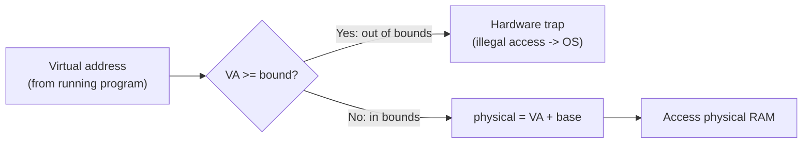

## Learning Objectives

- Describe the base-and-bound scheme: one register holding a process's starting physical location, another holding its size, used to translate and validate every memory access.
- Compute the physical address a given virtual address translates to, and determine whether a given virtual address is within bounds.
- Explain why base-and-bound requires hardware support (not pure software) to be fast enough for every single memory access.
- Identify base-and-bound's central limitation — one contiguous region per process — that motivates segmentation, the next concept.

## Context & Motivation

The previous concept established *what* address translation must achieve: every virtual address a process uses must be mapped to some physical address, transparently, in a way that keeps different processes from colliding. This concept covers the simplest possible mechanism that actually does this: **base-and-bound**, sometimes called dynamic relocation. It is not how modern systems implement virtual memory in full (paging, covered in a few concepts, is the real answer for that) — but working through this simplest case first makes the two essential ideas — relocation and bounds-checking — concrete before the added complexity of paging arrives.

## Core Theory

### The two hardware registers

Base-and-bound relies on two special-purpose CPU registers, set by the OS (a privileged operation) whenever it switches to running a given process:

- **Base register** — holds the physical address where this process's memory region actually starts in RAM.
- **Bound register** (sometimes called a limit register) — holds the size of this process's memory region.

Every single memory reference a running process makes — every instruction fetch, every data load or store — passes through hardware that automatically performs two things using these two registers, on every access, with no software intervention needed per access:

1. **Translation**: `physical address = virtual address + base`.
2. **Bounds check**: if `virtual address >= bound`, the access is illegal — the hardware raises an exception (trapping into the OS), rather than allowing the access to proceed.

### Why this needs to be hardware, not software

Doing this translation and check in software, on every single memory access a program makes, would be catastrophically slow — a running program can execute millions of memory operations per second, and adding an extra software-level check-and-add before each one would multiply the cost of literally every load and store. The base and bound registers are built directly into the CPU's memory-access hardware specifically so this translation and check happen automatically, in parallel with the access itself, adding effectively no perceptible overhead — the same design principle already seen in this platform's `computer/computer-architecture` discipline, where cache lookups also happen automatically in hardware rather than through explicit software checks on every access.



### Relocation: why "base" gives every process its own private starting point

Because the base register is set differently per process (the OS updates it on every context switch, exactly like the register-restoring step already covered for context switches in general), the *same* virtual address in two different processes translates to different physical addresses — this is precisely the mechanism underlying the previous concept's Example 1, where two processes both used virtual address `0x1000` and landed in entirely different physical memory. **Relocation** is the general name for this idea: a process's code and data can be placed anywhere in physical memory, with the base register handling the offset transparently, so the process's own code never needs to be written or compiled with any specific physical address in mind.

### Base-and-bound's central limitation

Base-and-bound treats a process's entire address space as one single, contiguous region — one base, one bound, covering everything from code to stack to heap as a single block. This has a serious practical cost: a process's code, heap, and stack rarely grow at similar rates or sit next to each other with no wasted space in between — a large gap left unused between a small heap and a small stack (both of which typically need room to grow) must still be reserved as part of the single contiguous region, wasted for the process's entire lifetime. This single-region rigidity is exactly what the next concept, segmentation, addresses by giving each logical piece of an address space (code, heap, stack) its own independent base and bound.

## Worked Examples

### Example 1: Translating a virtual address, step by step

Suppose the OS has set, for the currently running process: `base = 0x00100000`, `bound = 0x00010000` (a 64 KB region). The process references virtual address `0x00002000`:

```text
Step 1 (bounds check): is 0x00002000 >= bound (0x00010000)?  No -> legal
Step 2 (translation):  physical = virtual + base
                                 = 0x00002000 + 0x00100000
                                 = 0x00102000
```

The hardware performs both steps automatically for this single memory access, and the actual physical RAM access happens at `0x00102000` — a location the running process's own code never mentions or needs to know about.

### Example 2: An out-of-bounds access, caught by hardware

Same process (`base = 0x00100000`, `bound = 0x00010000`), but this time referencing virtual address `0x00020000` — larger than the bound:

```text
Step 1 (bounds check): is 0x00020000 >= bound (0x00010000)?  Yes -> ILLEGAL
```

The hardware traps immediately, before any translation or physical-memory access occurs — the OS's trap handler typically terminates the offending process (this is the mechanism behind a segmentation-fault-style crash, hardware-enforced, catching precisely the kind of out-of-bounds access already discussed as a common memory bug in this platform's `c-and-assembly` discipline, now shown from the OS's own enforcement side).

### Example 3: Relocation — the same process, run at a different base

Suppose the OS decides, on a later run, to load the identical process's code starting at a different physical location — `base = 0x00500000` instead of `0x00100000`, `bound` unchanged at `0x00010000`. The process's own code is completely unmodified; it still issues the identical virtual address `0x00002000`:

```text
Step 1 (bounds check): 0x00002000 >= 0x00010000? No -> legal (same as before)
Step 2 (translation):  physical = 0x00002000 + 0x00500000 = 0x00502000
```

The exact same virtual reference now lands at a completely different physical location, purely because the OS chose a different base value this time — the process's code required no changes at all, since it only ever deals in virtual addresses. This is relocation working exactly as intended: the OS is free to place a process's memory anywhere convenient in physical RAM.

## Common Misconceptions & Pitfalls

- **"Base-and-bound is how modern operating systems actually implement virtual memory."** It is the simplest possible scheme, useful for building the core ideas (translation, bounds-checking, relocation) before the added complexity of paging — real modern systems use paging (covered in a few concepts) specifically because base-and-bound's one-contiguous-region-per-process design wastes memory and lacks flexibility, as this concept's final section explains.
- **"The bounds check and the translation are two separate steps a program must trigger."** Both happen automatically, in hardware, for every single memory access a running program makes — the program's own code never explicitly requests or triggers either step; they are transparent to it entirely.
- **"An out-of-bounds virtual address might, by bad luck, still land on valid physical memory."** The bounds check happens strictly *before* any translation or physical access is attempted — an out-of-bounds virtual address is rejected outright by the hardware trap, never silently translated and allowed through.
- **"Relocation means physically moving a process's data in memory."** Relocation, in this context, means the OS can *choose* where a process's memory lives, transparently, by setting the base register appropriately — it does not require moving already-placed data (though a related, more advanced technique, swapping, covered later in this discipline, does involve genuinely moving data between memory and disk).

## Summary

Base-and-bound translation is the simplest hardware mechanism for virtualizing memory: one base register giving the physical starting location of a process's memory, one bound register giving its size, with hardware performing an automatic bounds check and address translation (`physical = virtual + base`) on every single memory access, fast enough to add no perceptible overhead. This single mechanism delivers both **relocation** — a process's code can run correctly regardless of where in physical memory the OS actually places it — and **protection** — an out-of-bounds virtual address is caught by hardware before it can touch memory outside the process's assigned region. Its central limitation is treating an entire address space as one contiguous block, wasting space between a process's logically distinct pieces (code, heap, stack) that don't grow at the same rate — exactly the gap the next concept, segmentation, closes by giving each such piece its own independent base and bound.

## Documentation Links

- [Arpaci-Dusseau — Operating Systems: Three Easy Pieces, "Mechanism: Address Translation"](https://pages.cs.wisc.edu/~remzi/OSTEP/vm-mechanism.pdf) — the canonical treatment of base-and-bound translation and hardware-enforced bounds checking this concept is built from.
- [UC Berkeley CS162 — Operating Systems and Systems Programming](https://cs162.org/) — course covering base-and-bound as the introductory mechanism for hardware-assisted address translation.
