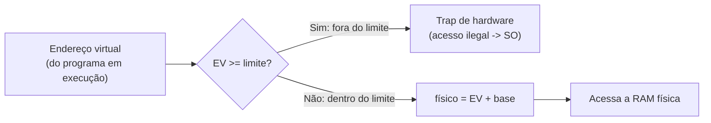

## Objetivos de Aprendizagem

- Descrever o esquema base e limite: um registrador guardando o local físico inicial de um processo e outro guardando seu tamanho, usados para traduzir e validar todo acesso à memória.
- Calcular o endereço físico para o qual um dado endereço virtual é traduzido, e determinar se um dado endereço virtual está dentro do limite.
- Explicar por que o base e limite exige suporte de hardware (e não software puro) para ser rápido o bastante em todo acesso à memória.
- Identificar a limitação central do base e limite (uma única região contígua por processo), que motiva a segmentação, o próximo conceito.

## Contexto e Motivação

O conceito anterior estabeleceu *o que* a tradução de endereços precisa alcançar: todo endereço virtual que um processo usa precisa ser mapeado em algum endereço físico, de forma transparente, de um jeito que impeça processos diferentes de colidir. Este conceito cobre o mecanismo mais simples possível que de fato faz isso: o **base e limite**, às vezes chamado de realocação dinâmica. Não é assim que os sistemas modernos implementam a memória virtual por completo (a paginação, vista daqui a alguns conceitos, é a resposta real para isso), mas trabalhar primeiro esse caso mais simples torna concretas as duas ideias essenciais (realocação e verificação de limites) antes de chegar a complexidade extra da paginação.

## Teoria Central

### Os dois registradores de hardware

O base e limite depende de dois registradores de CPU de propósito especial, configurados pelo SO (uma operação privilegiada) sempre que ele passa a rodar um dado processo:

- **Registrador base**: guarda o endereço físico onde a região de memória deste processo de fato começa na RAM.
- **Registrador limite** (às vezes chamado de registrador de limite superior): guarda o tamanho da região de memória deste processo.

Toda referência à memória que um processo em execução faz (toda busca de instrução, todo load ou store de dados) passa por hardware que faz automaticamente duas coisas usando esses dois registradores, em todo acesso, sem precisar de intervenção de software por acesso:

1. **Tradução**: `endereço físico = endereço virtual + base`.
2. **Verificação de limite**: se `endereço virtual >= limite`, o acesso é ilegal; o hardware levanta uma exceção (desviando para o SO), em vez de deixar o acesso prosseguir.

### Por que isso precisa ser hardware, e não software

Fazer essa tradução e essa verificação em software, em cada acesso à memória que um programa faz, seria catastroficamente lento: um programa em execução pode fazer milhões de operações de memória por segundo, e acrescentar uma verificação e uma soma extras em nível de software antes de cada uma multiplicaria o custo de literalmente todo load e store. Os registradores base e limite são construídos diretamente no hardware de acesso à memória da CPU justamente para que essa tradução e essa verificação aconteçam automaticamente, em paralelo com o próprio acesso, sem acrescentar sobrecarga perceptível; é o mesmo princípio de projeto já visto na disciplina `computer/computer-architecture` desta plataforma, em que as consultas à cache também acontecem automaticamente em hardware, e não por verificações explícitas de software a cada acesso.



### Realocação: por que a "base" dá a cada processo seu próprio ponto de partida privado

Como o registrador base é configurado de forma diferente para cada processo (o SO o atualiza em toda troca de contexto, exatamente como o passo de restaurar registradores já visto para trocas de contexto em geral), o *mesmo* endereço virtual em dois processos diferentes é traduzido para endereços físicos diferentes; é precisamente esse o mecanismo por trás do Exemplo 1 do conceito anterior, em que dois processos usaram o endereço virtual `0x1000` e caíram em memória física totalmente diferente. **Realocação** é o nome geral dessa ideia: o código e os dados de um processo podem ser colocados em qualquer lugar da memória física, com o registrador base cuidando do deslocamento de forma transparente, de modo que o próprio código do processo nunca precisa ser escrito ou compilado tendo em mente algum endereço físico específico.

### A limitação central do base e limite

O base e limite trata o espaço de endereçamento inteiro de um processo como uma única região contígua: uma base, um limite, cobrindo tudo, do código à pilha e ao heap, como um único bloco. Isso tem um custo prático sério: o código, o heap e a pilha de um processo raramente crescem em ritmos parecidos ou ficam um ao lado do outro sem espaço desperdiçado no meio; um grande vão sem uso entre um heap pequeno e uma pilha pequena (que normalmente precisam ambos de espaço para crescer) ainda precisa ser reservado como parte da única região contígua, desperdiçado por toda a vida do processo. Essa rigidez de região única é exatamente o que o próximo conceito, a segmentação, resolve, dando a cada pedaço lógico de um espaço de endereçamento (código, heap, pilha) sua própria base e seu próprio limite independentes.

## Exemplos Resolvidos

### Exemplo 1: traduzindo um endereço virtual, passo a passo

Suponha que o SO configurou, para o processo em execução: `base = 0x00100000`, `limite = 0x00010000` (uma região de 64 KB). O processo referencia o endereço virtual `0x00002000`:

```text
Passo 1 (verificação de limite): 0x00002000 >= limite (0x00010000)?  Não -> legal
Passo 2 (tradução):              físico = virtual + base
                                        = 0x00002000 + 0x00100000
                                        = 0x00102000
```

O hardware faz os dois passos automaticamente para esse único acesso à memória, e o acesso real à RAM física acontece em `0x00102000`, um local que o próprio código do processo em execução nunca menciona nem precisa conhecer.

### Exemplo 2: um acesso fora do limite, pego pelo hardware

O mesmo processo (`base = 0x00100000`, `limite = 0x00010000`), mas desta vez referenciando o endereço virtual `0x00020000`, maior que o limite:

```text
Passo 1 (verificação de limite): 0x00020000 >= limite (0x00010000)?  Sim -> ILEGAL
```

O hardware desvia imediatamente, antes de qualquer tradução ou acesso à memória física acontecer; o tratador de trap do SO normalmente encerra o processo infrator (esse é o mecanismo por trás de um travamento do tipo falha de segmentação, imposto pelo hardware, pegando precisamente o tipo de acesso fora dos limites já discutido como bug de memória comum na disciplina `c-and-assembly` desta plataforma, agora visto pelo lado da própria imposição do SO).

### Exemplo 3: realocação, o mesmo processo rodando com outra base

Suponha que o SO decida, numa execução posterior, carregar o código do mesmo processo começando num local físico diferente: `base = 0x00500000` em vez de `0x00100000`, com o `limite` inalterado em `0x00010000`. O código do processo não foi modificado em nada; ele continua emitindo o mesmíssimo endereço virtual `0x00002000`:

```text
Passo 1 (verificação de limite): 0x00002000 >= 0x00010000? Não -> legal (igual a antes)
Passo 2 (tradução):              físico = 0x00002000 + 0x00500000 = 0x00502000
```

A mesmíssima referência virtual agora cai num local físico completamente diferente, só porque o SO escolheu um valor de base diferente desta vez; o código do processo não precisou de mudança nenhuma, já que ele só lida com endereços virtuais. Isso é a realocação funcionando exatamente como pretendido: o SO fica livre para colocar a memória de um processo onde for conveniente na RAM física.

## Equívocos Comuns e Armadilhas

- **"O base e limite é como os sistemas operacionais modernos de fato implementam a memória virtual."** É o esquema mais simples possível, útil para construir as ideias centrais (tradução, verificação de limites, realocação) antes da complexidade extra da paginação; os sistemas modernos reais usam paginação (vista daqui a alguns conceitos) justamente porque o projeto de uma região contígua por processo do base e limite desperdiça memória e falta flexibilidade, como a seção final deste conceito explica.
- **"A verificação de limite e a tradução são dois passos separados que um programa precisa disparar."** Os dois acontecem automaticamente, em hardware, em todo acesso à memória que um programa em execução faz; o próprio código do programa nunca pede nem dispara explicitamente nenhum dos dois passos; eles são totalmente transparentes para ele.
- **"Um endereço virtual fora do limite pode, por azar, ainda cair numa memória física válida."** A verificação de limite acontece estritamente *antes* de qualquer tradução ou acesso físico ser tentado; um endereço virtual fora do limite é rejeitado de imediato pelo trap de hardware, nunca traduzido silenciosamente e deixado passar.
- **"Realocação significa mover fisicamente os dados de um processo na memória."** Realocação, neste contexto, significa que o SO pode *escolher* onde a memória de um processo fica, de forma transparente, configurando o registrador base adequadamente; não exige mover dados já colocados (embora uma técnica relacionada e mais avançada, o swapping, vista mais adiante nesta disciplina, envolva de fato mover dados entre a memória e o disco).

## Resumo

A tradução base e limite é o mecanismo de hardware mais simples para virtualizar a memória: um registrador base dando o local físico inicial da memória de um processo e um registrador limite dando seu tamanho, com o hardware fazendo uma verificação automática de limite e a tradução de endereço (`físico = virtual + base`) em todo acesso à memória, rápido o bastante para não acrescentar sobrecarga perceptível. Esse único mecanismo entrega tanto a **realocação** (o código de um processo roda corretamente, seja onde for que o SO coloque sua memória física) quanto a **proteção** (um endereço virtual fora do limite é pego pelo hardware antes de tocar memória fora da região atribuída ao processo). Sua limitação central é tratar um espaço de endereçamento inteiro como um único bloco contíguo, desperdiçando espaço entre os pedaços logicamente distintos de um processo (código, heap, pilha) que não crescem no mesmo ritmo; é exatamente a lacuna que o próximo conceito, a segmentação, fecha, dando a cada pedaço desses sua própria base e seu próprio limite independentes.

## Documentation Links

- [Arpaci-Dusseau: Operating Systems: Three Easy Pieces, "Mechanism: Address Translation"](https://pages.cs.wisc.edu/~remzi/OSTEP/vm-mechanism.pdf): o tratamento canônico da tradução base e limite e da verificação de limites imposta pelo hardware a partir do qual este conceito é construído.
- [UC Berkeley CS162: Operating Systems and Systems Programming](https://cs162.org/): curso que cobre o base e limite como mecanismo introdutório da tradução de endereços assistida por hardware.
