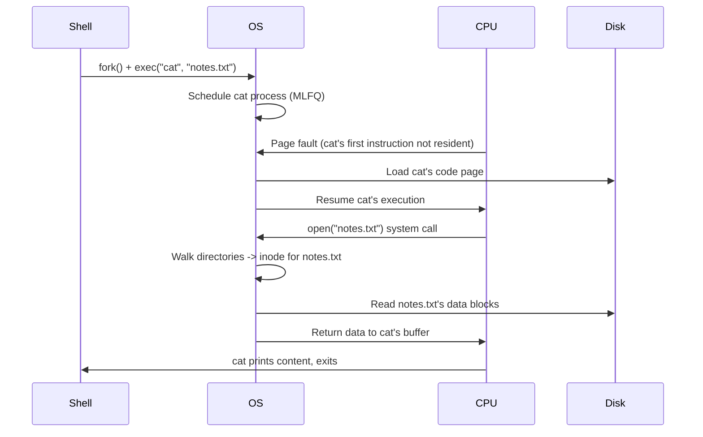

## Learning Objectives

- Trace one concrete process's lifecycle through every mechanism covered in this discipline: creation, scheduling, memory virtualization, a page fault, synchronization, and a real disk read.
- Explain how the process abstraction, CPU scheduling, virtual memory, and the file system are four separate answers to the same underlying question: how does the OS safely multiplex scarce physical resources among many demands?
- Identify, for a given point in the traced scenario, which specific concept from this discipline is responsible for that step's correctness.
- State explicitly what this discipline has deliberately left for more advanced treatment elsewhere (IPC, deep concurrency correctness, virtualization, security boundaries), and connect that to `systems/operating-systems-ii` and `computer/systems-laboratory`.

## Context & Motivation

This discipline covered four large clusters — processes and scheduling, concurrency and synchronization, virtual memory, and file systems — largely one at a time, each with its own concepts and worked examples. But no real running program experiences these as separate, sequential phases: a single request to a real server touches scheduling, memory translation, possibly a page fault, possibly a lock, and possibly a disk read, all within microseconds of each other, in a tightly interleaved sequence. This capstone traces one concrete, ordinary-looking scenario — a shell launching a program that reads a file — end to end, naming the exact mechanism from this discipline responsible for each step, to show these four clusters as one coherent system rather than four independent topics.

## Core Theory

### The scenario: a shell runs `cat notes.txt`

A user types `cat notes.txt` into a running shell and presses Enter. This single action sets in motion a sequence touching every major concept covered in this discipline, in this rough order:

1. **Process creation.** The shell calls `fork()`, creating a child process that is momentarily an exact copy of the shell itself; the child then calls `exec()` to replace its own memory image with `cat`'s code — the process API concept, in direct action.
2. **Scheduling.** The new `cat` process enters the ready queue; the OS's scheduler (MLFQ, in a realistic modern system) eventually picks it to run, performing a context switch to load its saved register state (initially, its very first state, freshly set up by `exec()`) onto the CPU.
3. **Address space setup.** `exec()` established `cat`'s virtual address space — code, stack, heap segments (or their page-table equivalents) — but, per demand paging, none of `cat`'s pages are necessarily resident in physical memory yet.
4. **A page fault, on the very first instruction.** The CPU attempts to fetch `cat`'s first instruction; if that code page isn't yet resident, this triggers a page fault — demand paging's fault handler locates the page (from `cat`'s executable file on disk), allocates a physical frame (possibly evicting some other resident page first, per a replacement policy like LRU, if memory is tight), loads it, and resumes.
5. **The file system, reached through a system call.** `cat`'s code issues a system call to open `notes.txt` — resolving that path requires exactly the directory-by-directory, inode-by-inode walk already traced in this discipline's file-systems cluster, ending at `notes.txt`'s own inode and its data-block pointers.
6. **Reading the file's data.** The requested data blocks are read from disk into a buffer in `cat`'s own memory (itself possibly triggering further page faults, if the destination pages aren't yet resident) — completing the system call, after which `cat` writes the content to its standard output and exits.



### Where synchronization fits, even in this simple trace

This particular single-threaded scenario doesn't itself need a lock — but the OS *internally* uses exactly the mutual-exclusion and condition-based-waiting tools covered in this discipline's concurrency cluster to protect its own shared kernel data structures throughout every step above: the ready queue the scheduler manipulates, the free-frame list the page-fault handler consults, the free-space bitmap and directory data the file-system layer reads and updates, are all shared kernel state that multiple CPUs (running other processes' kernel-mode code concurrently) could be touching at the same moment — every one of those internal structures needs exactly the locks, condition variables, or semaphores this discipline's concurrency cluster developed, just applied inside the kernel rather than inside a user's own multi-threaded program.

### Four clusters, one underlying question

Looking back across the whole discipline, processes-and-scheduling, concurrency, virtual memory, and file systems are four different answers to structurally the same question: *how does the OS safely and fairly multiplex a scarce physical resource among many simultaneous demands?* Scheduling multiplexes the CPU among many processes; virtual memory multiplexes physical RAM among many address spaces; the file system multiplexes disk blocks among many named files; and the concurrency cluster's tools are what make all of this multiplexing *safe* when more than one CPU core (or more than one thread) is doing the multiplexing's own bookkeeping at the same time.

### What this discipline deliberately leaves for later

This discipline's scope was the classic intro-OS spine: process/thread mechanics, CPU scheduling, synchronization mechanics (locks, condition variables, semaphores, deadlock), virtual memory, and basic file systems. Deliberately left for more advanced treatment elsewhere: deeper inter-process communication mechanisms beyond the basic process API, formal concurrency correctness techniques (beyond the mechanics covered here), virtualization (hypervisors, full machine emulation), and security boundaries and access control — all explicitly reserved for `systems/operating-systems-ii`, per this platform's own curriculum plan. Separately, `computer/systems-laboratory` (not yet written) is where the ideas covered *conceptually* throughout this discipline — a scheduler, a memory manager, a file system — get built by hand, as a companion lab to this discipline's theory, the same relationship OSTEP's own reference implementations and Princeton-style assignments have to their source textbooks' chapters.

## Worked Examples

### Example 1: Naming the responsible concept at each traced step

```text
Step in the trace                          Concept from this discipline
------------------------------------------ --------------------------------
Shell creates a new process for `cat`      The Process API: fork() and exec()
OS picks `cat` to actually run next        Multi-Level Feedback Queue Scheduling
`cat`'s code isn't resident yet            Demand Paging (and, if memory is
                                            tight, Page Replacement Policies)
`cat`'s virtual addresses need translating Address Spaces / Paging and Page Tables
                                            / The Translation Lookaside Buffer
Resolving "notes.txt" to actual data       Files, Directories, and Inodes
Kernel's internal shared structures        Locks / Condition Variables / Semaphores
                                            (protecting the ready queue, free-
                                            frame list, bitmap, directory data)
```

Every row traces back to one specific, already-covered concept — nothing in this ordinary scenario requires anything beyond what this discipline built, cluster by cluster.

### Example 2: What could go wrong at each step, and which concept prevents it

```text
Without process isolation (address spaces): a bug in `cat` could corrupt
  the shell's own memory directly.
Without a fair scheduler: `cat` might never actually get to run if some
  other process starves it (the starvation concept, generalized).
Without page-fault handling: `cat`'s code could never be loaded lazily,
  forcing every process to pay the cost of loading its ENTIRE executable
  upfront, most of which may never even run.
Without crash-consistent file system updates (journaling): a crash
  during some UNRELATED file's creation, happening around the same time
  `cat` is reading notes.txt, could leave the file system's structures
  in a state where notes.txt's own data becomes unreadable or corrupted.
Without kernel-level locks: two CPUs concurrently handling two different
  processes' system calls could corrupt the SAME shared free-frame list
  or directory structure, corrupting state for processes that have
  nothing to do with each other.
```

Each failure mode maps to exactly one guarantee this discipline established, and removing any single one reintroduces a specific, traceable hazard — not a vague, general "things might go wrong."

### Example 3: The same trace, restated as "what's virtualized or protected, and by what"

```text
Resource            Virtualized/protected by         Discipline cluster
-------------------  --------------------------------  -------------------
CPU                  Scheduling (MLFQ)                 Processes & Scheduling
Memory               Address spaces, paging, TLB        Virtual Memory
Shared kernel state  Locks, condition variables         Concurrency & Sync.
Disk / persistent    Files, directories, inodes,         File Systems
  storage             journaling
```

This table is, in effect, a one-line summary of the entire discipline: every cluster is the answer to "how is THIS particular scarce resource safely shared," and the worked trace above is simply what happens when all four answers operate together, on one ordinary command.

## Common Misconceptions & Pitfalls

- **"Scheduling, memory, concurrency, and file systems are four unrelated topics that happen to be taught in the same course."** As this capstone's trace shows, a single ordinary command exercises all four simultaneously and continuously — they are four coordinated answers to the same underlying resource-multiplexing question, not independent subjects.
- **"A single-threaded program like `cat` doesn't need to care about anything from the concurrency cluster."** The *user-level* program may be single-threaded, but the OS kernel handling its system calls is itself managing shared state that other CPUs (running other processes' kernel-mode code) may be touching concurrently — the concurrency cluster's tools are load-bearing here even when the user's own code never spawns a thread.
- **"This discipline has now covered everything a real operating system does."** This capstone explicitly names what's deliberately left out — deeper IPC, formal concurrency correctness beyond the mechanics covered, virtualization, and security boundaries — reserved for `systems/operating-systems-ii`, and the hands-on construction of these same ideas is `computer/systems-laboratory`'s job, not this discipline's.
- **"Page faults and file system operations are separate, unrelated kinds of disk activity."** As the trace shows, they can be directly connected: bringing a process's own code pages into memory (a page fault) and reading a file it opens (a file-system operation) are both, ultimately, requests for data that currently lives only on disk — different data, same underlying disk-access reality.

## Summary

Tracing one ordinary command — a shell launching `cat notes.txt` — through process creation, scheduling, address-space setup, a page fault, file-system path resolution, and a real disk read shows every cluster of this discipline operating together, continuously, rather than as separate phases: process/thread mechanics and scheduling decide *when* code runs; virtual memory and paging decide *where* its data lives and *how* it gets there lazily; the concurrency cluster's locks and condition variables protect the kernel's own shared bookkeeping throughout every one of these steps; and the file system resolves a human-readable name down to the actual bytes on disk. All four clusters are different, coordinated answers to one underlying question — how to safely and fairly multiplex scarce physical resources (CPU, RAM, disk) among many simultaneous demands. This discipline deliberately stopped at the classic intro-OS spine, leaving deeper IPC, formal concurrency correctness, virtualization, and security boundaries to `systems/operating-systems-ii`, and leaving the hands-on construction of a real scheduler, memory manager, and file system to `computer/systems-laboratory` — the natural next steps once this discipline's conceptual foundation is in place.

## Documentation Links

- [Arpaci-Dusseau — Operating Systems: Three Easy Pieces, "Complete Virtual Memory Systems"](https://pages.cs.wisc.edu/~remzi/OSTEP/vm-complete.pdf) — OSTEP's own synthesis of how virtualization mechanisms operate together as a complete system, the same spirit this capstone applies across all four clusters.
- [UC Berkeley CS162 — Operating Systems and Systems Programming](https://cs162.org/) — course whose project sequence (scheduler, virtual memory, file system, all layered on one kernel) mirrors this capstone's end-to-end integration of the same four areas.
