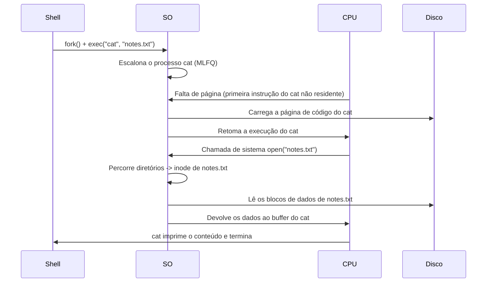

## Objetivos de Aprendizagem

- Acompanhar o ciclo de vida de um processo concreto por todos os mecanismos vistos nesta disciplina: criação, escalonamento, virtualização de memória, uma falta de página, sincronização e uma leitura real de disco.
- Explicar como a abstração de processo, o escalonamento de CPU, a memória virtual e o sistema de arquivos são quatro respostas separadas para a mesma pergunta subjacente: como o SO multiplexa com segurança recursos físicos escassos entre muitas demandas?
- Identificar, para um dado ponto do cenário acompanhado, qual conceito específico desta disciplina é responsável pela correção daquele passo.
- Dizer explicitamente o que esta disciplina deixou de propósito para um tratamento mais avançado em outro lugar (IPC, correção profunda de concorrência, virtualização, fronteiras de segurança), e ligar isso a `systems/operating-systems-ii` e `computer/systems-laboratory`.

## Contexto e Motivação

Esta disciplina cobriu quatro grandes blocos (processos e escalonamento, concorrência e sincronização, memória virtual e sistemas de arquivos), em grande parte um de cada vez, cada um com seus próprios conceitos e exemplos resolvidos. Mas nenhum programa real em execução vive isso como fases separadas e sequenciais: uma única requisição a um servidor real toca escalonamento, tradução de memória, possivelmente uma falta de página, possivelmente um lock e possivelmente uma leitura de disco, tudo a microssegundos de distância, numa sequência bem entrelaçada. Este projeto final acompanha de ponta a ponta um cenário concreto e de aparência comum (um shell lançando um programa que lê um arquivo), nomeando o mecanismo exato desta disciplina responsável por cada passo, para mostrar esses quatro blocos como um único sistema coerente, e não como quatro tópicos independentes.

## Teoria Central

### O cenário: um shell roda `cat notes.txt`

Um usuário digita `cat notes.txt` num shell em execução e aperta Enter. Essa única ação dispara uma sequência que toca todo conceito importante visto nesta disciplina, mais ou menos nesta ordem:

1. **Criação de processo.** O shell chama `fork()`, criando um processo filho que é, por um instante, uma cópia exata do próprio shell; o filho então chama `exec()` para substituir sua própria imagem de memória pelo código do `cat`: o conceito da API de processos, em ação direta.
2. **Escalonamento.** O novo processo `cat` entra na fila de prontos; o escalonador do SO (MLFQ, num sistema moderno realista) acaba escolhendo-o para rodar, fazendo uma troca de contexto para carregar na CPU seu estado de registradores salvo (inicialmente, seu primeiríssimo estado, recém-configurado pelo `exec()`).
3. **Configuração do espaço de endereçamento.** O `exec()` estabeleceu o espaço de endereçamento virtual do `cat` (segmentos de código, pilha e heap, ou seus equivalentes em tabela de páginas), mas, pela paginação sob demanda, nenhuma das páginas do `cat` está necessariamente residente na memória física ainda.
4. **Uma falta de página, logo na primeira instrução.** A CPU tenta buscar a primeira instrução do `cat`; se essa página de código ainda não estiver residente, isso dispara uma falta de página: o tratador de faltas da paginação sob demanda localiza a página (no arquivo executável do `cat` em disco), aloca um quadro físico (possivelmente despejando antes alguma outra página residente, segundo uma política de substituição como LRU, se a memória estiver apertada), carrega-a e retoma.
5. **O sistema de arquivos, alcançado por uma chamada de sistema.** O código do `cat` emite uma chamada de sistema para abrir `notes.txt`; resolver esse caminho exige exatamente o percurso diretório por diretório, inode por inode, já acompanhado no bloco de sistemas de arquivos desta disciplina, terminando no próprio inode de `notes.txt` e nos seus ponteiros para blocos de dados.
6. **Lendo os dados do arquivo.** Os blocos de dados pedidos são lidos do disco para um buffer na própria memória do `cat` (o que por sua vez pode disparar mais faltas de página, se as páginas de destino ainda não estiverem residentes), completando a chamada de sistema, depois da qual o `cat` escreve o conteúdo na sua saída padrão e termina.



### Onde a sincronização entra, mesmo neste traço simples

Este cenário específico de uma única thread não precisa ele mesmo de um lock; mas o SO usa *internamente* exatamente as ferramentas de exclusão mútua e de espera baseada em condição vistas no bloco de concorrência desta disciplina para proteger suas próprias estruturas de dados compartilhadas do kernel durante cada passo acima: a fila de prontos que o escalonador manipula, a lista de quadros livres que o tratador de faltas de página consulta, o bitmap de espaço livre e os dados de diretório que a camada do sistema de arquivos lê e atualiza são todos estado compartilhado do kernel que várias CPUs (rodando código em modo kernel de outros processos ao mesmo tempo) podem estar tocando no mesmo instante; cada uma dessas estruturas internas precisa exatamente dos locks, variáveis de condição ou semáforos que o bloco de concorrência desta disciplina desenvolveu, só que aplicados dentro do kernel, e não dentro do próprio programa multithread de um usuário.

### Quatro blocos, uma pergunta subjacente

Olhando para trás, para a disciplina inteira, processos e escalonamento, concorrência, memória virtual e sistemas de arquivos são quatro respostas diferentes para estruturalmente a mesma pergunta: *como o SO multiplexa, com segurança e de forma justa, um recurso físico escasso entre muitas demandas simultâneas?* O escalonamento multiplexa a CPU entre muitos processos; a memória virtual multiplexa a RAM física entre muitos espaços de endereçamento; o sistema de arquivos multiplexa os blocos de disco entre muitos arquivos com nome; e as ferramentas do bloco de concorrência são o que torna toda essa multiplexação *segura* quando mais de um núcleo de CPU (ou mais de uma thread) está fazendo a própria contabilidade da multiplexação ao mesmo tempo.

### O que esta disciplina deixa de propósito para depois

O escopo desta disciplina foi a espinha clássica de uma introdução a SO: mecânica de processos e threads, escalonamento de CPU, mecânica de sincronização (locks, variáveis de condição, semáforos, deadlock), memória virtual e sistemas de arquivos básicos. Ficaram de fora de propósito, para um tratamento mais avançado em outro lugar: mecanismos mais profundos de comunicação entre processos além da API básica de processos, técnicas formais de correção de concorrência (além da mecânica vista aqui), virtualização (hipervisores, emulação completa de máquina) e fronteiras de segurança e controle de acesso, todos reservados explicitamente para `systems/operating-systems-ii`, segundo o próprio plano curricular desta plataforma. Separadamente, `computer/systems-laboratory` (ainda não escrita) é onde as ideias vistas *conceitualmente* ao longo desta disciplina (um escalonador, um gerenciador de memória, um sistema de arquivos) são construídas à mão, como laboratório complementar à teoria desta disciplina, a mesma relação que as implementações de referência do próprio OSTEP e os trabalhos no estilo de Princeton têm com os capítulos dos livros de que partem.

## Exemplos Resolvidos

### Exemplo 1: nomeando o conceito responsável em cada passo acompanhado

```text
Passo no traço                               Conceito desta disciplina
-------------------------------------------- ---------------------------------
O shell cria um novo processo para o `cat`   A API de Processos: fork() e exec()
O SO escolhe o `cat` para rodar em seguida   Escalonamento com Filas Multinível
                                              com Realimentação
O código do `cat` ainda não está residente   Paginação sob Demanda (e, se a
                                              memória estiver apertada, Políticas
                                              de Substituição de Páginas)
Os endereços virtuais do `cat` precisam      Espaços de Endereçamento / Paginação
  ser traduzidos                              e Tabelas de Páginas / O Translation
                                              Lookaside Buffer
Resolver "notes.txt" até os dados reais      Arquivos, Diretórios e Inodes
Estruturas compartilhadas internas do kernel Locks / Variáveis de Condição / Semáforos
                                              (protegendo a fila de prontos, a lista
                                              de quadros livres, o bitmap, os dados
                                              de diretório)
```

Cada linha remete a um conceito específico já visto; nada neste cenário comum exige algo além do que esta disciplina construiu, bloco a bloco.

### Exemplo 2: o que poderia dar errado em cada passo, e qual conceito impede

```text
Sem isolamento de processos (espaços de endereçamento): um bug no `cat`
  poderia corromper diretamente a memória do próprio shell.
Sem um escalonador justo: o `cat` poderia nunca chegar a rodar se algum
  outro processo o deixasse com fome (o conceito de inanição, generalizado).
Sem tratamento de faltas de página: o código do `cat` nunca poderia ser
  carregado de forma preguiçosa, obrigando todo processo a pagar o custo de
  carregar o executável INTEIRO de antemão, do qual boa parte talvez nunca rode.
Sem atualizações do sistema de arquivos consistentes a falhas (journaling):
  uma falha durante a criação de algum arquivo NÃO RELACIONADO, acontecendo
  na mesma época em que o `cat` lê notes.txt, poderia deixar as estruturas do
  sistema de arquivos num estado em que os próprios dados de notes.txt ficam
  ilegíveis ou corrompidos.
Sem locks em nível de kernel: duas CPUs tratando ao mesmo tempo chamadas de
  sistema de dois processos diferentes poderiam corromper a MESMA lista de
  quadros livres ou estrutura de diretório compartilhada, corrompendo o estado
  de processos que não têm nada a ver um com o outro.
```

Cada modo de falha corresponde a exatamente uma garantia que esta disciplina estabeleceu, e remover qualquer uma delas reintroduz um perigo específico e rastreável, e não um vago e genérico "as coisas podem dar errado".

### Exemplo 3: o mesmo traço, reescrito como "o que é virtualizado ou protegido, e pelo quê"

```text
Recurso               Virtualizado/protegido por         Bloco da disciplina
--------------------  ---------------------------------  ----------------------
CPU                   Escalonamento (MLFQ)               Processos e Escalonamento
Memória               Espaços de endereçamento,          Memória Virtual
                       paginação, TLB
Estado compartilhado  Locks, variáveis de condição       Concorrência e Sincronização
  do kernel
Disco / armazenamento Arquivos, diretórios, inodes,      Sistemas de Arquivos
  persistente          journaling
```

Esta tabela é, na prática, um resumo de uma linha da disciplina inteira: cada bloco é a resposta para "como ESTE recurso escasso específico é compartilhado com segurança", e o traço resolvido acima é simplesmente o que acontece quando as quatro respostas operam juntas, num comando comum.

## Equívocos Comuns e Armadilhas

- **"Escalonamento, memória, concorrência e sistemas de arquivos são quatro tópicos sem relação que por acaso são ensinados no mesmo curso."** Como o traço deste projeto final mostra, um único comando comum exercita os quatro ao mesmo tempo e de forma contínua; são quatro respostas coordenadas para a mesma pergunta subjacente de multiplexação de recursos, e não assuntos independentes.
- **"Um programa de uma única thread como o `cat` não precisa se preocupar com nada do bloco de concorrência."** O programa em *nível de usuário* pode ter uma única thread, mas o kernel do SO que trata suas chamadas de sistema está ele mesmo gerenciando estado compartilhado que outras CPUs (rodando código em modo kernel de outros processos) podem estar tocando ao mesmo tempo; as ferramentas do bloco de concorrência são estruturais aqui, mesmo quando o próprio código do usuário nunca cria uma thread.
- **"Esta disciplina já cobriu tudo o que um sistema operacional real faz."** Este projeto final nomeia explicitamente o que ficou de fora de propósito (IPC mais profunda, correção formal de concorrência além da mecânica vista, virtualização e fronteiras de segurança), reservado para `systems/operating-systems-ii`, e a construção prática dessas mesmas ideias é trabalho de `computer/systems-laboratory`, não desta disciplina.
- **"Faltas de página e operações do sistema de arquivos são tipos separados e sem relação de atividade de disco."** Como o traço mostra, elas podem estar diretamente ligadas: trazer as próprias páginas de código de um processo para a memória (uma falta de página) e ler um arquivo que ele abre (uma operação do sistema de arquivos) são ambas, no fim, pedidos por dados que hoje só existem no disco: dados diferentes, a mesma realidade subjacente de acesso ao disco.

## Resumo

Acompanhar um único comando comum (um shell lançando `cat notes.txt`) pela criação de processo, escalonamento, configuração do espaço de endereçamento, uma falta de página, a resolução de caminho no sistema de arquivos e uma leitura real de disco mostra todos os blocos desta disciplina operando juntos e de forma contínua, e não como fases separadas: a mecânica de processos e threads e o escalonamento decidem *quando* o código roda; a memória virtual e a paginação decidem *onde* seus dados ficam e *como* chegam lá de forma preguiçosa; os locks e as variáveis de condição do bloco de concorrência protegem a própria contabilidade compartilhada do kernel durante cada um desses passos; e o sistema de arquivos resolve um nome legível por humanos até os bytes reais no disco. Os quatro blocos são respostas diferentes e coordenadas para uma única pergunta subjacente: como multiplexar com segurança e de forma justa recursos físicos escassos (CPU, RAM, disco) entre muitas demandas simultâneas. Esta disciplina parou de propósito na espinha clássica de uma introdução a SO, deixando IPC mais profunda, correção formal de concorrência, virtualização e fronteiras de segurança para `systems/operating-systems-ii`, e deixando a construção prática de um escalonador, um gerenciador de memória e um sistema de arquivos reais para `computer/systems-laboratory`: os próximos passos naturais quando a base conceitual desta disciplina estiver no lugar.

## Documentation Links

- [Arpaci-Dusseau: Operating Systems: Three Easy Pieces, "Complete Virtual Memory Systems"](https://pages.cs.wisc.edu/~remzi/OSTEP/vm-complete.pdf): a síntese do próprio OSTEP de como os mecanismos de virtualização operam juntos como um sistema completo, o mesmo espírito que este projeto final aplica aos quatro blocos.
- [UC Berkeley CS162: Operating Systems and Systems Programming](https://cs162.org/): curso cuja sequência de projetos (escalonador, memória virtual, sistema de arquivos, todos em camadas sobre um único kernel) espelha a integração de ponta a ponta das mesmas quatro áreas feita neste projeto final.
