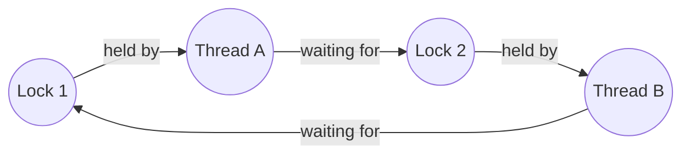

## Learning Objectives

- Define deadlock: a set of threads each waiting for a resource held by another thread in the same set, with none able to proceed.
- List the four Coffman conditions that must all hold simultaneously for deadlock to be possible, and explain why breaking any one of them prevents it.
- Build a resource-allocation graph for a concrete scenario and detect a deadlock as a cycle in that graph.
- Connect deadlock detection to the cycle-detection algorithm already covered for general graphs, and name the standard prevention/avoidance strategies at a conceptual level.

## Context & Motivation

Locks and semaphores solve the critical-section problem correctly, but combining more than one of them introduces a new failure mode that none of this cluster's earlier concepts could produce on their own: **deadlock**, where two or more threads each hold a resource the other needs, and each is waiting for a resource the other holds — a standoff with no thread able to make progress, ever, without outside intervention. Recognizing a potential deadlock is, remarkably, exactly the same problem already solved in this platform's `algorithms-software/algorithms` discipline for general graphs: building the right graph and checking it for a cycle.

## Core Theory

### What deadlock looks like

The canonical minimal example: thread A holds lock 1 and is waiting to acquire lock 2; thread B holds lock 2 and is waiting to acquire lock 1. Neither thread can ever proceed — A cannot get lock 2 because B holds it and won't release it until B gets lock 1; B cannot get lock 1 because A holds it and won't release it until A gets lock 2. Both locks correctly enforced mutual exclusion the entire time; the system as a whole is still permanently stuck.

### The four Coffman conditions

Deadlock can only occur if all four of these conditions hold simultaneously:

1. **Mutual exclusion.** At least one resource is held in a non-shareable way (only one thread can hold it at a time) — exactly what a lock provides by design.
2. **Hold and wait.** A thread holding at least one resource is waiting to acquire additional resources currently held by other threads.
3. **No preemption.** Resources cannot be forcibly taken away from the thread holding them — a thread must voluntarily release a resource itself.
4. **Circular wait.** There exists a cycle of threads, each waiting for a resource held by the next thread in the cycle.

Because all four must hold together, breaking even one of them for a given system makes deadlock impossible in that system — this is the conceptual basis for every deadlock *prevention* strategy: eliminate hold-and-wait by requiring threads to acquire all needed locks at once, or eliminate circular wait by imposing a global, consistent lock-acquisition ordering (every thread must acquire lock 1 before lock 2, never the reverse), or allow preemption where the resource type permits it. This platform does not develop the mechanics of each prevention strategy in exhaustive detail here — CS2013 and OSTEP both treat prevention and avoidance strategies as a substantial topic of their own, appropriately left to a more advanced treatment — but naming the four conditions and the one-broken-condition principle behind prevention is itself the essential, transferable insight.

### The resource-allocation graph

Deadlock can be represented as a directed graph: one node per thread, one node per resource (lock), an edge from a resource to a thread if that thread currently holds it, and an edge from a thread to a resource if that thread is currently waiting to acquire it.



A deadlock exists in the system if and only if this graph contains a **cycle** — precisely the same structural condition, on precisely the same kind of directed graph, that the `cycle-detection-and-topological-sort` concept in this platform's `algorithms-software/algorithms` discipline already covers for graphs in general. Detecting deadlock at runtime is literally an application of that same algorithm (typically a DFS-based cycle detector) to this specific graph, built from currently-held and currently-requested locks, rather than a new algorithmic idea invented specifically for operating systems.

## Worked Examples

### Example 1: Building the graph for the classic two-thread deadlock

```text
State:
  Thread A holds Lock 1, is waiting for Lock 2
  Thread B holds Lock 2, is waiting for Lock 1

Graph edges:
  Lock1 -> A   (A holds Lock 1)
  A -> Lock2   (A waits for Lock 2)
  Lock2 -> B   (B holds Lock 2)
  B -> Lock1   (B waits for Lock 1)

Following the path: Lock1 -> A -> Lock2 -> B -> Lock1
This returns to its starting node -- a cycle -- confirming deadlock.
```

### Example 2: Three threads, no deadlock (no cycle) despite waiting

```text
State:
  Thread A holds Lock 1, is waiting for Lock 2
  Thread B holds Lock 2, is waiting for Lock 3
  Thread C holds Lock 3, waiting for nothing (about to finish and release Lock 3)

Graph edges:
  Lock1 -> A,  A -> Lock2,  Lock2 -> B,  B -> Lock3,  Lock3 -> C

Following the path from A: Lock1 -> A -> Lock2 -> B -> Lock3 -> C
This path ends at C (no outgoing edge from C, since C isn't waiting on
anything) -- no cycle exists. C will eventually finish, release Lock 3,
B will then acquire it and eventually release Lock 2, and A will then
proceed. Waiting alone, without a CYCLE of waiting, is not deadlock --
it's just an ordinary, resolvable wait chain.
```

This distinction — a chain of waiting vs. a genuine cycle — is exactly why the graph-based, cycle-detection framing matters: not every thread that's currently blocked is part of a deadlock, and checking for an actual cycle (rather than just "is anyone waiting") is what correctly separates the two cases.

### Example 3: Preventing the two-thread deadlock via lock ordering

Applying the "break circular wait" prevention strategy from the Coffman-conditions discussion, require every thread in the system to always acquire Lock 1 before Lock 2, never the reverse:

```c
// Both threads now follow the same order: Lock 1, then Lock 2
void thread_A() {
    acquire(&lock1);
    acquire(&lock2);   // A never holds lock2 while waiting for lock1
    // ... critical section using both ...
    release(&lock2);
    release(&lock1);
}

void thread_B() {
    acquire(&lock1);   // B now also takes lock1 FIRST, not lock2 first
    acquire(&lock2);
    // ... critical section using both ...
    release(&lock2);
    release(&lock1);
}
```

With both threads following the identical acquisition order, the specific cycle from Example 1 (A holds 1, waits for 2; B holds 2, waits for 1) can no longer arise — whichever thread acquires Lock 1 first will simply also be the one to acquire Lock 2 first, and the other thread will block on Lock 1 *before* it ever gets a chance to acquire Lock 2 and create the circular dependency. The resource-allocation graph for this corrected version can never contain the cycle from Example 1, because the "B holds Lock 2 while waiting for Lock 1" edge pair can no longer occur.

## Common Misconceptions & Pitfalls

- **"Any thread that's currently blocked waiting for a lock is part of a deadlock."** Ordinary, resolvable waiting (Example 2's chain) is common and harmless — deadlock specifically requires a *cycle* in the resource-allocation graph, not merely the presence of waiting threads.
- **"Deadlock requires many threads and many locks to occur."** The minimal case needs only two threads and two locks, as the classic example shows — deadlock is about the *structure* of who's waiting for what, not the raw count of participants.
- **"Breaking one of the four Coffman conditions is a nice-to-have optimization."** Because all four conditions must hold *simultaneously* for deadlock to be possible, permanently breaking even one of them (such as enforcing a global lock-acquisition order, breaking circular wait) makes deadlock structurally impossible for that system — this is precisely why prevention strategies target specific conditions rather than trying to detect and recover after the fact.
- **"Detecting deadlock requires a fundamentally new algorithm specific to operating systems."** It requires exactly the cycle-detection algorithm already developed for general directed graphs — the operating-systems-specific part is only in how the graph itself is built (from currently-held and currently-requested locks), not in the detection technique applied to it.

## Summary

Deadlock is a standoff among threads, each waiting for a resource held by another thread in the same set, with none able to proceed — possible only when all four Coffman conditions hold simultaneously: mutual exclusion, hold-and-wait, no preemption, and circular wait. Representing threads and locks as a directed resource-allocation graph (an edge from a held resource to its holder, and from a waiting thread to the resource it wants) turns deadlock detection into exactly the cycle-detection problem already solved for graphs in general in this platform's `algorithms-software/algorithms` discipline — a genuine cycle in this graph is deadlock; a mere chain of waiting, however long, is not. Prevention strategies work by permanently breaking one of the four conditions — most concretely, imposing a consistent global lock-acquisition order eliminates circular wait entirely, as the worked example shows. With mutual exclusion, condition-based waiting, counting, and now deadlock all covered, this cluster's concurrency mechanics are complete; the next cluster turns from coordinating threads within a shared address space to how the OS constructs and manages that address space itself — virtual memory.

## Documentation Links

- [Arpaci-Dusseau — Operating Systems: Three Easy Pieces, "Concurrency Bugs"](https://pages.cs.wisc.edu/~remzi/OSTEP/threads-bugs.pdf) — the canonical treatment of deadlock, the Coffman conditions, and prevention strategies this concept is built from.
- [UC Berkeley CS162 — Operating Systems and Systems Programming](https://cs162.org/) — course covering deadlock detection via resource-allocation graphs and prevention through condition-breaking.
