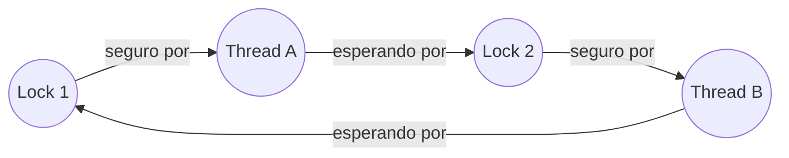

## Objetivos de Aprendizagem

- Definir deadlock: um conjunto de threads em que cada uma espera por um recurso guardado por outra thread do mesmo conjunto, sem que nenhuma consiga prosseguir.
- Listar as quatro condições de Coffman que precisam valer todas ao mesmo tempo para o deadlock ser possível, e explicar por que quebrar qualquer uma delas o impede.
- Construir um grafo de alocação de recursos para um cenário concreto e detectar um deadlock como um ciclo nesse grafo.
- Ligar a detecção de deadlock ao algoritmo de detecção de ciclos já visto para grafos em geral, e nomear em nível conceitual as estratégias padrão de prevenção e de evitação.

## Contexto e Motivação

Locks e semáforos resolvem corretamente o problema da seção crítica, mas combinar mais de um deles introduz um novo modo de falha que nenhum dos conceitos anteriores deste bloco conseguia produzir sozinho: o **deadlock**, em que duas ou mais threads seguram cada uma um recurso de que a outra precisa, e cada uma espera por um recurso que a outra segura; um impasse em que nenhuma thread consegue jamais fazer progresso sem intervenção externa. Reconhecer um possível deadlock é, de forma notável, exatamente o mesmo problema já resolvido na disciplina `algorithms-software/algorithms` desta plataforma para grafos em geral: construir o grafo certo e conferir se ele tem um ciclo.

## Teoria Central

### Como é um deadlock

O exemplo mínimo canônico: a thread A segura o lock 1 e espera para adquirir o lock 2; a thread B segura o lock 2 e espera para adquirir o lock 1. Nenhuma das duas threads consegue jamais prosseguir: A não consegue o lock 2 porque B o segura e não vai liberá-lo até conseguir o lock 1; B não consegue o lock 1 porque A o segura e não vai liberá-lo até conseguir o lock 2. Os dois locks impuseram corretamente a exclusão mútua o tempo todo; o sistema como um todo, ainda assim, está travado para sempre.

### As quatro condições de Coffman

O deadlock só pode ocorrer se estas quatro condições valerem todas ao mesmo tempo:

1. **Exclusão mútua.** Pelo menos um recurso é guardado de forma não compartilhável (só uma thread pode segurá-lo por vez), exatamente o que um lock fornece por projeto.
2. **Segurar e esperar.** Uma thread que segura pelo menos um recurso está esperando para adquirir recursos adicionais que outras threads seguram no momento.
3. **Sem preempção.** Os recursos não podem ser tomados à força da thread que os segura; uma thread precisa liberar um recurso por conta própria.
4. **Espera circular.** Existe um ciclo de threads, cada uma esperando por um recurso guardado pela próxima thread do ciclo.

Como as quatro precisam valer juntas, quebrar uma só delas num dado sistema torna o deadlock impossível nesse sistema; essa é a base conceitual de toda estratégia de *prevenção* de deadlock: eliminar o segurar e esperar exigindo que as threads adquiram todos os locks necessários de uma vez, ou eliminar a espera circular impondo uma ordem global e consistente de aquisição de locks (toda thread precisa adquirir o lock 1 antes do lock 2, nunca o contrário), ou permitir preempção onde o tipo de recurso permitir. Esta plataforma não desenvolve aqui em detalhe exaustivo a mecânica de cada estratégia de prevenção (o CS2013 e o OSTEP tratam as estratégias de prevenção e de evitação como um tópico substancial por si só, adequadamente deixado para um tratamento mais avançado), mas nomear as quatro condições e o princípio de quebrar uma condição por trás da prevenção já é, por si só, a ideia essencial e transferível.

### O grafo de alocação de recursos

O deadlock pode ser representado como um grafo dirigido: um nó por thread, um nó por recurso (lock), uma aresta de um recurso para uma thread se essa thread o segura no momento, e uma aresta de uma thread para um recurso se essa thread está esperando para adquiri-lo no momento.



Existe deadlock no sistema se e somente se esse grafo contiver um **ciclo**: precisamente a mesma condição estrutural, precisamente no mesmo tipo de grafo dirigido, que o conceito `cycle-detection-and-topological-sort` da disciplina `algorithms-software/algorithms` desta plataforma já cobre para grafos em geral. Detectar deadlock em tempo de execução é literalmente uma aplicação desse mesmo algoritmo (normalmente um detector de ciclos baseado em DFS) a este grafo específico, construído a partir dos locks seguros e pedidos no momento, e não uma ideia algorítmica nova inventada especificamente para sistemas operacionais.

## Exemplos Resolvidos

### Exemplo 1: construindo o grafo do deadlock clássico de duas threads

```text
Estado:
  A Thread A segura o Lock 1 e espera pelo Lock 2
  A Thread B segura o Lock 2 e espera pelo Lock 1

Arestas do grafo:
  Lock1 -> A   (A segura o Lock 1)
  A -> Lock2   (A espera pelo Lock 2)
  Lock2 -> B   (B segura o Lock 2)
  B -> Lock1   (B espera pelo Lock 1)

Seguindo o caminho: Lock1 -> A -> Lock2 -> B -> Lock1
Ele volta ao nó de partida: um ciclo, confirmando o deadlock.
```

### Exemplo 2: três threads, sem deadlock (sem ciclo), apesar da espera

```text
Estado:
  A Thread A segura o Lock 1 e espera pelo Lock 2
  A Thread B segura o Lock 2 e espera pelo Lock 3
  A Thread C segura o Lock 3 e não espera por nada (prestes a terminar e liberar o Lock 3)

Arestas do grafo:
  Lock1 -> A,  A -> Lock2,  Lock2 -> B,  B -> Lock3,  Lock3 -> C

Seguindo o caminho a partir de A: Lock1 -> A -> Lock2 -> B -> Lock3 -> C
Esse caminho termina em C (não há aresta saindo de C, já que C não espera
por nada): não existe ciclo. C vai acabar terminando e liberando o Lock 3,
B vai então adquiri-lo e acabar liberando o Lock 2, e A vai então prosseguir.
Esperar, sozinho, sem um CICLO de espera, não é deadlock: é só uma cadeia
de espera comum e resolvível.
```

Essa distinção (uma cadeia de espera contra um ciclo genuíno) é exatamente o motivo de o enquadramento baseado em grafo e detecção de ciclos importar: nem toda thread bloqueada no momento faz parte de um deadlock, e conferir se existe um ciclo de verdade (em vez de só "alguém está esperando?") é o que separa corretamente os dois casos.

### Exemplo 3: prevenindo o deadlock de duas threads com ordem de locks

Aplicando a estratégia de prevenção "quebrar a espera circular" da discussão das condições de Coffman, exija que toda thread do sistema sempre adquira o Lock 1 antes do Lock 2, nunca o contrário:

```c
// As duas threads agora seguem a mesma ordem: Lock 1, depois Lock 2
void thread_A() {
    acquire(&lock1);
    acquire(&lock2);   // A nunca segura o lock2 enquanto espera pelo lock1
    // ... seção crítica usando os dois ...
    release(&lock2);
    release(&lock1);
}

void thread_B() {
    acquire(&lock1);   // B agora também pega o lock1 PRIMEIRO, e não o lock2
    acquire(&lock2);
    // ... seção crítica usando os dois ...
    release(&lock2);
    release(&lock1);
}
```

Com as duas threads seguindo a mesmíssima ordem de aquisição, o ciclo específico do Exemplo 1 (A segura 1 e espera por 2; B segura 2 e espera por 1) não pode mais surgir: a thread que adquirir o Lock 1 primeiro vai simplesmente ser também a que adquire o Lock 2 primeiro, e a outra thread vai bloquear no Lock 1 *antes* de ter qualquer chance de adquirir o Lock 2 e criar a dependência circular. O grafo de alocação de recursos desta versão corrigida nunca pode conter o ciclo do Exemplo 1, porque o par de arestas "B segura o Lock 2 enquanto espera pelo Lock 1" não pode mais ocorrer.

## Equívocos Comuns e Armadilhas

- **"Qualquer thread bloqueada no momento esperando um lock faz parte de um deadlock."** A espera comum e resolvível (a cadeia do Exemplo 2) é frequente e inofensiva; o deadlock exige especificamente um *ciclo* no grafo de alocação de recursos, e não só a presença de threads em espera.
- **"O deadlock exige muitas threads e muitos locks para ocorrer."** O caso mínimo precisa de só duas threads e dois locks, como o exemplo clássico mostra; o deadlock é sobre a *estrutura* de quem espera pelo quê, não sobre o número bruto de participantes.
- **"Quebrar uma das quatro condições de Coffman é uma otimização desejável, mas opcional."** Como as quatro condições precisam valer *ao mesmo tempo* para o deadlock ser possível, quebrar de forma permanente uma só delas (como impor uma ordem global de aquisição de locks, quebrando a espera circular) torna o deadlock estruturalmente impossível nesse sistema; é precisamente por isso que as estratégias de prevenção miram condições específicas, em vez de tentar detectar e recuperar depois do fato.
- **"Detectar deadlock exige um algoritmo fundamentalmente novo, específico de sistemas operacionais."** Exige exatamente o algoritmo de detecção de ciclos já desenvolvido para grafos dirigidos em geral; a parte específica de sistemas operacionais está só em como o próprio grafo é construído (a partir dos locks seguros e pedidos no momento), e não na técnica de detecção aplicada a ele.

## Resumo

O deadlock é um impasse entre threads, cada uma esperando por um recurso guardado por outra thread do mesmo conjunto, sem que nenhuma consiga prosseguir; ele só é possível quando as quatro condições de Coffman valem ao mesmo tempo: exclusão mútua, segurar e esperar, sem preempção e espera circular. Representar threads e locks como um grafo dirigido de alocação de recursos (uma aresta de um recurso seguro para quem o segura, e de uma thread em espera para o recurso que ela quer) transforma a detecção de deadlock exatamente no problema de detecção de ciclos já resolvido para grafos em geral na disciplina `algorithms-software/algorithms` desta plataforma: um ciclo genuíno nesse grafo é deadlock; uma mera cadeia de espera, por mais longa que seja, não é. As estratégias de prevenção funcionam quebrando de forma permanente uma das quatro condições; mais concretamente, impor uma ordem global e consistente de aquisição de locks elimina por completo a espera circular, como o exemplo resolvido mostra. Com exclusão mútua, espera baseada em condição, contagem e agora deadlock cobertos, a mecânica de concorrência deste bloco está completa; o próximo bloco passa de coordenar threads dentro de um espaço de endereçamento compartilhado para como o SO constrói e gerencia esse próprio espaço de endereçamento: a memória virtual.

## Documentation Links

- [Arpaci-Dusseau: Operating Systems: Three Easy Pieces, "Concurrency Bugs"](https://pages.cs.wisc.edu/~remzi/OSTEP/threads-bugs.pdf): o tratamento canônico do deadlock, das condições de Coffman e das estratégias de prevenção a partir do qual este conceito é construído.
- [UC Berkeley CS162: Operating Systems and Systems Programming](https://cs162.org/): curso que cobre a detecção de deadlock por grafos de alocação de recursos e a prevenção pela quebra de condições.
