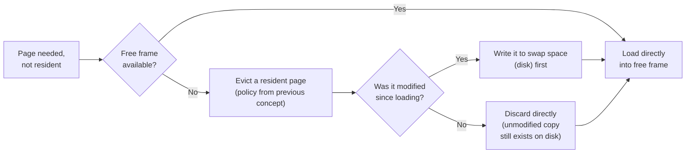

## Learning Objectives

- Define demand paging: loading a page into memory only when it is actually referenced, not upfront when a process starts.
- Explain swapping: moving a page out to disk to free its frame, and bringing it back in on a later page fault.
- Define thrashing: the collapse in throughput when the combined memory demand of all running processes exceeds physical memory, and the system spends more time paging than computing.
- Explain why adding more processes to an already-thrashing system makes performance worse, not better.

## Context & Motivation

Every concept so far in this cluster has assumed a process's needed pages simply become resident somehow — this concept fills in exactly when and why. **Demand paging** is the practical answer: load a page only when it's actually referenced for the first time (or referenced again after being evicted), rather than loading a process's entire address space upfront, most of which might never even be touched during a given run. This lets far more processes fit into physical memory at once than their combined virtual address spaces would otherwise allow — until, if too many processes genuinely need too much memory simultaneously, the system hits a collapse OSTEP calls **thrashing**, where page faults become so frequent that the system spends nearly all its time paging and almost none actually computing.

## Core Theory

### Demand paging: load lazily, on first touch

Under demand paging, a process starts running with none (or very few) of its pages actually resident in physical memory. The very first reference to any given page causes a page fault — not because anything is wrong, but simply because that page has genuinely never been loaded yet. The OS's fault handler locates the page's content (typically on disk, as part of the process's executable file or its swap space), allocates a physical frame for it, loads it, updates the page table, and resumes the faulting instruction, which now succeeds. Subsequent references to the same page find it already resident, no fault needed — exactly the same locality-driven benefit already seen for the TLB, now operating one level further down, at the granularity of whole pages rather than individual translations.

### Swapping: making room by moving pages to disk

When physical memory is full and a new page must be brought in, one option — beyond simply evicting a page whose contents are no longer needed at all — is **swapping**: writing an evicted page's contents out to a dedicated area of disk (swap space), freeing its physical frame, and bringing that page back in from swap space later if it's referenced again. This lets a system support processes whose combined virtual memory usage genuinely exceeds physical RAM, at the cost of a real, comparatively slow disk operation whenever a swapped-out page must be brought back in.



### Thrashing: when demand exceeds supply, system-wide

**Thrashing** occurs when the combined set of pages that all currently-running processes are actively using — sometimes called each process's *working set* — exceeds what physical memory can hold simultaneously. In this state, bringing in one process's needed page forces evicting a page some other (or the same) process still actively needs, which will itself fault again almost immediately — the system spends the overwhelming majority of its time servicing page faults (each involving a comparatively very slow disk operation) and almost no time actually running any process's real computation. Throughput, far from merely degrading gracefully, can collapse sharply once this threshold is crossed.

### Why adding more processes makes thrashing worse, not better

A natural but wrong instinct when a system seems underutilized (CPU often idle, waiting on disk I/O for paging) is to add more processes to use that apparently spare capacity. Under thrashing, this is exactly backwards: adding another process only adds its own working set's demand for physical memory on top of an already-oversubscribed system, causing existing processes to lose even more of their needed pages to eviction, faulting even more — thrashing gets worse, and overall throughput drops further, not the intuitive "more work getting done." The fix is the reverse: reduce the number of processes competing for memory (or increase physical memory) until the combined working sets actually fit, at which point page faults become rare again and throughput recovers.

## Worked Examples

### Example 1: Demand paging in action — a process's first few references

A process starts with zero pages resident. Its code begins execution:

```text
Reference to page 0 (first instruction): FAULT -- page 0 loaded from disk,
    now resident. Instruction re-executed, succeeds.
Reference to page 0 (next instruction, same page): no fault -- already resident.
Reference to page 1 (a jump to a new function): FAULT -- page 1 loaded.
Reference to page 1 (more instructions in that function): no fault.
Reference to page 5 (a rarely-used error-handling routine): never referenced
    at all during this particular run -- NEVER loaded, saving the time and
    memory that would have been spent loading it upfront.
```

The process runs correctly having only ever loaded pages 0 and 1 — page 5's error-handling code, never actually exercised this run, never costs anything, exactly demand paging's benefit over loading an entire executable upfront regardless of what's actually used.

### Example 2: Throughput collapsing as demand crosses the available-memory threshold

Suppose physical memory can hold 100 pages' worth of resident data at once, and every process needs roughly 20 pages actively resident to run without constant faulting:

```text
4 processes running (4 x 20 = 80 pages needed): fits comfortably within 100.
  Page faults: rare (only on genuinely new pages). Throughput: high.

5 processes running (5 x 20 = 100 pages needed): exactly at the limit.
  Page faults: still manageable, though little slack remains.

6 processes running (6 x 20 = 120 pages needed): EXCEEDS 100 available.
  Every process's actively-used pages can no longer all stay resident
  simultaneously -- pages get evicted and immediately re-faulted, over
  and over. Page faults: constant. Throughput: collapses, well below
  even the 4-process case's throughput, despite "more work" nominally
  being scheduled.
```

Going from 5 to 6 processes here doesn't add roughly one-sixth more useful work — it can make *all six* processes fault almost continuously, actively computing far less collectively than the 4-process case did, exactly the thrashing collapse this concept describes.

### Example 3: Why adding a 7th process makes the collapse worse, not better

Continuing Example 2's already-thrashing 6-process scenario, suppose a well-meaning administrator, seeing high page-fault activity and assuming the CPU must be "idle and available," starts a 7th process:

```text
Before: 6 processes x 20 pages = 120 pages demanded, 100 available
        -> already thrashing (20-page shortfall)

After adding 1 more process: 7 x 20 = 140 pages demanded, 100 available
        -> shortfall grows to 40 pages -- MORE eviction-and-immediate-
           refault activity, not less; overall throughput drops further
           even though nominally more processes are "running."
```

The correct response to this scenario is the opposite of adding a process — reducing the number of concurrently-running processes (or their memory demand) back down to something that actually fits within the 100 available pages restores manageable fault rates and recovers throughput.

## Common Misconceptions & Pitfalls

- **"Demand paging loads a process's entire program into memory as soon as it starts, just more efficiently."** It specifically does the opposite — pages are loaded lazily, only on first actual reference, so code or data never touched during a given run (like Example 1's unused error-handling page) is never loaded at all.
- **"A high page-fault rate always means something is broken."** A moderate rate of page faults, especially early in a process's life as demand paging brings in its actively-used pages for the first time, is entirely normal — thrashing specifically refers to a *sustained, severe* rate where the system spends nearly all its time faulting rather than computing, a qualitatively different, collapse-level condition.
- **"If the CPU looks idle while thrashing, adding more work will use that spare capacity productively."** Under genuine thrashing, apparent CPU idleness reflects processes waiting on slow disk I/O for paging, not truly spare capacity — adding more processes increases total memory demand on an already-oversubscribed system, worsening the fault rate and *reducing* overall throughput further, exactly the opposite of using idle capacity productively.
- **"Swapping and paging are the same thing."** Paging is the general mechanism of dividing memory into fixed-size units and mapping them via a page table; swapping specifically refers to moving an evicted page's contents out to (and later back in from) disk-based swap space to free a physical frame — a swapping operation is one possible, comparatively expensive consequence of a paging eviction decision, not a synonym for paging itself.

## Summary

Demand paging loads each page only on its first actual reference, letting a process run correctly having loaded only the pages it genuinely uses, and letting far more processes' virtual memory usage fit into limited physical RAM than would be possible loading everything upfront. When memory is full, evicting a page may require **swapping** it out to disk first if it has been modified, at the cost of a comparatively slow disk operation to bring it back later if needed again. **Thrashing** is the system-wide collapse that occurs when the combined actively-used memory (working sets) of all running processes exceeds physical memory: pages get evicted and almost immediately re-faulted in a continuous cycle, and throughput collapses well below what a lighter, better-fitting workload would achieve — with the counter-intuitive consequence that adding more processes to an already-thrashing system makes the collapse worse, not better, since it only adds more demand on top of an already-oversubscribed resource. With virtual memory's full arc now covered — from address spaces, through translation mechanisms, to eviction policy and system-wide memory pressure — this discipline's final cluster turns to a different resource the OS also virtualizes and manages: persistent storage, via the file system.

## Documentation Links

- [Arpaci-Dusseau — Operating Systems: Three Easy Pieces, "Complete Virtual Memory Systems"](https://pages.cs.wisc.edu/~remzi/OSTEP/vm-complete.pdf) — the canonical treatment of demand paging, swapping, and thrashing this concept is built from.
- [UC Berkeley CS162 — Operating Systems and Systems Programming](https://cs162.org/) — course covering demand paging and thrashing as the system-level consequences of memory oversubscription.
