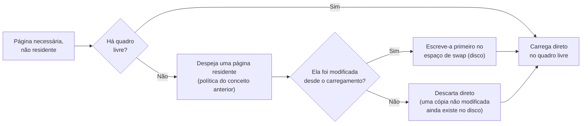

## Objetivos de Aprendizagem

- Definir a paginação sob demanda: carregar uma página na memória só quando ela é de fato referenciada, e não de antemão quando um processo começa.
- Explicar o swapping: mover uma página para o disco para liberar seu quadro, e trazê-la de volta numa falta de página posterior.
- Definir thrashing: o colapso da vazão quando a demanda de memória combinada de todos os processos em execução excede a memória física, e o sistema passa mais tempo paginando do que calculando.
- Explicar por que acrescentar mais processos a um sistema que já está em thrashing piora o desempenho, em vez de melhorá-lo.

## Contexto e Motivação

Todo conceito deste bloco até aqui supôs que as páginas de que um processo precisa simplesmente ficam residentes de algum jeito; este conceito preenche exatamente quando e por quê. A **paginação sob demanda** é a resposta prática: carregar uma página só quando ela é de fato referenciada pela primeira vez (ou referenciada de novo depois de ser despejada), em vez de carregar de antemão o espaço de endereçamento inteiro de um processo, boa parte do qual talvez nunca seja tocada numa dada execução. Isso permite que muito mais processos caibam na memória física ao mesmo tempo do que seus espaços de endereçamento virtuais combinados permitiriam de outra forma, até que, se processos demais precisarem de fato de memória demais ao mesmo tempo, o sistema chegue a um colapso que o OSTEP chama de **thrashing**, em que as faltas de página ficam tão frequentes que o sistema passa quase todo o tempo paginando e quase nada calculando de fato.

## Teoria Central

### Paginação sob demanda: carregar de forma preguiçosa, no primeiro toque

Com a paginação sob demanda, um processo começa a rodar com nenhuma (ou pouquíssimas) de suas páginas de fato residentes na memória física. A primeiríssima referência a qualquer página causa uma falta de página, não porque algo esteja errado, mas simplesmente porque aquela página genuinamente ainda nunca foi carregada. O tratador de faltas do SO localiza o conteúdo da página (normalmente no disco, como parte do arquivo executável do processo ou do seu espaço de swap), aloca um quadro físico para ela, carrega-a, atualiza a tabela de páginas e retoma a instrução que causou a falta, que agora tem sucesso. As referências seguintes à mesma página a encontram já residente, sem precisar de falta: exatamente o mesmo benefício guiado pela localidade já visto para o TLB, agora operando um nível mais abaixo, na granularidade de páginas inteiras e não de traduções individuais.

### Swapping: abrindo espaço movendo páginas para o disco

Quando a memória física está cheia e uma nova página precisa ser trazida, uma opção (além de simplesmente despejar uma página cujo conteúdo não é mais necessário) é o **swapping**: escrever o conteúdo de uma página despejada numa área dedicada do disco (o espaço de swap), liberando seu quadro físico, e trazer essa página de volta do espaço de swap depois, se ela for referenciada de novo. Isso permite que um sistema suporte processos cujo uso combinado de memória virtual genuinamente excede a RAM física, ao custo de uma operação de disco real e comparativamente lenta sempre que uma página enviada ao swap precisar ser trazida de volta.



### Thrashing: quando a demanda excede a oferta, no sistema inteiro

O **thrashing** ocorre quando o conjunto combinado de páginas que todos os processos em execução estão usando ativamente (às vezes chamado de *working set* de cada processo) excede o que a memória física consegue guardar ao mesmo tempo. Nesse estado, trazer a página necessária de um processo obriga a despejar uma página de que algum outro processo (ou o mesmo) ainda precisa ativamente, e que vai ela mesma dar falta de novo quase imediatamente; o sistema passa a esmagadora maioria do tempo atendendo faltas de página (cada uma envolvendo uma operação de disco comparativamente muito lenta) e quase nenhum tempo rodando de fato o cálculo real de algum processo. A vazão, longe de só se degradar de forma suave, pode desabar abruptamente quando esse limiar é cruzado.

### Por que acrescentar mais processos piora o thrashing, em vez de melhorá-lo

Um instinto natural, mas errado, quando um sistema parece subutilizado (CPU muitas vezes ociosa, esperando E/S de disco para paginação) é acrescentar mais processos para usar essa capacidade aparentemente sobrando. Sob thrashing, isso é exatamente ao contrário: acrescentar mais um processo só soma a demanda do working set dele por memória física a um sistema já sobrecarregado, fazendo os processos existentes perderem ainda mais das páginas de que precisam para o despejo e dando ainda mais faltas; o thrashing piora, e a vazão geral cai ainda mais, e não aumenta o "trabalho feito", como a intuição sugeriria. A correção é o contrário: reduzir o número de processos disputando memória (ou aumentar a memória física) até que os working sets combinados de fato caibam, ponto em que as faltas de página voltam a ser raras e a vazão se recupera.

## Exemplos Resolvidos

### Exemplo 1: paginação sob demanda em ação, as primeiras referências de um processo

Um processo começa com zero páginas residentes. Seu código começa a executar:

```text
Referência à página 0 (primeira instrução): FALTA. A página 0 é carregada do disco
    e fica residente. A instrução é reexecutada e tem sucesso.
Referência à página 0 (próxima instrução, mesma página): sem falta, já residente.
Referência à página 1 (um salto para uma função nova): FALTA. A página 1 é carregada.
Referência à página 1 (mais instruções nessa função): sem falta.
Referência à página 5 (uma rotina de tratamento de erro raramente usada): nunca é
    referenciada nesta execução específica. NUNCA é carregada, economizando o tempo
    e a memória que seriam gastos para carregá-la de antemão.
```

O processo roda corretamente tendo carregado só as páginas 0 e 1; o código de tratamento de erro da página 5, nunca exercitado de fato nesta execução, nunca custa nada, que é exatamente o benefício da paginação sob demanda em relação a carregar um executável inteiro de antemão, seja o que for que se use de fato.

### Exemplo 2: a vazão desabando quando a demanda cruza o limiar de memória disponível

Suponha que a memória física consiga guardar o equivalente a 100 páginas de dados residentes ao mesmo tempo, e que cada processo precise de cerca de 20 páginas ativamente residentes para rodar sem faltas constantes:

```text
4 processos rodando (4 x 20 = 80 páginas necessárias): cabe com folga em 100.
  Faltas de página: raras (só em páginas genuinamente novas). Vazão: alta.

5 processos rodando (5 x 20 = 100 páginas necessárias): exatamente no limite.
  Faltas de página: ainda controláveis, embora reste pouca folga.

6 processos rodando (6 x 20 = 120 páginas necessárias): EXCEDE as 100 disponíveis.
  As páginas usadas ativamente por todos os processos não conseguem mais ficar
  residentes ao mesmo tempo: as páginas são despejadas e dão falta de novo logo
  em seguida, repetidas vezes. Faltas de página: constantes. Vazão: desaba, bem
  abaixo até da vazão do caso de 4 processos, apesar de "mais trabalho" estar
  nominalmente escalonado.
```

Passar de 5 para 6 processos aqui não acrescenta cerca de um sexto a mais de trabalho útil: pode fazer *os seis* processos darem falta quase continuamente, calculando de fato bem menos, coletivamente, do que o caso de 4 processos; exatamente o colapso por thrashing que este conceito descreve.

### Exemplo 3: por que acrescentar um 7º processo piora o colapso, em vez de melhorá-lo

Continuando o cenário de 6 processos já em thrashing do Exemplo 2, suponha que um administrador bem-intencionado, vendo muita atividade de faltas de página e supondo que a CPU deve estar "ociosa e disponível", inicie um 7º processo:

```text
Antes: 6 processos x 20 páginas = 120 páginas pedidas, 100 disponíveis
       -> já em thrashing (déficit de 20 páginas)

Depois de acrescentar mais 1 processo: 7 x 20 = 140 páginas pedidas, 100 disponíveis
       -> o déficit sobe para 40 páginas: MAIS atividade de despejo seguido de falta
          imediata, e não menos; a vazão geral cai ainda mais, embora nominalmente
          haja mais processos "rodando".
```

A resposta correta para esse cenário é o contrário de acrescentar um processo: reduzir o número de processos rodando ao mesmo tempo (ou a demanda de memória deles) de volta a algo que de fato caiba nas 100 páginas disponíveis restaura taxas de falta controláveis e recupera a vazão.

## Equívocos Comuns e Armadilhas

- **"A paginação sob demanda carrega o programa inteiro de um processo na memória assim que ele começa, só que de forma mais eficiente."** Ela faz especificamente o contrário: as páginas são carregadas de forma preguiçosa, só na primeira referência real, então código ou dados nunca tocados numa dada execução (como a página de tratamento de erro não usada do Exemplo 1) nunca são carregados.
- **"Uma taxa alta de faltas de página sempre significa que algo está quebrado."** Uma taxa moderada de faltas de página, especialmente no começo da vida de um processo, quando a paginação sob demanda traz pela primeira vez suas páginas usadas ativamente, é inteiramente normal; o thrashing se refere especificamente a uma taxa *sustentada e severa*, em que o sistema passa quase todo o tempo dando faltas em vez de calculando, uma condição qualitativamente diferente, de colapso.
- **"Se a CPU parece ociosa durante o thrashing, acrescentar mais trabalho vai usar essa capacidade sobrando de forma produtiva."** Sob thrashing genuíno, a aparente ociosidade da CPU reflete processos esperando E/S de disco lenta para paginação, e não capacidade realmente sobrando; acrescentar mais processos aumenta a demanda total de memória num sistema já sobrecarregado, piorando a taxa de faltas e *reduzindo* ainda mais a vazão geral, exatamente o oposto de usar capacidade ociosa de forma produtiva.
- **"Swapping e paginação são a mesma coisa."** A paginação é o mecanismo geral de dividir a memória em unidades de tamanho fixo e mapeá-las por uma tabela de páginas; o swapping se refere especificamente a mover o conteúdo de uma página despejada para (e depois de volta de) um espaço de swap em disco para liberar um quadro físico. Uma operação de swapping é uma consequência possível, e comparativamente cara, de uma decisão de despejo da paginação, e não um sinônimo de paginação.

## Resumo

A paginação sob demanda carrega cada página só na sua primeira referência real, permitindo que um processo rode corretamente tendo carregado só as páginas que de fato usa, e permitindo que o uso de memória virtual de muito mais processos caiba numa RAM física limitada do que seria possível carregando tudo de antemão. Quando a memória está cheia, despejar uma página pode exigir fazer **swapping** dela para o disco primeiro, se ela tiver sido modificada, ao custo de uma operação de disco comparativamente lenta para trazê-la de volta depois, se for necessária de novo. O **thrashing** é o colapso de todo o sistema que ocorre quando a memória combinada usada ativamente (os working sets) de todos os processos em execução excede a memória física: as páginas são despejadas e dão falta de novo quase imediatamente, num ciclo contínuo, e a vazão desaba bem abaixo do que uma carga mais leve e que coubesse melhor alcançaria, com a consequência contraintuitiva de que acrescentar mais processos a um sistema já em thrashing piora o colapso em vez de melhorá-lo, já que só soma mais demanda a um recurso já sobrecarregado. Com o arco completo da memória virtual agora coberto (dos espaços de endereçamento, passando pelos mecanismos de tradução, até a política de despejo e a pressão de memória em todo o sistema), o bloco final desta disciplina se volta para outro recurso que o SO também virtualiza e gerencia: o armazenamento persistente, por meio do sistema de arquivos.

## Documentation Links

- [Arpaci-Dusseau: Operating Systems: Three Easy Pieces, "Complete Virtual Memory Systems"](https://pages.cs.wisc.edu/~remzi/OSTEP/vm-complete.pdf): o tratamento canônico da paginação sob demanda, do swapping e do thrashing a partir do qual este conceito é construído.
- [UC Berkeley CS162: Operating Systems and Systems Programming](https://cs162.org/): curso que cobre a paginação sob demanda e o thrashing como as consequências em nível de sistema da sobrecarga de memória.
