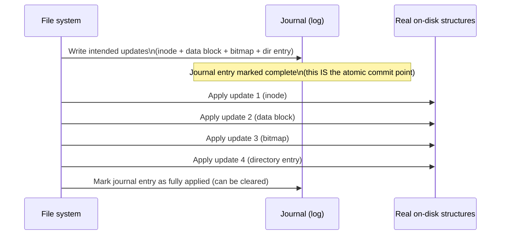

## Learning Objectives

- Describe how a file system tracks which disk blocks are free, and where inodes themselves are stored on disk.
- Explain why a multi-block update (writing a new inode, a new data block, and updating a free-space bitmap) can leave the disk in an inconsistent state if a crash happens partway through.
- Describe journaling: writing an intended set of updates to a log before applying them, and how this makes crash recovery reliable.
- Trace a concrete crash scenario with and without journaling, and explain the difference in what recovery finds.

## Context & Motivation

The previous concept described a file system's logical structure — inodes and directories — as if updates to them always happen cleanly, instantly, all at once. In reality, creating a new file, for instance, requires updating *several* separate on-disk structures: allocating a new inode, writing its initial content to a new data block, updating a free-space tracking structure to mark that block as used, and adding a new directory entry pointing to the new inode. Each of these is a separate write to disk, and a real machine can lose power, or a real OS can crash, at any point *between* these separate writes — leaving some already written and others not, a state no correctly-functioning file system should ever be able to reach. **Journaling** is the now-standard technique for making this multi-step update effectively atomic despite a crash landing anywhere in the middle.

## Core Theory

### Tracking free space and locating inodes

A file system needs to know which disk blocks are currently free (available for new allocations) and which are in use — commonly tracked via a **bitmap**, one bit per block, set if that block is currently allocated. Inodes themselves are typically stored in a dedicated, fixed region of the disk (an inode table), addressable by inode number, so that resolving an inode number to its actual on-disk metadata is a direct, fast lookup rather than a search.

### The crash-consistency problem: several writes, one operation

Creating a new file conceptually requires updating at least these on-disk structures, each a separate write:

1. Allocate a new inode (write its initial metadata into the inode table).
2. Allocate a new data block for the file's content (write the actual data).
3. Update the block-allocation bitmap to mark the new data block as used.
4. Update the containing directory's data to add a new `(name, inode number)` entry.

If the disk (or the whole machine) crashes after step 1 but before step 3, for instance, the inode exists on disk, but the bitmap doesn't yet reflect that its data block is in use — a future allocation might hand out that "free-looking" block to something else entirely, corrupting the just-created file's data without warning. Different crash points between these steps can leave different, genuinely inconsistent combinations of updates applied and not applied — this is the **crash-consistency problem**, and it exists precisely because these several writes are not, at the hardware level, one single atomic operation.

### Journaling: log the intent first, then apply it

**Journaling** solves this by writing a description of the *intended* set of updates to a dedicated log (the journal) on disk *before* actually applying any of them to the file system's real structures. Once the full set of intended updates is safely recorded in the journal, the file system applies them to the real structures; if a crash happens during this application phase, recovery after reboot simply re-reads the journal and re-applies (or, depending on the exact protocol, safely discards and retries) whatever updates the journal shows were intended — because the *complete* intended set of changes was safely recorded as a single unit before any of the risky, multi-step application began.



The crucial insight: the moment the *complete* intended-update record is safely written to the journal is treated as the atomic commit point. If a crash happens anywhere during the "apply to real structures" phase, recovery can tell, by reading the journal, exactly what *should* have happened, and can safely finish applying it (or, if the journal entry itself was never fully written before the crash, safely discard it entirely as if the whole operation never started) — either way, recovery reaches a consistent state, never a partially-applied, corrupted one.

### Why this matters at exactly this discipline's level

Crash consistency is a genuine, real-world engineering problem file systems must solve — and journaling's core idea (write your intent to a durable log first, so a multi-step operation can be safely completed or safely discarded after an interruption, but never left half-done) is a specific instance of a much more general pattern for making complex, multi-step operations safe against failure — the same spirit, if not the identical mechanism, as the atomicity guarantees this platform's later database-oriented material addresses for multi-step transactions.

## Worked Examples

### Example 1: A crash without journaling — a corrupted, inconsistent state

Continuing the file-creation sequence from Core Theory, suppose the crash happens exactly after step 1 (inode written) and step 2 (data written), but before step 3 (bitmap updated):

```text
After crash, on reboot:
  Inode table:  new inode #99 exists, points to data block 700
  Data block 700: contains the new file's actual content
  Bitmap:        block 700 still marked FREE (step 3 never happened)
  Directory:     no entry yet points to inode 99 (step 4 never happened)

Consequence: block 700 looks free to the allocator. A LATER, unrelated
  file creation could be handed block 700 as if it were empty, silently
  overwriting the first file's real data -- with no directory entry
  even existing yet to reveal that anything was ever there.
```

This is a genuinely corrupted, inconsistent on-disk state — not merely "the new file didn't get created," but an active, silent risk of a *different* future file corrupting data that logically belongs to inode 99.

### Example 2: The identical crash, with journaling in place

Same crash point (after inode and data-block writes, before the bitmap update), but now every one of the four updates was first written as one journal entry before any application began:

```text
On reboot, recovery reads the journal:
  Journal entry: "create inode 99, write data to block 700,
                  mark block 700 used in bitmap, add directory
                  entry (notes2.txt -> inode 99)" -- marked COMPLETE
                  in the journal (fully written before the crash).

Since the journal entry is complete, recovery SAFELY RE-APPLIES any
  steps that hadn't finished yet (in this case, marking block 700 used
  in the bitmap, and adding the directory entry) -- reaching exactly
  the fully-consistent end state the original operation intended,
  with no corrupted or ambiguous state ever left behind.
```

### Example 3: A crash during the journal write itself

Suppose the crash happens even earlier — while the journal entry itself is still being written, before it's marked complete:

```text
On reboot, recovery reads the journal:
  Journal entry: INCOMPLETE (crash happened mid-write of the entry itself)

Since the entry was never marked complete, recovery safely DISCARDS it
  entirely -- as if the file-creation operation had never been
  attempted at all. No partial inode, no orphaned data block, no
  inconsistency: the file system looks exactly as it did before the
  operation started.
```

This is the second half of journaling's guarantee: a crash before the journal entry is complete is treated as if the whole operation never happened; a crash after it's complete is treated as an operation that will definitely finish being applied — there is no possible crash point that leaves an ambiguous, half-applied state, unlike Example 1's non-journaled scenario.

## Common Misconceptions & Pitfalls

- **"Journaling prevents crashes from ever happening."** Journaling does nothing to prevent a crash — it makes recovery *after* a crash reliable, by ensuring the file system can always determine, from the journal, exactly which operations should be considered fully applied and which should be discarded entirely, rather than being left in an ambiguous partial state.
- **"Without journaling, a file system simply fails to create the new file — nothing else is affected."** As Example 1 shows, the danger isn't merely "the operation didn't finish" — it's that other, unrelated structures (like the free-space bitmap) can be left describing a state that doesn't match reality, creating real corruption risk for *future*, unrelated operations.
- **"The journal itself is where the file's data permanently lives."** The journal records the *intent* to make a set of changes, used specifically for crash recovery — the file's actual, permanent data lives in the real on-disk structures (inode table, data blocks) that the journal's recorded intent is eventually applied to; the journal entry is typically discarded once its updates are confirmed fully applied.
- **"A single disk write (like writing one block) can also be interrupted mid-write, so journaling doesn't really solve anything."** Real disks (and their controllers) provide some guarantee about individual block writes being atomic at that granularity — the crash-consistency problem journaling addresses is specifically about *multiple, separate* writes needing to appear atomic *together*, a genuinely different and harder problem than any single write's own atomicity.

## Summary

Creating or modifying a file requires several separate on-disk writes — an inode, a data block, a free-space bitmap update, a directory entry — and a crash landing between any of these writes can leave the file system in a genuinely inconsistent state, as Example 1's silently-corruptible "free-looking but actually used" block shows concretely. **Journaling** solves this by first writing the complete set of intended updates to a durable log, treating the moment that log entry is fully written as the atomic commit point: a crash before that point means recovery safely discards the entire operation as if it never started; a crash after that point means recovery safely finishes applying every intended update, reaching a fully consistent end state either way. This is a specific, now near-universal instance of a general pattern for making multi-step operations crash-safe. With this discipline's file-systems cluster — the structural picture of inodes and directories, now followed by the mechanics of safe, crash-consistent updates — complete, the capstone concept that closes this discipline traces one concrete process's entire journey through every mechanism covered: creation, scheduling, memory access, a page fault, and finally a real disk read through exactly this file-system layer.

## Documentation Links

- [Arpaci-Dusseau — Operating Systems: Three Easy Pieces, "File System Implementation"](https://pages.cs.wisc.edu/~remzi/OSTEP/file-implementation.pdf) — the canonical treatment of on-disk file system layout, crash consistency, and journaling this concept is built from.
- [ACM/IEEE CS2013 — Operating Systems Knowledge Area](https://csed.acm.org/knowledge-areas-operating-systems-os-cs2013-version/) — curriculum guidelines naming journaling and log-structured file systems as core fault-tolerance techniques within the (elective) File Systems topic.
