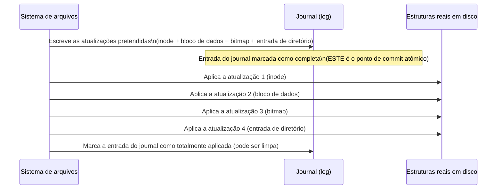

## Objetivos de Aprendizagem

- Descrever como um sistema de arquivos acompanha quais blocos de disco estão livres, e onde os próprios inodes ficam guardados no disco.
- Explicar por que uma atualização de vários blocos (escrever um novo inode, um novo bloco de dados e atualizar um bitmap de espaço livre) pode deixar o disco num estado inconsistente se acontecer uma falha no meio do caminho.
- Descrever o journaling: escrever um conjunto pretendido de atualizações num log antes de aplicá-las, e como isso torna confiável a recuperação depois de uma falha.
- Acompanhar um cenário concreto de falha com e sem journaling, e explicar a diferença no que a recuperação encontra.

## Contexto e Motivação

O conceito anterior descreveu a estrutura lógica de um sistema de arquivos (inodes e diretórios) como se as atualizações neles sempre acontecessem de forma limpa, instantânea, tudo de uma vez. Na realidade, criar um arquivo novo, por exemplo, exige atualizar *várias* estruturas separadas em disco: alocar um novo inode, escrever seu conteúdo inicial num novo bloco de dados, atualizar uma estrutura de controle de espaço livre para marcar esse bloco como usado, e acrescentar uma nova entrada de diretório apontando para o novo inode. Cada uma dessas é uma escrita separada no disco, e uma máquina real pode perder energia, ou um SO real pode travar, em qualquer ponto *entre* essas escritas separadas, deixando algumas já escritas e outras não, um estado que nenhum sistema de arquivos funcionando corretamente deveria jamais conseguir alcançar. O **journaling** é a técnica hoje padrão para tornar essa atualização de vários passos efetivamente atômica, mesmo com uma falha caindo em qualquer lugar no meio.

## Teoria Central

### Acompanhando o espaço livre e localizando inodes

Um sistema de arquivos precisa saber quais blocos de disco estão livres no momento (disponíveis para novas alocações) e quais estão em uso, o que costuma ser acompanhado por um **bitmap**, um bit por bloco, ligado se aquele bloco estiver alocado no momento. Os próprios inodes costumam ficar guardados numa região fixa e dedicada do disco (uma tabela de inodes), endereçável pelo número do inode, de modo que resolver um número de inode até seus metadados reais em disco seja uma consulta direta e rápida, e não uma busca.

### O problema da consistência a falhas: várias escritas, uma operação

Criar um arquivo novo exige, conceitualmente, atualizar pelo menos estas estruturas em disco, cada uma numa escrita separada:

1. Alocar um novo inode (escrever seus metadados iniciais na tabela de inodes).
2. Alocar um novo bloco de dados para o conteúdo do arquivo (escrever os dados reais).
3. Atualizar o bitmap de alocação de blocos para marcar o novo bloco de dados como usado.
4. Atualizar os dados do diretório que o contém para acrescentar uma nova entrada `(nome, número do inode)`.

Se o disco (ou a máquina inteira) falhar depois do passo 1, mas antes do passo 3, por exemplo, o inode existe no disco, mas o bitmap ainda não reflete que seu bloco de dados está em uso; uma alocação futura poderia entregar esse bloco "aparentemente livre" para algo completamente diferente, corrompendo os dados do arquivo recém-criado sem aviso. Pontos de falha diferentes entre esses passos podem deixar combinações diferentes, e genuinamente inconsistentes, de atualizações aplicadas e não aplicadas; esse é o **problema da consistência a falhas**, e ele existe precisamente porque essas várias escritas não são, em nível de hardware, uma única operação atômica.

### Journaling: registre a intenção primeiro, depois aplique

O **journaling** resolve isso escrevendo uma descrição do conjunto *pretendido* de atualizações num log dedicado (o journal) em disco *antes* de de fato aplicar qualquer uma delas às estruturas reais do sistema de arquivos. Quando o conjunto completo de atualizações pretendidas está registrado com segurança no journal, o sistema de arquivos as aplica às estruturas reais; se acontecer uma falha durante essa fase de aplicação, a recuperação depois de reiniciar simplesmente relê o journal e reaplica (ou, dependendo do protocolo exato, descarta com segurança e tenta de novo) as atualizações que o journal mostra como pretendidas, porque o conjunto *completo* de mudanças pretendidas foi registrado com segurança como uma única unidade antes de começar qualquer parte da aplicação arriscada, de vários passos.



A ideia crucial: o momento em que o registro *completo* de atualizações pretendidas está escrito com segurança no journal é tratado como o ponto de commit atômico. Se acontecer uma falha em qualquer ponto da fase "aplicar às estruturas reais", a recuperação consegue saber, lendo o journal, exatamente o que *deveria* ter acontecido, e pode terminar de aplicá-lo com segurança (ou, se a própria entrada do journal nunca foi totalmente escrita antes da falha, descartá-la por completo com segurança, como se a operação inteira nunca tivesse começado); de qualquer jeito, a recuperação chega a um estado consistente, nunca a um estado parcialmente aplicado e corrompido.

### Por que isso importa exatamente no nível desta disciplina

A consistência a falhas é um problema de engenharia genuíno, do mundo real, que os sistemas de arquivos precisam resolver; e a ideia central do journaling (escrever primeiro sua intenção num log durável, para que uma operação de vários passos possa ser terminada com segurança ou descartada com segurança depois de uma interrupção, mas nunca deixada pela metade) é uma instância específica de um padrão muito mais geral para tornar operações complexas, de vários passos, seguras contra falhas; o mesmo espírito, ainda que não o mesmo mecanismo, das garantias de atomicidade que o material posterior desta plataforma, voltado para bancos de dados, trata para transações de vários passos.

## Exemplos Resolvidos

### Exemplo 1: uma falha sem journaling, um estado corrompido e inconsistente

Continuando a sequência de criação de arquivo da Teoria Central, suponha que a falha aconteça exatamente depois do passo 1 (inode escrito) e do passo 2 (dados escritos), mas antes do passo 3 (bitmap atualizado):

```text
Depois da falha, ao reiniciar:
  Tabela de inodes: o novo inode #99 existe e aponta para o bloco de dados 700
  Bloco de dados 700: contém o conteúdo real do novo arquivo
  Bitmap:             o bloco 700 continua marcado como LIVRE (o passo 3 nunca aconteceu)
  Diretório:          nenhuma entrada aponta ainda para o inode 99 (o passo 4 nunca aconteceu)

Consequência: o bloco 700 parece livre para o alocador. Uma criação de arquivo
  POSTERIOR e não relacionada poderia receber o bloco 700 como se estivesse
  vazio, sobrescrevendo silenciosamente os dados reais do primeiro arquivo,
  sem que exista sequer uma entrada de diretório para revelar que algo
  esteve ali.
```

Esse é um estado em disco genuinamente corrompido e inconsistente: não é só "o arquivo novo não foi criado", mas um risco ativo e silencioso de um arquivo futuro *diferente* corromper dados que logicamente pertencem ao inode 99.

### Exemplo 2: a mesma falha, com journaling em funcionamento

O mesmo ponto de falha (depois das escritas do inode e do bloco de dados, antes da atualização do bitmap), mas agora cada uma das quatro atualizações foi escrita primeiro como uma única entrada de journal, antes de começar qualquer aplicação:

```text
Ao reiniciar, a recuperação lê o journal:
  Entrada do journal: "criar o inode 99, escrever os dados no bloco 700,
                       marcar o bloco 700 como usado no bitmap, acrescentar
                       a entrada de diretório (notes2.txt -> inode 99)",
                       marcada como COMPLETA no journal (totalmente
                       escrita antes da falha).

Como a entrada do journal está completa, a recuperação REAPLICA COM SEGURANÇA
  os passos que ainda não tinham terminado (neste caso, marcar o bloco 700
  como usado no bitmap e acrescentar a entrada de diretório), chegando
  exatamente ao estado final totalmente consistente que a operação original
  pretendia, sem deixar para trás nenhum estado corrompido ou ambíguo.
```

### Exemplo 3: uma falha durante a própria escrita do journal

Suponha que a falha aconteça ainda mais cedo, enquanto a própria entrada do journal ainda está sendo escrita, antes de ser marcada como completa:

```text
Ao reiniciar, a recuperação lê o journal:
  Entrada do journal: INCOMPLETA (a falha aconteceu no meio da escrita da própria entrada)

Como a entrada nunca foi marcada como completa, a recuperação a DESCARTA
  com segurança por completo, como se a operação de criação de arquivo nunca
  tivesse sido tentada. Nenhum inode parcial, nenhum bloco de dados órfão,
  nenhuma inconsistência: o sistema de arquivos fica exatamente como estava
  antes de a operação começar.
```

Essa é a segunda metade da garantia do journaling: uma falha antes de a entrada do journal estar completa é tratada como se a operação inteira nunca tivesse acontecido; uma falha depois de ela estar completa é tratada como uma operação que com certeza vai terminar de ser aplicada; não existe ponto de falha possível que deixe um estado ambíguo e meio aplicado, ao contrário do cenário sem journaling do Exemplo 1.

## Equívocos Comuns e Armadilhas

- **"O journaling impede que falhas aconteçam."** O journaling não faz nada para impedir uma falha: ele torna confiável a recuperação *depois* de uma falha, garantindo que o sistema de arquivos sempre consiga determinar, pelo journal, exatamente quais operações devem ser consideradas totalmente aplicadas e quais devem ser descartadas por completo, em vez de ficarem num estado parcial ambíguo.
- **"Sem journaling, um sistema de arquivos simplesmente não consegue criar o arquivo novo, e nada mais é afetado."** Como o Exemplo 1 mostra, o perigo não é só "a operação não terminou": é que outras estruturas, não relacionadas (como o bitmap de espaço livre), podem ficar descrevendo um estado que não bate com a realidade, criando risco real de corrupção para operações *futuras* e não relacionadas.
- **"O próprio journal é onde os dados do arquivo ficam permanentemente."** O journal registra a *intenção* de fazer um conjunto de mudanças, usado especificamente para a recuperação depois de falhas; os dados reais e permanentes do arquivo ficam nas estruturas reais em disco (tabela de inodes, blocos de dados) às quais a intenção registrada no journal acaba sendo aplicada; a entrada do journal normalmente é descartada quando se confirma que suas atualizações foram totalmente aplicadas.
- **"Uma única escrita em disco (como escrever um bloco) também pode ser interrompida no meio, então o journaling não resolve nada de verdade."** Discos reais (e suas controladoras) oferecem alguma garantia de que escritas individuais de bloco são atômicas nessa granularidade; o problema de consistência a falhas que o journaling trata é especificamente sobre *várias escritas separadas* precisarem parecer atômicas *juntas*, um problema genuinamente diferente e mais difícil que a atomicidade de uma única escrita.

## Resumo

Criar ou modificar um arquivo exige várias escritas separadas em disco (um inode, um bloco de dados, uma atualização do bitmap de espaço livre, uma entrada de diretório), e uma falha caindo entre qualquer uma dessas escritas pode deixar o sistema de arquivos num estado genuinamente inconsistente, como mostra concretamente o bloco "aparentemente livre, mas na verdade usado" e silenciosamente corrompível do Exemplo 1. O **journaling** resolve isso escrevendo primeiro o conjunto completo de atualizações pretendidas num log durável, tratando como ponto de commit atômico o momento em que essa entrada de log está totalmente escrita: uma falha antes desse ponto significa que a recuperação descarta com segurança a operação inteira, como se ela nunca tivesse começado; uma falha depois desse ponto significa que a recuperação termina com segurança de aplicar cada atualização pretendida, chegando a um estado final totalmente consistente de qualquer jeito. Essa é uma instância específica, e hoje quase universal, de um padrão geral para tornar operações de vários passos seguras contra falhas. Com o bloco de sistemas de arquivos desta disciplina completo (o quadro estrutural de inodes e diretórios, agora seguido da mecânica de atualizações seguras e consistentes a falhas), o conceito final que fecha esta disciplina acompanha a jornada inteira de um processo concreto por todos os mecanismos vistos: criação, escalonamento, acesso à memória, uma falta de página e, por fim, uma leitura real de disco exatamente por esta camada de sistema de arquivos.

## Documentation Links

- [Arpaci-Dusseau: Operating Systems: Three Easy Pieces, "File System Implementation"](https://pages.cs.wisc.edu/~remzi/OSTEP/file-implementation.pdf): o tratamento canônico do layout de sistemas de arquivos em disco, da consistência a falhas e do journaling a partir do qual este conceito é construído.
- [ACM/IEEE CS2013: Operating Systems Knowledge Area](https://csed.acm.org/knowledge-areas-operating-systems-os-cs2013-version/): diretrizes curriculares que nomeiam o journaling e os sistemas de arquivos estruturados em log como técnicas centrais de tolerância a falhas dentro do tópico (eletivo) de Sistemas de Arquivos.
