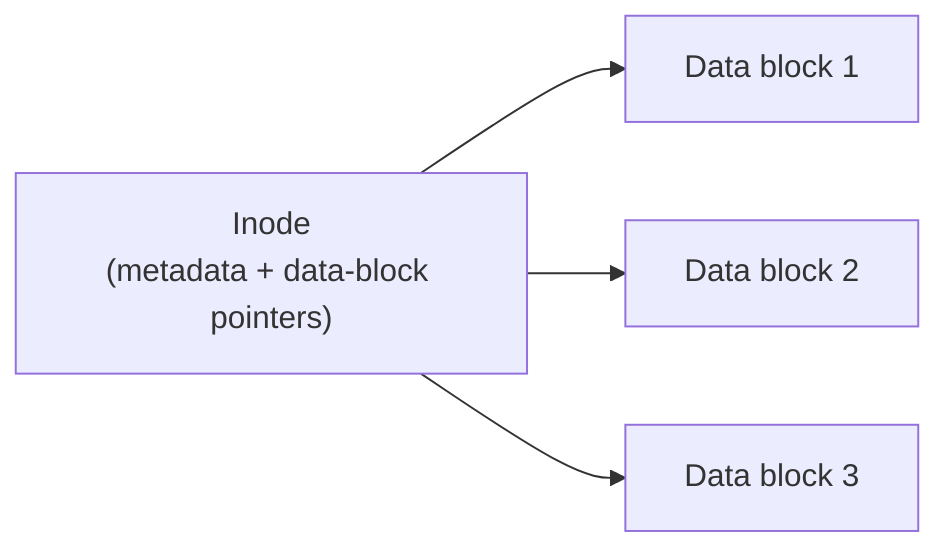

## Learning Objectives

- Explain a file system's core job: turning a flat array of disk blocks into named, organized, persistent files.
- Describe an inode's role: holding a file's metadata and the pointers that locate its actual data blocks on disk.
- Describe a directory as a special file mapping human-readable names to inode numbers, and explain how this enables a hierarchical namespace.
- Trace, step by step, how opening a file by path name resolves down to its actual data blocks via directories and an inode.

## Context & Motivation

Every concept so far in this discipline has concerned memory — RAM, which loses its contents the instant power is lost. Persistent storage — disk — is fundamentally different: it survives across reboots, and the OS's job with respect to it is different too. A raw disk is just a flat, numbered array of fixed-size blocks; the **file system** is the layer that turns that flat array into the abstraction every program actually uses: named files, organized into directories, that persist and can be found again by name rather than by memorizing block numbers. ACM/IEEE CS2013 explicitly marks file systems as an elective topic within its Operating Systems knowledge area (unlike scheduling, concurrency, and memory management, all marked core) — a real, citable signal that this material, while genuinely important in practice and given real space here and in OSTEP's own extensive persistence coverage, is treated with somewhat less exhaustive depth in this discipline than the core-mechanics clusters that preceded it.

## Core Theory

### The inode: a file's metadata and data-block map

An **inode** ("index node") holds everything the file system needs to know about one file except its name: its size, its permissions, its owner, its timestamps, and — critically — pointers to the actual disk blocks where its data physically lives. A file's inode is typically identified by an **inode number**, an integer that's the file system's true internal identity for that file — a file's human-readable name, as the next section covers, is a separate, additional layer entirely.



### Directories: files that map names to inode numbers

A **directory** is, itself, just a special kind of file — its own inode, its own data blocks — except its data is specifically a list of `(name, inode number)` pairs rather than arbitrary content. Looking up a file by name means reading a directory's data blocks and searching for a matching name entry, which yields that file's inode number — the actual gateway to its metadata and real data blocks.

### Hierarchical namespace: directories containing directories

Because a directory's entries can themselves point to the inodes of *other directories*, directories can nest arbitrarily deep, building the familiar hierarchical path structure (`/home/alice/notes.txt`) out of nothing more than directories-as-files repeatedly containing name-to-inode-number mappings, with no separate mechanism needed beyond what's already described above.

### Resolving a path name, one directory lookup at a time

Opening a file by its full path requires walking this structure one component at a time, starting from a well-known root: look up `home` in the root directory's entries to get `home`'s inode number, read *that* directory's data (since it's an inode pointing to more data blocks, exactly like any other file) to look up `alice`, get *that* directory's inode, read its entries to look up `notes.txt`, and finally arrive at `notes.txt`'s own inode — only now, at the very end, reaching the actual file's metadata and real data-block pointers.

## Worked Examples

### Example 1: A minimal inode, concretely

```text
Inode #42:
  Type:  regular file
  Size:  6144 bytes
  Owner: alice
  Permissions: rw-r--r--
  Data block pointers: [block 501, block 502]
```

Nothing here mentions the file's *name* — "notes.txt" appears nowhere inside inode #42 itself. The name lives entirely in whichever directory happens to contain an entry pointing at inode 42; the same inode could, in principle, be pointed to by multiple different directory entries (with different names) simultaneously — a real feature (hard links) beyond this discipline's depth, but a direct consequence of names and inodes being genuinely separate layers.

### Example 2: A directory's actual contents

```text
Directory "/home/alice" (itself inode #17, its data blocks contain):
  name           inode number
  ----           ------------
  notes.txt      42
  photos         88     <- another directory (nested)
  .              17     <- alice's own inode (self-reference)
  ..             5      <- parent directory's inode (/home)
```

This directory's "data" is nothing more than this small table of name-to-inode-number pairs — reading it and scanning for `notes.txt` yields `42`, exactly the inode from Example 1, which is what actually holds the file's size, permissions, and real data-block pointers.

### Example 3: Resolving `/home/alice/notes.txt` step by step

```text
Step 1: Start at the root directory's well-known inode (say, inode #2).
Step 2: Read root's data blocks; look up "home" -> inode #5.
Step 3: Read inode #5's data blocks (it's a directory); look up "alice" -> inode #17.
Step 4: Read inode #17's data blocks (Example 2's table); look up "notes.txt" -> inode #42.
Step 5: Read inode #42 itself (Example 1) -- NOW we have the file's real
        metadata and data-block pointers (blocks 501, 502).
Step 6: Read blocks 501 and 502 to get the file's actual 6144 bytes of content.
```

Every one of steps 2 through 4 is the *identical* operation — read a directory's data, scan for a matching name, follow to the next inode — repeated once per path component; only step 5 finally reaches the target file's own inode, and only step 6 reaches its actual data.

## Common Misconceptions & Pitfalls

- **"A file's name is stored in the file's own inode."** A file's name lives entirely in the directory entry (or entries) pointing to it, not in the inode itself — the inode holds metadata and data-block pointers, but has no concept of "its own name," which is exactly what makes multiple names for the same underlying file (hard links) possible in real file systems.
- **"Opening a deeply nested file is a single, direct lookup."** Resolving a path requires walking one directory at a time, from the root down, exactly as Example 3 traces — a deeply nested path genuinely requires proportionally more directory reads to resolve, not a single shortcut lookup.
- **"A directory is a fundamentally different kind of object from a regular file."** A directory is itself just a file with its own inode and data blocks — the only real difference is what its data blocks are interpreted as containing (name-to-inode-number entries, rather than arbitrary content), not some entirely separate mechanism.
- **"File systems are as central to this discipline's core as scheduling, memory, and concurrency."** ACM/IEEE CS2013 itself marks file systems as an elective Operating Systems topic, distinct from the core-marked scheduling, concurrency, and memory management already covered in depth in this discipline — file systems are covered here at a correspondingly lighter, still-real depth, appropriate to that distinction.

## Summary

A file system turns a disk's flat array of numbered blocks into the named, hierarchical abstraction every program actually uses. An **inode** holds one file's metadata and the pointers locating its actual data on disk, but has no concept of its own name; a **directory** is itself just a file whose data blocks hold a table mapping human-readable names to inode numbers, and directories containing entries for other directories is exactly what builds the familiar nested path hierarchy. Opening a file by path name means walking this structure one component at a time — reading a directory's entries, following to the next inode, repeating — until the final path component resolves to the target file's own inode, which is only then read for its real metadata and data-block pointers. This structural picture — inodes and directories — is the "what" of a file system's organization; the next concept turns to the "how": how these structures are actually laid out and updated on disk safely, especially in the face of a crash mid-update.

## Documentation Links

- [Arpaci-Dusseau — Operating Systems: Three Easy Pieces, "Files and Directories"](https://pages.cs.wisc.edu/~remzi/OSTEP/file-intro.pdf) — the canonical treatment of inodes, directories, and path resolution this concept is built from.
- [ACM/IEEE CS2013 — Operating Systems Knowledge Area](https://csed.acm.org/knowledge-areas-operating-systems-os-cs2013-version/) — curriculum guidelines marking file systems (including file organization) as an elective Operating Systems topic.
