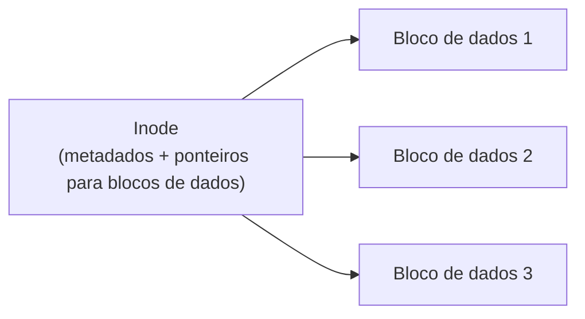

## Objetivos de Aprendizagem

- Explicar o trabalho central de um sistema de arquivos: transformar um array plano de blocos de disco em arquivos com nome, organizados e persistentes.
- Descrever o papel de um inode: guardar os metadados de um arquivo e os ponteiros que localizam seus blocos de dados reais no disco.
- Descrever um diretório como um arquivo especial que mapeia nomes legíveis por humanos em números de inode, e explicar como isso viabiliza um espaço de nomes hierárquico.
- Acompanhar, passo a passo, como abrir um arquivo pelo nome do caminho se resolve até seus blocos de dados reais por meio de diretórios e de um inode.

## Contexto e Motivação

Todo conceito até aqui nesta disciplina tratou de memória: a RAM, que perde seu conteúdo no instante em que a energia acaba. O armazenamento persistente (o disco) é fundamentalmente diferente: ele sobrevive a reinicializações, e o trabalho do SO em relação a ele também é diferente. Um disco bruto é só um array plano e numerado de blocos de tamanho fixo; o **sistema de arquivos** é a camada que transforma esse array plano na abstração que todo programa de fato usa: arquivos com nome, organizados em diretórios, que persistem e podem ser encontrados de novo pelo nome, sem precisar decorar números de bloco. O ACM/IEEE CS2013 marca explicitamente os sistemas de arquivos como um tópico eletivo dentro da sua área de conhecimento de Sistemas Operacionais (ao contrário de escalonamento, concorrência e gerenciamento de memória, todos marcados como centrais), um sinal real e citável de que este material, embora genuinamente importante na prática e com espaço real aqui e na extensa cobertura de persistência do próprio OSTEP, é tratado nesta disciplina com profundidade um pouco menos exaustiva do que os blocos de mecânica central que vieram antes.

## Teoria Central

### O inode: os metadados de um arquivo e o mapa dos seus blocos de dados

Um **inode** ("index node", nó de índice) guarda tudo o que o sistema de arquivos precisa saber sobre um arquivo, exceto seu nome: seu tamanho, suas permissões, seu dono, suas marcas de tempo e, de forma crucial, os ponteiros para os blocos de disco onde seus dados ficam fisicamente. O inode de um arquivo costuma ser identificado por um **número de inode**, um inteiro que é a verdadeira identidade interna daquele arquivo para o sistema de arquivos; o nome legível por humanos de um arquivo, como a próxima seção mostra, é uma camada separada e adicional.



### Diretórios: arquivos que mapeiam nomes em números de inode

Um **diretório** é, ele mesmo, só um tipo especial de arquivo (seu próprio inode, seus próprios blocos de dados), exceto que seus dados são especificamente uma lista de pares `(nome, número do inode)` em vez de conteúdo arbitrário. Procurar um arquivo pelo nome significa ler os blocos de dados de um diretório e buscar uma entrada com o nome correspondente, o que dá o número do inode daquele arquivo: a porta de entrada real para seus metadados e seus blocos de dados reais.

### Espaço de nomes hierárquico: diretórios contendo diretórios

Como as entradas de um diretório podem elas mesmas apontar para os inodes de *outros diretórios*, os diretórios podem se aninhar com profundidade arbitrária, construindo a estrutura hierárquica de caminhos familiar (`/home/alice/notes.txt`) a partir de nada mais que diretórios-como-arquivos contendo repetidamente mapeamentos de nome para número de inode, sem precisar de nenhum mecanismo separado além do já descrito acima.

### Resolvendo o nome de um caminho, uma consulta de diretório por vez

Abrir um arquivo pelo seu caminho completo exige percorrer essa estrutura um componente de cada vez, começando por uma raiz bem conhecida: procurar `home` nas entradas do diretório raiz para obter o número do inode de `home`, ler os dados *desse* diretório (já que ele é um inode que aponta para mais blocos de dados, exatamente como qualquer outro arquivo) para procurar `alice`, obter o inode *desse* diretório, ler suas entradas para procurar `notes.txt` e, por fim, chegar ao próprio inode de `notes.txt`; só agora, no finalzinho, alcançando os metadados reais do arquivo e seus ponteiros para blocos de dados.

## Exemplos Resolvidos

### Exemplo 1: um inode mínimo, de forma concreta

```text
Inode #42:
  Tipo:  arquivo comum
  Tamanho: 6144 bytes
  Dono: alice
  Permissões: rw-r--r--
  Ponteiros para blocos de dados: [bloco 501, bloco 502]
```

Nada aqui menciona o *nome* do arquivo: "notes.txt" não aparece em lugar nenhum dentro do próprio inode #42. O nome fica inteiramente no diretório que por acaso contenha uma entrada apontando para o inode 42; o mesmo inode poderia, em princípio, ser apontado por várias entradas de diretório diferentes (com nomes diferentes) ao mesmo tempo, um recurso real (hard links) além da profundidade desta disciplina, mas uma consequência direta de nomes e inodes serem camadas genuinamente separadas.

### Exemplo 2: o conteúdo real de um diretório

```text
Diretório "/home/alice" (ele mesmo o inode #17; seus blocos de dados contêm):
  nome           número do inode
  ----           ---------------
  notes.txt      42
  photos         88     <- outro diretório (aninhado)
  .              17     <- o próprio inode de alice (autorreferência)
  ..             5      <- o inode do diretório pai (/home)
```

Os "dados" deste diretório não passam desta pequena tabela de pares nome e número de inode; lê-la e procurar `notes.txt` dá `42`, exatamente o inode do Exemplo 1, que é o que de fato guarda o tamanho, as permissões e os ponteiros reais para blocos de dados do arquivo.

### Exemplo 3: resolvendo `/home/alice/notes.txt` passo a passo

```text
Passo 1: Comece no inode bem conhecido do diretório raiz (digamos, o inode #2).
Passo 2: Leia os blocos de dados da raiz; procure "home" -> inode #5.
Passo 3: Leia os blocos de dados do inode #5 (é um diretório); procure "alice" -> inode #17.
Passo 4: Leia os blocos de dados do inode #17 (a tabela do Exemplo 2); procure "notes.txt" -> inode #42.
Passo 5: Leia o próprio inode #42 (Exemplo 1): AGORA temos os metadados reais
         do arquivo e os ponteiros para blocos de dados (blocos 501, 502).
Passo 6: Leia os blocos 501 e 502 para obter os 6144 bytes reais de conteúdo do arquivo.
```

Cada um dos passos 2 a 4 é a *mesma* operação (ler os dados de um diretório, procurar um nome correspondente, seguir para o próximo inode) repetida uma vez por componente do caminho; só o passo 5 chega enfim ao próprio inode do arquivo alvo, e só o passo 6 chega aos seus dados reais.

## Equívocos Comuns e Armadilhas

- **"O nome de um arquivo fica guardado no próprio inode do arquivo."** O nome de um arquivo fica inteiramente na entrada (ou nas entradas) de diretório que apontam para ele, e não no próprio inode; o inode guarda metadados e ponteiros para blocos de dados, mas não tem conceito de "seu próprio nome", e é exatamente isso que torna possíveis vários nomes para o mesmo arquivo subjacente (hard links) em sistemas de arquivos reais.
- **"Abrir um arquivo profundamente aninhado é uma única consulta direta."** Resolver um caminho exige percorrer um diretório de cada vez, da raiz para baixo, exatamente como o Exemplo 3 acompanha; um caminho profundamente aninhado de fato exige proporcionalmente mais leituras de diretório para ser resolvido, e não uma única consulta por atalho.
- **"Um diretório é um tipo de objeto fundamentalmente diferente de um arquivo comum."** Um diretório é ele mesmo só um arquivo, com seu próprio inode e seus blocos de dados; a única diferença real é como seus blocos de dados são interpretados (entradas de nome para número de inode, em vez de conteúdo arbitrário), e não algum mecanismo inteiramente separado.
- **"Os sistemas de arquivos são tão centrais no núcleo desta disciplina quanto escalonamento, memória e concorrência."** O próprio ACM/IEEE CS2013 marca os sistemas de arquivos como um tópico eletivo de Sistemas Operacionais, distinto do escalonamento, da concorrência e do gerenciamento de memória marcados como centrais e já vistos em profundidade nesta disciplina; os sistemas de arquivos são vistos aqui com uma profundidade correspondentemente mais leve, mas ainda real, adequada a essa distinção.

## Resumo

Um sistema de arquivos transforma o array plano de blocos numerados de um disco na abstração hierárquica e com nomes que todo programa de fato usa. Um **inode** guarda os metadados de um arquivo e os ponteiros que localizam seus dados reais no disco, mas não tem conceito do seu próprio nome; um **diretório** é ele mesmo só um arquivo cujos blocos de dados guardam uma tabela que mapeia nomes legíveis por humanos em números de inode, e diretórios contendo entradas para outros diretórios é exatamente o que constrói a familiar hierarquia de caminhos aninhados. Abrir um arquivo pelo nome do caminho significa percorrer essa estrutura um componente de cada vez (ler as entradas de um diretório, seguir para o próximo inode, repetir) até que o último componente do caminho se resolva no próprio inode do arquivo alvo, que só então é lido para obter seus metadados reais e ponteiros para blocos de dados. Esse quadro estrutural (inodes e diretórios) é o "o quê" da organização de um sistema de arquivos; o próximo conceito se volta para o "como": como essas estruturas são de fato dispostas e atualizadas no disco com segurança, especialmente diante de uma falha no meio de uma atualização.

## Documentation Links

- [Arpaci-Dusseau: Operating Systems: Three Easy Pieces, "Files and Directories"](https://pages.cs.wisc.edu/~remzi/OSTEP/file-intro.pdf): o tratamento canônico de inodes, diretórios e resolução de caminhos a partir do qual este conceito é construído.
- [ACM/IEEE CS2013: Operating Systems Knowledge Area](https://csed.acm.org/knowledge-areas-operating-systems-os-cs2013-version/): diretrizes curriculares que marcam os sistemas de arquivos (incluindo a organização de arquivos) como um tópico eletivo de Sistemas Operacionais.
