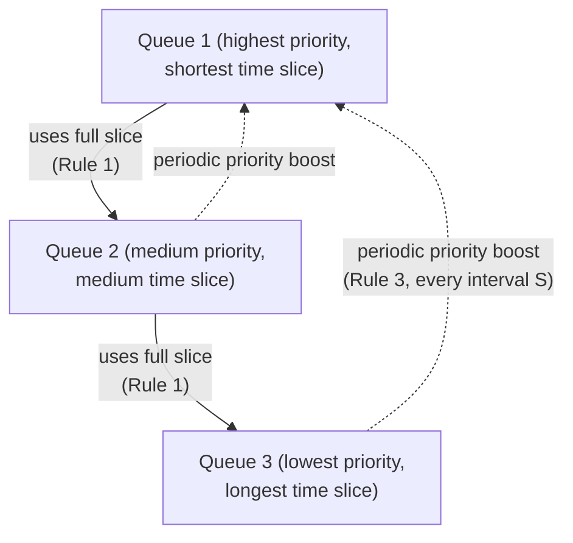

## Learning Objectives

- Describe the multi-level feedback queue (MLFQ) structure: multiple priority queues, each with its own time slice.
- Explain MLFQ's core rules: demote a job that uses its full time slice (likely CPU-bound), keep a job that yields early at a high priority (likely interactive), and periodically boost every job back to the top to prevent starvation.
- Explain why MLFQ approximates SJF's benefits without SJF's need to know job lengths in advance.
- Trace a concrete job's priority level over several rounds of scheduling under MLFQ's rules.

## Context & Motivation

Every scheduling policy covered so far in this cluster has a real limitation: SJF needs to know run times in advance (rarely available), round-robin treats every job identically regardless of its actual behavior (ignoring useful information the OS could learn), and priority scheduling needs someone to assign sensible priorities up front (and needs aging bolted on to avoid starvation). The **multi-level feedback queue (MLFQ)**, OSTEP's centerpiece scheduling algorithm, is the synthesis: instead of asking any job to declare anything about itself, it *learns* from how a job actually behaves once running, and adjusts that job's priority accordingly, going forward.

The intuition is simple and powerful: a job that uses its entire time slice, over and over, without voluntarily giving up the CPU, is behaving like CPU-bound batch work — the kind of job SJF would want to run *after* shorter jobs. A job that voluntarily gives up the CPU quickly, before its slice even expires — because it's waiting on user input, or on a quick I/O operation — is behaving like the kind of interactive job round-robin was designed to favor with fast response time. MLFQ infers which kind of job it's looking at purely from this observed behavior, with no advance declaration needed from anyone.

## Core Theory

### The structure: multiple queues, each with a time slice

MLFQ maintains several priority queues (commonly a handful of levels), each associated with its own time slice — typically shorter slices at higher-priority queues, longer slices at lower ones. The scheduler always runs a job from the highest-priority non-empty queue; among jobs in the same queue, it uses round-robin.

### Rule 1: use up your full slice, get demoted

If a job uses its *entire* time slice at its current queue level without voluntarily giving up the CPU, MLFQ concludes the job is behaving in a CPU-intensive way and moves it down one queue level — a lower priority, and typically a longer time slice for its next turn. A job repeatedly behaving this way sinks toward the bottom of the queue hierarchy over successive rounds.

### Rule 2: give up the CPU early, stay where you are (or rise)

If a job voluntarily relinquishes the CPU before its time slice expires — because it's blocked waiting on I/O, or simply has no more work to do right now — MLFQ treats this as evidence of interactive behavior and keeps the job at its current (high) priority level, so it continues to receive fast response time on its next turn. This is exactly the behavior round-robin already rewarded with good response time, but MLFQ now reserves that reward specifically for jobs that have earned it through observed behavior, rather than handing it out unconditionally to every job.

### Rule 3: priority boost — periodically reset everyone to the top

Applying rules 1 and 2 alone creates two real problems: a long-running CPU-bound job that has sunk to the bottom queue can **starve** if a continuous stream of short, interactive jobs keeps the higher queues busy (the same starvation pathology already introduced with priority scheduling) — and a job's *past* CPU-bound behavior might no longer reflect its *current* needs (a batch job that has just finished its heavy computation and become interactive should not be permanently penalized for its earlier phase). The fix: periodically (every fixed interval, sometimes called `S`), move every job in the system back up to the highest-priority queue, giving every job — including one that had sunk to the bottom — a fresh chance to demonstrate its current behavior.



### Why this approximates SJF without needing to know the future

A genuinely short job finishes (or blocks for I/O) quickly, almost by definition — so under Rule 2, it never uses up a full time slice at the top queue, and it stays at high priority for its entire (short) lifetime, receiving fast turns throughout, much like SJF would have prioritized it from the start. A genuinely long, CPU-bound job repeatedly uses its full slice at every level it visits, and Rule 1 sinks it down through the queues — meaning it increasingly runs *after* whatever short jobs are still arriving at the top queue, again approximating what SJF would have done. Crucially, MLFQ arrives at this same rough ordering purely by *observing* each job's actual behavior over time, never by requiring any job to declare its length up front — solving SJF's central practical limitation while still approximating its benefit.

## Worked Examples

### Example 1: A short, interactive job's trajectory

Job I repeatedly does a small amount of work, then blocks waiting for input, then repeats. Starting at the top queue (slice = 2):

```text
Round 1: I runs 1 unit, blocks for input (used < full slice)
         -> Rule 2 applies: I stays at top queue
Round 2: I runs 1 unit, blocks for input again
         -> Rule 2 applies again: I stays at top queue
...
```

I never uses a full slice, so it never gets demoted — it remains at the highest-priority queue for its entire lifetime, receiving fast response time on every one of its many short bursts, exactly the treatment an interactive program benefits from.

### Example 2: A long, CPU-bound job's trajectory

Job B needs 20 units of pure CPU computation with no I/O at all. Queue slices: top queue = 2, middle queue = 4, bottom queue = 8:

```text
Round 1 (top queue, slice 2):    B uses the full 2 units -> demoted to middle queue
Round 2 (middle queue, slice 4): B uses the full 4 units -> demoted to bottom queue
Round 3 (bottom queue, slice 8): B uses the full 8 units -> stays at bottom (already lowest)
Round 4 (bottom queue, slice 8): B uses its remaining 6 units, finishes
```

B sinks to the bottom queue within two rounds purely because it keeps using its entire slice — no one told the scheduler in advance that B was a long job; MLFQ inferred it from B's own observed behavior, then treated it roughly the way SJF would have (running it after other, shorter work) without ever needing to know its total length up front.

### Example 3: The priority boost preventing long-term starvation

Continuing Example 2's scenario, suppose new short interactive jobs keep arriving at the top queue indefinitely, so B (stuck at the bottom queue) would otherwise never get scheduled again — the same starvation pattern already seen under priority scheduling:

```text
t=0..100:   Various short jobs occupy the top queue; B sits at the
            bottom queue, ready but never selected (top queue is
            always non-empty when the scheduler looks).

t=100:      Priority boost fires (Rule 3, interval S=100).
            EVERY job, including B, moves back to the top queue.

t=100+:     B gets an immediate turn at the top queue's short slice
            -- B's wait is now bounded to at most one boost interval,
            regardless of how many short jobs keep arriving.
```

The periodic boost guarantees B's starvation is bounded by the fixed interval `S`, the same fundamental fix aging applied to priority scheduling — just implemented here as a scheduled reset rather than a continuously accumulating priority value.

## Common Misconceptions & Pitfalls

- **"MLFQ requires knowing whether a job is interactive or CPU-bound before it runs."** It requires exactly the opposite — MLFQ infers this purely from observed behavior (whether a job uses its full time slice or gives up the CPU early), with no advance declaration needed from the job or the programmer.
- **"Once a job sinks to a low-priority queue, it stays there forever."** The periodic priority boost (Rule 3) resets every job back to the highest queue at fixed intervals, both preventing starvation and giving a job whose behavior has genuinely changed (say, finishing a CPU-bound phase and becoming interactive) a fresh chance to be judged on its current behavior.
- **"MLFQ is just round-robin with extra steps."** Round-robin treats every job identically regardless of behavior; MLFQ's entire design is about differentiating jobs by their observed behavior and adjusting priority (and time-slice length) accordingly — the queues and demotion/promotion rules are the mechanism that makes this differentiation possible.
- **"A job that briefly gives up the CPU near the very end of its slice gets treated the same as one that used the whole slice."** MLFQ's Rule 1 specifically checks whether a job used its *entire* allotted slice; giving up the CPU even slightly early, for any reason, counts as voluntary yielding under Rule 2, not full-slice usage under Rule 1 — the exact boundary matters to the algorithm's classification.

## Summary

The multi-level feedback queue maintains several priority queues, each with its own time slice, and adjusts a job's queue level based purely on observed behavior: using a full time slice without yielding demotes a job (Rule 1, inferring CPU-bound behavior), voluntarily yielding before the slice expires keeps a job at high priority (Rule 2, inferring interactive behavior), and a periodic priority boost resets every job back to the top queue (Rule 3, preventing the starvation that rules 1 and 2 alone would otherwise permit for long-sunk jobs). This approximates shortest-job-first's benefit — running short jobs promptly, deferring long ones — without SJF's fatal practical requirement of knowing job lengths in advance, by inferring the same information from how each job actually behaves once it starts running. MLFQ is the last of this discipline's CPU-scheduling policies and, together with the process abstraction and context-switching mechanism already covered, completes the picture of how one CPU (or a handful of cores) supports many simultaneously "running" processes — the next cluster turns from *which process runs* to a harder question already lurking in the background: what happens when several processes, or several threads within one process, actually need to coordinate with each other.

## Documentation Links

- [Arpaci-Dusseau — Operating Systems: Three Easy Pieces, "Scheduling: The Multi-Level Feedback Queue"](https://pages.cs.wisc.edu/~remzi/OSTEP/cpu-sched.pdf) — the canonical treatment of MLFQ's rules and design rationale this concept is built from.
- [UC Berkeley CS162 — Operating Systems and Systems Programming](https://cs162.org/) — course covering multi-level feedback queue scheduling as its capstone CPU-scheduling policy.
