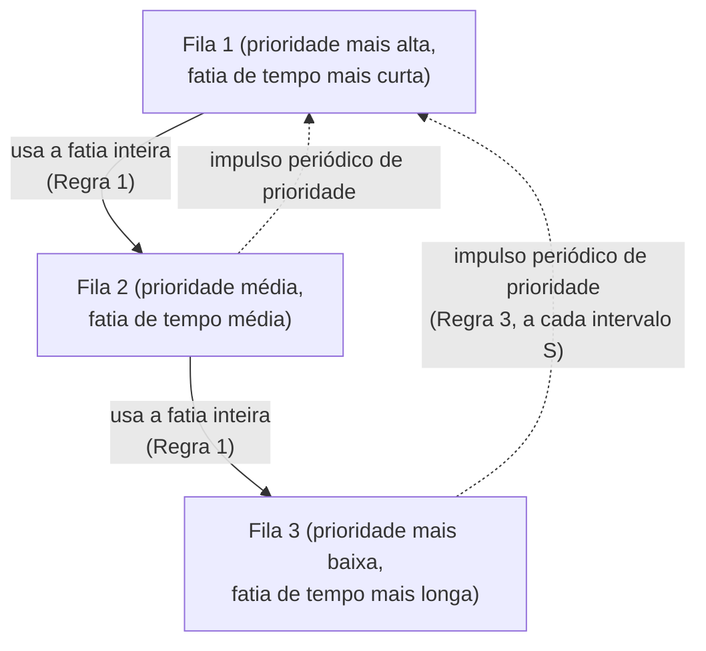

## Objetivos de Aprendizagem

- Descrever a estrutura das filas multinível com realimentação (MLFQ): várias filas de prioridade, cada uma com sua própria fatia de tempo.
- Explicar as regras centrais da MLFQ: rebaixar uma tarefa que usa sua fatia de tempo inteira (provavelmente limitada pela CPU), manter em prioridade alta uma tarefa que cede cedo (provavelmente interativa) e, periodicamente, impulsionar toda tarefa de volta ao topo para evitar inanição.
- Explicar por que a MLFQ aproxima os benefícios do SJF sem a necessidade, que o SJF tem, de conhecer de antemão o tamanho das tarefas.
- Acompanhar o nível de prioridade de uma tarefa concreta ao longo de várias rodadas de escalonamento sob as regras da MLFQ.

## Contexto e Motivação

Toda política de escalonamento vista até aqui neste bloco tem uma limitação real: o SJF precisa conhecer os tempos de execução de antemão (raramente disponíveis), o round-robin trata toda tarefa de forma idêntica, seja qual for seu comportamento real (ignorando informação útil que o SO poderia aprender), e o escalonamento por prioridade precisa de alguém para atribuir prioridades sensatas de antemão (e precisa de envelhecimento acoplado para evitar inanição). As **filas multinível com realimentação (MLFQ)**, o algoritmo de escalonamento central do OSTEP, são a síntese: em vez de pedir que qualquer tarefa declare algo sobre si mesma, elas *aprendem* com o comportamento real de uma tarefa depois que ela está rodando, e ajustam a prioridade dessa tarefa de acordo, daí em diante.

A intuição é simples e poderosa: uma tarefa que usa sua fatia de tempo inteira, repetidas vezes, sem ceder voluntariamente a CPU, está se comportando como trabalho em lote limitado pela CPU, o tipo de tarefa que o SJF gostaria de rodar *depois* das tarefas mais curtas. Uma tarefa que cede voluntariamente a CPU rápido, antes mesmo de sua fatia expirar (porque está esperando entrada do usuário, ou uma operação de E/S rápida), está se comportando como o tipo de tarefa interativa que o round-robin foi projetado para favorecer com um tempo de resposta rápido. A MLFQ infere que tipo de tarefa está olhando puramente a partir desse comportamento observado, sem precisar de declaração antecipada de ninguém.

## Teoria Central

### A estrutura: várias filas, cada uma com uma fatia de tempo

A MLFQ mantém várias filas de prioridade (normalmente um punhado de níveis), cada uma associada à sua própria fatia de tempo, normalmente fatias mais curtas nas filas de prioridade mais alta e mais longas nas de prioridade mais baixa. O escalonador sempre roda uma tarefa da fila não vazia de prioridade mais alta; entre tarefas da mesma fila, ele usa round-robin.

### Regra 1: usou a fatia inteira, é rebaixada

Se uma tarefa usa sua fatia de tempo *inteira* no seu nível de fila atual sem ceder voluntariamente a CPU, a MLFQ conclui que a tarefa está se comportando de forma intensiva em CPU e a move um nível de fila para baixo: uma prioridade mais baixa e, normalmente, uma fatia de tempo mais longa na sua próxima vez. Uma tarefa que se comporta assim repetidamente afunda em direção ao fundo da hierarquia de filas ao longo de rodadas sucessivas.

### Regra 2: cedeu a CPU cedo, fica onde está (ou sobe)

Se uma tarefa cede voluntariamente a CPU antes de sua fatia de tempo expirar (porque está bloqueada esperando E/S, ou simplesmente não tem mais trabalho a fazer agora), a MLFQ trata isso como evidência de comportamento interativo e mantém a tarefa no seu nível de prioridade atual (alto), para que ela continue recebendo um tempo de resposta rápido na sua próxima vez. É exatamente o comportamento que o round-robin já recompensava com um bom tempo de resposta, mas a MLFQ agora reserva essa recompensa especificamente para as tarefas que a mereceram pelo comportamento observado, em vez de distribuí-la incondicionalmente a toda tarefa.

### Regra 3: impulso de prioridade, recolocar todo mundo no topo periodicamente

Aplicar só as regras 1 e 2 cria dois problemas reais: uma tarefa longa e limitada pela CPU que afundou até a fila do fundo pode sofrer **inanição** se um fluxo contínuo de tarefas curtas e interativas mantiver as filas de cima ocupadas (a mesma patologia de inanição já apresentada com o escalonamento por prioridade); e o comportamento *passado* limitado pela CPU de uma tarefa pode não refletir mais suas necessidades *atuais* (uma tarefa em lote que acabou de terminar seu cálculo pesado e ficou interativa não deveria ser penalizada para sempre pela fase anterior). A correção: periodicamente (a cada intervalo fixo, às vezes chamado de `S`), mover toda tarefa do sistema de volta para a fila de prioridade mais alta, dando a toda tarefa (incluindo uma que tinha afundado até o fundo) uma nova chance de demonstrar seu comportamento atual.



### Por que isso aproxima o SJF sem precisar conhecer o futuro

Uma tarefa genuinamente curta termina (ou bloqueia para E/S) rápido, quase por definição; então, pela Regra 2, ela nunca usa uma fatia de tempo inteira na fila do topo e fica em prioridade alta durante toda a sua vida (curta), recebendo vezes rápidas o tempo todo, mais ou menos como o SJF a teria priorizado desde o início. Uma tarefa genuinamente longa e limitada pela CPU usa repetidamente sua fatia inteira em cada nível que visita, e a Regra 1 a faz afundar pelas filas, o que significa que ela roda cada vez mais *depois* das tarefas curtas que continuam chegando na fila do topo, de novo aproximando o que o SJF teria feito. Crucialmente, a MLFQ chega a essa mesma ordem aproximada puramente *observando* o comportamento real de cada tarefa ao longo do tempo, sem jamais exigir que alguma tarefa declare seu tamanho de antemão, resolvendo a limitação prática central do SJF enquanto ainda aproxima seu benefício.

## Exemplos Resolvidos

### Exemplo 1: a trajetória de uma tarefa curta e interativa

A tarefa I faz repetidamente uma pequena quantidade de trabalho, depois bloqueia esperando entrada, e depois repete. Começando na fila do topo (fatia = 2):

```text
Rodada 1: I roda 1 unidade e bloqueia esperando entrada (usou < fatia inteira)
          -> vale a Regra 2: I fica na fila do topo
Rodada 2: I roda 1 unidade e bloqueia esperando entrada de novo
          -> vale a Regra 2 de novo: I fica na fila do topo
...
```

I nunca usa uma fatia inteira, então nunca é rebaixada: ela continua na fila de prioridade mais alta durante toda a sua vida, recebendo um tempo de resposta rápido em cada uma das suas muitas rajadas curtas, exatamente o tratamento de que um programa interativo se beneficia.

### Exemplo 2: a trajetória de uma tarefa longa e limitada pela CPU

A tarefa B precisa de 20 unidades de cálculo puro de CPU, sem E/S nenhuma. Fatias das filas: fila do topo = 2, fila do meio = 4, fila do fundo = 8:

```text
Rodada 1 (fila do topo, fatia 2):  B usa as 2 unidades inteiras -> rebaixada para a fila do meio
Rodada 2 (fila do meio, fatia 4):  B usa as 4 unidades inteiras -> rebaixada para a fila do fundo
Rodada 3 (fila do fundo, fatia 8): B usa as 8 unidades inteiras -> fica no fundo (já é a mais baixa)
Rodada 4 (fila do fundo, fatia 8): B usa as 6 unidades restantes e termina
```

B afunda até a fila do fundo em duas rodadas só porque continua usando sua fatia inteira; ninguém disse de antemão ao escalonador que B era uma tarefa longa; a MLFQ inferiu isso do próprio comportamento observado de B, e então a tratou mais ou menos como o SJF teria feito (rodando-a depois de outros trabalhos mais curtos), sem jamais precisar conhecer seu tamanho total de antemão.

### Exemplo 3: o impulso de prioridade impedindo a inanição de longo prazo

Continuando o cenário do Exemplo 2, suponha que novas tarefas curtas e interativas continuem chegando à fila do topo indefinidamente, de modo que B (presa na fila do fundo) de outra forma nunca mais seria escalonada; o mesmo padrão de inanição já visto no escalonamento por prioridade:

```text
t=0..100:   Várias tarefas curtas ocupam a fila do topo; B fica na fila do
            fundo, pronta, mas nunca selecionada (a fila do topo está sempre
            não vazia quando o escalonador olha).

t=100:      O impulso de prioridade dispara (Regra 3, intervalo S=100).
            TODA tarefa, incluindo B, volta para a fila do topo.

t=100+:     B tem uma vez imediata com a fatia curta da fila do topo: a espera
            de B agora fica limitada a no máximo um intervalo de impulso,
            não importa quantas tarefas curtas continuem chegando.
```

O impulso periódico garante que a inanição de B fique limitada pelo intervalo fixo `S`, a mesma correção fundamental que o envelhecimento aplicou ao escalonamento por prioridade, só que implementada aqui como uma reinicialização agendada em vez de um valor de prioridade que se acumula continuamente.

## Equívocos Comuns e Armadilhas

- **"A MLFQ exige saber se uma tarefa é interativa ou limitada pela CPU antes de ela rodar."** Ela exige exatamente o contrário: a MLFQ infere isso puramente pelo comportamento observado (se uma tarefa usa sua fatia de tempo inteira ou cede a CPU cedo), sem precisar de declaração antecipada da tarefa ou do programador.
- **"Quando uma tarefa afunda até uma fila de prioridade baixa, ela fica lá para sempre."** O impulso periódico de prioridade (Regra 3) recoloca toda tarefa na fila mais alta em intervalos fixos, tanto impedindo a inanição quanto dando a uma tarefa cujo comportamento genuinamente mudou (digamos, que terminou uma fase limitada pela CPU e ficou interativa) uma nova chance de ser julgada pelo seu comportamento atual.
- **"A MLFQ é só round-robin com passos extras."** O round-robin trata toda tarefa de forma idêntica, seja qual for seu comportamento; o projeto inteiro da MLFQ é sobre diferenciar tarefas pelo seu comportamento observado e ajustar a prioridade (e o tamanho da fatia de tempo) de acordo; as filas e as regras de rebaixamento e promoção são o mecanismo que torna essa diferenciação possível.
- **"Uma tarefa que cede rapidamente a CPU bem no finalzinho da sua fatia é tratada igual a uma que usou a fatia inteira."** A Regra 1 da MLFQ confere especificamente se uma tarefa usou sua fatia alocada *inteira*; ceder a CPU, mesmo que só um pouco antes, por qualquer motivo, conta como cessão voluntária pela Regra 2, e não como uso da fatia inteira pela Regra 1; a fronteira exata importa para a classificação do algoritmo.

## Resumo

As filas multinível com realimentação mantêm várias filas de prioridade, cada uma com sua própria fatia de tempo, e ajustam o nível de fila de uma tarefa puramente pelo comportamento observado: usar uma fatia de tempo inteira sem ceder rebaixa a tarefa (Regra 1, inferindo comportamento limitado pela CPU), ceder voluntariamente antes de a fatia expirar mantém a tarefa em prioridade alta (Regra 2, inferindo comportamento interativo), e um impulso periódico de prioridade recoloca toda tarefa na fila do topo (Regra 3, impedindo a inanição que as regras 1 e 2 sozinhas permitiriam para tarefas afundadas há muito tempo). Isso aproxima o benefício do menor tarefa primeiro (rodar as tarefas curtas prontamente, adiar as longas) sem a exigência prática fatal do SJF de conhecer de antemão o tamanho das tarefas, inferindo a mesma informação a partir de como cada tarefa de fato se comporta depois que começa a rodar. A MLFQ é a última das políticas de escalonamento de CPU desta disciplina e, junto com a abstração de processo e o mecanismo de troca de contexto já vistos, completa o quadro de como uma CPU (ou um punhado de núcleos) suporta muitos processos "rodando" ao mesmo tempo; o próximo bloco passa de *qual processo roda* para uma pergunta mais difícil que já espreita ao fundo: o que acontece quando vários processos, ou várias threads dentro de um processo, de fato precisam se coordenar entre si.

## Documentation Links

- [Arpaci-Dusseau: Operating Systems: Three Easy Pieces, "Scheduling: The Multi-Level Feedback Queue"](https://pages.cs.wisc.edu/~remzi/OSTEP/cpu-sched.pdf): o tratamento canônico das regras e da justificativa de projeto da MLFQ a partir do qual este conceito é construído.
- [UC Berkeley CS162: Operating Systems and Systems Programming](https://cs162.org/): curso que cobre o escalonamento com filas multinível com realimentação como sua política de escalonamento de CPU culminante.
