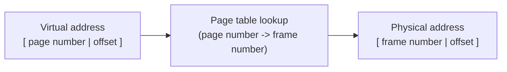

## Learning Objectives

- Describe paging: dividing an address space into many small, fixed-size pages, each independently mapped to a physical frame.
- Explain why fixed-size pages eliminate external fragmentation entirely, unlike segmentation.
- Describe a page table's role: recording, per page, which physical frame it maps to (or that it isn't currently resident).
- Translate a concrete virtual address into a physical address using a page number and offset, via an explicit page table.

## Context & Motivation

Segmentation's independent base-and-bound pairs fixed base-and-bound's wasted-gap problem, but introduced external fragmentation: managing few, large, variable-sized segments in physical memory inevitably scatters free space into unusable slivers. **Paging** takes a fundamentally different approach to the same underlying problem — instead of few large, variable-sized chunks, divide memory into *many small, fixed-size* pieces called pages. Fixed size is the key move: if every chunk is exactly the same size, there is no way for free space to fragment into oddly-sized, unusable pieces — any free page-sized slot fits any page-sized request, by construction. This is the mechanism virtually every modern general-purpose operating system actually uses for virtual memory.

## Core Theory

### Pages and frames

A process's virtual address space is divided into fixed-size **pages** (commonly 4 KB, though other sizes exist); physical memory is divided into equally-sized **frames**. Address translation now means mapping each virtual page to some physical frame — any page can go in any free frame, anywhere in physical memory, with no requirement that a process's pages sit contiguously in physical RAM at all.

### The page table: one entry per page

A **page table** is the OS's per-process record of exactly which physical frame each virtual page currently maps to. A virtual address is split into two parts: a **page number** (the upper bits, selecting which page) and an **offset** (the lower bits, the position within that page — unchanged by translation, since a page and its corresponding frame are the same size). Translation looks up the page number in the page table to find the mapped frame number, then reassembles the physical address as `frame number` followed by the same `offset`.



### Why fixed size eliminates external fragmentation

Because every page and every frame is identical in size, any free frame can hold any page — there is no scenario, unlike segmentation's variable-sized chunks, where enough total free memory exists but no single free unit is large enough for a given request. Free frames are interchangeable; a process needing N more pages simply needs N free frames, wherever in physical memory they happen to sit, with no contiguity requirement at all.

### The real cost: a large page table, and internal fragmentation

This flexibility is not free. A page table needs one entry per virtual page in a process's address space — for a large address space, this can mean a very large table (later concepts in real systems address this with multi-level and other advanced page-table structures, out of scope for this discipline's depth). Paging also introduces its own, different, milder waste: **internal fragmentation** — if a page holds, say, 4 KB, but a process's actual data only fills part of the last page it needs, the unused remainder of that final page is wasted (but only ever up to one page's worth per allocation, unlike external fragmentation's potentially much larger, unbounded waste).

## Worked Examples

### Example 1: Translating a virtual address with a 4 KB page size

Page size 4 KB means the offset needs 12 bits (2¹² = 4096). Suppose the page table for this process says: page 2 → frame 7. Translate virtual address `0x2050`:

```text
0x2050 in binary:  0010 0000 0101 0000
Page number (upper bits, page size 4KB=2^12): 0x2050 / 4096 = 2  (page 2)
Offset (lower 12 bits):                        0x2050 % 4096 = 0x050

Page table lookup: page 2 -> frame 7

Physical address = (frame 7 * 4096) + offset 0x050
                  = 0x7000 + 0x050
                  = 0x7050
```

The offset (`0x050`) is identical in both the virtual and physical address — only the page number changes to a (potentially unrelated) frame number; this is exactly why the offset needs no translation at all, only the page number does.

### Example 2: A page table for a small process

```text
Page table for Process P (page size 4KB):
  Page 0 -> Frame 3
  Page 1 -> Frame 9
  Page 2 -> Frame 1
  Page 3 -> (not present -- not yet allocated, or swapped out)

Virtual addresses 0x0000-0x0FFF (page 0) -> physical frame 3's range
Virtual addresses 0x1000-0x1FFF (page 1) -> physical frame 9's range
Virtual addresses 0x2000-0x2FFF (page 2) -> physical frame 1's range
```

Notice pages 0, 1, and 2 map to frames 3, 9, and 1 — not contiguous, not in order, and not adjacent in physical memory at all. This is precisely paging's key advantage over segmentation: a process's pages can be scattered arbitrarily across physical memory, and the page table simply records wherever each one actually landed, with zero requirement for contiguity.

### Example 3: Why any free frame satisfies any page request (no external fragmentation)

Physical memory has these free frames scattered among used ones: frames 2, 5, 9, 14 are free (used frames elsewhere). A process needs 3 more pages:

```text
Segmentation-style request: needs one CONTIGUOUS chunk large enough for
  all 3 pages' worth of data -- if free space is scattered like this,
  no contiguous region might be big enough (external fragmentation).

Paging: needs any 3 FREE FRAMES, anywhere -- frames 2, 5, and 9 (say)
  are simply assigned, one page each, regardless of their physical
  order or adjacency. The scattered nature of the free frames is
  irrelevant, because pages never needed to be contiguous with each
  other in the first place.
```

The identical scattered-free-space scenario that would fail under segmentation's contiguity requirement succeeds trivially under paging, because paging never asked for contiguity to begin with.

## Common Misconceptions & Pitfalls

- **"Paging is just segmentation with smaller segments."** The defining difference is fixed vs. variable size — segments vary in size per logical piece of an address space; pages are all identical in size, which is precisely what eliminates external fragmentation, a problem paging does not merely reduce but structurally cannot have.
- **"A page's physical frame number and its virtual page number are usually the same or close."** They can be, and typically are, completely unrelated — Example 2's page 0 mapping to frame 3 (not frame 0) illustrates that pages can land anywhere; the page table is precisely what records this otherwise-arbitrary mapping.
- **"Paging has no wasted memory at all, unlike segmentation."** Paging trades external fragmentation for a smaller, different problem: internal fragmentation, where a page's unused remainder (at most one page's worth per allocation) is wasted — a real, if much smaller and more bounded, cost than segmentation's fragmentation.
- **"The offset portion of a virtual address needs to be translated too, just like the page number."** The offset is passed through unchanged — pages and frames are the same size specifically so the position *within* a page maps directly to the identical position within its frame, with only the page-to-frame mapping itself requiring lookup.

## Summary

Paging divides a virtual address space into many small, fixed-size pages, each independently mapped by a per-process **page table** to a physical **frame** of the identical size — because every unit is the same size, any free frame satisfies any page request, structurally eliminating the external fragmentation that plagued segmentation's variable-sized chunks. Translating a virtual address splits it into a page number (looked up in the page table to find the mapped frame) and an offset (passed through unchanged, since pages and frames share a size). The real costs are different in kind from segmentation's: a potentially large page table (one entry per virtual page) and a milder, bounded internal fragmentation (wasted space within a page's unused remainder). This concept describes the *mechanism* of translation via an explicit page table; it says nothing yet about *speed* — looking up a page table entry in memory on every single memory access would itself be a severe slowdown, which is exactly the problem the next concept, the translation lookaside buffer, exists to solve.

## Documentation Links

- [Arpaci-Dusseau — Operating Systems: Three Easy Pieces, "Paging: Introduction"](https://pages.cs.wisc.edu/~remzi/OSTEP/vm-paging.pdf) — the canonical treatment of paging, page tables, and the fragmentation tradeoff this concept is built from.
- [ACM/IEEE CS2013 — Operating Systems Knowledge Area](https://csed.acm.org/knowledge-areas-operating-systems-os-cs2013-version/) — curriculum guidelines establishing paging as core virtual memory content.
