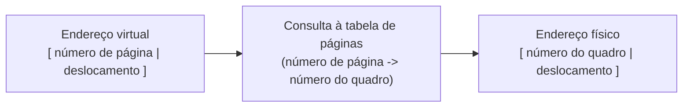

## Objetivos de Aprendizagem

- Descrever a paginação: dividir um espaço de endereçamento em muitas páginas pequenas e de tamanho fixo, cada uma mapeada de forma independente para um quadro físico.
- Explicar por que páginas de tamanho fixo eliminam por completo a fragmentação externa, ao contrário da segmentação.
- Descrever o papel de uma tabela de páginas: registrar, para cada página, para qual quadro físico ela é mapeada (ou que ela não está residente no momento).
- Traduzir um endereço virtual concreto num endereço físico usando um número de página e um deslocamento, por meio de uma tabela de páginas explícita.

## Contexto e Motivação

Os pares independentes de base e limite da segmentação corrigiram o problema do vão desperdiçado do base e limite fixo, mas introduziram a fragmentação externa: gerenciar poucos segmentos grandes e de tamanho variável na memória física inevitavelmente espalha o espaço livre em lascas inutilizáveis. A **paginação** adota uma abordagem fundamentalmente diferente para o mesmo problema subjacente: em vez de poucos pedaços grandes e de tamanho variável, dividir a memória em *muitas peças pequenas e de tamanho fixo* chamadas páginas. O tamanho fixo é o lance-chave: se todo pedaço tem exatamente o mesmo tamanho, não há como o espaço livre se fragmentar em pedaços de tamanhos estranhos e inutilizáveis; qualquer espaço livre do tamanho de uma página serve para qualquer pedido do tamanho de uma página, por construção. Esse é o mecanismo que praticamente todo sistema operacional moderno de propósito geral de fato usa para a memória virtual.

## Teoria Central

### Páginas e quadros

O espaço de endereçamento virtual de um processo é dividido em **páginas** de tamanho fixo (comumente 4 KB, embora existam outros tamanhos); a memória física é dividida em **quadros** do mesmo tamanho. A tradução de endereços agora significa mapear cada página virtual para algum quadro físico: qualquer página pode ir em qualquer quadro livre, em qualquer lugar da memória física, sem nenhuma exigência de que as páginas de um processo fiquem contíguas na RAM física.

### A tabela de páginas: uma entrada por página

Uma **tabela de páginas** é o registro, por processo, que o SO mantém de exatamente para qual quadro físico cada página virtual está mapeada no momento. Um endereço virtual é dividido em duas partes: um **número de página** (os bits de cima, que selecionam qual página) e um **deslocamento** (os bits de baixo, a posição dentro daquela página, inalterada pela tradução, já que uma página e seu quadro correspondente têm o mesmo tamanho). A tradução procura o número de página na tabela de páginas para achar o número do quadro mapeado, e então remonta o endereço físico como `número do quadro` seguido do mesmo `deslocamento`.



### Por que o tamanho fixo elimina a fragmentação externa

Como toda página e todo quadro têm tamanho idêntico, qualquer quadro livre consegue guardar qualquer página; não existe cenário, ao contrário dos pedaços de tamanho variável da segmentação, em que exista memória livre total suficiente, mas nenhuma unidade livre seja grande o bastante para um dado pedido. Os quadros livres são intercambiáveis; um processo que precisa de N páginas a mais simplesmente precisa de N quadros livres, onde quer que estejam na memória física, sem nenhuma exigência de contiguidade.

### O custo real: uma tabela de páginas grande, e fragmentação interna

Essa flexibilidade não sai de graça. Uma tabela de páginas precisa de uma entrada por página virtual no espaço de endereçamento de um processo; para um espaço de endereçamento grande, isso pode significar uma tabela muito grande (sistemas reais tratam isso em conceitos posteriores com estruturas de tabela de páginas multinível e outras mais avançadas, fora do escopo de profundidade desta disciplina). A paginação também introduz seu próprio desperdício, diferente e mais brando: a **fragmentação interna**; se uma página guarda, digamos, 4 KB, mas os dados reais de um processo só preenchem parte da última página de que ele precisa, o restante não usado dessa última página é desperdiçado (mas sempre no máximo o equivalente a uma página por alocação, ao contrário do desperdício potencialmente muito maior e ilimitado da fragmentação externa).

## Exemplos Resolvidos

### Exemplo 1: traduzindo um endereço virtual com páginas de 4 KB

Páginas de 4 KB significam que o deslocamento precisa de 12 bits (2¹² = 4096). Suponha que a tabela de páginas deste processo diga: página 2 → quadro 7. Traduza o endereço virtual `0x2050`:

```text
0x2050 em binário:  0010 0000 0101 0000
Número de página (bits de cima, página de 4KB=2^12): 0x2050 / 4096 = 2  (página 2)
Deslocamento (12 bits de baixo):                     0x2050 % 4096 = 0x050

Consulta à tabela de páginas: página 2 -> quadro 7

Endereço físico = (quadro 7 * 4096) + deslocamento 0x050
                = 0x7000 + 0x050
                = 0x7050
```

O deslocamento (`0x050`) é idêntico no endereço virtual e no físico; só o número de página muda para um número de quadro (potencialmente sem relação); é exatamente por isso que o deslocamento não precisa de tradução nenhuma, só o número de página precisa.

### Exemplo 2: uma tabela de páginas de um processo pequeno

```text
Tabela de páginas do Processo P (páginas de 4KB):
  Página 0 -> Quadro 3
  Página 1 -> Quadro 9
  Página 2 -> Quadro 1
  Página 3 -> (não presente: ainda não alocada, ou enviada ao swap)

Endereços virtuais 0x0000-0x0FFF (página 0) -> faixa do quadro físico 3
Endereços virtuais 0x1000-0x1FFF (página 1) -> faixa do quadro físico 9
Endereços virtuais 0x2000-0x2FFF (página 2) -> faixa do quadro físico 1
```

Repare que as páginas 0, 1 e 2 são mapeadas para os quadros 3, 9 e 1: não contíguos, fora de ordem e nada adjacentes na memória física. Essa é precisamente a vantagem-chave da paginação sobre a segmentação: as páginas de um processo podem ficar espalhadas de forma arbitrária pela memória física, e a tabela de páginas simplesmente registra onde cada uma de fato caiu, com zero exigência de contiguidade.

### Exemplo 3: por que qualquer quadro livre atende a qualquer pedido de página (sem fragmentação externa)

A memória física tem estes quadros livres espalhados entre os usados: os quadros 2, 5, 9, 14 estão livres (com quadros usados em outros lugares). Um processo precisa de mais 3 páginas:

```text
Pedido no estilo da segmentação: precisa de UM pedaço CONTÍGUO grande o bastante
  para os dados das 3 páginas; se o espaço livre estiver espalhado assim,
  pode não haver região contígua grande o bastante (fragmentação externa).

Paginação: precisa de 3 QUADROS LIVRES quaisquer, em qualquer lugar; os quadros
  2, 5 e 9 (digamos) são simplesmente atribuídos, uma página em cada, seja qual
  for sua ordem física ou adjacência. O fato de os quadros livres estarem
  espalhados é irrelevante, porque as páginas nunca precisaram ser contíguas
  entre si.
```

O mesmíssimo cenário de espaço livre espalhado, que falharia sob a exigência de contiguidade da segmentação, tem sucesso trivial sob a paginação, porque a paginação nunca pediu contiguidade.

## Equívocos Comuns e Armadilhas

- **"A paginação é só segmentação com segmentos menores."** A diferença que define é tamanho fixo contra tamanho variável: os segmentos variam de tamanho conforme cada pedaço lógico do espaço de endereçamento; as páginas têm todas o mesmo tamanho, e é precisamente isso que elimina a fragmentação externa, um problema que a paginação não apenas reduz, mas estruturalmente não pode ter.
- **"O número do quadro físico de uma página e seu número de página virtual costumam ser iguais ou próximos."** Eles podem ser, e normalmente são, completamente sem relação; o mapeamento da página 0 para o quadro 3 (e não para o quadro 0) no Exemplo 2 ilustra que as páginas podem cair em qualquer lugar; a tabela de páginas é precisamente o que registra esse mapeamento, de outra forma arbitrário.
- **"A paginação não tem memória desperdiçada nenhuma, ao contrário da segmentação."** A paginação troca a fragmentação externa por um problema menor e diferente: a fragmentação interna, em que o restante não usado de uma página (no máximo o equivalente a uma página por alocação) é desperdiçado; um custo real, ainda que muito menor e mais limitado que a fragmentação da segmentação.
- **"A parte de deslocamento de um endereço virtual também precisa ser traduzida, assim como o número de página."** O deslocamento passa inalterado: páginas e quadros têm o mesmo tamanho justamente para que a posição *dentro* de uma página corresponda diretamente à mesma posição dentro do seu quadro, e só o próprio mapeamento de página para quadro precisa de consulta.

## Resumo

A paginação divide um espaço de endereçamento virtual em muitas páginas pequenas e de tamanho fixo, cada uma mapeada de forma independente por uma **tabela de páginas** por processo para um **quadro** físico de tamanho idêntico; como toda unidade tem o mesmo tamanho, qualquer quadro livre atende a qualquer pedido de página, eliminando estruturalmente a fragmentação externa que atormentava os pedaços de tamanho variável da segmentação. Traduzir um endereço virtual o divide num número de página (procurado na tabela de páginas para achar o quadro mapeado) e num deslocamento (que passa inalterado, já que páginas e quadros têm o mesmo tamanho). Os custos reais são de natureza diferente dos da segmentação: uma tabela de páginas potencialmente grande (uma entrada por página virtual) e uma fragmentação interna mais branda e limitada (espaço desperdiçado no restante não usado de uma página). Este conceito descreve o *mecanismo* de tradução por uma tabela de páginas explícita; ele ainda não diz nada sobre *velocidade*: consultar uma entrada da tabela de páginas na memória a cada acesso seria ela mesma uma lentidão severa, que é exatamente o problema que o próximo conceito, o translation lookaside buffer, existe para resolver.

## Documentation Links

- [Arpaci-Dusseau: Operating Systems: Three Easy Pieces, "Paging: Introduction"](https://pages.cs.wisc.edu/~remzi/OSTEP/vm-paging.pdf): o tratamento canônico da paginação, das tabelas de páginas e do trade-off de fragmentação a partir do qual este conceito é construído.
- [ACM/IEEE CS2013: Operating Systems Knowledge Area](https://csed.acm.org/knowledge-areas-operating-systems-os-cs2013-version/): diretrizes curriculares que estabelecem a paginação como conteúdo central de memória virtual.
