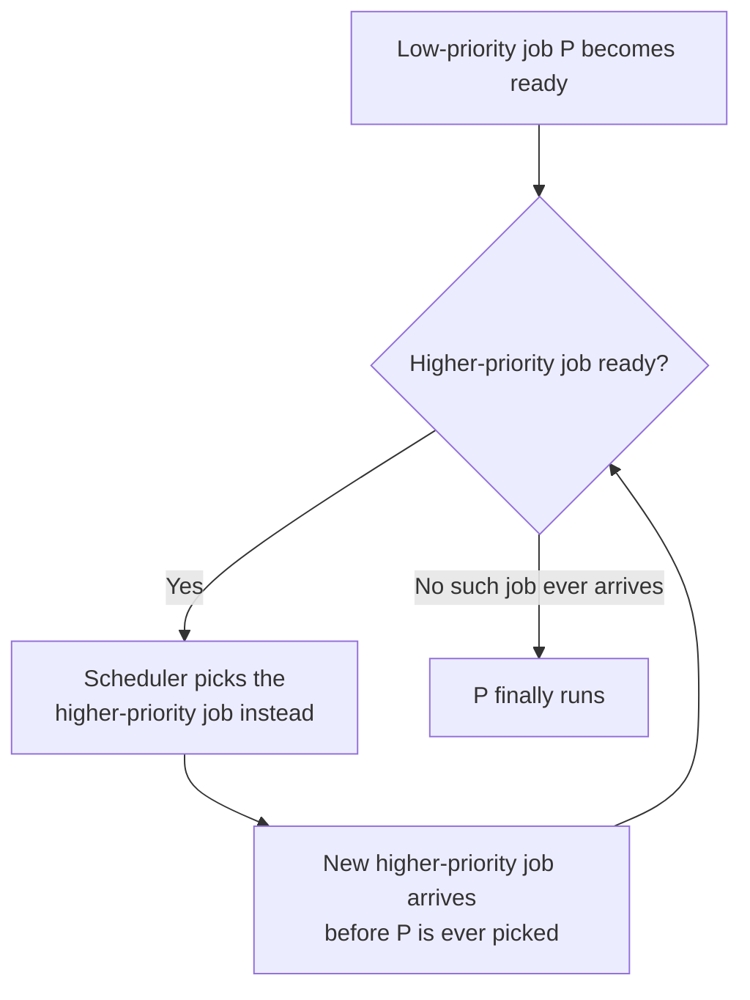

## Learning Objectives

- Describe priority scheduling: always running the highest-priority ready job, and how this can express urgency that pure arrival order or job length cannot.
- Define starvation precisely: a job that is ready to run but never actually gets scheduled, because higher-priority work keeps arriving.
- Trace a concrete scenario in which a low-priority job starves under strict priority scheduling.
- Describe aging as a real, general technique for preventing starvation, and connect it to the "learn from observed behavior" theme that culminates in multi-level feedback queues.

## Context & Motivation

Neither SJF nor round-robin has any notion that some work is simply more important than other work, regardless of how long it takes. A short background log-rotation job and a short, time-critical alert-handling job look identical to both policies — both are "just another ready job." **Priority scheduling** introduces the missing dimension directly: assign every job a priority, and always run the highest-priority ready job next, breaking ties however the specific policy chooses to (often round-robin among equal priorities).

This is a genuine improvement for expressing urgency — but it introduces a new failure mode that neither FCFS's convoy effect nor round-robin's overhead tradeoff resembles: a job can be ready, able to make progress, and simply never get picked, for as long as higher-priority work keeps showing up. OSTEP names this **starvation**, and the fix — aging, gradually raising a waiting job's priority the longer it waits — is the first hint of the idea multi-level feedback queues, the next concept, build into a complete policy: let a job's treatment be shaped by what has actually been observed about it, not fixed forever at the moment it arrives.

## Core Theory

### The priority scheduling rule

Every job is assigned a priority (a number, where convention varies — some systems use higher-number-is-more-urgent, others the reverse). At every scheduling decision, the OS picks the highest-priority job among those currently ready, running it either to completion or until preempted by an even higher-priority job that becomes ready. Priorities can come from many sources in a real system: a system administrator's configuration, a job's category (interactive vs. batch), or a running average of a process's recent behavior — the last of these becomes central once multi-level feedback queues are introduced.

### Starvation: ready, but perpetually passed over

**Starvation** occurs when a process is ready to run — capable of making progress right now — but never actually gets a turn, because the scheduler always finds some other ready job with equal or higher priority to run instead. This is fundamentally different from a job simply taking a long time to finish (as under FCFS's convoy effect): a starved job isn't slow, and isn't even necessarily waiting behind one specific job — it can be perpetually overtaken by a continuous stream of different higher-priority arrivals, none of which individually seems unreasonable, with the cumulative effect of the low-priority job never running at all.



The diagram's left loop back into itself is exactly starvation in diagram form: as long as *some* higher-priority job is always ready when the scheduler looks, P never reaches the "finally runs" branch — not because of any single blocking job, but because the condition for running P (no higher-priority ready job) is never met.

### Aging: the standard fix

**Aging** solves starvation directly: gradually increase a job's priority the longer it waits without being scheduled. Eventually, a job that has been waiting long enough accumulates enough boosted priority to outrank whatever new, nominally-higher-priority work keeps arriving, guaranteeing it eventually runs — the wait is bounded, not indefinite. Aging requires no knowledge of a job's future behavior; it only needs the OS to track how long each ready job has actually been waiting, which is exactly the kind of information the OS already has readily available.

### The connection forward: judging jobs by observed behavior

Aging is the first policy in this cluster that adjusts a job's treatment based on something the OS has *observed* (how long it has waited) rather than something declared up front (an assigned priority, a claimed run time). The next concept, multi-level feedback queues, generalizes this same idea much further: instead of only tracking wait time, it tracks how much CPU time a job has actually used recently, inferring whether a job behaves more like a short interactive task or a long CPU-bound one — without ever needing that information declared in advance, addressing SJF's original limitation from an entirely different angle than round-robin did.

## Worked Examples

### Example 1: A low-priority job starving under strict priority scheduling

Job L (low priority, priority 1) is ready at time 0, needing 5 units of work. Higher-priority jobs (priority 5) keep arriving continuously — H1 at time 0, H2 at time 3, H3 at time 6, and so on, each needing 3 units:

```text
t=0:  H1 (priority 5) arrives and runs (L is ready but lower priority)
t=3:  H1 finishes; H2 (priority 5) arrives just in time and runs
t=6:  H2 finishes; H3 (priority 5) arrives just in time and runs
t=9:  H3 finishes; H4 (priority 5) arrives just in time and runs
...   (pattern continues indefinitely)

L: ready since t=0, priority 1, never scheduled -- STARVED
```

L is perfectly capable of running — it has real work to do and is sitting in the ready queue the entire time — but strict priority scheduling never picks it, because a new priority-5 job is always ready exactly when the scheduler needs to choose. No single job "blocks" L the way a long job blocks short ones under FCFS; the starvation here is a property of the continuous stream, not any one job.

### Example 2: Aging rescues the same scenario

Apply an aging rule: every 5 units of time a job spends waiting, its effective priority increases by 1. Tracking L's effective priority over time:

```text
t=0:  L's priority = 1 (waiting begins)
t=5:  L's priority = 2 (aged once)
t=10: L's priority = 3 (aged twice)
t=15: L's priority = 4 (aged three times)
t=20: L's priority = 5 -- now ties the incoming H jobs' priority 5

Once L's aged priority reaches (or, with a tie-breaking rule, exceeds)
the incoming jobs' priority 5, the scheduler picks L instead of the
next arriving H job -- L finally runs at some point around t=20,
after which its priority resets once it actually gets CPU time.
```

L's wait is now bounded — it is guaranteed to eventually out-rank any fixed-priority stream, purely because its own effective priority keeps climbing the longer it's ignored, with no dependence on the H jobs ever stopping.

### Example 3: Starvation vs. the convoy effect — different mechanisms, both real

```text
Convoy effect (FCFS):        One specific long job blocks specific
                              short jobs arriving right after it.
                              Fix: reorder by length (SJF).

Starvation (priority sched.): A continuous stream of higher-priority
                              jobs perpetually outranks one lower-
                              priority job, with no single culprit.
                              Fix: raise priority the longer a job
                              waits (aging).
```

Both are real scheduling pathologies covered in this cluster, but they arise from different causes (a single mis-ordered long job, vs. a perpetual priority mismatch) and are fixed by different mechanisms (reordering by known length, vs. tracking wait time and adjusting priority accordingly).

## Common Misconceptions & Pitfalls

- **"Starvation means a job takes a very long time to finish."** Starvation specifically means a ready job never gets scheduled at all, for an unbounded amount of time — it is a qualitatively different failure than merely having a long turnaround time, which every job under FCFS's convoy effect still eventually experiences.
- **"Starvation requires one specific job to keep blocking another."** It doesn't — as the worked example shows, a continuous stream of *different* higher-priority jobs, no individual one of which is unreasonable, can starve a lower-priority job with no single culprit responsible.
- **"Aging is a special-purpose hack only relevant to priority scheduling."** Aging is a specific instance of a much more general theme in scheduling — adjusting a job's treatment based on observed history rather than a fixed, declared property — the same theme the very next concept (multi-level feedback queues) develops much further, using observed recent CPU usage instead of observed wait time.
- **"Higher priority should always mean better response time and better turnaround time for that job."** Priority scheduling optimizes for expressing relative urgency, not for any single metric from the goals-and-metrics concept — a system entirely of equal-priority jobs gets no benefit from priority scheduling at all, and priority alone says nothing about a job's actual run time.

## Summary

Priority scheduling always runs the highest-priority ready job, letting the OS express that some work matters more than others regardless of arrival order or job length — but it introduces **starvation**: a ready, capable job that never actually gets scheduled because a continuous stream of higher-priority work keeps arriving, with no single job responsible for the block. **Aging** fixes this directly by gradually raising a waiting job's priority the longer it sits unscheduled, guaranteeing every job's wait is eventually bounded using only information the OS already has (how long each job has waited), with no need to know anything about a job's future behavior. Aging is the first move in this cluster toward judging a job by what has actually been observed about it rather than a value fixed at arrival — exactly the idea the next concept, multi-level feedback queues, generalizes into a complete, practical scheduling policy that approximates SJF's benefits without ever needing to know a job's run time in advance.

## Documentation Links

- [UC Berkeley CS162 — Operating Systems and Systems Programming](https://cs162.org/) — course covering priority scheduling, starvation, and aging as part of its scheduling unit.
- [ACM/IEEE CS2013 — Operating Systems Knowledge Area](https://csed.acm.org/knowledge-areas-operating-systems-os-cs2013-version/) — curriculum guidelines covering priority-based scheduling and starvation prevention as core Operating Systems content.
