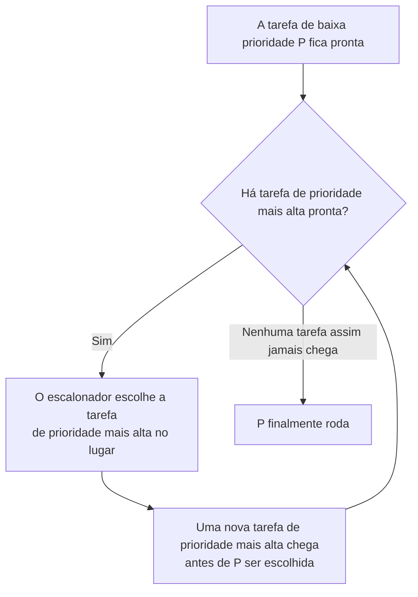

## Objetivos de Aprendizagem

- Descrever o escalonamento por prioridade: rodar sempre a tarefa pronta de prioridade mais alta, e como isso consegue expressar urgência que a pura ordem de chegada ou o tamanho da tarefa não conseguem.
- Definir inanição com precisão: uma tarefa que está pronta para rodar, mas nunca chega de fato a ser escalonada, porque trabalho de prioridade mais alta continua chegando.
- Acompanhar um cenário concreto em que uma tarefa de baixa prioridade sofre inanição sob escalonamento estrito por prioridade.
- Descrever o envelhecimento (aging) como uma técnica real e geral para evitar a inanição, e ligá-lo ao tema de "aprender pelo comportamento observado" que culmina nas filas multinível com realimentação.

## Contexto e Motivação

Nem o SJF nem o round-robin têm qualquer noção de que algum trabalho é simplesmente mais importante que outro, não importa quanto tempo leve. Uma tarefa curta de rotação de logs em segundo plano e uma tarefa curta e crítica de tratamento de alertas parecem idênticas para as duas políticas: ambas são "só mais uma tarefa pronta". O **escalonamento por prioridade** introduz diretamente a dimensão que faltava: atribuir uma prioridade a toda tarefa e rodar sempre em seguida a tarefa pronta de prioridade mais alta, desempatando como a política específica escolher (muitas vezes com round-robin entre prioridades iguais).

Isso é uma melhora genuína para expressar urgência, mas introduz um novo modo de falha que não se parece nem com o efeito comboio do FCFS nem com o trade-off de sobrecarga do round-robin: uma tarefa pode estar pronta, capaz de progredir, e simplesmente nunca ser escolhida, enquanto trabalho de prioridade mais alta continuar aparecendo. O OSTEP chama isso de **inanição** (starvation), e a correção (o envelhecimento, aumentar gradualmente a prioridade de uma tarefa em espera quanto mais tempo ela espera) é a primeira pista da ideia que as filas multinível com realimentação, o próximo conceito, transformam numa política completa: deixar o tratamento de uma tarefa ser moldado pelo que de fato foi observado sobre ela, e não fixado para sempre no momento em que ela chega.

## Teoria Central

### A regra do escalonamento por prioridade

Toda tarefa recebe uma prioridade (um número, em que a convenção varia: alguns sistemas usam número maior significa mais urgente, outros o contrário). Em cada decisão de escalonamento, o SO escolhe a tarefa de prioridade mais alta entre as que estão prontas no momento, rodando-a até terminar ou até ser preemptada por uma tarefa de prioridade ainda mais alta que fique pronta. Num sistema real, as prioridades podem vir de muitas fontes: a configuração de um administrador de sistema, a categoria de uma tarefa (interativa versus em lote), ou uma média móvel do comportamento recente de um processo; esta última fonte vira central quando as filas multinível com realimentação são apresentadas.

### Inanição: pronta, mas passada para trás o tempo todo

A **inanição** ocorre quando um processo está pronto para rodar (capaz de progredir agora mesmo), mas nunca chega a ter sua vez, porque o escalonador sempre encontra alguma outra tarefa pronta de prioridade igual ou mais alta para rodar no lugar. Isso é fundamentalmente diferente de uma tarefa que simplesmente demora para terminar (como no efeito comboio do FCFS): uma tarefa em inanição não é lenta, e nem necessariamente está esperando atrás de uma tarefa específica; ela pode ser ultrapassada o tempo todo por um fluxo contínuo de chegadas diferentes de prioridade mais alta, nenhuma das quais parece descabida isoladamente, com o efeito acumulado de a tarefa de baixa prioridade nunca rodar.



O laço à esquerda do diagrama, voltando sobre si mesmo, é exatamente a inanição em forma de diagrama: enquanto *alguma* tarefa de prioridade mais alta estiver sempre pronta quando o escalonador olhar, P nunca chega ao ramo "finalmente roda"; não por causa de uma tarefa bloqueadora específica, mas porque a condição para rodar P (nenhuma tarefa pronta de prioridade mais alta) nunca é satisfeita.

### Envelhecimento: a correção padrão

O **envelhecimento** (aging) resolve a inanição diretamente: aumentar gradualmente a prioridade de uma tarefa quanto mais tempo ela espera sem ser escalonada. Em algum momento, uma tarefa que esperou tempo suficiente acumula prioridade impulsionada o bastante para superar o trabalho novo, nominalmente de prioridade mais alta, que continua chegando, garantindo que ela acabe rodando: a espera fica limitada, e não indefinida. O envelhecimento não exige conhecer o comportamento futuro de uma tarefa; ele só precisa que o SO acompanhe há quanto tempo cada tarefa pronta de fato está esperando, exatamente o tipo de informação que o SO já tem à mão.

### A ligação adiante: julgar as tarefas pelo comportamento observado

O envelhecimento é a primeira política deste bloco que ajusta o tratamento de uma tarefa com base em algo que o SO *observou* (há quanto tempo ela espera), e não em algo declarado de antemão (uma prioridade atribuída, um tempo de execução alegado). O próximo conceito, filas multinível com realimentação, generaliza essa mesma ideia bem mais: em vez de só acompanhar o tempo de espera, ele acompanha quanto tempo de CPU uma tarefa de fato usou recentemente, inferindo se uma tarefa se comporta mais como uma tarefa interativa curta ou como uma longa e limitada pela CPU, sem jamais precisar que essa informação seja declarada de antemão, tratando a limitação original do SJF por um ângulo totalmente diferente do que o round-robin usou.

## Exemplos Resolvidos

### Exemplo 1: uma tarefa de baixa prioridade sofrendo inanição sob escalonamento estrito por prioridade

A tarefa L (prioridade baixa, prioridade 1) está pronta no instante 0, precisando de 5 unidades de trabalho. Tarefas de prioridade mais alta (prioridade 5) continuam chegando sem parar: H1 no instante 0, H2 no instante 3, H3 no instante 6, e assim por diante, cada uma precisando de 3 unidades:

```text
t=0:  H1 (prioridade 5) chega e roda (L está pronta, mas tem prioridade menor)
t=3:  H1 termina; H2 (prioridade 5) chega bem a tempo e roda
t=6:  H2 termina; H3 (prioridade 5) chega bem a tempo e roda
t=9:  H3 termina; H4 (prioridade 5) chega bem a tempo e roda
...   (o padrão continua indefinidamente)

L: pronta desde t=0, prioridade 1, nunca escalonada: EM INANIÇÃO
```

L é perfeitamente capaz de rodar (tem trabalho real a fazer e fica na fila de prontos o tempo todo), mas o escalonamento estrito por prioridade nunca a escolhe, porque uma nova tarefa de prioridade 5 está sempre pronta exatamente quando o escalonador precisa escolher. Nenhuma tarefa isolada "bloqueia" L do jeito que uma tarefa longa bloqueia as curtas no FCFS; a inanição aqui é uma propriedade do fluxo contínuo, e não de uma tarefa específica.

### Exemplo 2: o envelhecimento resgata o mesmo cenário

Aplique uma regra de envelhecimento: a cada 5 unidades de tempo que uma tarefa passa esperando, sua prioridade efetiva sobe 1. Acompanhando a prioridade efetiva de L ao longo do tempo:

```text
t=0:  prioridade de L = 1 (começa a esperar)
t=5:  prioridade de L = 2 (envelheceu uma vez)
t=10: prioridade de L = 3 (envelheceu duas vezes)
t=15: prioridade de L = 4 (envelheceu três vezes)
t=20: prioridade de L = 5: agora empata com a prioridade 5 das tarefas H que chegam

Quando a prioridade envelhecida de L alcança (ou, com uma regra de desempate,
supera) a prioridade 5 das tarefas que chegam, o escalonador escolhe L em vez
da próxima tarefa H que chegar: L finalmente roda em algum ponto por volta de
t=20, e depois disso sua prioridade é reiniciada quando ela de fato recebe
tempo de CPU.
```

A espera de L agora é limitada: ela tem garantia de acabar superando qualquer fluxo de prioridade fixa, puramente porque sua própria prioridade efetiva continua subindo quanto mais tempo ela é ignorada, sem depender de as tarefas H pararem algum dia.

### Exemplo 3: inanição vs. efeito comboio, mecanismos diferentes, ambos reais

```text
Efeito comboio (FCFS):               Uma tarefa longa específica bloqueia
                                      tarefas curtas específicas que chegam
                                      logo depois dela.
                                      Correção: reordenar pelo tamanho (SJF).

Inanição (escalonamento por          Um fluxo contínuo de tarefas de prioridade
  prioridade):                        mais alta supera o tempo todo uma tarefa
                                      de prioridade mais baixa, sem um culpado
                                      único.
                                      Correção: aumentar a prioridade quanto mais
                                      tempo uma tarefa espera (envelhecimento).
```

As duas são patologias reais de escalonamento vistas neste bloco, mas surgem de causas diferentes (uma única tarefa longa mal ordenada, contra um descompasso permanente de prioridade) e são corrigidas por mecanismos diferentes (reordenar pelo tamanho conhecido, contra acompanhar o tempo de espera e ajustar a prioridade de acordo).

## Equívocos Comuns e Armadilhas

- **"Inanição significa que uma tarefa demora muito para terminar."** A inanição significa especificamente que uma tarefa pronta nunca é escalonada, por um tempo ilimitado; é uma falha qualitativamente diferente de só ter um tempo de retorno longo, algo que toda tarefa sob o efeito comboio do FCFS ainda acaba vivendo.
- **"A inanição exige que uma tarefa específica continue bloqueando outra."** Não exige: como o exemplo resolvido mostra, um fluxo contínuo de tarefas *diferentes* de prioridade mais alta, nenhuma descabida isoladamente, pode deixar uma tarefa de prioridade mais baixa em inanição sem que haja um culpado único.
- **"O envelhecimento é um remendo de uso específico, relevante só para o escalonamento por prioridade."** O envelhecimento é uma instância específica de um tema muito mais geral do escalonamento (ajustar o tratamento de uma tarefa pelo histórico observado, em vez de por uma propriedade fixa e declarada), o mesmo tema que o conceito seguinte (filas multinível com realimentação) desenvolve bem mais, usando o uso recente de CPU observado em vez do tempo de espera observado.
- **"Prioridade mais alta sempre deveria significar melhor tempo de resposta e melhor tempo de retorno para aquela tarefa."** O escalonamento por prioridade otimiza a expressão de urgência relativa, e não alguma métrica única do conceito de objetivos e métricas; um sistema formado só por tarefas de prioridade igual não ganha nada com o escalonamento por prioridade, e a prioridade sozinha não diz nada sobre o tempo de execução real de uma tarefa.

## Resumo

O escalonamento por prioridade sempre roda a tarefa pronta de prioridade mais alta, deixando o SO expressar que algum trabalho importa mais que outro, seja qual for a ordem de chegada ou o tamanho da tarefa; mas ele introduz a **inanição**: uma tarefa pronta e capaz que nunca chega de fato a ser escalonada, porque um fluxo contínuo de trabalho de prioridade mais alta continua chegando, sem que nenhuma tarefa isolada seja responsável pelo bloqueio. O **envelhecimento** corrige isso diretamente, aumentando gradualmente a prioridade de uma tarefa em espera quanto mais tempo ela fica sem ser escalonada, garantindo que a espera de toda tarefa acabe limitada, usando só informação que o SO já tem (há quanto tempo cada tarefa espera), sem precisar saber nada sobre o comportamento futuro de uma tarefa. O envelhecimento é o primeiro passo deste bloco rumo a julgar uma tarefa pelo que de fato foi observado sobre ela, e não por um valor fixado na chegada; exatamente a ideia que o próximo conceito, filas multinível com realimentação, generaliza numa política de escalonamento completa e prática, que aproxima os benefícios do SJF sem jamais precisar conhecer de antemão o tempo de execução de uma tarefa.

## Documentation Links

- [UC Berkeley CS162: Operating Systems and Systems Programming](https://cs162.org/): curso que cobre escalonamento por prioridade, inanição e envelhecimento como parte da sua unidade de escalonamento.
- [ACM/IEEE CS2013: Operating Systems Knowledge Area](https://csed.acm.org/knowledge-areas-operating-systems-os-cs2013-version/): diretrizes curriculares que cobrem o escalonamento baseado em prioridade e a prevenção da inanição como conteúdo central de Sistemas Operacionais.
