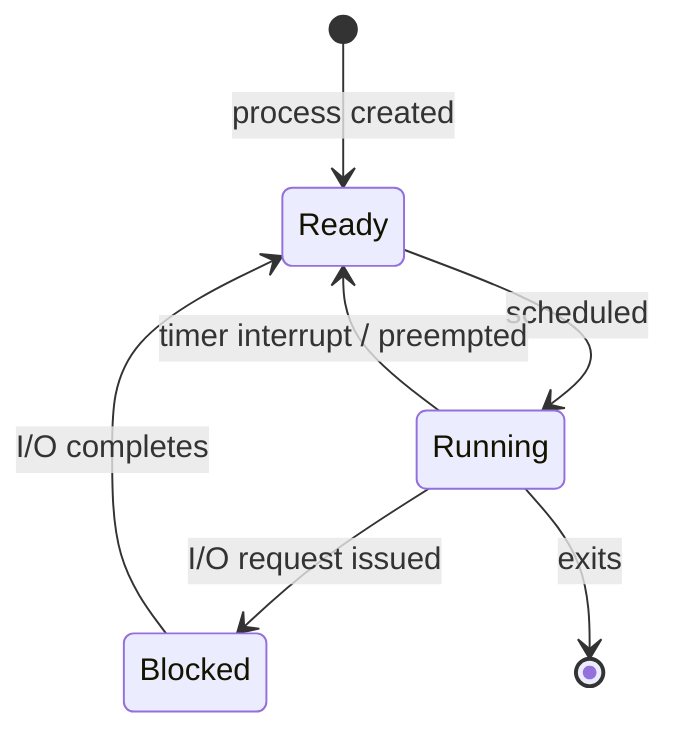

## Learning Objectives

- Name the core process states — running, ready, and blocked — and the events that move a process between them.
- Explain what a context switch actually saves and restores, and why it must save more than just the program counter.
- Describe the limited direct execution approach: running processes directly on the CPU for speed, while retaining OS control through hardware traps.
- Distinguish a voluntary context switch (a process blocks on I/O) from an involuntary one (a timer interrupt forces a switch).

## Context & Motivation

A process is not always actually executing, even while it exists. It might be waiting for a disk read to complete, waiting for its turn on a CPU that's currently running someone else, or actively executing instructions this very instant. OSTEP formalizes this with a small state diagram, and the machinery that moves a process between "actually running on the CPU" and "not running right now, but fully able to resume later" is the **context switch** — arguably the single piece of systems software responsible for the entire multiprogramming illusion introduced in the previous concept.

Getting this right is harder than it sounds, because it must be done both correctly and fast. Correctly, because losing even one register value when switching away from a process could corrupt that process's computation when it resumes. Fast, because a context switch happens many times per second on a busy system, and every microsecond spent switching is a microsecond not spent running any process's actual code — pure overhead the scheduling policies discussed next must account for.

## Core Theory

### The three core process states

A process is, at any moment, in exactly one of these states:

- **Running** — currently executing instructions on a CPU.
- **Ready** — able to run, but not currently assigned a CPU (waiting its turn).
- **Blocked** — waiting on some event (most commonly I/O completion, such as a disk read finishing) and unable to make progress even if given a CPU right now.



The transitions matter as much as the states themselves. **Ready → Running** happens when the scheduler picks this process to run next. **Running → Ready** happens involuntarily, most often because a timer interrupt fired and the OS preempted the process to give someone else a turn. **Running → Blocked** happens voluntarily, when the running process itself issues a request — reading from disk, waiting on a network socket — that cannot complete immediately. **Blocked → Ready** happens when whatever the process was waiting for finally completes, making it eligible to run again (though not immediately guaranteed the CPU — it re-enters the ready state, not running).

### Limited direct execution: run directly, but stay in control

The fastest possible way to run a process would be **direct execution**: just jump to the program's code and let it run on the real CPU with no OS involvement at all. This is exactly as fast as running native code should be — but it gives up all control. A process running with no OS oversight could run forever without yielding the CPU, or access another process's memory, or issue a privileged instruction that shuts down the whole machine.

OSTEP's solution is **limited direct execution (LDE)**: still run the process's code directly on the real CPU for speed, but retain control through hardware-provided **traps**. Two categories of trap matter here: a **system call** is a *voluntary* trap the process itself triggers, deliberately entering the OS's kernel mode to request a privileged operation (like reading a file); a **timer interrupt** is an *involuntary* trap the hardware fires automatically at fixed intervals, handing control back to the OS whether the running process asked for it or not. The timer interrupt specifically is what makes it impossible for a runaway or malicious process to simply refuse to ever yield the CPU — the hardware, not the process, forces the switch.

### What a context switch must save and restore

To switch from process A to process B, the OS must, at minimum:

1. Save A's full register state, including the program counter and stack pointer (the same "process context" already introduced), into A's saved-state area — commonly, part of A's process control block (PCB), the kernel's own record of everything it needs to know about A.
2. Load B's previously saved register state — including B's program counter and stack pointer — from B's PCB into the actual CPU registers.
3. Return from the trap or interrupt handler, which resumes execution at whatever B's program counter says — meaning B, from its own point of view, simply continues exactly where it left off, with no memory of ever having been paused.

Skipping even one register in this save/restore sequence risks corrupting the resumed process's computation the moment it uses that register's stale or wrong value — which is precisely why this bundle was defined so precisely as "process context" in the first concept of this discipline.

### Voluntary vs. involuntary switches

A context switch triggered because the running process itself called something that blocks (a disk read, waiting on a lock covered later in this discipline) is a **voluntary** switch — the process itself, via a system call, chose this moment to give up the CPU because it can't proceed anyway. A context switch triggered by a timer interrupt while the process was doing nothing wrong at all — just using more than its fair share of CPU time — is **involuntary**: the hardware forces the switch regardless of what the process wants. Both kinds ultimately run the exact same save/restore machinery described above; they differ only in *why* the switch happens, not in *how*.

## Worked Examples

### Example 1: A process's journey through the states

```text
t=0   Process P created                       -> Ready
t=1   Scheduler picks P                        -> Running
t=5   P issues a disk read (blocking call)     -> Blocked
t=5   Scheduler picks a different process Q    -> (Q: Running)
t=40  P's disk read completes                  -> Ready  (not Running yet!)
t=41  Scheduler eventually picks P again        -> Running
t=60  P finishes                                -> terminated
```

Notice the gap between t=40 (P becomes ready again) and t=41 (P actually resumes running) — becoming ready only means P is now *eligible*; it still has to wait for the scheduler to actually choose it, exactly the decision the CPU scheduling concepts covered next in this discipline are about.

### Example 2: What the context switch saves, concretely

Suppose process A is interrupted by a timer while executing this instruction sequence, right after computing a value into a register:

```text
A's code:
  mov rax, 42        <- A just executed this
  add rax, rbx       <- A was about to execute this next (PC points here)
```

A timer interrupt fires here. The OS's context-switch code saves, into A's PCB:

```text
PC:  address of "add rax, rbx"   (the next instruction, not yet run)
SP:  A's current stack pointer
rax: 42
rbx: (whatever it held)
... (remaining general registers)
```

Later, when A is scheduled again, the OS restores exactly these values into the real CPU registers and resumes execution at the saved PC — so `add rax, rbx` runs next, using `rax = 42` as if no interruption ever happened, even though, in reality, an entirely different process may have used that same physical CPU for milliseconds in between.

### Example 3: Voluntary vs. involuntary, side by side

```text
Voluntary switch (process blocks on I/O):
  Process P calls read() on a disk file
    -> P's request cannot complete immediately
    -> OS moves P: Running -> Blocked
    -> OS picks a different Ready process to run

Involuntary switch (timer interrupt):
  Process P is running a tight CPU-only loop, using its full time slice
    -> Hardware timer fires (P did NOT ask for this)
    -> OS moves P: Running -> Ready (P could keep running, but its turn is over)
    -> OS picks the next process per its scheduling policy
```

Both examples end with the OS running a different process next, and both use the identical save/restore mechanics — the difference is entirely in what triggered the switch: P's own blocking request, versus hardware forcing the issue regardless of what P wanted.

## Common Misconceptions & Pitfalls

- **"A process moves straight from Blocked back to Running once its I/O finishes."** It moves to Ready, not Running — becoming unblocked only makes a process eligible again; the scheduler still has to actually pick it before it resumes executing.
- **"Direct execution and limited direct execution are the same thing."** Plain direct execution gives a process the real CPU with no OS oversight at all — fast, but unsafe. Limited direct execution keeps the speed of running directly on hardware while retaining control through traps (system calls and, critically, timer interrupts).
- **"A context switch just needs to update the program counter."** It must save and restore the entire register file, not just the PC — general-purpose registers, the stack pointer, and any other CPU state the running program depends on. Missing any of it can silently corrupt the resumed process's computation.
- **"Without a scheduler forcing switches, a well-behaved process would eventually give up the CPU on its own."** The timer interrupt exists precisely because this cannot be assumed — a bug or a hostile program could otherwise run forever, and the whole point of limited direct execution's involuntary trap is removing that dependency on cooperation.

## Summary

A process is always in one of three core states — running, ready, or blocked — moving between them as the scheduler assigns the CPU, a timer interrupt preempts it, or it issues a blocking request like disk I/O. The OS achieves both speed and safety through **limited direct execution**: processes run their code directly on real hardware, but the OS retains control through traps — voluntary system calls and, crucially, involuntary timer interrupts that no process can refuse. The **context switch** is the mechanism underlying every one of these transitions: saving a process's complete register state (program counter, stack pointer, and general registers) into its process control block, then restoring a different process's previously saved state so it resumes with no observable gap. This machinery — states, traps, and context switches — is the substrate the next several concepts build directly on top of: CPU scheduling is precisely the policy question of *which* ready process the OS should load next, every time this machinery runs.

## Documentation Links

- [Arpaci-Dusseau — Operating Systems: Three Easy Pieces, "Mechanism: Limited Direct Execution"](https://pages.cs.wisc.edu/~remzi/OSTEP/cpu-mechanisms.pdf) — the canonical treatment of process states, traps, and the context switch this concept is built from.
- [UC Berkeley CS162 — Operating Systems and Systems Programming](https://cs162.org/) — course covering the same process-state and context-switching mechanics as part of its systems foundations.
