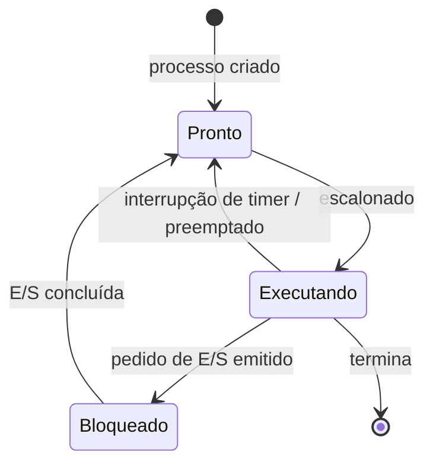

## Objetivos de Aprendizagem

- Nomear os estados centrais de um processo (executando, pronto e bloqueado) e os eventos que movem um processo entre eles.
- Explicar o que uma troca de contexto de fato salva e restaura, e por que ela precisa salvar mais do que só o contador de programa.
- Descrever a abordagem de execução direta limitada: rodar os processos diretamente na CPU pela velocidade, mantendo o controle do SO por meio de traps de hardware.
- Distinguir uma troca de contexto voluntária (um processo bloqueia em E/S) de uma involuntária (uma interrupção de timer força a troca).

## Contexto e Motivação

Um processo nem sempre está de fato executando, mesmo enquanto existe. Ele pode estar esperando uma leitura de disco terminar, esperando sua vez numa CPU que no momento roda outro processo, ou executando instruções ativamente neste exato instante. O OSTEP formaliza isso com um pequeno diagrama de estados, e a maquinaria que move um processo entre "rodando de fato na CPU" e "não rodando agora, mas totalmente capaz de retomar depois" é a **troca de contexto**: provavelmente a peça de software de sistemas responsável, sozinha, por toda a ilusão de multiprogramação apresentada no conceito anterior.

Fazer isso direito é mais difícil do que parece, porque precisa ser feito de forma correta e rápida. Correta, porque perder um único valor de registrador ao trocar um processo pode corromper o cálculo desse processo quando ele retomar. Rápida, porque uma troca de contexto acontece muitas vezes por segundo num sistema ocupado, e cada microssegundo gasto trocando é um microssegundo que não é gasto rodando o código real de processo nenhum: pura sobrecarga, que as políticas de escalonamento discutidas a seguir precisam levar em conta.

## Teoria Central

### Os três estados centrais de um processo

Um processo está, a cada momento, em exatamente um destes estados:

- **Executando** (running): executando instruções numa CPU no momento.
- **Pronto** (ready): capaz de rodar, mas sem CPU atribuída no momento (esperando sua vez).
- **Bloqueado** (blocked): esperando algum evento (mais comumente a conclusão de uma E/S, como uma leitura de disco terminar) e incapaz de progredir, mesmo que recebesse uma CPU agora.



As transições importam tanto quanto os próprios estados. **Pronto → Executando** acontece quando o escalonador escolhe este processo para rodar em seguida. **Executando → Pronto** acontece de forma involuntária, na maioria das vezes porque uma interrupção de timer disparou e o SO preemptou o processo para dar a vez a outro. **Executando → Bloqueado** acontece de forma voluntária, quando o próprio processo em execução emite um pedido (ler do disco, esperar num socket de rede) que não pode ser atendido de imediato. **Bloqueado → Pronto** acontece quando aquilo que o processo esperava finalmente termina, tornando-o elegível para rodar de novo (mas sem garantia imediata da CPU: ele volta ao estado pronto, e não ao executando).

### Execução direta limitada: rodar diretamente, mas manter o controle

A forma mais rápida possível de rodar um processo seria a **execução direta**: só saltar para o código do programa e deixá-lo rodar na CPU real, sem nenhum envolvimento do SO. Isso é exatamente tão rápido quanto rodar código nativo deveria ser, mas abre mão de todo controle. Um processo rodando sem supervisão do SO poderia rodar para sempre sem ceder a CPU, ou acessar a memória de outro processo, ou emitir uma instrução privilegiada que desliga a máquina inteira.

A solução do OSTEP é a **execução direta limitada (LDE)**: continuar rodando o código do processo diretamente na CPU real pela velocidade, mas manter o controle por meio de **traps** fornecidos pelo hardware. Duas categorias de trap importam aqui: uma **chamada de sistema** é um trap *voluntário* que o próprio processo dispara, entrando deliberadamente no modo kernel do SO para pedir uma operação privilegiada (como ler um arquivo); uma **interrupção de timer** é um trap *involuntário* que o hardware dispara automaticamente em intervalos fixos, devolvendo o controle ao SO quer o processo em execução tenha pedido, quer não. É especificamente a interrupção de timer que torna impossível que um processo descontrolado ou malicioso simplesmente se recuse a ceder a CPU para sempre: o hardware, e não o processo, força a troca.

### O que uma troca de contexto precisa salvar e restaurar

Para trocar do processo A para o processo B, o SO precisa, no mínimo:

1. Salvar o estado completo de registradores de A, incluindo o contador de programa e o ponteiro de pilha (o mesmo "contexto do processo" já apresentado), na área de estado salvo de A, normalmente parte do bloco de controle de processo (PCB) de A, o registro próprio do kernel com tudo o que ele precisa saber sobre A.
2. Carregar o estado de registradores de B, salvo anteriormente (incluindo o contador de programa e o ponteiro de pilha de B), do PCB de B para os registradores reais da CPU.
3. Retornar do tratador do trap ou da interrupção, o que retoma a execução no ponto indicado pelo contador de programa de B; ou seja, B, do seu próprio ponto de vista, simplesmente continua exatamente de onde parou, sem nenhuma lembrança de ter sido pausado.

Pular um único registrador nessa sequência de salvar e restaurar arrisca corromper o cálculo do processo retomado no momento em que ele usar o valor velho ou errado desse registrador; e é precisamente por isso que esse pacote foi definido com tanta precisão como "contexto do processo" no primeiro conceito desta disciplina.

### Trocas voluntárias vs. involuntárias

Uma troca de contexto disparada porque o próprio processo em execução chamou algo que bloqueia (uma leitura de disco, a espera por um lock visto mais adiante nesta disciplina) é uma troca **voluntária**: o próprio processo, por meio de uma chamada de sistema, escolheu este momento para ceder a CPU, porque não consegue prosseguir de qualquer jeito. Uma troca de contexto disparada por uma interrupção de timer enquanto o processo não estava fazendo nada de errado (só usando mais do que sua parte justa de tempo de CPU) é **involuntária**: o hardware força a troca, seja qual for a vontade do processo. Os dois tipos acabam rodando exatamente a mesma maquinaria de salvar e restaurar descrita acima; eles diferem só em *por que* a troca acontece, e não em *como*.

## Exemplos Resolvidos

### Exemplo 1: a jornada de um processo pelos estados

```text
t=0   O processo P é criado                       -> Pronto
t=1   O escalonador escolhe P                     -> Executando
t=5   P emite uma leitura de disco (bloqueante)   -> Bloqueado
t=5   O escalonador escolhe outro processo Q      -> (Q: Executando)
t=40  A leitura de disco de P termina             -> Pronto  (ainda não Executando!)
t=41  O escalonador acaba escolhendo P de novo    -> Executando
t=60  P termina                                   -> encerrado
```

Repare no intervalo entre t=40 (P fica pronto de novo) e t=41 (P de fato volta a rodar): ficar pronto só significa que P agora é *elegível*; ele ainda precisa esperar que o escalonador de fato o escolha, exatamente a decisão de que tratam os conceitos de escalonamento de CPU vistos a seguir nesta disciplina.

### Exemplo 2: o que a troca de contexto salva, de forma concreta

Suponha que o processo A seja interrompido por um timer enquanto executa esta sequência de instruções, logo depois de calcular um valor num registrador:

```text
Código de A:
  mov rax, 42        <- A acabou de executar esta
  add rax, rbx       <- A ia executar esta em seguida (o PC aponta aqui)
```

Uma interrupção de timer dispara aqui. O código de troca de contexto do SO salva, no PCB de A:

```text
PC:  endereço de "add rax, rbx"   (a próxima instrução, ainda não executada)
SP:  o ponteiro de pilha atual de A
rax: 42
rbx: (o que ele guardava)
... (os registradores gerais restantes)
```

Depois, quando A é escalonado de novo, o SO restaura exatamente esses valores nos registradores reais da CPU e retoma a execução no PC salvo; então `add rax, rbx` roda em seguida, usando `rax = 42` como se nenhuma interrupção tivesse acontecido, embora, na realidade, um processo totalmente diferente possa ter usado essa mesma CPU física por milissegundos nesse meio-tempo.

### Exemplo 3: voluntária vs. involuntária, lado a lado

```text
Troca voluntária (o processo bloqueia em E/S):
  O processo P chama read() num arquivo em disco
    -> o pedido de P não pode ser atendido de imediato
    -> o SO move P: Executando -> Bloqueado
    -> o SO escolhe outro processo Pronto para rodar

Troca involuntária (interrupção de timer):
  O processo P está rodando um laço apertado só de CPU, usando sua fatia de tempo inteira
    -> o timer de hardware dispara (P NÃO pediu isso)
    -> o SO move P: Executando -> Pronto (P poderia continuar rodando, mas sua vez acabou)
    -> o SO escolhe o próximo processo segundo sua política de escalonamento
```

Os dois exemplos terminam com o SO rodando outro processo em seguida, e os dois usam a mesmíssima mecânica de salvar e restaurar; a diferença está inteiramente no que disparou a troca: o próprio pedido bloqueante de P, contra o hardware forçando a questão seja qual for a vontade de P.

## Equívocos Comuns e Armadilhas

- **"Um processo passa direto de Bloqueado de volta para Executando quando sua E/S termina."** Ele passa para Pronto, e não para Executando: deixar de estar bloqueado só torna um processo elegível de novo; o escalonador ainda precisa de fato escolhê-lo antes de ele voltar a executar.
- **"Execução direta e execução direta limitada são a mesma coisa."** A execução direta pura dá a um processo a CPU real sem nenhuma supervisão do SO: rápida, mas insegura. A execução direta limitada mantém a velocidade de rodar diretamente no hardware enquanto conserva o controle por meio de traps (chamadas de sistema e, de forma crítica, interrupções de timer).
- **"Uma troca de contexto só precisa atualizar o contador de programa."** Ela precisa salvar e restaurar o conjunto inteiro de registradores, e não só o PC: registradores de propósito geral, o ponteiro de pilha e qualquer outro estado da CPU de que o programa em execução dependa. Deixar qualquer parte de fora pode corromper silenciosamente o cálculo do processo retomado.
- **"Sem um escalonador forçando trocas, um processo bem-comportado acabaria cedendo a CPU por conta própria."** A interrupção de timer existe precisamente porque isso não pode ser suposto: um bug ou um programa hostil poderia, de outra forma, rodar para sempre, e o objetivo inteiro do trap involuntário da execução direta limitada é remover essa dependência de cooperação.

## Resumo

Um processo está sempre num de três estados centrais (executando, pronto ou bloqueado), movendo-se entre eles conforme o escalonador lhe atribui a CPU, uma interrupção de timer o preempta ou ele emite um pedido bloqueante como E/S de disco. O SO consegue velocidade e segurança ao mesmo tempo pela **execução direta limitada**: os processos rodam seu código diretamente no hardware real, mas o SO mantém o controle por meio de traps (chamadas de sistema voluntárias e, de forma crucial, interrupções de timer involuntárias que nenhum processo pode recusar). A **troca de contexto** é o mecanismo por trás de cada uma dessas transições: salvar o estado completo de registradores de um processo (contador de programa, ponteiro de pilha e registradores gerais) no seu bloco de controle de processo, e então restaurar o estado salvo anteriormente de outro processo, para que ele retome sem nenhuma lacuna observável. Essa maquinaria (estados, traps e trocas de contexto) é o substrato sobre o qual os próximos conceitos se constroem diretamente: o escalonamento de CPU é precisamente a pergunta de política sobre *qual* processo pronto o SO deve carregar em seguida, toda vez que essa maquinaria roda.

## Documentation Links

- [Arpaci-Dusseau: Operating Systems: Three Easy Pieces, "Mechanism: Limited Direct Execution"](https://pages.cs.wisc.edu/~remzi/OSTEP/cpu-mechanisms.pdf): o tratamento canônico de estados de processo, traps e troca de contexto a partir do qual este conceito é construído.
- [UC Berkeley CS162: Operating Systems and Systems Programming](https://cs162.org/): curso que cobre a mesma mecânica de estados de processo e de troca de contexto como parte dos seus fundamentos de sistemas.
