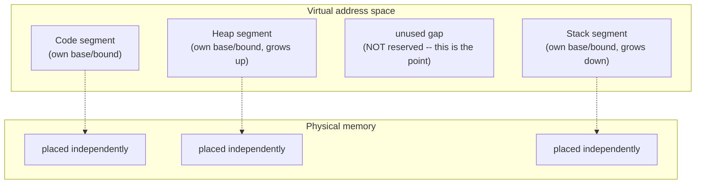

## Learning Objectives

- Describe segmentation: giving each logical piece of an address space (code, heap, stack) its own independent base and bound.
- Explain why segmentation avoids wasting memory on the unused gap between a small heap and a small stack, unlike single-region base-and-bound.
- Define external fragmentation and explain why it arises even when segments themselves are managed correctly.
- Describe the free-space-management strategies (best-fit, first-fit) an allocator uses to place variable-sized segments, and the fragmentation tradeoff each makes.

## Context & Motivation

Base-and-bound's single, contiguous region per process wastes memory whenever a process's logical pieces — code, heap, stack — don't happen to grow at the same rate, which is the ordinary case: a small program with a large heap and a tiny stack, or vice versa, still has to reserve a single block sized to cover the largest possible extent of all its pieces combined, wasting whatever gap sits unused in between. **Segmentation** fixes this by breaking the single base-and-bound pair into several independent base-and-bound pairs, one per logical segment — but this flexibility comes with a genuinely new cost: managing many independently-sized, independently-placed regions in physical memory is a real allocation problem in its own right, with its own well-known failure mode, **external fragmentation**.

## Core Theory

### Segmentation: one base-and-bound pair per logical piece

Instead of a single base register and a single bound register for an entire address space, segmentation gives each logical segment — typically code, heap, and stack — its own base and bound. The hardware determines which segment a given virtual address belongs to (often using the top few bits of the address as a segment selector) and applies that specific segment's base-and-bound translation and check, exactly as the previous concept described for the single-region case, just now per-segment rather than once for the whole address space.



Because each segment is placed and sized independently, the unused gap between a small heap and a small stack in the virtual address space never needs a corresponding chunk of *physical* memory reserved for it at all — only the segments that actually contain data occupy real physical space, directly solving base-and-bound's central waste problem.

### External fragmentation: the cost of flexibility

Placing several independently-sized segments (from potentially many different processes) into physical memory over time creates a genuine allocation problem: as segments are allocated and later freed, physical memory becomes divided into a patchwork of used and free chunks of varying sizes. **External fragmentation** occurs when the *total* free memory is more than enough to satisfy a new request, but no single *contiguous* free chunk is large enough — the free space exists, but it's scattered in pieces too small individually to use.

```text
Physical memory, after several allocations and frees:
[used: 10KB][free: 4KB][used: 8KB][free: 3KB][used: 6KB][free: 5KB]

Total free memory: 4 + 3 + 5 = 12KB
A new request for a single contiguous 10KB segment FAILS --
even though 12KB is free in total, no single free chunk is >= 10KB.
```

### Free-space-management strategies

An allocator managing this patchwork of free chunks needs a policy for which free chunk to hand out when a new request arrives. Two classic strategies, each with real, opposite tradeoffs:

- **Best-fit**: search all free chunks and pick the smallest one that's still large enough to satisfy the request. This minimizes wasted space *within* the chosen chunk for this one request, but tends to leave behind many tiny, awkward leftover fragments (a chunk just barely bigger than the request, with only a sliver left over) that are unlikely to be useful for future requests.
- **First-fit**: scan free chunks in order and pick the first one large enough, without searching for the best possible match. This is faster to compute (no need to examine every free chunk), and in practice tends to fragment memory somewhat differently than best-fit, though neither strategy eliminates external fragmentation — they only trade off *how* fragmentation tends to accumulate and how fast a placement decision can be made.

Neither policy is a complete cure — external fragmentation is an inherent cost of managing variable-sized allocations in general, whether those allocations are OS-level segments or, for that matter, the heap allocator inside a single process already covered in this platform's `c-and-assembly` discipline, which faces the identical placement problem for `malloc`-style requests within one process's own heap.

## Worked Examples

### Example 1: The gap base-and-bound wastes, that segmentation avoids

A process needs a 2 KB heap and a 1 KB stack, but its virtual address space reserves room for the heap to potentially grow up to 60 KB and the stack up to 60 KB, leaving a large unused virtual gap between them:

```text
Single-region base-and-bound: must reserve one contiguous 120KB+ physical
  block to cover from the start of the smallest segment to the end of
  the largest possible extent -- including the entire unused gap.

Segmentation: heap segment (base/bound covering only its actual 2KB used)
  and stack segment (base/bound covering only its actual 1KB used) are
  placed independently in physical memory -- only 3KB of actual physical
  memory is consumed, not 120KB+.
```

### Example 2: Best-fit vs. first-fit on the same free-chunk list

Free chunks, in memory order: `[5KB][14KB][6KB][20KB]`. A new request for 10 KB arrives.

```text
First-fit: scan in order -- 5KB (too small, skip), 14KB (big enough!) -> choose 14KB
           Leftover fragment: 14 - 10 = 4KB (added back to the free list)

Best-fit:  examine ALL chunks >= 10KB -- 14KB and 20KB qualify
           Choose the SMALLEST one that fits: 14KB
           Leftover fragment: 14 - 10 = 4KB (same result here, coincidentally)
```

In this particular case both strategies land on the same chunk, but best-fit required examining every free chunk to find the smallest sufficient one (more computation), while first-fit stopped at the first sufficient match — a real, general performance difference, even when the placement outcome happens to coincide.

### Example 3: A case where best-fit and first-fit diverge

Free chunks, in memory order: `[20KB][11KB][50KB]`. A new request for 10 KB arrives.

```text
First-fit: scan in order -- 20KB is the first chunk >= 10KB -> choose 20KB
           Leftover: 20 - 10 = 10KB fragment

Best-fit:  examine ALL chunks >= 10KB -- 20KB, 11KB, 50KB all qualify
           Choose the SMALLEST: 11KB
           Leftover: 11 - 10 = 1KB fragment (small, awkward sliver)
```

Best-fit leaves behind a much smaller, less useful 1 KB fragment here, while first-fit leaves a more usable 10 KB fragment — illustrating the real tradeoff: best-fit minimizes waste for *this* request but at the cost of scattering many small, hard-to-reuse slivers across memory over time, while first-fit is faster to compute per request and tends to leave somewhat larger (if less precisely matched) leftover chunks.

## Common Misconceptions & Pitfalls

- **"Segmentation eliminates memory waste entirely."** It eliminates the *specific* waste base-and-bound suffers (an unused gap reserved between logically separate pieces), but introduces its own cost — external fragmentation from managing many independently-placed, variable-sized segments over time.
- **"External fragmentation means there isn't enough free memory."** It specifically means there IS enough free memory *in total*, but not enough in any single contiguous chunk — Example 1's `[4KB][3KB][5KB]` free chunks (12KB total) failing a 10KB contiguous request is external fragmentation, not a genuine shortage.
- **"Best-fit is strictly better than first-fit because it minimizes wasted space per request."** Best-fit minimizes waste for the *current* request but tends to leave behind many small, hard-to-reuse fragments over time (as Example 3 shows), and it costs more computation per allocation (searching every free chunk) — first-fit is faster and, in practice, often fragments memory comparably over the long run.
- **"This free-space-management problem is specific to OS-level segments and doesn't apply elsewhere."** The identical problem (placing variable-sized allocations into a patchwork of free space, with the same best-fit/first-fit-style tradeoffs) is faced by an ordinary heap allocator inside a single process — the same `malloc`-style allocator already covered in this platform's `c-and-assembly` discipline.

## Summary

Segmentation gives each logical piece of a process's address space — code, heap, stack — its own independent base and bound, directly fixing the wasted-gap problem inherent to single-region base-and-bound translation, since only actually-used segments need corresponding physical memory. This flexibility introduces a genuine new cost: managing many independently-placed, variable-sized segments in physical memory over time produces **external fragmentation** — enough total free memory exists, but scattered into chunks too small individually to satisfy a new contiguous request. Free-space-management strategies like best-fit (minimize per-request waste, at the cost of scattering small unusable fragments) and first-fit (faster, comparable long-run fragmentation) manage this tradeoff without eliminating it — the same placement problem, and the same tradeoffs, reappear identically inside a single process's own heap allocator. The next concept, paging, sidesteps external fragmentation entirely by taking a fundamentally different approach: dividing memory into many small, fixed-size pieces instead of few large, variable-sized segments.

## Documentation Links

- [Arpaci-Dusseau — Operating Systems: Three Easy Pieces, "Segmentation"](https://pages.cs.wisc.edu/~remzi/OSTEP/vm-segmentation.pdf) — the canonical treatment of segmentation this concept is built from.
- [Arpaci-Dusseau — Operating Systems: Three Easy Pieces, "Free-Space Management"](https://pages.cs.wisc.edu/~remzi/OSTEP/vm-freespace.pdf) — the canonical treatment of external fragmentation and best-fit/first-fit allocation strategies this concept is built from.
