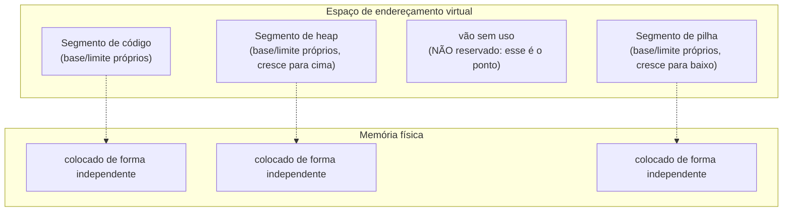

## Objetivos de Aprendizagem

- Descrever a segmentação: dar a cada pedaço lógico de um espaço de endereçamento (código, heap, pilha) sua própria base e seu próprio limite independentes.
- Explicar por que a segmentação evita desperdiçar memória com o vão sem uso entre um heap pequeno e uma pilha pequena, ao contrário do base e limite de região única.
- Definir fragmentação externa e explicar por que ela surge mesmo quando os próprios segmentos são gerenciados corretamente.
- Descrever as estratégias de gerenciamento de espaço livre (best-fit, first-fit) que um alocador usa para colocar segmentos de tamanho variável, e o trade-off de fragmentação de cada uma.

## Contexto e Motivação

A região única e contígua por processo do base e limite desperdiça memória sempre que os pedaços lógicos de um processo (código, heap, pilha) não crescem no mesmo ritmo, que é o caso comum: um programa pequeno com um heap grande e uma pilha minúscula, ou vice-versa, ainda precisa reservar um único bloco dimensionado para cobrir a maior extensão possível de todos os seus pedaços juntos, desperdiçando o vão que ficar sem uso no meio. A **segmentação** corrige isso quebrando o único par de base e limite em vários pares independentes, um por segmento lógico; mas essa flexibilidade traz um custo genuinamente novo: gerenciar muitas regiões de tamanho e posição independentes na memória física é um problema real de alocação por si só, com seu próprio modo de falha bem conhecido, a **fragmentação externa**.

## Teoria Central

### Segmentação: um par de base e limite por pedaço lógico

Em vez de um único registrador base e um único registrador limite para um espaço de endereçamento inteiro, a segmentação dá a cada segmento lógico (normalmente código, heap e pilha) sua própria base e seu próprio limite. O hardware determina a qual segmento um dado endereço virtual pertence (muitas vezes usando os bits mais altos do endereço como seletor de segmento) e aplica a tradução e a verificação de base e limite daquele segmento específico, exatamente como o conceito anterior descreveu para o caso de região única, só que agora por segmento, em vez de uma vez para o espaço de endereçamento inteiro.



Como cada segmento é colocado e dimensionado de forma independente, o vão sem uso entre um heap pequeno e uma pilha pequena no espaço de endereçamento virtual nunca precisa de um pedaço correspondente de memória *física* reservado para ele; só os segmentos que de fato contêm dados ocupam espaço físico real, resolvendo diretamente o problema central de desperdício do base e limite.

### Fragmentação externa: o custo da flexibilidade

Colocar ao longo do tempo vários segmentos de tamanhos independentes (de potencialmente muitos processos diferentes) na memória física cria um problema genuíno de alocação: conforme segmentos são alocados e depois liberados, a memória física fica dividida numa colcha de retalhos de pedaços usados e livres de tamanhos variados. A **fragmentação externa** ocorre quando a memória livre *total* é mais que suficiente para atender a um novo pedido, mas nenhum pedaço livre *contíguo* isolado é grande o bastante: o espaço livre existe, mas está espalhado em pedaços pequenos demais para serem usados individualmente.

```text
Memória física, depois de várias alocações e liberações:
[usado: 10KB][livre: 4KB][usado: 8KB][livre: 3KB][usado: 6KB][livre: 5KB]

Memória livre total: 4 + 3 + 5 = 12KB
Um novo pedido de um único segmento contíguo de 10KB FALHA:
embora haja 12KB livres no total, nenhum pedaço livre isolado é >= 10KB.
```

### Estratégias de gerenciamento de espaço livre

Um alocador que gerencia essa colcha de pedaços livres precisa de uma política para decidir qual pedaço livre entregar quando chega um novo pedido. Duas estratégias clássicas, cada uma com trade-offs reais e opostos:

- **Best-fit** (melhor encaixe): procurar em todos os pedaços livres e escolher o menor que ainda seja grande o bastante para atender ao pedido. Isso minimiza o espaço desperdiçado *dentro* do pedaço escolhido para este pedido, mas tende a deixar para trás muitos fragmentos residuais minúsculos e desajeitados (um pedaço só um pouco maior que o pedido, com só uma lasca sobrando) que provavelmente não vão servir para pedidos futuros.
- **First-fit** (primeiro encaixe): percorrer os pedaços livres em ordem e escolher o primeiro grande o bastante, sem procurar o melhor encaixe possível. Isso é mais rápido de calcular (não precisa examinar todo pedaço livre) e, na prática, tende a fragmentar a memória de um jeito um pouco diferente do best-fit, embora nenhuma das estratégias elimine a fragmentação externa; elas só trocam *como* a fragmentação tende a se acumular e quão rápido uma decisão de posicionamento pode ser tomada.

Nenhuma das políticas é uma cura completa: a fragmentação externa é um custo inerente de gerenciar alocações de tamanho variável em geral, sejam elas segmentos em nível de SO ou, aliás, o alocador de heap dentro de um único processo já visto na disciplina `c-and-assembly` desta plataforma, que enfrenta o mesmíssimo problema de posicionamento para pedidos no estilo `malloc` dentro do heap de um processo.

## Exemplos Resolvidos

### Exemplo 1: o vão que o base e limite desperdiça e que a segmentação evita

Um processo precisa de um heap de 2 KB e de uma pilha de 1 KB, mas seu espaço de endereçamento virtual reserva espaço para o heap crescer potencialmente até 60 KB e para a pilha até 60 KB, deixando um grande vão virtual sem uso entre eles:

```text
Base e limite de região única: precisa reservar um bloco físico contíguo de 120KB+
  para cobrir do início do menor segmento até o fim da maior extensão possível,
  incluindo o vão sem uso inteiro.

Segmentação: o segmento de heap (base/limite cobrindo só seus 2KB de fato usados)
  e o segmento de pilha (base/limite cobrindo só seu 1KB de fato usado) são
  colocados de forma independente na memória física: só 3KB de memória física
  real são consumidos, e não 120KB+.
```

### Exemplo 2: best-fit vs. first-fit na mesma lista de pedaços livres

Pedaços livres, na ordem da memória: `[5KB][14KB][6KB][20KB]`. Chega um novo pedido de 10 KB.

```text
First-fit: percorre em ordem: 5KB (pequeno demais, pula), 14KB (grande o bastante!) -> escolhe 14KB
           Fragmento residual: 14 - 10 = 4KB (volta para a lista de livres)

Best-fit:  examina TODOS os pedaços >= 10KB: 14KB e 20KB se qualificam
           Escolhe o MENOR que serve: 14KB
           Fragmento residual: 14 - 10 = 4KB (mesmo resultado aqui, por coincidência)
```

Neste caso específico, as duas estratégias caem no mesmo pedaço, mas o best-fit precisou examinar todo pedaço livre para achar o menor suficiente (mais cálculo), enquanto o first-fit parou no primeiro encaixe suficiente; uma diferença real e geral de desempenho, mesmo quando o resultado do posicionamento por acaso coincide.

### Exemplo 3: um caso em que best-fit e first-fit divergem

Pedaços livres, na ordem da memória: `[20KB][11KB][50KB]`. Chega um novo pedido de 10 KB.

```text
First-fit: percorre em ordem: 20KB é o primeiro pedaço >= 10KB -> escolhe 20KB
           Residual: fragmento de 20 - 10 = 10KB

Best-fit:  examina TODOS os pedaços >= 10KB: 20KB, 11KB, 50KB se qualificam
           Escolhe o MENOR: 11KB
           Residual: fragmento de 11 - 10 = 1KB (uma lasca pequena e desajeitada)
```

O best-fit deixa para trás aqui um fragmento de 1 KB bem menor e menos útil, enquanto o first-fit deixa um fragmento de 10 KB mais aproveitável, ilustrando o trade-off real: o best-fit minimiza o desperdício para *este* pedido, mas ao custo de espalhar pela memória, ao longo do tempo, muitas lascas pequenas e difíceis de reaproveitar, enquanto o first-fit é mais rápido de calcular por pedido e tende a deixar pedaços residuais um pouco maiores (ainda que com encaixe menos preciso).

## Equívocos Comuns e Armadilhas

- **"A segmentação elimina por completo o desperdício de memória."** Ela elimina o desperdício *específico* de que o base e limite sofre (um vão sem uso reservado entre pedaços logicamente separados), mas introduz seu próprio custo: a fragmentação externa, por gerenciar ao longo do tempo muitos segmentos de tamanho variável colocados de forma independente.
- **"Fragmentação externa significa que não há memória livre suficiente."** Ela significa especificamente que HÁ memória livre suficiente *no total*, mas não o bastante num único pedaço contíguo; os pedaços livres `[4KB][3KB][5KB]` da Teoria Central (12KB no total) falhando num pedido contíguo de 10KB são fragmentação externa, e não uma falta genuína.
- **"O best-fit é estritamente melhor que o first-fit porque minimiza o espaço desperdiçado por pedido."** O best-fit minimiza o desperdício do pedido *atual*, mas tende a deixar para trás, ao longo do tempo, muitos fragmentos pequenos e difíceis de reaproveitar (como o Exemplo 3 mostra), e custa mais cálculo por alocação (procurar em todo pedaço livre); o first-fit é mais rápido e, na prática, muitas vezes fragmenta a memória de forma comparável no longo prazo.
- **"Este problema de gerenciamento de espaço livre é específico de segmentos em nível de SO e não se aplica em outro lugar."** O mesmíssimo problema (colocar alocações de tamanho variável numa colcha de espaço livre, com os mesmos trade-offs no estilo best-fit/first-fit) é enfrentado por um alocador de heap comum dentro de um único processo: o mesmo alocador no estilo `malloc` já visto na disciplina `c-and-assembly` desta plataforma.

## Resumo

A segmentação dá a cada pedaço lógico do espaço de endereçamento de um processo (código, heap, pilha) sua própria base e seu próprio limite independentes, corrigindo diretamente o problema do vão desperdiçado inerente à tradução base e limite de região única, já que só os segmentos de fato usados precisam de memória física correspondente. Essa flexibilidade introduz um custo genuinamente novo: gerenciar ao longo do tempo muitos segmentos de tamanho variável, colocados de forma independente na memória física, produz **fragmentação externa**: existe memória livre total suficiente, mas espalhada em pedaços pequenos demais, individualmente, para atender a um novo pedido contíguo. Estratégias de gerenciamento de espaço livre como best-fit (minimiza o desperdício por pedido, ao custo de espalhar fragmentos pequenos e inutilizáveis) e first-fit (mais rápida, com fragmentação de longo prazo comparável) administram esse trade-off sem eliminá-lo; o mesmo problema de posicionamento, com os mesmos trade-offs, reaparece de forma idêntica dentro do próprio alocador de heap de um processo. O próximo conceito, a paginação, contorna por completo a fragmentação externa com uma abordagem fundamentalmente diferente: dividir a memória em muitas peças pequenas e de tamanho fixo, em vez de poucos segmentos grandes e de tamanho variável.

## Documentation Links

- [Arpaci-Dusseau: Operating Systems: Three Easy Pieces, "Segmentation"](https://pages.cs.wisc.edu/~remzi/OSTEP/vm-segmentation.pdf): o tratamento canônico da segmentação a partir do qual este conceito é construído.
- [Arpaci-Dusseau: Operating Systems: Three Easy Pieces, "Free-Space Management"](https://pages.cs.wisc.edu/~remzi/OSTEP/vm-freespace.pdf): o tratamento canônico da fragmentação externa e das estratégias de alocação best-fit/first-fit a partir do qual este conceito é construído.
