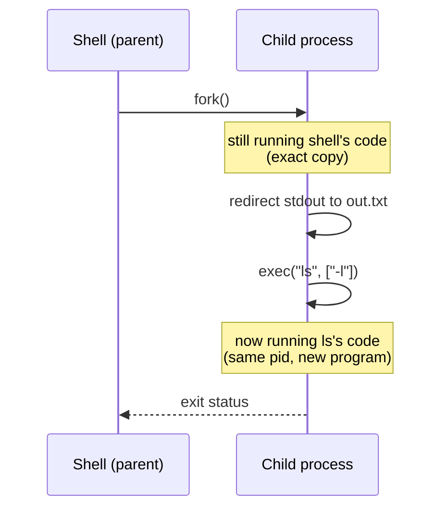

## Learning Objectives

- Explain what `fork()` does: creating a near-identical copy of the calling process, and how the parent and child are told apart by `fork()`'s return value.
- Explain what `exec()` does: replacing a process's current memory image with a different program, without creating a new process.
- Trace why Unix splits process creation into these two separate calls instead of one "run this other program" call, and what that split makes possible.
- Connect `fork()`/`exec()` to how a real shell implements running a command.

## Context & Motivation

Every time a shell runs a command — typing `ls` and pressing Enter — a new process must come into existence to execute `ls`'s code. The obvious design would be a single system call: "create a new process running this program." Unix, going back to its original 1970s design, instead splits this into two independent, more primitive operations: `fork()`, which creates a copy of the *calling* process, and `exec()`, which replaces the *calling* process's memory image with a different program. Neither one, by itself, does "run a different program as a new process" — but calling `fork()` and then `exec()` in the child does exactly that, and the separation buys something the single-call design could never offer.

OSTEP's *Interlude: Process API* chapter frames this split as one of the most elegant, if initially baffling, ideas in Unix's design. The elegance shows up the moment a shell needs to do anything *between* creating a new process and running the target program in it — redirecting output to a file, setting up a pipe between two commands — because all of that setup can happen in the child, after `fork()` but before `exec()`, using perfectly ordinary code that runs in a process which is, for that brief window, still an exact copy of the shell itself.

## Core Theory

### `fork()`: one call, two processes

`fork()` creates a new process — the **child** — as a near-exact duplicate of the calling process, the **parent**: same code, same heap and stack contents (copied, not shared), same open file descriptors. The one crucial difference is `fork()`'s **return value**, which is different in each of the two processes now running: the parent receives the child's process ID (a positive integer), while the child receives exactly `0`. This is the only way the two processes — running the identical code, since the child is a copy — can tell which one they are and take different paths.

```text
pid_t rc = fork();
if (rc < 0) {
    // fork failed
} else if (rc == 0) {
    // I am the child (rc == 0)
} else {
    // I am the parent (rc == child's pid)
}
```

Immediately after `fork()` returns, there are two processes executing this same `if`/`else` — each takes a different branch based on what `fork()` handed back to it.

### `exec()`: replacing a process's memory, not creating one

`exec()` (in its several real variants — `execve`, `execvp`, and others) does something different in kind: it loads a *new* program's code and data into the *calling process's own* address space, overwriting what was there, and starts execution at that new program's entry point. Critically, `exec()` does **not** create a new process — the process ID stays the same; only the code, data, and stack it's executing are replaced. A successful `exec()` call never returns to the calling program's old code, because that code no longer exists in memory to return to.

### Why split them: what `fork()` + `exec()` buys a shell

Consider what a shell must do to run `ls -l > out.txt`: create a process, redirect that process's standard output to `out.txt`, and only then run `ls` in it. With `fork()` and `exec()` as separate steps, this is straightforward — the shell calls `fork()`, and in the child (`rc == 0`), *before* calling `exec()`, it does ordinary file-descriptor manipulation to point standard output at `out.txt`. Only after that setup does the child call `exec()` to become `ls`. Because the child is, until the moment `exec()` runs, still a full copy of the shell — with the shell's own code and system-call access — any setup a shell might need is just ordinary code running in that window, with no special-purpose system call required for each possible kind of setup (redirection, pipes, environment changes, and more).



### Connection to the process address space this new process will use

The moment `exec()` replaces a process's code and data, it is establishing a fresh version of exactly the address-space layout already covered when this platform's `computer/c-and-assembly` discipline built a running C program from source: a code segment, a data segment, a heap, and a stack, now populated with `ls`'s binary instead of the shell's. `fork()` and `exec()` are the OS-level mechanism that actually stands that layout up for a brand-new running program — this concept is the "who calls the moving truck," while the process address space concept already covered is "what the truck delivers."

## Worked Examples

### Example 1: A minimal fork() that prints from both processes

```c
#include <stdio.h>
#include <unistd.h>

int main() {
    pid_t rc = fork();
    if (rc == 0) {
        printf("child: pid=%d\n", getpid());
    } else {
        printf("parent: pid=%d, child pid=%d\n", getpid(), rc);
    }
    return 0;
}
```

A single call to `fork()` produces two processes, both executing the code below it — but taking different branches. A real run might print (in either order, since scheduling order between parent and child is not guaranteed):

```text
parent: pid=4021, child pid=4022
child: pid=4022
```

Notice `printf` itself runs twice, once in each process, even though there is exactly one `printf` call in the source — because after `fork()`, there are two independent processes, each with their own copy of the code and their own place in it.

### Example 2: fork() then exec() — a minimal shell fragment

```c
pid_t rc = fork();
if (rc == 0) {
    // child: become "ls -l"
    char *args[] = {"ls", "-l", NULL};
    execvp("ls", args);
    // only reached if execvp fails
    printf("exec failed\n");
} else {
    // parent: wait for the child to finish
    int status;
    waitpid(rc, &status, 0);
    printf("child finished\n");
}
```

The child's `printf("exec failed\n")` line is only ever reached if `execvp` itself fails to find or load `ls` — on success, `execvp` never returns, because the child's code, data, and stack have been entirely replaced by `ls`'s. The parent's `waitpid` call blocks until the child (now running as `ls`) finishes, then prints its own message — demonstrating that the child's process ID never changed across the `exec()` call, even though the program running under it completely did.

### Example 3: Output redirection, the reason for the split

```c
pid_t rc = fork();
if (rc == 0) {
    // child: redirect stdout to a file BEFORE exec
    close(STDOUT_FILENO);
    open("out.txt", O_CREAT | O_WRONLY, 0644);   // takes fd 1 (stdout)
    execvp("ls", (char *[]){"ls", "-l", NULL});
} else {
    waitpid(rc, NULL, 0);
}
```

The `close`/`open` pair runs in the child, after `fork()` but before `exec()`, using nothing more than ordinary file-descriptor system calls — no special "run this program with output redirected to that file" call exists or is needed. Because file descriptors are part of a process's saved state (per the process context already introduced), and because the child still has the shell's full code and system-call access at this point, arbitrary setup like this is simply code, not a new primitive — exactly the flexibility the fork/exec split was designed to provide.

## Common Misconceptions & Pitfalls

- **"`fork()` runs a different program in a new process."** `fork()` only duplicates the calling process — same program, same code. Running a *different* program requires a separate `exec()` call, typically made by the child after `fork()`.
- **"`exec()` creates a new process."** It does not — the process ID is unchanged. `exec()` replaces the calling process's own code, data, and stack with a different program's; no new process comes into existence.
- **"After `fork()`, the parent's and child's memory stay linked, so changes in one show up in the other."** They do not (barring specially requested shared memory, out of scope here) — `fork()` gives the child its own independent copy of the parent's memory at the moment of the call; subsequent changes in either process are invisible to the other.
- **"`fork()` returns different values because the two processes execute different code."** It's the reverse: the two processes start out running the *identical* code (a full copy), and it is precisely `fork()`'s different return values (0 in the child, the child's pid in the parent) that let identical code take different branches.
- **"A shell needs one system call per kind of setup it might want (redirection, pipes, ...)."** The entire point of splitting `fork()` from `exec()` is that no such call is needed — any setup is just ordinary code running in the child during the window between the two calls.

## Summary

Unix splits process creation into two independent primitives: `fork()`, which duplicates the calling process into a parent and a nearly identical child distinguished only by `fork()`'s return value, and `exec()`, which replaces the *calling* process's own code, data, and stack with a different program's, keeping the same process ID. Neither call alone launches a new program as a new process, but `fork()` followed by `exec()` in the child does — and the gap between the two calls is exactly where a real shell does redirection, pipe setup, and other configuration, using ordinary code rather than a dedicated system call for each case. `exec()`'s replacement of a process's memory image is the OS-level act of standing up the address-space layout — code, data, heap, stack — already built from the ground up in this platform's C and assembly material. The next concept turns from how a process comes into existence to the states a process moves through once it exists, and the mechanism — the context switch — that lets the OS pause one and resume another.

## Documentation Links

- [Arpaci-Dusseau — Operating Systems: Three Easy Pieces, "Interlude: Process API"](https://pages.cs.wisc.edu/~remzi/OSTEP/cpu-api.pdf) — the canonical treatment of `fork()`/`exec()` and why Unix splits process creation this way.
- [UC Berkeley CS162 — Operating Systems and Systems Programming](https://cs162.org/) — course covering the same process-creation API as part of its systems-programming foundations.
