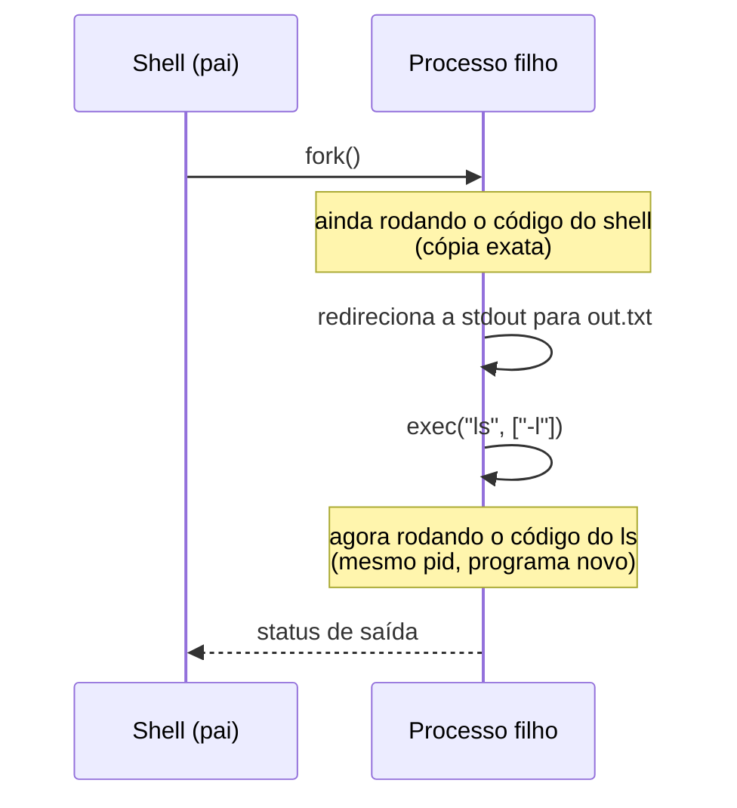

## Objetivos de Aprendizagem

- Explicar o que o `fork()` faz: criar uma cópia quase idêntica do processo chamador, e como o pai e o filho são distinguidos pelo valor de retorno do `fork()`.
- Explicar o que o `exec()` faz: substituir a imagem de memória atual de um processo por outro programa, sem criar um processo novo.
- Acompanhar por que o Unix divide a criação de processos nessas duas chamadas separadas em vez de uma única chamada "rode este outro programa", e o que essa divisão torna possível.
- Ligar o `fork()`/`exec()` à forma como um shell real implementa a execução de um comando.

## Contexto e Motivação

Toda vez que um shell roda um comando (digitar `ls` e apertar Enter), um processo novo precisa passar a existir para executar o código do `ls`. O projeto óbvio seria uma única chamada de sistema: "crie um processo novo rodando este programa". O Unix, desde seu projeto original dos anos 1970, divide isso em duas operações independentes e mais primitivas: `fork()`, que cria uma cópia do processo *chamador*, e `exec()`, que substitui a imagem de memória do processo *chamador* por outro programa. Nenhuma das duas, sozinha, faz "rodar outro programa como um processo novo"; mas chamar `fork()` e depois `exec()` no filho faz exatamente isso, e a separação compra algo que o projeto de chamada única nunca conseguiria oferecer.

O capítulo *Interlude: Process API* do OSTEP enquadra essa divisão como uma das ideias mais elegantes, ainda que de início desconcertantes, do projeto do Unix. A elegância aparece no momento em que um shell precisa fazer qualquer coisa *entre* criar um processo novo e rodar o programa alvo nele (redirecionar a saída para um arquivo, montar um pipe entre dois comandos), porque toda essa preparação pode acontecer no filho, depois do `fork()` e antes do `exec()`, usando código perfeitamente comum, rodando num processo que, durante essa breve janela, ainda é uma cópia exata do próprio shell.

## Teoria Central

### `fork()`: uma chamada, dois processos

O `fork()` cria um processo novo (o **filho**) como uma duplicata quase exata do processo chamador (o **pai**): mesmo código, mesmo conteúdo de heap e de pilha (copiado, não compartilhado), mesmos descritores de arquivo abertos. A única diferença crucial é o **valor de retorno** do `fork()`, que é diferente em cada um dos dois processos agora rodando: o pai recebe o ID de processo do filho (um inteiro positivo), enquanto o filho recebe exatamente `0`. Essa é a única forma de os dois processos (rodando o mesmo código, já que o filho é uma cópia) saberem qual deles são e seguirem caminhos diferentes.

```text
pid_t rc = fork();
if (rc < 0) {
    // o fork falhou
} else if (rc == 0) {
    // sou o filho (rc == 0)
} else {
    // sou o pai (rc == pid do filho)
}
```

Logo depois que o `fork()` retorna, há dois processos executando este mesmo `if`/`else`, e cada um segue um ramo diferente, conforme o que o `fork()` lhe entregou.

### `exec()`: substituir a memória de um processo, e não criar um

O `exec()` (nas suas várias variantes reais: `execve`, `execvp` e outras) faz algo de natureza diferente: carrega o código e os dados de um programa *novo* no espaço de endereçamento *do próprio processo chamador*, sobrescrevendo o que estava lá, e começa a execução no ponto de entrada desse novo programa. Crucialmente, o `exec()` **não** cria um processo novo: o ID de processo continua o mesmo; só o código, os dados e a pilha que ele executa são substituídos. Uma chamada de `exec()` bem-sucedida nunca volta para o código antigo do programa chamador, porque esse código não existe mais na memória para onde voltar.

### Por que separar: o que o `fork()` + `exec()` compra para um shell

Considere o que um shell precisa fazer para rodar `ls -l > out.txt`: criar um processo, redirecionar a saída padrão desse processo para `out.txt` e só então rodar `ls` nele. Com `fork()` e `exec()` como passos separados, isso é direto: o shell chama `fork()` e, no filho (`rc == 0`), *antes* de chamar `exec()`, faz uma manipulação comum de descritores de arquivo para apontar a saída padrão para `out.txt`. Só depois dessa preparação o filho chama `exec()` para virar o `ls`. Como o filho é, até o momento em que o `exec()` roda, ainda uma cópia completa do shell (com o código do próprio shell e acesso a chamadas de sistema), qualquer preparação de que um shell possa precisar é só código comum rodando nessa janela, sem precisar de uma chamada de sistema especial para cada tipo possível de preparação (redirecionamento, pipes, mudanças de ambiente e mais).



### Ligação com o espaço de endereçamento que este processo novo vai usar

No momento em que o `exec()` substitui o código e os dados de um processo, ele está estabelecendo uma versão nova exatamente do layout de espaço de endereçamento já visto quando a disciplina `computer/c-and-assembly` desta plataforma construiu um programa C em execução a partir do código-fonte: um segmento de código, um segmento de dados, um heap e uma pilha, agora preenchidos com o binário do `ls` em vez do shell. O `fork()` e o `exec()` são o mecanismo em nível de SO que de fato monta esse layout para um programa novo em execução; este conceito é "quem chama o caminhão de mudança", enquanto o conceito de espaço de endereçamento de processo já visto é "o que o caminhão entrega".

## Exemplos Resolvidos

### Exemplo 1: um fork() mínimo que imprime nos dois processos

```c
#include <stdio.h>
#include <unistd.h>

int main() {
    pid_t rc = fork();
    if (rc == 0) {
        printf("child: pid=%d\n", getpid());
    } else {
        printf("parent: pid=%d, child pid=%d\n", getpid(), rc);
    }
    return 0;
}
```

Uma única chamada de `fork()` produz dois processos, ambos executando o código abaixo dela, mas seguindo ramos diferentes. Uma execução real poderia imprimir (em qualquer ordem, já que a ordem de escalonamento entre pai e filho não é garantida):

```text
parent: pid=4021, child pid=4022
child: pid=4022
```

Repare que o próprio `printf` roda duas vezes, uma em cada processo, embora haja exatamente uma chamada de `printf` no código-fonte; porque, depois do `fork()`, há dois processos independentes, cada um com sua cópia do código e seu próprio ponto nele.

### Exemplo 2: fork() e depois exec(), um fragmento mínimo de shell

```c
pid_t rc = fork();
if (rc == 0) {
    // filho: vira "ls -l"
    char *args[] = {"ls", "-l", NULL};
    execvp("ls", args);
    // só é alcançado se o execvp falhar
    printf("exec failed\n");
} else {
    // pai: espera o filho terminar
    int status;
    waitpid(rc, &status, 0);
    printf("child finished\n");
}
```

A linha `printf("exec failed\n")` do filho só é alcançada se o próprio `execvp` falhar em achar ou carregar o `ls`; em caso de sucesso, o `execvp` nunca retorna, porque o código, os dados e a pilha do filho foram inteiramente substituídos pelos do `ls`. A chamada `waitpid` do pai bloqueia até que o filho (agora rodando como `ls`) termine, e então imprime sua própria mensagem, demonstrando que o ID de processo do filho nunca mudou ao longo da chamada de `exec()`, embora o programa rodando sob ele tenha mudado por completo.

### Exemplo 3: redirecionamento de saída, o motivo da separação

```c
pid_t rc = fork();
if (rc == 0) {
    // filho: redireciona a stdout para um arquivo ANTES do exec
    close(STDOUT_FILENO);
    open("out.txt", O_CREAT | O_WRONLY, 0644);   // fica com o fd 1 (stdout)
    execvp("ls", (char *[]){"ls", "-l", NULL});
} else {
    waitpid(rc, NULL, 0);
}
```

O par `close`/`open` roda no filho, depois do `fork()` e antes do `exec()`, usando nada além de chamadas de sistema comuns de descritores de arquivo; não existe nem é necessária uma chamada especial de "rode este programa com a saída redirecionada para aquele arquivo". Como os descritores de arquivo fazem parte do estado salvo de um processo (segundo o contexto de processo já apresentado), e como o filho ainda tem o código completo do shell e acesso a chamadas de sistema nesse ponto, uma preparação arbitrária como esta é simplesmente código, e não uma primitiva nova: exatamente a flexibilidade que a separação entre fork e exec foi projetada para oferecer.

## Equívocos Comuns e Armadilhas

- **"O `fork()` roda outro programa num processo novo."** O `fork()` só duplica o processo chamador: mesmo programa, mesmo código. Rodar um programa *diferente* exige uma chamada separada de `exec()`, normalmente feita pelo filho depois do `fork()`.
- **"O `exec()` cria um processo novo."** Não cria: o ID de processo não muda. O `exec()` substitui o próprio código, os dados e a pilha do processo chamador pelos de outro programa; nenhum processo novo passa a existir.
- **"Depois do `fork()`, as memórias do pai e do filho ficam ligadas, então mudanças num aparecem no outro."** Não ficam (salvo memória compartilhada pedida de forma especial, fora do escopo aqui): o `fork()` dá ao filho sua própria cópia independente da memória do pai no momento da chamada; mudanças posteriores em qualquer um dos processos ficam invisíveis para o outro.
- **"O `fork()` devolve valores diferentes porque os dois processos executam código diferente."** É o contrário: os dois processos começam rodando o *mesmo* código (uma cópia completa), e são precisamente os valores de retorno diferentes do `fork()` (0 no filho, o pid do filho no pai) que permitem que um código idêntico siga ramos diferentes.
- **"Um shell precisa de uma chamada de sistema para cada tipo de preparação que possa querer (redirecionamento, pipes, ...)."** O objetivo inteiro de separar o `fork()` do `exec()` é que nenhuma chamada desse tipo é necessária: qualquer preparação é só código comum rodando no filho durante a janela entre as duas chamadas.

## Resumo

O Unix divide a criação de processos em duas primitivas independentes: o `fork()`, que duplica o processo chamador num pai e num filho quase idênticos, distinguidos só pelo valor de retorno do `fork()`, e o `exec()`, que substitui o próprio código, os dados e a pilha do processo *chamador* pelos de outro programa, mantendo o mesmo ID de processo. Nenhuma das chamadas sozinha lança um programa novo como processo novo, mas o `fork()` seguido de `exec()` no filho faz isso; e o intervalo entre as duas chamadas é exatamente onde um shell real faz redirecionamentos, montagem de pipes e outras configurações, usando código comum em vez de uma chamada de sistema dedicada para cada caso. A substituição da imagem de memória de um processo pelo `exec()` é o ato, em nível de SO, de montar o layout de espaço de endereçamento (código, dados, heap, pilha) já construído do zero no material de C e assembly desta plataforma. O próximo conceito passa de como um processo passa a existir para os estados pelos quais um processo passa depois de existir, e o mecanismo (a troca de contexto) que permite ao SO pausar um e retomar outro.

## Documentation Links

- [Arpaci-Dusseau: Operating Systems: Three Easy Pieces, "Interlude: Process API"](https://pages.cs.wisc.edu/~remzi/OSTEP/cpu-api.pdf): o tratamento canônico de `fork()`/`exec()` e de por que o Unix divide a criação de processos dessa forma.
- [UC Berkeley CS162: Operating Systems and Systems Programming](https://cs162.org/): curso que cobre a mesma API de criação de processos como parte dos seus fundamentos de programação de sistemas.
