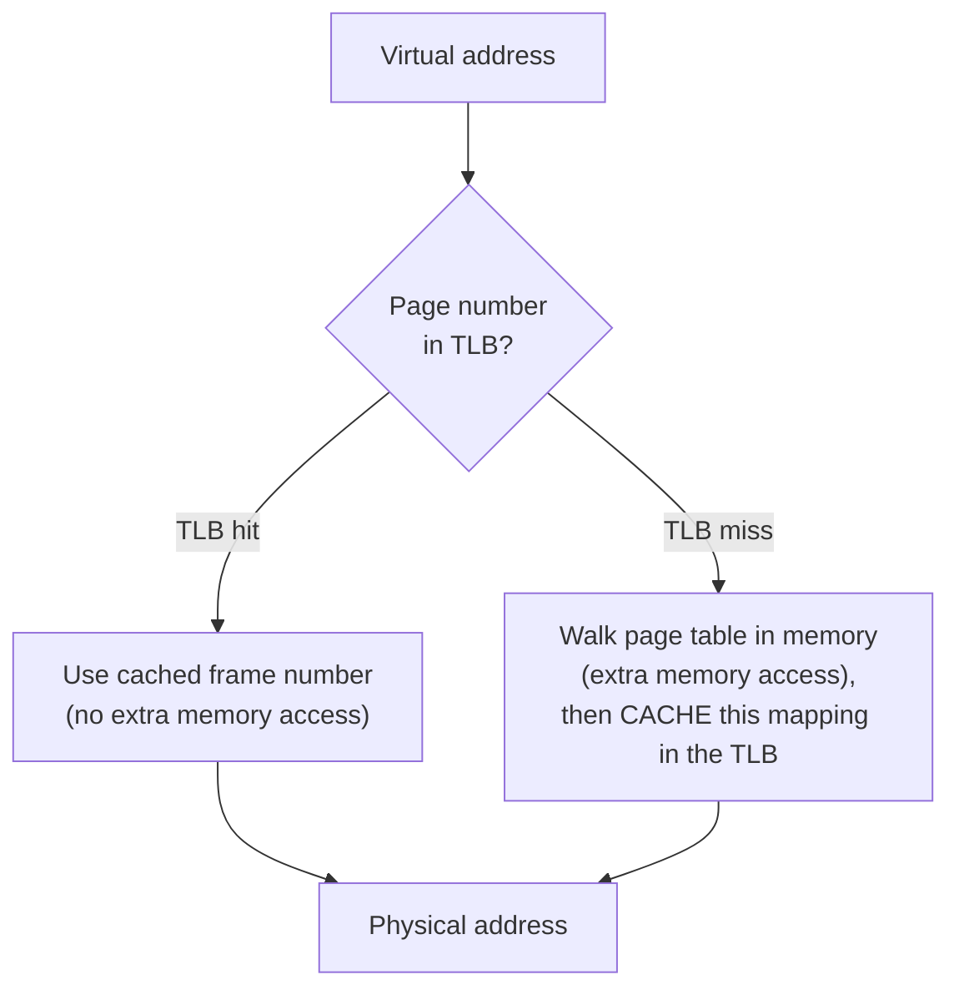

## Learning Objectives

- Explain why looking up a page table entry in memory on every single memory access would make paging unacceptably slow.
- Describe the TLB as a small, fully associative hardware cache of recent virtual-to-physical page translations.
- Trace a TLB hit vs. a TLB miss, and compute their different costs on a concrete access sequence.
- Connect the TLB directly to the caching principles (locality, full associativity) already covered in this platform's `computer-architecture` discipline.

## Context & Motivation

The previous concept described paging's translation mechanism correctly, but glossed over a serious performance problem: the page table itself lives in main memory. Naively, translating *every* virtual address a running program uses would require an *extra* memory access — reading the page table entry — before the *actual* memory access the program wanted can even happen, effectively doubling the cost of every single load and store a program makes. This platform's `computer/computer-architecture` discipline already covered exactly the general technique for this class of problem: caching frequently-accessed data in a small, very fast piece of hardware close to the CPU. The **translation lookaside buffer (TLB)** applies that same idea to page table entries specifically — a small, dedicated cache of recent virtual-to-physical page translations, checked before ever touching the full page table in memory.

## Core Theory

### The TLB is a cache, applying a familiar idea to a new kind of data

Everything already established about caching in this platform's `computer-architecture` discipline — that programs exhibit locality (recently used addresses are likely to be used again soon), that a small, fast structure holding recently-used items can satisfy most requests without touching slower memory — applies directly here, just with page table entries as the cached items instead of ordinary data. A **TLB hit** means the needed page-to-frame mapping is already sitting in this small, fast hardware cache, avoiding the extra memory access to the full page table entirely. A **TLB miss** means the mapping isn't cached, and the hardware (or, in some designs, OS software) must actually walk the page table in memory to find it — paying the extra memory access this whole mechanism exists to avoid, on this particular access.



### Why the TLB is (typically) fully associative

The `computer-architecture` discipline's coverage of set-associative and fully-associative caches noted, as an aside, that full associativity — any entry can go in any slot, at the cost of needing a comparator per slot — is only practical for small, specialized structures, specifically naming the TLB as exactly such a case. The TLB genuinely fits this description: it holds only a small number of entries (recently used page-to-frame mappings), small enough that comparing an incoming page number against every slot in parallel is entirely practical, unlike a multi-megabyte data cache, where full associativity's comparator overhead would be prohibitive at that scale. This concept is where that earlier aside becomes the main subject rather than a passing mention.

### Why locality makes the TLB effective in practice

Programs exhibit the same locality already discussed for ordinary data caching: a loop repeatedly accessing elements of the same array, for instance, issues many virtual addresses that all fall within the same handful of pages — meaning the *same* small set of page-to-frame translations gets reused heavily over a short window, exactly the pattern a small cache is built to exploit. Without this locality, a TLB's small size would make it nearly useless (constantly missing); with it, the TLB satisfies the overwhelming majority of address translations in practice, keeping paging's per-access overhead close to negligible despite the extra indirection paging introduces in principle.

### What happens on a TLB miss

On a miss, the actual page table in memory must be consulted — either by dedicated hardware (a hardware-managed TLB, which walks the page table itself and refills the TLB automatically) or by trapping into OS software (a software-managed TLB, where the OS's own trap handler performs the lookup and explicitly inserts the new mapping into the TLB). Either way, once the correct mapping is found, it is installed into the TLB — evicting some existing entry if the TLB is full — so that a subsequent access to the same page becomes a hit.

## Worked Examples

### Example 1: Cost comparison — TLB hit vs. TLB miss

Suppose a single memory access normally costs 100 ns, and a TLB lookup itself costs a negligible 1 ns (since it's a tiny, fast, dedicated hardware structure):

```text
TLB hit:  1 ns (TLB lookup) + 100 ns (actual data access) = ~101 ns
TLB miss: 1 ns (TLB lookup, which misses)
          + 100 ns (page table walk -- itself a memory access)
          + 100 ns (the actual data access, now that translation is known)
          = ~201 ns
```

A TLB miss very roughly doubles the cost of that particular access, exactly the "extra memory access" problem the previous concept flagged — which is precisely why keeping the TLB hit rate high (via locality) matters so much to overall performance.

### Example 2: Tracing hits and misses over a loop with locality

A loop repeatedly accesses elements within the same 3 pages (say, iterating over an array that spans exactly 3 pages) many times in a row:

```text
Access 1 (page 5): TLB miss (first time seeing page 5) -- caches page 5's mapping
Access 2 (page 5): TLB hit (same page, still cached)
Access 3 (page 5): TLB hit
...
Access 500 (page 6): TLB miss (first time seeing page 6) -- caches page 6's mapping
Access 501 (page 6): TLB hit
...
```

Only the very first access to each distinct page misses; every subsequent access to that same page, as long as it remains cached, hits — for a loop repeatedly touching a small, stable set of pages, the vast majority of accesses hit, and only a small handful (one per distinct page first encountered) pay the miss cost.

### Example 3: An access pattern that defeats the TLB (poor locality)

Contrast the loop above with a pattern that jumps unpredictably across many different, widely-scattered pages on every single access — for instance, following pointers through a data structure scattered randomly across a huge address space with no page reused within any short window:

```text
Access 1 (page 900):   miss
Access 2 (page 12034): miss (completely different page, evicts old entry
                         if TLB is already full)
Access 3 (page 58):    miss
Access 4 (page 7712):  miss
...
```

With essentially no page reused across nearby accesses, nearly every access misses — this is exactly the scenario, already discussed in general terms in `computer-architecture`'s coverage of cache-friendly code, where poor locality defeats a cache's entire benefit; the TLB is no exception, and a program with pathologically poor page-level locality pays close to the full miss cost on every single memory access.

## Common Misconceptions & Pitfalls

- **"The TLB stores actual data, like a regular cache."** The TLB caches page-to-frame *translations* (mappings), not the data at those addresses — a TLB hit still requires a separate access to actual physical memory (or a data cache) to fetch the real data; the TLB only speeds up finding *where* that data physically is.
- **"A TLB miss means the requested memory address doesn't exist or is invalid."** A TLB miss simply means the translation for that page isn't currently cached in the TLB — the page table (walked on a miss) may well have a perfectly valid mapping for it; a miss is a performance event, not necessarily an error (an actually invalid/unmapped page is a different, separate condition, addressed later in this discipline).
- **"The TLB needs to be large to be effective, since programs use huge amounts of memory."** Because of locality, a genuinely small TLB (holding only a modest number of entries) is typically very effective in practice, exactly like small data caches are effective despite programs' address spaces being vastly larger than the cache itself.
- **"Full associativity is used for the TLB because it's simpler to build than set-associative caching."** It's used specifically because the TLB is small enough that full associativity's per-slot comparator cost is affordable — the same tradeoff already covered in `computer-architecture`'s treatment of associativity, applied here to a case where the tradeoff genuinely favors full associativity, unlike a much larger data cache.

## Summary

The translation lookaside buffer (TLB) is a small, typically fully associative hardware cache of recent virtual-page-to-physical-frame translations, checked before ever consulting the full page table in memory — a TLB hit avoids the extra memory access that a naive page-table lookup on every single access would otherwise require; a TLB miss pays that extra cost (and refills the TLB with the newly found mapping). This is a direct application of the general caching principles — locality, and the specific full-associativity tradeoff — already covered in this platform's `computer-architecture` discipline, applied here to page table entries specifically rather than ordinary program data. Programs with good locality (repeatedly touching a small, stable set of pages) see the overwhelming majority of accesses hit the TLB, keeping paging's overhead close to negligible in practice, despite the extra indirection paging introduces in principle. With paging's mechanism and its speed problem now both covered, the next concept turns to a genuinely new question this cluster hasn't yet addressed: when physical memory fills up and a page must be evicted to make room for another, which page should it be?

## Documentation Links

- [Arpaci-Dusseau — Operating Systems: Three Easy Pieces, "Paging: Faster Translations (TLBs)"](https://pages.cs.wisc.edu/~remzi/OSTEP/vm-tlbs.pdf) — the canonical treatment of the TLB, its hit/miss behavior, and its reliance on locality this concept is built from.
- [UC Berkeley CS162 — Operating Systems and Systems Programming](https://cs162.org/) — course covering the TLB as the standard hardware mechanism for fast address translation.
