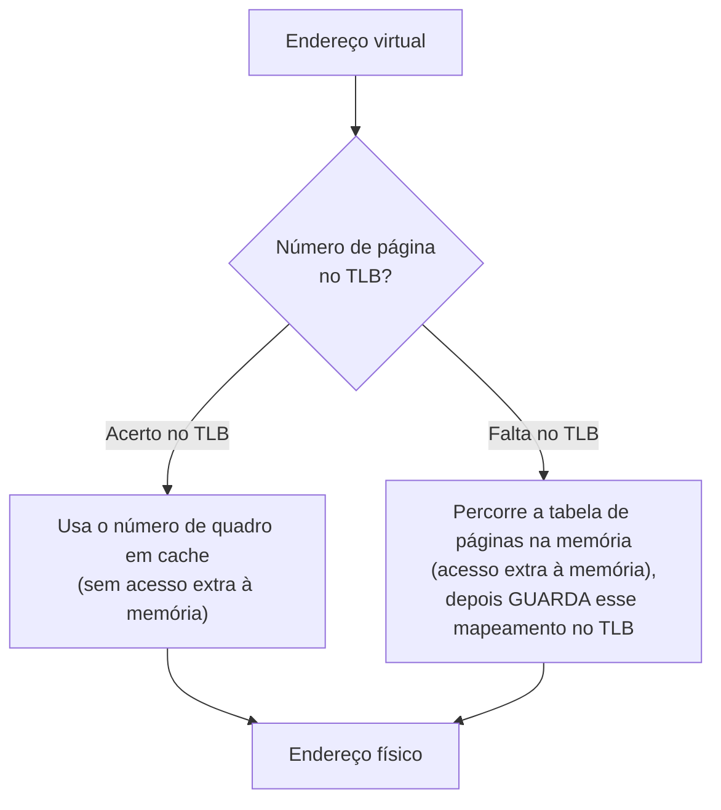

## Objetivos de Aprendizagem

- Explicar por que consultar uma entrada da tabela de páginas na memória a cada acesso deixaria a paginação inaceitavelmente lenta.
- Descrever o TLB como uma pequena cache de hardware, totalmente associativa, de traduções recentes de página virtual para página física.
- Acompanhar um acerto (hit) e uma falta (miss) no TLB, e calcular seus custos diferentes numa sequência concreta de acessos.
- Ligar o TLB diretamente aos princípios de cache (localidade, associatividade total) já vistos na disciplina `computer-architecture` desta plataforma.

## Contexto e Motivação

O conceito anterior descreveu corretamente o mecanismo de tradução da paginação, mas passou por cima de um sério problema de desempenho: a própria tabela de páginas fica na memória principal. De forma ingênua, traduzir *todo* endereço virtual que um programa em execução usa exigiria um acesso *extra* à memória (ler a entrada da tabela de páginas) antes que o acesso *real* que o programa queria pudesse sequer acontecer, dobrando na prática o custo de todo load e store que um programa faz. A disciplina `computer/computer-architecture` desta plataforma já cobriu exatamente a técnica geral para essa classe de problema: guardar em cache dados acessados com frequência numa peça de hardware pequena e muito rápida, perto da CPU. O **translation lookaside buffer (TLB)** aplica essa mesma ideia especificamente às entradas da tabela de páginas: uma pequena cache dedicada de traduções recentes de página virtual para quadro físico, consultada antes de tocar a tabela de páginas completa na memória.

## Teoria Central

### O TLB é uma cache, aplicando uma ideia conhecida a um novo tipo de dado

Tudo o que já foi estabelecido sobre caches na disciplina `computer-architecture` desta plataforma (que os programas exibem localidade, ou seja, endereços usados recentemente tendem a ser usados de novo em breve, e que uma estrutura pequena e rápida guardando os itens usados recentemente consegue atender à maioria dos pedidos sem tocar a memória mais lenta) se aplica diretamente aqui, só que com entradas da tabela de páginas como itens guardados em cache, em vez de dados comuns. Um **acerto no TLB** significa que o mapeamento de página para quadro necessário já está nessa cache de hardware pequena e rápida, evitando por completo o acesso extra à tabela de páginas completa. Uma **falta no TLB** significa que o mapeamento não está em cache, e o hardware (ou, em alguns projetos, o software do SO) precisa de fato percorrer a tabela de páginas na memória para achá-lo, pagando, neste acesso específico, o acesso extra à memória que todo este mecanismo existe para evitar.



### Por que o TLB é (normalmente) totalmente associativo

O tratamento de caches associativas por conjunto e totalmente associativas da disciplina `computer-architecture` observou, de passagem, que a associatividade total (qualquer entrada pode ir em qualquer posição, ao custo de precisar de um comparador por posição) só é prática para estruturas pequenas e especializadas, citando especificamente o TLB como exatamente um caso desses. O TLB de fato se encaixa nessa descrição: ele guarda só um pequeno número de entradas (mapeamentos de página para quadro usados recentemente), pequeno o bastante para que comparar um número de página que chega com cada posição em paralelo seja inteiramente prático, ao contrário de uma cache de dados de vários megabytes, em que a sobrecarga de comparadores da associatividade total seria proibitiva nessa escala. Este conceito é onde aquela observação de passagem vira o assunto principal, e não só uma menção.

### Por que a localidade torna o TLB eficaz na prática

Os programas exibem a mesma localidade já discutida para a cache de dados comum: um laço que acessa repetidamente elementos do mesmo array, por exemplo, emite muitos endereços virtuais que caem todos dentro do mesmo punhado de páginas; o que significa que o *mesmo* pequeno conjunto de traduções de página para quadro é reutilizado intensamente numa janela curta, exatamente o padrão que uma cache pequena é construída para explorar. Sem essa localidade, o tamanho pequeno de um TLB o tornaria quase inútil (faltas o tempo todo); com ela, o TLB atende à esmagadora maioria das traduções de endereço na prática, mantendo a sobrecarga por acesso da paginação quase desprezível, apesar da indireção extra que a paginação introduz em princípio.

### O que acontece numa falta no TLB

Numa falta, a tabela de páginas real na memória precisa ser consultada, seja por hardware dedicado (um TLB gerenciado por hardware, que percorre ele mesmo a tabela de páginas e reabastece o TLB automaticamente), seja desviando para o software do SO (um TLB gerenciado por software, em que o próprio tratador de trap do SO faz a consulta e insere explicitamente o novo mapeamento no TLB). De qualquer jeito, quando o mapeamento correto é encontrado, ele é instalado no TLB (despejando alguma entrada existente se o TLB estiver cheio), para que um acesso posterior à mesma página vire um acerto.

## Exemplos Resolvidos

### Exemplo 1: comparação de custos, acerto vs. falta no TLB

Suponha que um único acesso à memória custe normalmente 100 ns, e que a própria consulta ao TLB custe desprezíveis 1 ns (já que é uma estrutura de hardware dedicada, minúscula e rápida):

```text
Acerto no TLB: 1 ns (consulta ao TLB) + 100 ns (acesso real aos dados) = ~101 ns
Falta no TLB:  1 ns (consulta ao TLB, que falta)
               + 100 ns (percurso da tabela de páginas, ele mesmo um acesso à memória)
               + 100 ns (o acesso real aos dados, agora que a tradução é conhecida)
               = ~201 ns
```

Uma falta no TLB mais ou menos dobra o custo daquele acesso específico, exatamente o problema do "acesso extra à memória" que o conceito anterior apontou; e é precisamente por isso que manter alta a taxa de acertos do TLB (graças à localidade) importa tanto para o desempenho geral.

### Exemplo 2: acompanhando acertos e faltas num laço com localidade

Um laço acessa repetidamente elementos dentro das mesmas 3 páginas (digamos, percorrendo um array que ocupa exatamente 3 páginas) muitas vezes seguidas:

```text
Acesso 1 (página 5): falta no TLB (primeira vez vendo a página 5); guarda o mapeamento da página 5
Acesso 2 (página 5): acerto no TLB (mesma página, ainda em cache)
Acesso 3 (página 5): acerto no TLB
...
Acesso 500 (página 6): falta no TLB (primeira vez vendo a página 6); guarda o mapeamento da página 6
Acesso 501 (página 6): acerto no TLB
...
```

Só o primeiríssimo acesso a cada página distinta dá falta; todo acesso seguinte a essa mesma página, enquanto ela continuar em cache, acerta; num laço que toca repetidamente um conjunto pequeno e estável de páginas, a vasta maioria dos acessos acerta, e só um punhado (um por página distinta encontrada pela primeira vez) paga o custo da falta.

### Exemplo 3: um padrão de acesso que derrota o TLB (localidade ruim)

Contraste o laço acima com um padrão que salta de forma imprevisível por muitas páginas diferentes e bem espalhadas a cada acesso; por exemplo, seguir ponteiros por uma estrutura de dados espalhada aleatoriamente por um espaço de endereçamento enorme, sem nenhuma página reutilizada numa janela curta:

```text
Acesso 1 (página 900):   falta
Acesso 2 (página 12034): falta (página completamente diferente, despeja uma entrada
                          antiga se o TLB já estiver cheio)
Acesso 3 (página 58):    falta
Acesso 4 (página 7712):  falta
...
```

Sem praticamente nenhuma página reutilizada entre acessos próximos, quase todo acesso dá falta; é exatamente o cenário, já discutido em termos gerais no tratamento de código amigável à cache da disciplina `computer-architecture`, em que uma localidade ruim derrota todo o benefício de uma cache; o TLB não é exceção, e um programa com localidade patologicamente ruim em nível de página paga quase o custo completo de falta em cada acesso à memória.

## Equívocos Comuns e Armadilhas

- **"O TLB guarda dados reais, como uma cache comum."** O TLB guarda em cache *traduções* (mapeamentos) de página para quadro, e não os dados nesses endereços; um acerto no TLB ainda exige um acesso separado à memória física real (ou a uma cache de dados) para buscar os dados de verdade; o TLB só acelera achar *onde* esses dados estão fisicamente.
- **"Uma falta no TLB significa que o endereço de memória pedido não existe ou é inválido."** Uma falta no TLB significa simplesmente que a tradução daquela página não está em cache no TLB no momento; a tabela de páginas (percorrida numa falta) pode muito bem ter um mapeamento perfeitamente válido para ela; uma falta é um evento de desempenho, não necessariamente um erro (uma página de fato inválida ou não mapeada é uma condição diferente e separada, tratada mais adiante nesta disciplina).
- **"O TLB precisa ser grande para ser eficaz, já que os programas usam quantidades enormes de memória."** Por causa da localidade, um TLB genuinamente pequeno (guardando só um número modesto de entradas) costuma ser muito eficaz na prática, exatamente como pequenas caches de dados são eficazes apesar de os espaços de endereçamento dos programas serem muito maiores que a própria cache.
- **"A associatividade total é usada no TLB porque é mais simples de construir que a cache associativa por conjunto."** Ela é usada especificamente porque o TLB é pequeno o bastante para que o custo de um comparador por posição da associatividade total seja acessível; é o mesmo trade-off já visto no tratamento de associatividade da disciplina `computer-architecture`, aplicado aqui a um caso em que o trade-off genuinamente favorece a associatividade total, ao contrário de uma cache de dados muito maior.

## Resumo

O translation lookaside buffer (TLB) é uma pequena cache de hardware, normalmente totalmente associativa, de traduções recentes de página virtual para quadro físico, consultada antes de recorrer à tabela de páginas completa na memória: um acerto no TLB evita o acesso extra à memória que uma consulta ingênua à tabela de páginas a cada acesso exigiria; uma falta no TLB paga esse custo extra (e reabastece o TLB com o mapeamento recém-encontrado). Essa é uma aplicação direta dos princípios gerais de cache (localidade e o trade-off específico da associatividade total) já vistos na disciplina `computer-architecture` desta plataforma, aplicados aqui especificamente a entradas da tabela de páginas, e não a dados comuns de programa. Programas com boa localidade (tocando repetidamente um conjunto pequeno e estável de páginas) veem a esmagadora maioria dos acessos acertar o TLB, mantendo a sobrecarga da paginação quase desprezível na prática, apesar da indireção extra que a paginação introduz em princípio. Com o mecanismo da paginação e seu problema de velocidade agora cobertos, o próximo conceito se volta para uma pergunta genuinamente nova que este bloco ainda não tratou: quando a memória física enche e uma página precisa ser despejada para dar lugar a outra, qual página deve ser?

## Documentation Links

- [Arpaci-Dusseau: Operating Systems: Three Easy Pieces, "Paging: Faster Translations (TLBs)"](https://pages.cs.wisc.edu/~remzi/OSTEP/vm-tlbs.pdf): o tratamento canônico do TLB, do seu comportamento de acerto e falta e da sua dependência da localidade a partir do qual este conceito é construído.
- [UC Berkeley CS162: Operating Systems and Systems Programming](https://cs162.org/): curso que cobre o TLB como o mecanismo de hardware padrão para a tradução rápida de endereços.
