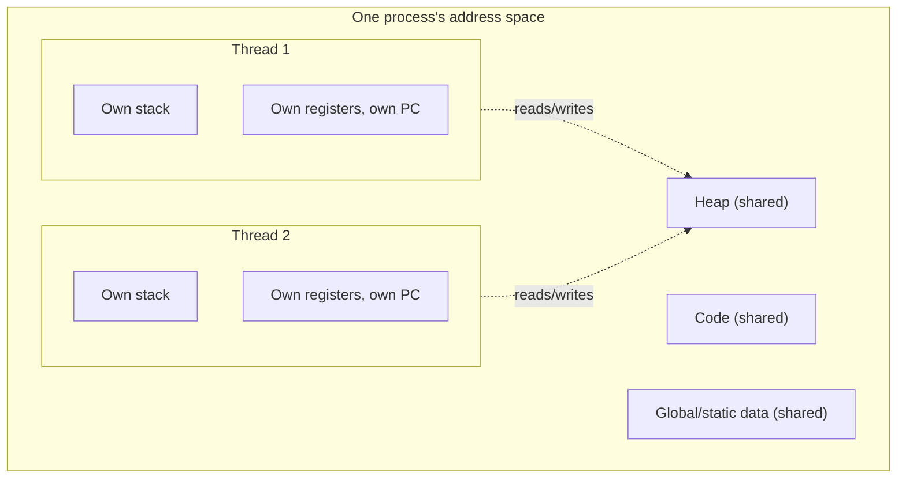

## Learning Objectives

- Define a thread as an independently schedulable stream of execution that shares its process's address space with sibling threads.
- Distinguish what threads share (code, heap, global data) from what each thread keeps private (its own stack and register set, including its own program counter and stack pointer).
- Connect the shared-state concurrency model, already introduced conceptually elsewhere, to the concrete systems mechanism — threads — that actually implements it.
- Explain why multiple threads can be scheduled onto multiple cores simultaneously, unlike a single process on a single core.

## Context & Motivation

This platform's `algorithms-software/programming-paradigms` discipline already introduced shared-state concurrency as a *mental model*: multiple tasks reading and writing the same memory directly, efficient but requiring coordination to avoid race conditions — deliberately staying at that conceptual level, and explicitly deferring "the mechanics of how that coordination is actually implemented" to "a more advanced, systems-level treatment elsewhere." This concept, and the five that follow it in this cluster, is that elsewhere.

The systems-level unit that makes shared-state concurrency concrete is the **thread**: an independently schedulable stream of execution that lives *inside* a process and shares that process's address space with any sibling threads. Where `fork()` (already covered) creates an entirely new process with its own private, copied address space, creating a new thread instead adds another independently-running stream of execution *within the same process*, sharing its heap and global variables directly — which is exactly what makes the race-condition hazard from the paradigms discipline a real, physical possibility rather than just a thought experiment.

## Core Theory

### What threads share, and what stays private

Within one process, every thread shares:

- The process's **code** (the same instructions every thread executes, though different threads can be at different points in that code at any moment).
- The process's **heap** and any **global/static data** — the exact shared, mutable memory that makes race conditions possible in the first place.
- The process's open **file descriptors** and other process-wide resources.

Each individual thread keeps its own, private:

- **Program counter** — since each thread can be at a different point in the shared code at any given moment.
- **Register set** — each thread's own in-flight computation, exactly like the register state already covered for whole processes, but now one such set per thread rather than one per process.
- **Stack** — each thread needs its own space for local variables and function-call bookkeeping, since two threads calling the same function independently must not corrupt each other's local variables or return addresses.



### Why this is the mechanism behind shared-state concurrency

The paradigms discipline's shared-state model described tasks that "read and write the same memory directly" — threads are exactly the OS-level unit that makes this literally true: two threads in the same process genuinely share the same physical heap memory, the same global variables, the same open files. There is no copying, no message being passed — a write by one thread to a shared heap location is immediately, physically visible to every other thread in that process the next time it reads that location. This is precisely why the race-condition scenario from that discipline (two threads incrementing a shared counter, with the increments silently overwriting each other) is a real hazard here, not a hypothetical one: the shared memory it depends on is real, physical, and always present between threads.

### Threads vs. processes: independent scheduling, shared memory

A thread, like a whole process, is independently schedulable — the OS's scheduler (covered in the previous cluster) can context-switch between threads exactly as it does between processes, using the same underlying save/restore mechanism, just now saving and restoring a thread's own register set and stack pointer rather than an entire process's. On a machine with multiple CPU cores, multiple threads *of the same process* can genuinely run **simultaneously**, one thread per core, all reading and writing the identical shared heap at the exact same instant — a possibility a single process running alone could never realize on its own, since it has, by definition, only one stream of execution.

### Why the paradigms discipline was right to defer this

Building a full mental model of shared-state vs. message-passing concurrency required no OS-level detail at all — the tradeoff (direct, fast shared access vs. explicit-message isolation) is visible purely at the level of "what can two tasks touch." Actually making shared-state concurrency *safe*, however, requires exactly the systems-level machinery this cluster now introduces: what a thread physically is, and then — starting with the very next concept — the specific tools (locks, condition variables, semaphores) that prevent the race conditions this shared memory makes possible.

## Worked Examples

### Example 1: Two threads, one shared counter — the setup for a race

```c
int counter = 0;   // global (shared) variable

void *increment(void *arg) {
    for (int i = 0; i < 100000; i++) {
        counter++;    // NOT atomic: read, add 1, write back
    }
    return NULL;
}

// main() creates two threads, both running increment(),
// then waits for both to finish and prints counter.
```

Both threads share the exact same `counter` variable in the process's heap/global data — there is no copy, no separate `counter` per thread. If both threads could execute purely sequentially (never interleaved), the final value would predictably be 200000. In practice, running this exact program often prints a value *less* than 200000, because `counter++` is not a single atomic step at the machine level (it is a read, then an add, then a write back), and the two threads' reads and writes can interleave — precisely the race condition the paradigms discipline described conceptually, now happening for real because these two threads genuinely share the same memory location.

### Example 2: What's private per thread, made concrete

```c
void *worker(void *arg) {
    int local_id = *(int *)arg;   // each thread's own copy, on its own stack
    for (int i = 0; i < 3; i++) {
        printf("thread %d: iteration %d\n", local_id, i);
    }
    return NULL;
}
```

Each thread executing `worker` has its own `local_id` and its own loop variable `i`, stored on that thread's own private stack — one thread's `i` reaching 2 has no effect on another thread's independent `i`. If this same variable had instead been declared as a global (shared) variable rather than a local one, every thread would be reading and writing the identical shared location, and the same kind of race condition as Example 1 would become possible.

### Example 3: Simultaneous execution on multiple cores

```text
Single-core machine, 2 threads:
  Core 1: Thread A runs, then context switch, then Thread B runs, ...
  (threads take turns; never truly simultaneous at the instruction level)

Multi-core machine (2+ cores), 2 threads:
  Core 1: Thread A running
  Core 2: Thread B running
  -- both executing AT THE SAME PHYSICAL INSTANT, both reading/writing
     the same shared heap memory concurrently.
```

On genuinely multiple cores, the race-condition hazard becomes even sharper than on a single core with time-sliced switching: two threads' reads and writes to the same shared memory location can happen at literally the same moment, with no context switch even needed to create the unsafe interleaving — reinforcing why real coordination mechanisms (starting with the very next concept, the critical section problem, followed by locks) are not optional even on hardware where "only one thing runs at a time" might otherwise seem like a safety net.

## Common Misconceptions & Pitfalls

- **"Threads are just a lighter-weight kind of process."** Threads and processes both are independently schedulable, but a `fork()`ed process gets its own private, copied address space (isolated from its parent), while threads within one process share that process's actual heap and global memory directly — the sharing, not just the "lightness," is the defining, consequential difference.
- **"Every variable in a multithreaded program is shared between threads."** Only heap-allocated and global/static data are shared; each thread has its own private stack, so local variables declared inside a function are independent per thread, exactly as Example 2 shows.
- **"Race conditions can only happen due to context switching on a single core."** On genuine multi-core hardware, threads of the same process can execute literally simultaneously, making unsafe interleavings possible even without any context switch — multi-core execution makes the hazard more acute, not less.
- **"This concept re-teaches what the concurrent-programming concept in `programming-paradigms` already covered."** That concept deliberately stayed at the conceptual, comparative level and explicitly deferred systems-level mechanics; this concept is precisely that deferred material — the concrete OS-level unit (a thread) that makes the shared-state model physically real, not a repeat of the earlier conceptual comparison.

## Summary

A thread is an independently schedulable stream of execution living inside a process, sharing that process's code, heap, and global data with any sibling threads, while keeping its own private stack, registers, and program counter. This is the concrete systems-level mechanism behind the shared-state concurrency model already introduced conceptually in `algorithms-software/programming-paradigms`, which deliberately deferred exactly this material to "a more advanced, systems-level treatment elsewhere." Because threads genuinely share physical memory — and, on multi-core hardware, can execute that sharing literally simultaneously — the race-condition hazard described conceptually there becomes a real, physical possibility here, motivating every concept in the rest of this cluster: the formal critical-section problem, and the concrete tools (locks, condition variables, semaphores) built to solve it safely.

## Documentation Links

- [Arpaci-Dusseau — Operating Systems: Three Easy Pieces, "Concurrency: An Introduction"](https://pages.cs.wisc.edu/~remzi/OSTEP/threads-intro.pdf) — the canonical treatment of threads and shared address spaces this concept is built from.
- [UC Berkeley CS162 — Operating Systems and Systems Programming](https://cs162.org/) — course covering threads as the systems-level unit underlying shared-memory concurrency.
