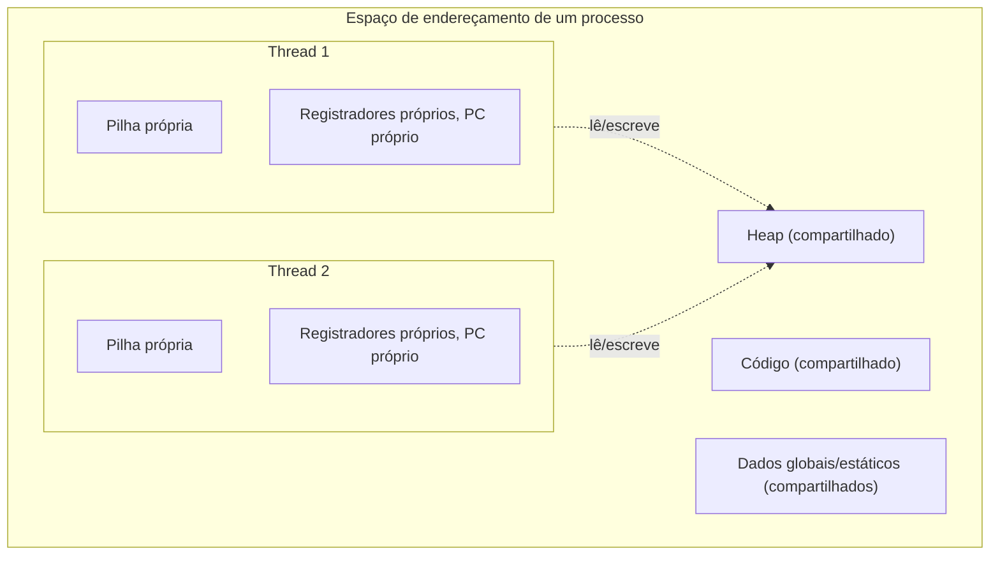

## Objetivos de Aprendizagem

- Definir uma thread como um fluxo de execução escalonável de forma independente que compartilha o espaço de endereçamento do seu processo com as threads irmãs.
- Distinguir o que as threads compartilham (código, heap, dados globais) do que cada thread mantém privado (sua própria pilha e seu conjunto de registradores, incluindo seu próprio contador de programa e ponteiro de pilha).
- Ligar o modelo de concorrência com estado compartilhado, já apresentado conceitualmente em outro lugar, ao mecanismo concreto de sistemas (as threads) que de fato o implementa.
- Explicar por que várias threads podem ser escalonadas em vários núcleos ao mesmo tempo, ao contrário de um único processo num único núcleo.

## Contexto e Motivação

A disciplina `algorithms-software/programming-paradigms` desta plataforma já apresentou a concorrência com estado compartilhado como um *modelo mental*: várias tarefas lendo e escrevendo diretamente a mesma memória, de forma eficiente, mas exigindo coordenação para evitar condições de corrida; ela ficou de propósito nesse nível conceitual e adiou explicitamente "a mecânica de como essa coordenação é de fato implementada" para "um tratamento mais avançado, em nível de sistemas, em outro lugar". Este conceito, e os cinco que o seguem neste bloco, são esse outro lugar.

A unidade em nível de sistemas que torna concreta a concorrência com estado compartilhado é a **thread**: um fluxo de execução escalonável de forma independente que vive *dentro* de um processo e compartilha o espaço de endereçamento desse processo com quaisquer threads irmãs. Onde o `fork()` (já visto) cria um processo inteiramente novo, com seu próprio espaço de endereçamento privado e copiado, criar uma thread nova acrescenta mais um fluxo de execução rodando de forma independente *dentro do mesmo processo*, compartilhando diretamente seu heap e suas variáveis globais; e é exatamente isso que torna o perigo de condição de corrida da disciplina de paradigmas uma possibilidade real e física, e não só um experimento mental.

## Teoria Central

### O que as threads compartilham, e o que fica privado

Dentro de um processo, toda thread compartilha:

- O **código** do processo (as mesmas instruções que toda thread executa, embora threads diferentes possam estar em pontos diferentes desse código a cada momento).
- O **heap** do processo e quaisquer **dados globais/estáticos**: exatamente a memória compartilhada e mutável que torna as condições de corrida possíveis em primeiro lugar.
- Os **descritores de arquivo** abertos do processo e outros recursos de todo o processo.

Cada thread individual mantém, de forma privada:

- O **contador de programa**, já que cada thread pode estar num ponto diferente do código compartilhado a cada momento.
- O **conjunto de registradores**: o cálculo em andamento de cada thread, exatamente como o estado de registradores já visto para processos inteiros, mas agora um conjunto desses por thread, e não um por processo.
- A **pilha**: cada thread precisa do seu próprio espaço para variáveis locais e para a contabilidade de chamadas de função, já que duas threads chamando a mesma função de forma independente não podem corromper as variáveis locais nem os endereços de retorno uma da outra.



### Por que este é o mecanismo por trás da concorrência com estado compartilhado

O modelo de estado compartilhado da disciplina de paradigmas descreveu tarefas que "leem e escrevem diretamente a mesma memória"; as threads são exatamente a unidade em nível de SO que torna isso literalmente verdade: duas threads no mesmo processo compartilham de fato a mesma memória física do heap, as mesmas variáveis globais, os mesmos arquivos abertos. Não há cópia, nenhuma mensagem sendo passada: uma escrita de uma thread num local compartilhado do heap fica imediata e fisicamente visível para toda outra thread daquele processo na próxima vez que ela ler esse local. É precisamente por isso que o cenário de condição de corrida daquela disciplina (duas threads incrementando um contador compartilhado, com os incrementos se sobrescrevendo silenciosamente) é um perigo real aqui, e não hipotético: a memória compartilhada da qual ele depende é real, física e está sempre presente entre as threads.

### Threads vs. processos: escalonamento independente, memória compartilhada

Uma thread, assim como um processo inteiro, é escalonável de forma independente: o escalonador do SO (visto no bloco anterior) consegue trocar de contexto entre threads exatamente como faz entre processos, usando o mesmo mecanismo subjacente de salvar e restaurar, só que agora salvando e restaurando o próprio conjunto de registradores e o ponteiro de pilha de uma thread, e não de um processo inteiro. Numa máquina com vários núcleos de CPU, várias threads *do mesmo processo* podem de fato rodar **ao mesmo tempo**, uma thread por núcleo, todas lendo e escrevendo o mesmíssimo heap compartilhado no mesmo instante exato; uma possibilidade que um único processo rodando sozinho nunca conseguiria concretizar, já que ele tem, por definição, um só fluxo de execução.

### Por que a disciplina de paradigmas fez bem em adiar isto

Construir um modelo mental completo de concorrência com estado compartilhado versus com troca de mensagens não exigiu detalhe nenhum em nível de SO: o trade-off (acesso compartilhado direto e rápido contra isolamento com mensagens explícitas) é visível puramente no nível de "o que duas tarefas conseguem tocar". Tornar de fato *segura* a concorrência com estado compartilhado, porém, exige exatamente a maquinaria em nível de sistemas que este bloco agora apresenta: o que uma thread é fisicamente e, a partir do próximo conceito, as ferramentas específicas (locks, variáveis de condição, semáforos) que impedem as condições de corrida que essa memória compartilhada torna possíveis.

## Exemplos Resolvidos

### Exemplo 1: duas threads, um contador compartilhado, o cenário de uma corrida

```c
int counter = 0;   // variável global (compartilhada)

void *increment(void *arg) {
    for (int i = 0; i < 100000; i++) {
        counter++;    // NÃO é atômico: lê, soma 1, escreve de volta
    }
    return NULL;
}

// main() cria duas threads, ambas rodando increment(),
// depois espera as duas terminarem e imprime counter.
```

As duas threads compartilham exatamente a mesma variável `counter` no heap/dados globais do processo: não há cópia, nem um `counter` separado por thread. Se as duas threads pudessem executar de forma puramente sequencial (nunca intercaladas), o valor final seria previsivelmente 200000. Na prática, rodar exatamente este programa muitas vezes imprime um valor *menor* que 200000, porque `counter++` não é um único passo atômico em nível de máquina (é uma leitura, depois uma soma, depois uma escrita de volta), e as leituras e escritas das duas threads podem se intercalar; precisamente a condição de corrida que a disciplina de paradigmas descreveu conceitualmente, agora acontecendo de verdade porque essas duas threads compartilham de fato o mesmo local de memória.

### Exemplo 2: o que é privado de cada thread, de forma concreta

```c
void *worker(void *arg) {
    int local_id = *(int *)arg;   // a cópia própria de cada thread, na sua própria pilha
    for (int i = 0; i < 3; i++) {
        printf("thread %d: iteration %d\n", local_id, i);
    }
    return NULL;
}
```

Cada thread executando `worker` tem seu próprio `local_id` e sua própria variável de laço `i`, guardados na pilha privada daquela thread: o `i` de uma thread chegar a 2 não tem efeito nenhum sobre o `i` independente de outra thread. Se essa mesma variável tivesse sido declarada como global (compartilhada) em vez de local, toda thread estaria lendo e escrevendo o mesmíssimo local compartilhado, e o mesmo tipo de condição de corrida do Exemplo 1 ficaria possível.

### Exemplo 3: execução simultânea em vários núcleos

```text
Máquina de um núcleo, 2 threads:
  Núcleo 1: a Thread A roda, depois troca de contexto, depois a Thread B roda, ...
  (as threads se revezam; nunca são de fato simultâneas em nível de instrução)

Máquina de vários núcleos (2+ núcleos), 2 threads:
  Núcleo 1: Thread A rodando
  Núcleo 2: Thread B rodando
  As duas executam NO MESMO INSTANTE FÍSICO, ambas lendo/escrevendo
  a mesma memória compartilhada do heap ao mesmo tempo.
```

Em vários núcleos de verdade, o perigo de condição de corrida fica ainda mais agudo do que num único núcleo com trocas por fatia de tempo: as leituras e escritas de duas threads no mesmo local de memória compartilhada podem acontecer literalmente no mesmo momento, sem precisar sequer de uma troca de contexto para criar a intercalação insegura; reforçando por que mecanismos reais de coordenação (começando pelo próximo conceito, o problema da seção crítica, seguido dos locks) não são opcionais, mesmo em hardware em que "só uma coisa roda por vez" poderia, de outra forma, parecer uma rede de segurança.

## Equívocos Comuns e Armadilhas

- **"As threads são só um tipo mais leve de processo."** Threads e processos são ambos escalonáveis de forma independente, mas um processo criado por `fork()` recebe seu próprio espaço de endereçamento privado e copiado (isolado do pai), enquanto as threads de um processo compartilham diretamente o heap e a memória global reais desse processo; o compartilhamento, e não só a "leveza", é a diferença definidora e cheia de consequências.
- **"Toda variável num programa multithread é compartilhada entre as threads."** Só os dados alocados no heap e os globais/estáticos são compartilhados; cada thread tem sua própria pilha privada, então as variáveis locais declaradas dentro de uma função são independentes por thread, exatamente como o Exemplo 2 mostra.
- **"As condições de corrida só podem acontecer por causa de trocas de contexto num único núcleo."** Em hardware de vários núcleos de verdade, as threads do mesmo processo podem executar literalmente ao mesmo tempo, tornando possíveis intercalações inseguras mesmo sem nenhuma troca de contexto; a execução em vários núcleos torna o perigo mais agudo, e não menos.
- **"Este conceito reensina o que o conceito de programação concorrente de `programming-paradigms` já cobriu."** Aquele conceito ficou de propósito no nível conceitual e comparativo e adiou explicitamente a mecânica em nível de sistemas; este conceito é precisamente esse material adiado: a unidade concreta em nível de SO (uma thread) que torna fisicamente real o modelo de estado compartilhado, e não uma repetição da comparação conceitual anterior.

## Resumo

Uma thread é um fluxo de execução escalonável de forma independente que vive dentro de um processo, compartilhando o código, o heap e os dados globais desse processo com quaisquer threads irmãs, enquanto mantém sua própria pilha, seus registradores e seu contador de programa privados. Esse é o mecanismo concreto, em nível de sistemas, por trás do modelo de concorrência com estado compartilhado já apresentado conceitualmente em `algorithms-software/programming-paradigms`, que adiou de propósito exatamente este material para "um tratamento mais avançado, em nível de sistemas, em outro lugar". Como as threads compartilham de fato memória física (e, em hardware de vários núcleos, podem executar esse compartilhamento literalmente ao mesmo tempo), o perigo de condição de corrida descrito conceitualmente lá vira uma possibilidade real e física aqui, motivando todo conceito do resto deste bloco: o problema formal da seção crítica, e as ferramentas concretas (locks, variáveis de condição, semáforos) construídas para resolvê-lo com segurança.

## Documentation Links

- [Arpaci-Dusseau: Operating Systems: Three Easy Pieces, "Concurrency: An Introduction"](https://pages.cs.wisc.edu/~remzi/OSTEP/threads-intro.pdf): o tratamento canônico de threads e de espaços de endereçamento compartilhados a partir do qual este conceito é construído.
- [UC Berkeley CS162: Operating Systems and Systems Programming](https://cs162.org/): curso que cobre as threads como a unidade em nível de sistemas por trás da concorrência com memória compartilhada.
