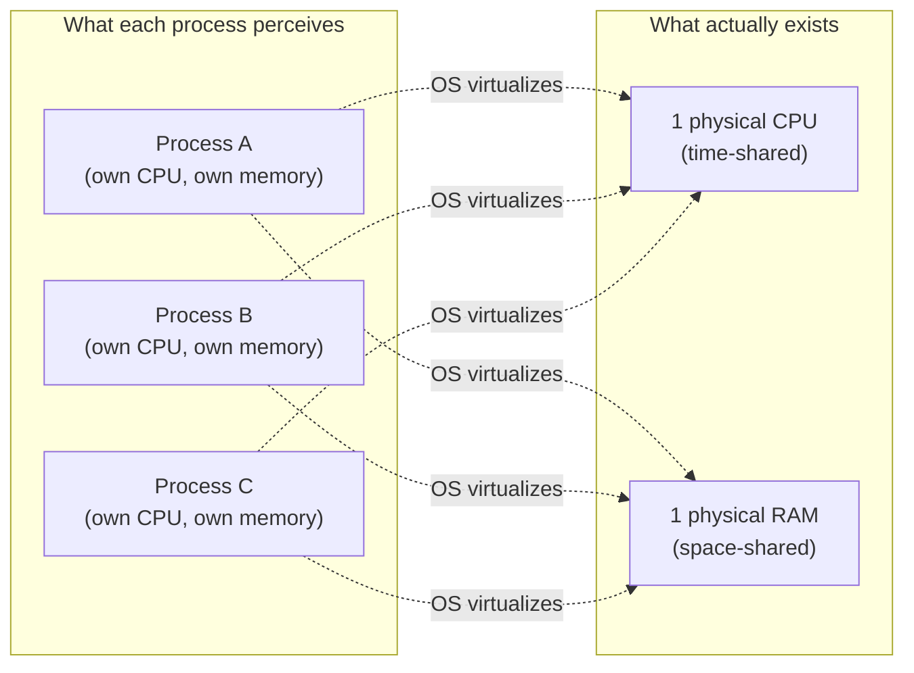

## Learning Objectives

- Define a process as the OS abstraction of a running program, and list the state it bundles together: memory image, registers (including the program counter and stack pointer), and open file handles.
- Distinguish a program (a static file on disk) from a process (that program, loaded and executing).
- Explain the two core services every OS provides to create the process illusion: virtualizing the CPU and virtualizing memory.
- Describe why an OS runs many more processes than it has physical CPUs, and what makes that possible.

## Context & Motivation

A modern laptop with 8 CPU cores routinely runs a web browser, a music player, a code editor, a terminal, and dozens of background services — all at once, all seemingly making progress at the same time. There are nowhere near enough physical CPUs for each of these programs to have one permanently to itself. The operating system's answer to this shortage is the single most important abstraction in all of systems software: the **process**.

A process is not the program's file on disk — `python3` sitting in `/usr/bin` is inert, just bytes. A process is that program *loaded into memory and actively executing*: its own private view of memory holding code and data, a set of CPU registers capturing exactly where execution currently is, and a table of open files it's currently using. The same program file can be turned into many independent processes — open two terminal windows and run the same shell script in each, and the OS creates two completely separate processes, each with its own memory and its own progress through the code, even though both started from the identical bytes on disk.

Arpaci-Dusseau's *Operating Systems: Three Easy Pieces* (OSTEP) introduces this as the OS performing a kind of **virtualization**: taking one physical resource — a CPU — and, through low-level machinery plus high-level policy, presenting many processes with the illusion that each has the CPU entirely to itself. The same trick is played on physical memory, giving each process its own private address space (a topic this discipline returns to in depth once processes, scheduling, and concurrency are covered). Everything else in this discipline — scheduling, virtual memory, even the file system — exists in service of maintaining this illusion convincingly and fairly.

## Core Theory

### What a process actually bundles together

A process is the sum of everything the OS needs to save and restore in order to pause a running program and later resume it exactly where it left off, with no observable difference from having run continuously:

- **Memory image.** The process's code (instructions), its static data, its heap (memory allocated dynamically at run time), and its stack (local variables and function-call bookkeeping) — the exact layout a program built in C would recognize from its address space.
- **CPU registers**, including two that deserve special mention: the **program counter (PC)**, tracking which instruction executes next, and the **stack pointer**, tracking the top of the current stack frame. General-purpose registers holding whatever values the program was last computing with are saved too.
- **Open file descriptors** — which files, network sockets, or devices the process currently has open, and where its read/write position is in each one.

This bundle is often called the process's **context**, and everything OSTEP or CS2013 says about "saving and restoring process state" refers to exactly this list.

### Program vs. process: the same code, many independent lives

A program is static: a sequence of bytes on disk, encoding instructions and data (compiled, in the case of something like a C program, straight out of the ISA and assembly work covered elsewhere in this module). A process is that program brought to life — loaded into memory, given its own stack and heap, and set running with its own program counter advancing through the code. Running the same program twice produces two processes with independent memory and independent progress; a bug that crashes one instance does not touch the other's memory, because each has been given its own private illusion of the machine.

### Virtualizing the CPU

With one CPU (or a handful of cores) and far more processes than cores, the OS must **time-share**: run one process for a while, save its full context, load a different process's saved context, and let that one run. Repeated fast enough — modern schedulers switch many times per second — every process appears to progress continuously, even though at any single instant only a small number are actually executing on real silicon. *How* the OS decides which process gets the CPU next, and for how long, is the subject of CPU scheduling, covered immediately after this concept; this concept only establishes that virtualization is happening at all.



### Why this abstraction, and not something simpler

A simpler design — let each program directly control the whole machine, one at a time, with no OS mediating — was in fact how the earliest computers worked, and it is exactly what limited direct execution, discussed next, still starts from as its baseline before adding the missing safety. The process abstraction is what makes multiprogramming (many programs "at once") both possible and safe: possible, because the OS can interleave many processes on limited hardware; safe, because each process's memory and state stay isolated from every other process's, so misbehavior in one program does not corrupt or crash unrelated ones.

## Worked Examples

### Example 1: One program, three processes

```text
$ python3 count.py &
$ python3 count.py &
$ python3 count.py &
```

Running the identical `count.py` script three times launches three separate processes. Each gets:

```text
Process 1 (pid 4021): own stack, own heap, own copy of any global counter
Process 2 (pid 4022): own stack, own heap, own copy of any global counter
Process 3 (pid 4023): own stack, own heap, own copy of any global counter
```

If `count.py` increments a global variable in a loop and prints it, all three processes print independently increasing sequences — none of them observes or interferes with another's counter, because "the program" and "a process running the program" are different things, and there are three fully independent instances of the latter.

### Example 2: What must be saved to pause a process

Suppose process A is running and the OS decides to switch to process B. For A to resume later with no visible gap, the OS must save:

```text
Program counter:     0x4011a3   (next instruction to execute)
Stack pointer:       0x7ffee2c0 (top of current stack frame)
General registers:   rax=17, rbx=0, rcx=42, ...
Open files:          fd 3 -> /var/log/app.log, offset 8192
```

Every one of these values is exactly what "process context" means in the Learning Objectives above. Miss any piece — restore the wrong program counter, say — and resuming process A would jump to the wrong instruction and almost certainly crash or corrupt its own computation.

### Example 3: Counting processes vs. programs on a real system

```text
$ ls /usr/bin/python3
/usr/bin/python3          # exactly one program (one file)

$ ps aux | grep python3
alice   4021  python3 count.py
alice   4022  python3 count.py
alice   4023  bob's-service.py
```

One program file, three processes — two are separate runs of the same program, one is a different program entirely, but all three are process instances the OS is independently context-switching among, each with its own saved register set and memory image.

## Common Misconceptions & Pitfalls

- **"A process and a program are the same thing."** A program is a static file on disk; a process is that program loaded into memory and executing, with its own private state. The same program can be the source of many independent processes at once.
- **"If a program is running, there's exactly one process for it."** Nothing prevents launching the same program many times; each launch is its own process with independent memory, independent register state, and no automatic sharing of data between the instances.
- **"Virtualizing the CPU means giving each process a slower, permanent slice of one real core."** It means time-sharing — rapidly switching which process's saved context is actually loaded onto the physical CPU — not literally partitioning one CPU into smaller, dedicated ones.
- **"A process's registers are just extra bookkeeping, not really part of its identity."** The saved register values, especially the program counter and stack pointer, are exactly what let a paused process resume with no observable interruption; losing or corrupting them breaks the process outright.

## Summary

A process is the OS's abstraction for a running program: a private memory image (code, data, heap, stack), a saved set of CPU registers including the program counter and stack pointer, and a table of open files. It is distinct from the program file on disk, since one program can be the source of many independent, isolated processes. The OS maintains the illusion that every process has its own CPU and its own memory through **virtualization** — time-sharing the CPU among processes, and, as covered later in this discipline, giving each process its own private address space. This single abstraction — bundling exactly the state needed to pause and later perfectly resume a computation — is the foundation every other topic in this discipline builds on, from how the OS creates new processes next, to how it decides which one runs when, to how it protects one process's memory from another's.

## Documentation Links

- [Arpaci-Dusseau — Operating Systems: Three Easy Pieces, "The Abstraction: The Process"](https://pages.cs.wisc.edu/~remzi/OSTEP/cpu-intro.pdf) — the canonical treatment of the process abstraction and CPU virtualization this concept is built from.
- [ACM/IEEE CS2013 — Operating Systems Knowledge Area](https://csed.acm.org/knowledge-areas-operating-systems-os-cs2013-version/) — curriculum guidelines establishing process/program state and the OS's virtualization role as foundational to Operating Systems.
