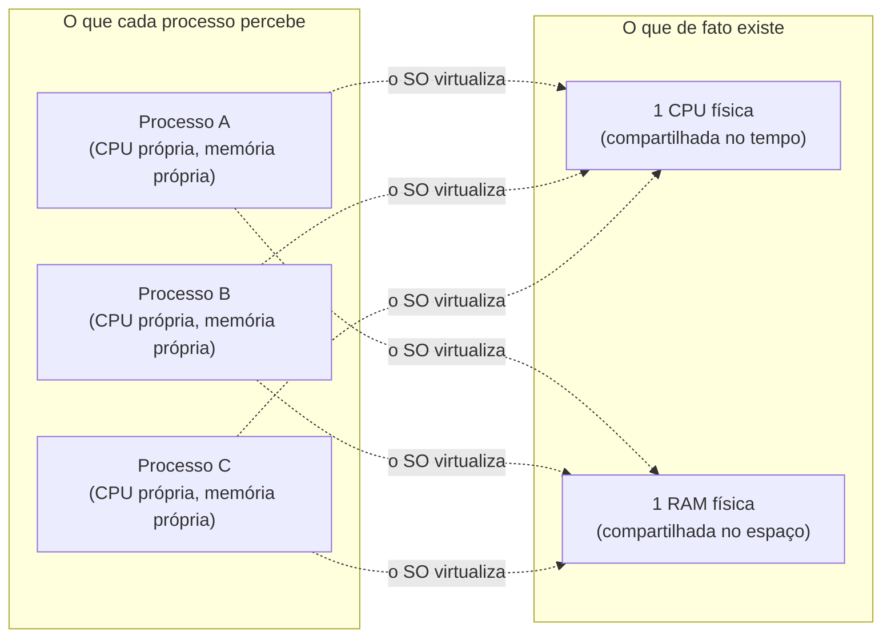

## Objetivos de Aprendizagem

- Definir um processo como a abstração do SO para um programa em execução, e listar o estado que ele reúne: imagem de memória, registradores (incluindo o contador de programa e o ponteiro de pilha) e descritores de arquivos abertos.
- Distinguir um programa (um arquivo estático em disco) de um processo (esse programa, carregado e executando).
- Explicar os dois serviços centrais que todo SO oferece para criar a ilusão de processo: virtualizar a CPU e virtualizar a memória.
- Descrever por que um SO roda muito mais processos do que tem CPUs físicas, e o que torna isso possível.

## Contexto e Motivação

Um notebook moderno com 8 núcleos de CPU roda rotineiramente um navegador, um tocador de música, um editor de código, um terminal e dezenas de serviços em segundo plano, tudo ao mesmo tempo, todos aparentemente progredindo juntos. Não há nem de longe CPUs físicas suficientes para cada um desses programas ter uma só para si de forma permanente. A resposta do sistema operacional para essa falta é a abstração mais importante de todo o software de sistemas: o **processo**.

Um processo não é o arquivo do programa em disco: o `python3` parado em `/usr/bin` é inerte, só bytes. Um processo é esse programa *carregado na memória e executando ativamente*: sua própria visão privada de memória guardando código e dados, um conjunto de registradores de CPU que captura exatamente onde a execução está no momento, e uma tabela dos arquivos abertos que ele está usando. O mesmo arquivo de programa pode virar muitos processos independentes: abra duas janelas de terminal e rode o mesmo script de shell em cada uma, e o SO cria dois processos completamente separados, cada um com sua própria memória e seu próprio progresso pelo código, embora ambos tenham começado a partir dos mesmíssimos bytes em disco.

O *Operating Systems: Three Easy Pieces* (OSTEP) de Arpaci-Dusseau apresenta isso como o SO fazendo um tipo de **virtualização**: pegar um recurso físico (uma CPU) e, por meio de maquinaria de baixo nível mais política de alto nível, apresentar a muitos processos a ilusão de que cada um tem a CPU inteira só para si. O mesmo truque é feito com a memória física, dando a cada processo seu próprio espaço de endereçamento privado (um tópico ao qual esta disciplina volta em profundidade depois que processos, escalonamento e concorrência forem vistos). Todo o resto desta disciplina (escalonamento, memória virtual, até o sistema de arquivos) existe para manter essa ilusão de forma convincente e justa.

## Teoria Central

### O que um processo de fato reúne

Um processo é a soma de tudo o que o SO precisa salvar e restaurar para pausar um programa em execução e depois retomá-lo exatamente de onde parou, sem nenhuma diferença observável em relação a ter rodado continuamente:

- **Imagem de memória.** O código do processo (instruções), seus dados estáticos, seu heap (memória alocada dinamicamente em tempo de execução) e sua pilha (variáveis locais e a contabilidade de chamadas de função): exatamente o layout que um programa construído em C reconheceria no seu espaço de endereçamento.
- **Registradores de CPU**, incluindo dois que merecem menção especial: o **contador de programa (PC)**, que acompanha qual instrução executa em seguida, e o **ponteiro de pilha**, que acompanha o topo do quadro de pilha atual. Os registradores de propósito geral, que guardam os valores com que o programa estava calculando por último, também são salvos.
- **Descritores de arquivos abertos**: quais arquivos, sockets de rede ou dispositivos o processo tem abertos no momento, e em que posição de leitura/escrita ele está em cada um.

Esse pacote costuma ser chamado de **contexto** do processo, e tudo o que o OSTEP ou o CS2013 dizem sobre "salvar e restaurar o estado do processo" se refere exatamente a esta lista.

### Programa vs. processo: o mesmo código, muitas vidas independentes

Um programa é estático: uma sequência de bytes em disco, codificando instruções e dados (compilados, no caso de algo como um programa C, diretamente a partir do trabalho de ISA e assembly visto em outro lugar deste módulo). Um processo é esse programa ganhando vida: carregado na memória, recebendo sua própria pilha e seu próprio heap, e posto para rodar com seu próprio contador de programa avançando pelo código. Rodar o mesmo programa duas vezes produz dois processos com memória independente e progresso independente; um bug que derruba uma instância não toca a memória da outra, porque cada uma recebeu sua própria ilusão privada da máquina.

### Virtualizando a CPU

Com uma CPU (ou um punhado de núcleos) e muito mais processos do que núcleos, o SO precisa **compartilhar o tempo**: rodar um processo por um tempo, salvar seu contexto completo, carregar o contexto salvo de outro processo e deixar esse rodar. Repetindo isso rápido o bastante (escalonadores modernos trocam muitas vezes por segundo), todo processo parece progredir de forma contínua, embora a cada instante só um pequeno número esteja de fato executando no silício real. *Como* o SO decide qual processo recebe a CPU em seguida, e por quanto tempo, é o assunto do escalonamento de CPU, visto logo depois deste conceito; este conceito só estabelece que a virtualização está acontecendo.



### Por que esta abstração, e não algo mais simples

Um projeto mais simples (deixar cada programa controlar diretamente a máquina inteira, um de cada vez, sem SO mediando) foi de fato como os primeiros computadores funcionavam, e é exatamente o ponto de partida de que a execução direta limitada, discutida a seguir, ainda parte antes de acrescentar a segurança que faltava. A abstração de processo é o que torna a multiprogramação (muitos programas "ao mesmo tempo") possível e segura: possível, porque o SO consegue intercalar muitos processos num hardware limitado; segura, porque a memória e o estado de cada processo ficam isolados dos de todos os outros, de modo que um mau comportamento num programa não corrompe nem derruba programas não relacionados.

## Exemplos Resolvidos

### Exemplo 1: um programa, três processos

```text
$ python3 count.py &
$ python3 count.py &
$ python3 count.py &
```

Rodar o mesmíssimo script `count.py` três vezes lança três processos separados. Cada um recebe:

```text
Processo 1 (pid 4021): pilha própria, heap próprio, cópia própria de qualquer contador global
Processo 2 (pid 4022): pilha própria, heap próprio, cópia própria de qualquer contador global
Processo 3 (pid 4023): pilha própria, heap próprio, cópia própria de qualquer contador global
```

Se o `count.py` incrementa uma variável global num laço e a imprime, os três processos imprimem sequências crescentes independentes: nenhum deles observa nem interfere no contador do outro, porque "o programa" e "um processo rodando o programa" são coisas diferentes, e há três instâncias totalmente independentes do segundo.

### Exemplo 2: o que precisa ser salvo para pausar um processo

Suponha que o processo A esteja rodando e o SO decida trocar para o processo B. Para que A retome depois sem nenhuma lacuna visível, o SO precisa salvar:

```text
Contador de programa:    0x4011a3   (próxima instrução a executar)
Ponteiro de pilha:       0x7ffee2c0 (topo do quadro de pilha atual)
Registradores gerais:    rax=17, rbx=0, rcx=42, ...
Arquivos abertos:        fd 3 -> /var/log/app.log, posição 8192
```

Cada um desses valores é exatamente o que "contexto do processo" significa nos Objetivos de Aprendizagem acima. Deixe qualquer pedaço de fora (restaure o contador de programa errado, digamos) e retomar o processo A saltaria para a instrução errada e quase certamente travaria ou corromperia seu próprio cálculo.

### Exemplo 3: contando processos vs. programas num sistema real

```text
$ ls /usr/bin/python3
/usr/bin/python3          # exatamente um programa (um arquivo)

$ ps aux | grep python3
alice   4021  python3 count.py
alice   4022  python3 count.py
alice   4023  bob's-service.py
```

Um arquivo de programa, três processos: dois são execuções separadas do mesmo programa, um é um programa totalmente diferente, mas os três são instâncias de processo entre as quais o SO troca de contexto de forma independente, cada uma com seu próprio conjunto de registradores salvo e sua própria imagem de memória.

## Equívocos Comuns e Armadilhas

- **"Processo e programa são a mesma coisa."** Um programa é um arquivo estático em disco; um processo é esse programa carregado na memória e executando, com seu próprio estado privado. O mesmo programa pode ser a origem de muitos processos independentes ao mesmo tempo.
- **"Se um programa está rodando, há exatamente um processo para ele."** Nada impede lançar o mesmo programa muitas vezes; cada lançamento é seu próprio processo, com memória independente, estado de registradores independente e nenhum compartilhamento automático de dados entre as instâncias.
- **"Virtualizar a CPU significa dar a cada processo uma fatia permanente e mais lenta de um núcleo real."** Significa compartilhar o tempo (trocar rapidamente qual contexto salvo de processo está de fato carregado na CPU física), e não dividir literalmente uma CPU em CPUs menores e dedicadas.
- **"Os registradores de um processo são só contabilidade extra, e não fazem parte de verdade da sua identidade."** Os valores de registradores salvos, especialmente o contador de programa e o ponteiro de pilha, são exatamente o que permite que um processo pausado retome sem interrupção observável; perdê-los ou corrompê-los quebra o processo de vez.

## Resumo

Um processo é a abstração do SO para um programa em execução: uma imagem de memória privada (código, dados, heap, pilha), um conjunto salvo de registradores de CPU, incluindo o contador de programa e o ponteiro de pilha, e uma tabela de arquivos abertos. Ele é distinto do arquivo do programa em disco, já que um programa pode ser a origem de muitos processos independentes e isolados. O SO mantém a ilusão de que todo processo tem sua própria CPU e sua própria memória por meio da **virtualização**: compartilhando no tempo a CPU entre os processos e, como visto mais adiante nesta disciplina, dando a cada processo seu próprio espaço de endereçamento privado. Essa única abstração (reunir exatamente o estado necessário para pausar e depois retomar perfeitamente um cálculo) é a base sobre a qual todo outro tópico desta disciplina se constrói, de como o SO cria processos novos em seguida, a como ele decide qual roda quando, a como ele protege a memória de um processo da de outro.

## Documentation Links

- [Arpaci-Dusseau: Operating Systems: Three Easy Pieces, "The Abstraction: The Process"](https://pages.cs.wisc.edu/~remzi/OSTEP/cpu-intro.pdf): o tratamento canônico da abstração de processo e da virtualização da CPU a partir do qual este conceito é construído.
- [ACM/IEEE CS2013: Operating Systems Knowledge Area](https://csed.acm.org/knowledge-areas-operating-systems-os-cs2013-version/): diretrizes curriculares que estabelecem o estado de processo/programa e o papel de virtualização do SO como fundamentais em Sistemas Operacionais.
