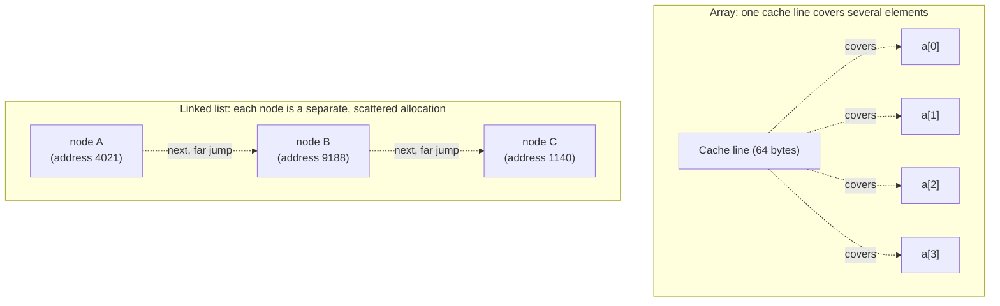

## Learning Objectives

- Compare dynamic arrays and doubly linked lists across access, insertion, deletion, and memory overhead.
- Explain cache locality and why it makes arrays faster in practice than their Big-O complexity alone predicts.
- Predict which structure is the better fit for a given access pattern, given only a description of the operations an application performs most.
- Analyze a scenario where the theoretically "correct" choice by Big-O still loses in practice, and explain why.

## Context & Motivation

The last four concepts each introduced a structure by way of a trade: static arrays trade flexibility for O(1) access; dynamic arrays trade a bounded amount of copying overhead for the *appearance* of unbounded growth while keeping that O(1) access amortized; singly linked lists trade away random access entirely in exchange for O(1) modification at a known point; doubly linked lists spend one extra pointer per node to make that O(1) modification available at both ends and from any node reached by reference. None of this was arbitrary — every one of these designs is a specific, defensible answer to the question "which operations does this application do most, and which can it afford to do slowly?" This concept is where that question finally gets asked directly, side by side, because "array or linked list?" is one of the most common real design decisions in software engineering, and it is a decision that a table of Big-O complexities alone does not fully answer.

It doesn't fully answer it because Big-O deliberately throws away constant factors — and one particular constant factor, **cache locality**, turns out to matter enormously in practice, often enough to overturn what the asymptotic complexity table alone would suggest. Modern CPUs are dramatically faster at reading memory that is physically close to memory they just read, because of hardware caching: reading one element of a contiguous array tends to pull several of its neighbors into a fast cache line "for free," so the *next* few accesses are almost free. A linked list's nodes, scattered arbitrarily across memory by whatever the memory allocator decided at the time each node was created, get none of this benefit — each `next` pointer, in the worst case, is a fresh cache miss. Sedgewick and Wayne's *Algorithms, Part I* and MIT's 6.006 both flag this explicitly: two structures can have the exact same Big-O classification for an operation and still differ by an order of magnitude in wall-clock time, purely because of memory layout. This concept, then, is a genuine decision guide — it asks not "which is asymptotically better" but "given what this program actually does most often, which structure's actual trade-offs fit."

## Core Theory

### Side-by-side complexity comparison

| Operation | Dynamic array | Doubly linked list | Why |
|---|---|---|---|
| Access by index, `a[i]` | O(1) | O(n) | Array: direct address arithmetic. List: must traverse from an end. |
| Search by value (unsorted) | O(n) | O(n) | Both must check elements one by one; neither has ordering to exploit. |
| Insert at front | O(n) | O(1) | Array must shift every existing element right. List rewires two pointers at the head. |
| Insert at back | O(1) amortized | O(1) | Array: usually free capacity (amortized doubling). List: `tail` pointer makes this direct. |
| Insert at middle (position known as a reference/index) | O(n) | O(1) once the node is located, O(n) to locate it by index | Array must shift. List needs no shifting but still must reach the position somehow. |
| Delete at front | O(n) | O(1) | Same shifting/rewiring asymmetry as insert at front. |
| Delete at back | O(1) | O(1) | Array: no shift needed. List: `tail.prev` gives the new tail directly (doubly linked only). |
| Delete at middle (node reference known) | O(n) | O(1) | Array must shift to close the gap. List rewires the neighbors' pointers directly. |
| Memory overhead per element | none beyond the data itself (plus unused capacity slack) | one or two pointers per node (8–16 bytes on a 64-bit system) | Array: contiguous slots, no per-element bookkeeping. List: every node carries pointer fields. |
| Cache locality | high — elements are adjacent in memory | low — nodes are scattered wherever the allocator placed them | Determines real-world constant-factor speed, invisible to Big-O alone. |

### Cache locality: the constant factor Big-O hides

CPUs read memory into small, fast **cache lines** (commonly 64 bytes) at a time, not one value at a time. When an array is traversed in order, reading `a[0]` typically pulls `a[1]`, `a[2]`, and several more neighbors into cache at essentially no extra cost, so subsequent accesses are served from fast cache rather than slow main memory — this is **spatial locality**, and contiguous arrays are close to the ideal case for exploiting it. A linked list gives no such guarantee: each node was allocated independently, potentially at any point during the program's execution, and there is no reason two logically adjacent nodes (`node.next`) are physically adjacent in memory. Traversing a linked list therefore tends to incur a cache miss on nearly every `next` hop, each one costing potentially tens to hundreds of times longer than a cache hit. This is why, even though "traverse all n elements" is O(n) for both a dynamic array and a linked list, measured wall-clock time for the array version is routinely several times faster in practice — a difference that the shared O(n) label completely obscures.



### Reframing the comparison as a decision procedure

Given the table above, the actual decision reduces to identifying an application's dominant access pattern and checking which structure's cheap operations match it:

- **Mostly indexed reads, rare insertion/deletion anywhere but the end** → dynamic array. This describes the overwhelming majority of general-purpose "list of things" use cases, which is exactly why arrays (or dynamic arrays specifically) are the default choice in most languages' standard collection libraries.
- **Frequent insertion/deletion at the front, or at arbitrary positions where a reference to the neighboring node is already available (e.g., iterating and removing as you go)** → linked list, doubly linked if both directions or tail-side operations are needed.
- **Frequent insertion/deletion at arbitrary positions specified by *index*, not by reference** → neither structure is ideal outright: the array pays O(n) to shift, and the list pays O(n) just to locate the index before its O(1) rewiring can even begin. This scenario is precisely what motivates more specialized structures (balanced trees, skip lists) outside the scope of this discipline's array/list comparison.
- **Memory-constrained environments, or workloads dominated by sequential scanning** → dynamic array, both for its lack of per-element pointer overhead and for its cache-friendly layout.

### What neither structure fixes

Neither a dynamic array nor a doubly linked list turns search-by-value into anything faster than O(n) without additional structure (sorting plus binary search, or a hash table, both covered elsewhere in this discipline). This comparison is strictly about how each structure implements the same core Sequence-like ADT operations — access, insert, delete — not about search, which neither one is designed to accelerate on its own.

## Worked Examples

### Example 1 — implementing and timing "insert at front, n times" on both structures

**Problem:** Implement "insert at front, repeated n times" for a Python-list-backed structure (simulating a fixed-shift array) and for a singly linked list, and compare their operation counts for n = 5.

```python
# Array-backed: insert-at-front requires shifting every existing element
def array_insert_front(arr, value):
    arr.insert(0, value)   # Python's list.insert(0, x) is O(len(arr)) — shifts everything

array_version = []
shifts = 0
for i in range(5):
    shifts += len(array_version)   # every existing element shifts by one
    array_insert_front(array_version, i)
print(array_version, "total shifts:", shifts)   # [4,3,2,1,0] total shifts: 0+1+2+3+4 = 10


# Linked-list-backed: insert-at-front is a fixed, small number of pointer operations
class Node:
    def __init__(self, data, next=None):
        self.data = data
        self.next = next

head = None
pointer_ops = 0
for i in range(5):
    head = Node(i, next=head)   # exactly one pointer write, regardless of list length
    pointer_ops += 1
result = []
current = head
while current:
    result.append(current.data)
    current = current.next
print(result, "total pointer ops:", pointer_ops)   # [4,3,2,1,0] total pointer ops: 5
```

**Reasoning.** The array version's total shift count grows as `0+1+2+3+4 = 10` — a triangular number, O(n²) total for n front-insertions, since each individual insertion is O(current length). The linked-list version does exactly one pointer write per insertion, O(n) total for n insertions. Both end up holding the identical final sequence `[4,3,2,1,0]`, but the linked list reached it with dramatically less total work — this is the array-versus-list trade-off from the complexity table made directly countable rather than abstract.

### Example 2 — where the array wins despite matching Big-O: sequential sum

**Problem:** Both a dynamic array and a linked list support "sum all n elements" in O(n). Explain, using the cache-locality argument from Core Theory, why the array version is expected to run measurably faster despite the identical Big-O classification.

```python
# Both are O(n) — the question is about the CONSTANT FACTOR, not the complexity class
def sum_array(arr):
    total = 0
    for x in arr:            # sequential access — each next element is right next to the last
        total += x
    return total

def sum_linked_list(head):
    total = 0
    current = head
    while current is not None:
        total += current.data   # each hop may jump to a distant, unrelated memory address
        current = current.next
    return total
```

**Reasoning.** Both functions perform exactly n additions and n traversal steps — identical operation counts, identical O(n) classification. The difference Core Theory identifies is entirely about *where in memory* each access lands: `sum_array`'s sequential reads benefit from cache lines already holding several upcoming elements, while `sum_linked_list`'s `current = current.next` jumps to whatever address that node happened to be allocated at, which is essentially unrelated to the address just read, defeating the cache's locality assumption on nearly every hop. This is the clearest possible illustration of why "same Big-O" does not mean "same real-world speed" — a distinction the complexity table's columns alone cannot convey, and exactly why this concept treats cache locality as a first-class row in that table rather than a footnote.

### Example 3 — a decision case: implementing a text editor's "insert character at cursor"

**Problem:** A text editor needs to support inserting and deleting a single character at the current cursor position, where the cursor moves frequently and can be anywhere in the document. Compare a dynamic-array-backed and a doubly-linked-list-backed implementation for this specific access pattern, and decide.

**Reasoning.** If the cursor position is tracked as a plain index, both structures pay a real cost to reach it: the array via O(1) index access (fine) but O(n) shifting on every insert/delete (expensive, since editing happens constantly); the linked list via O(n) traversal from an end to reach the cursor's node by index (also expensive, and for the same underlying reason — a numeric position, not a node reference). Neither is a clean win purely by Big-O. The resolution real text editors use is to change *how the cursor is represented*: if the cursor is tracked as a **node reference** into a doubly linked list (updated incrementally as the cursor moves left/right by following `prev`/`next`, which is O(1) per move) rather than as a recomputed index, then insertion and deletion exactly at the cursor become genuine O(1) operations with no traversal at all — because the node is already in hand, exactly matching the doubly linked list's real strength as identified in Core Theory. This is a case where the "right" structure only becomes right once the access pattern is described precisely enough (node reference, not index) to see which structure's actual cheap operation applies — a generic "which is asymptotically better for text editing" question, asked without that precision, has no clean answer.

## Common Misconceptions & Pitfalls

- **"Big-O comparison alone settles which structure to use."** Example 2 demonstrates two operations with identical O(n) classification differing substantially in real performance due to cache locality — a constant factor Big-O is defined to ignore, but one that matters enormously on real hardware.
- **"Linked lists are obsolete now that arrays/cache locality make arrays faster for most things."** This overcorrects. Example 1 shows repeated front-insertion is O(n²) total for an array-backed structure versus O(n) total for a linked list — a genuine asymptotic gap, not just a constant factor, that grows without bound as n grows. The right lesson is not "arrays are always better" but "match the structure to the dominant access pattern," per Core Theory's decision procedure.
- **"A linked list's O(1) insertion claim applies no matter how the insertion position is specified."** As Example 3's initial (index-based) framing shows, O(1) insertion requires a node reference already in hand — specifying position by index still costs O(n) to locate that node first, in a linked list exactly as much as an array pays to shift. The O(1) guarantee is about the rewiring step alone, never about locating the position from scratch.
- **"Memory overhead is a minor detail that shouldn't factor into the decision."** For very large collections of small elements (e.g., storing a billion single bytes), a doubly linked list's two 8-byte pointers per node can dwarf the size of the actual data being stored, multiplying total memory use many times over compared to a packed array — this is a real, sometimes decisive practical constraint, not a footnote.

## Summary

Dynamic arrays and doubly linked lists are not competitors where one simply wins — they occupy different, complementary points in the same trade-off space, and the complexity table built in Core Theory shows exactly where each one is cheap and where each is expensive: arrays win at indexed access and are cache-friendly for sequential work; linked lists win at insertion and deletion given a node reference, especially at the front or at both ends. Big-O comparison alone is necessary but not sufficient for this decision, because it discards the constant-factor effect of cache locality, which can make two O(n) operations differ substantially in real measured speed, as the sequential-sum example demonstrated directly. The right choice, in practice, comes from precisely identifying an application's dominant access pattern — indexed reads versus reference-based modification, front-heavy versus back-heavy versus scattered, sequential versus random — and matching it to whichever structure's cheap operations, from the table, actually correspond to that pattern.

## Documentation Links

- [MIT 6.006 — Lecture Notes (OCW)](https://ocw.mit.edu/courses/6-006-introduction-to-algorithms-spring-2020/pages/lecture-notes/) — doc
- [Sedgewick & Wayne — Algorithms, Part I (Princeton, Coursera)](https://www.coursera.org/learn/algorithms-part1) — doc
