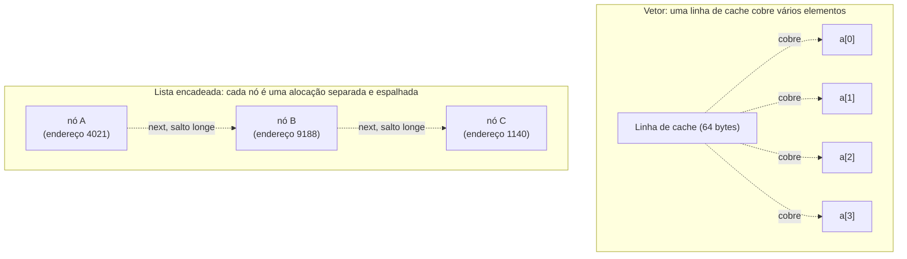

## Objetivos de Aprendizagem

- Comparar vetores dinâmicos e listas duplamente encadeadas em acesso, inserção, remoção e sobrecarga de memória.
- Explicar localidade de cache e por que ela torna vetores mais rápidos na prática do que sua complexidade Big-O sozinha prevê.
- Prever qual estrutura se encaixa melhor num dado padrão de acesso, dada só uma descrição das operações que uma aplicação realiza com mais frequência.
- Analisar um cenário onde a escolha teoricamente "correta" por Big-O ainda perde na prática, e explicar por quê.

## Contexto e Motivação

Os últimos quatro conceitos cada um introduziu uma estrutura por meio de uma troca: vetores estáticos trocam flexibilidade por acesso O(1); vetores dinâmicos trocam uma quantidade limitada de sobrecarga de cópia pela *aparência* de crescimento ilimitado enquanto mantêm aquele acesso O(1) amortizado; listas encadeadas simples abrem mão de acesso aleatório completamente em troca de modificação O(1) num ponto conhecido; listas duplamente encadeadas gastam um ponteiro extra por nó para tornar essa modificação O(1) disponível nas duas extremidades e a partir de qualquer nó alcançado por referência. Nada disso foi arbitrário; cada um desses designs é uma resposta específica e defensável à pergunta "quais operações essa aplicação faz mais, e quais ela pode se dar ao luxo de fazer devagar?" Este conceito é onde essa pergunta finalmente é feita diretamente, lado a lado, porque "vetor ou lista encadeada?" é uma das decisões de design reais mais comuns em engenharia de software, e é uma decisão que uma tabela de complexidades Big-O sozinha não responde completamente.

Não responde completamente porque Big-O deliberadamente descarta fatores constantes, e um fator constante em particular, **localidade de cache**, acaba importando enormemente na prática, com frequência o suficiente para reverter o que a tabela de complexidade assintótica sozinha sugeriria. CPUs modernas são dramaticamente mais rápidas lendo memória que está fisicamente perto de memória que acabaram de ler, por causa de cache de hardware: ler um elemento de um vetor contíguo tende a puxar vários de seus vizinhos para uma linha de cache rápida "de graça", então os próximos acessos são quase gratuitos. Os nós de uma lista encadeada, espalhados arbitrariamente pela memória por qualquer coisa que o alocador de memória tenha decidido no momento em que cada nó foi criado, não recebem nenhum desse benefício; cada ponteiro `next`, no pior caso, é um cache miss novo. O *Algorithms, Part I* de Sedgewick e Wayne e o 6.006 do MIT ambos sinalizam isso explicitamente: duas estruturas podem ter exatamente a mesma classificação Big-O para uma operação e ainda diferir por uma ordem de magnitude em tempo de relógio de parede, puramente por causa de layout de memória. Este conceito, então, é um guia de decisão genuíno; ele não pergunta "qual é assintoticamente melhor" mas "dado o que este programa de fato faz com mais frequência, os trade-offs reais de qual estrutura se encaixam".

## Teoria Central

### Comparação de complexidade lado a lado

| Operação | Vetor dinâmico | Lista duplamente encadeada | Por quê |
|---|---|---|---|
| Acesso por índice, `a[i]` | O(1) | O(n) | Vetor: aritmética de endereço direta. Lista: precisa percorrer a partir de uma extremidade. |
| Busca por valor (não ordenado) | O(n) | O(n) | Ambos precisam checar elementos um por um; nenhum tem ordenação para explorar. |
| Inserir no início | O(n) | O(1) | Vetor precisa deslocar todo elemento existente à direita. Lista rewire dois ponteiros na cabeça. |
| Inserir no final | O(1) amortizado | O(1) | Vetor: geralmente capacidade livre (dobramento amortizado). Lista: ponteiro `tail` torna isso direto. |
| Inserir no meio (posição conhecida como referência/índice) | O(n) | O(1) uma vez que o nó é localizado, O(n) para localizá-lo por índice | Vetor precisa deslocar. Lista não precisa deslocar mas ainda precisa alcançar a posição de algum jeito. |
| Remover do início | O(n) | O(1) | Mesma assimetria de deslocamento/rewiring que inserir no início. |
| Remover do final | O(1) | O(1) | Vetor: nenhum deslocamento necessário. Lista: `tail.prev` dá o novo tail diretamente (só duplamente encadeada). |
| Remover do meio (referência do nó conhecida) | O(n) | O(1) | Vetor precisa deslocar para fechar a lacuna. Lista rewire os ponteiros dos vizinhos diretamente. |
| Sobrecarga de memória por elemento | nenhuma além do próprio dado (mais folga de capacidade não usada) | um ou dois ponteiros por nó (8-16 bytes num sistema de 64 bits) | Vetor: compartimentos contíguos, sem contabilidade por elemento. Lista: todo nó carrega campos de ponteiro. |
| Localidade de cache | alta, elementos são adjacentes na memória | baixa, nós estão espalhados onde quer que o alocador os tenha colocado | Determina velocidade de fator constante no mundo real, invisível só pelo Big-O. |

### Localidade de cache: o fator constante que Big-O esconde

CPUs leem memória em **linhas de cache** pequenas e rápidas (comumente 64 bytes) de uma vez, não um valor de cada vez. Quando um vetor é percorrido em ordem, ler `a[0]` tipicamente puxa `a[1]`, `a[2]`, e vários outros vizinhos para o cache essencialmente sem custo extra, então acessos subsequentes são servidos do cache rápido em vez da memória principal lenta; isso é **localidade espacial**, e vetores contíguos estão perto do caso ideal para explorá-la. Uma lista encadeada não dá nenhuma garantia dessas: cada nó foi alocado independentemente, potencialmente em qualquer ponto durante a execução do programa, e não há razão para dois nós logicamente adjacentes (`node.next`) serem fisicamente adjacentes na memória. Percorrer uma lista encadeada portanto tende a incorrer num cache miss em quase todo salto `next`, cada um custando potencialmente dezenas a centenas de vezes mais que um cache hit. É por isso que, mesmo que "percorrer todos os n elementos" seja O(n) tanto para um vetor dinâmico quanto para uma lista encadeada, o tempo de relógio de parede medido para a versão do vetor é rotineiramente várias vezes mais rápido na prática, uma diferença que o rótulo compartilhado O(n) esconde completamente.



### Reformulando a comparação como um procedimento de decisão

Dada a tabela acima, a decisão real se reduz a identificar o padrão de acesso dominante de uma aplicação e checar quais operações baratas de qual estrutura correspondem a ele:

- **Principalmente leituras indexadas, inserção/remoção rara em qualquer lugar exceto no final** → vetor dinâmico. Isso descreve a esmagadora maioria dos casos de uso genéricos de "lista de coisas", que é exatamente por que vetores (ou vetores dinâmicos especificamente) são a escolha padrão nas bibliotecas de coleção padrão da maioria das linguagens.
- **Inserção/remoção frequente no início, ou em posições arbitrárias onde uma referência ao nó vizinho já está disponível (por exemplo, iterando e removendo conforme você avança)** → lista encadeada, duplamente encadeada se as duas direções ou operações do lado do tail são necessárias.
- **Inserção/remoção frequente em posições arbitrárias especificadas por *índice*, não por referência** → nenhuma estrutura é francamente ideal: o vetor paga O(n) para deslocar, e a lista paga O(n) só para localizar o índice antes de seu rewiring O(1) sequer poder começar. Este cenário é precisamente o que motiva estruturas mais especializadas (árvores balanceadas, skip lists) fora do escopo da comparação vetor/lista desta disciplina.
- **Ambientes limitados em memória, ou cargas de trabalho dominadas por varredura sequencial** → vetor dinâmico, tanto por sua falta de sobrecarga de ponteiro por elemento quanto por seu layout amigável ao cache.

### O que nenhuma das duas estruturas corrige

Nem um vetor dinâmico nem uma lista duplamente encadeada transforma busca-por-valor em algo mais rápido que O(n) sem estrutura adicional (ordenação mais busca binária, ou uma tabela hash, ambas cobertas em outro ponto desta disciplina). Essa comparação é estritamente sobre como cada estrutura implementa as mesmas operações centrais de TAD tipo Sequência (acesso, inserção, remoção), não sobre busca, que nenhuma das duas é projetada para acelerar sozinha.

## Exemplos Resolvidos

### Exemplo 1: implementando e cronometrando "inserir no início, n vezes" nas duas estruturas

**Problema:** implemente "inserir no início, repetido n vezes" para uma estrutura baseada em lista Python (simulando um vetor de deslocamento fixo) e para uma lista encadeada simples, e compare suas contagens de operação para n = 5.

```python
# Baseado em vetor: inserir-no-início exige deslocar todo elemento existente
def insere_inicio_vetor(arr, valor):
    arr.insert(0, valor)   # list.insert(0, x) do Python é O(len(arr)): desloca tudo

versao_vetor = []
deslocamentos = 0
for i in range(5):
    deslocamentos += len(versao_vetor)   # todo elemento existente desloca uma posição
    insere_inicio_vetor(versao_vetor, i)
print(versao_vetor, "deslocamentos totais:", deslocamentos)   # [4,3,2,1,0] deslocamentos totais: 0+1+2+3+4 = 10


# Baseado em lista encadeada: inserir-no-início é um número fixo e pequeno de operações de ponteiro
class No:
    def __init__(self, dado, proximo=None):
        self.dado = dado
        self.proximo = proximo

cabeca = None
operacoes_ponteiro = 0
for i in range(5):
    cabeca = No(i, proximo=cabeca)   # exatamente uma escrita de ponteiro, independente do comprimento da lista
    operacoes_ponteiro += 1
resultado = []
atual = cabeca
while atual:
    resultado.append(atual.dado)
    atual = atual.proximo
print(resultado, "operações de ponteiro totais:", operacoes_ponteiro)   # [4,3,2,1,0] operações de ponteiro totais: 5
```

**Raciocínio.** A contagem total de deslocamentos da versão do vetor cresce como `0+1+2+3+4 = 10`, um número triangular, O(n²) total para n inserções no início, já que cada inserção individual é O(comprimento atual). A versão da lista encadeada faz exatamente uma escrita de ponteiro por inserção, O(n) total para n inserções. As duas terminam guardando a sequência final idêntica `[4,3,2,1,0]`, mas a lista encadeada chegou lá com dramaticamente menos trabalho total; este é o trade-off vetor-versus-lista da tabela de complexidade tornado diretamente contável em vez de abstrato.

### Exemplo 2: onde o vetor vence apesar de Big-O igual: soma sequencial

**Problema:** tanto um vetor dinâmico quanto uma lista encadeada suportam "somar todos os n elementos" em O(n). Explique, usando o argumento de localidade de cache da Teoria Central, por que se espera que a versão do vetor rode mensuravelmente mais rápido apesar da classificação Big-O idêntica.

```python
# Os dois são O(n): a pergunta é sobre o FATOR CONSTANTE, não a classe de complexidade
def soma_vetor(arr):
    total = 0
    for x in arr:            # acesso sequencial: cada próximo elemento está bem ao lado do último
        total += x
    return total

def soma_lista_encadeada(cabeca):
    total = 0
    atual = cabeca
    while atual is not None:
        total += atual.dado   # cada salto pode ir a um endereço de memória distante e não relacionado
        atual = atual.proximo
    return total
```

**Raciocínio.** As duas funções realizam exatamente n adições e n passos de percurso, contagens de operação idênticas, classificação O(n) idêntica. A diferença que a Teoria Central identifica é inteiramente sobre *onde na memória* cada acesso cai: as leituras sequenciais de `soma_vetor` se beneficiam de linhas de cache já contendo vários elementos futuros, enquanto `atual = atual.proximo` de `soma_lista_encadeada` salta para qualquer endereço em que aquele nó aconteceu de ser alocado, o que é essencialmente não relacionado ao endereço acabado de ler, derrotando a suposição de localidade do cache em quase todo salto. Esta é a ilustração mais clara possível de por que "mesmo Big-O" não significa "mesma velocidade no mundo real", uma distinção que as colunas da tabela de complexidade sozinhas não conseguem transmitir, e exatamente por que este conceito trata localidade de cache como uma linha de primeira classe naquela tabela em vez de uma nota de rodapé.

### Exemplo 3: um caso de decisão: implementando "inserir caractere no cursor" de um editor de texto

**Problema:** um editor de texto precisa suportar inserir e remover um único caractere na posição atual do cursor, onde o cursor se move frequentemente e pode estar em qualquer lugar do documento. Compare uma implementação baseada em vetor dinâmico e uma baseada em lista duplamente encadeada para esse padrão de acesso específico, e decida.

**Raciocínio.** Se a posição do cursor é rastreada como um índice comum, as duas estruturas pagam um custo real para alcançá-la: o vetor via acesso indexado O(1) (tudo bem) mas deslocamento O(n) em toda inserção/remoção (caro, já que edição acontece constantemente); a lista encadeada via percurso O(n) a partir de uma extremidade para alcançar o nó do cursor por índice (também caro, e pela mesma razão subjacente: uma posição numérica, não uma referência de nó). Nenhuma das duas é uma vitória limpa só pelo Big-O. A resolução que editores de texto reais usam é mudar *como o cursor é representado*: se o cursor é rastreado como uma **referência de nó** numa lista duplamente encadeada (atualizada incrementalmente conforme o cursor se move para esquerda/direita seguindo `prev`/`next`, que é O(1) por movimento) em vez de como um índice recomputado, então inserção e remoção exatamente no cursor se tornam operações O(1) genuínas sem nenhum percurso, porque o nó já está em mãos, correspondendo exatamente à verdadeira força da lista duplamente encadeada como identificado na Teoria Central. Este é um caso onde a estrutura "certa" só se torna certa uma vez que o padrão de acesso é descrito com precisão suficiente (referência de nó, não índice) para ver a qual operação barata real de qual estrutura se aplica; uma pergunta genérica de "qual é assintoticamente melhor para edição de texto", feita sem essa precisão, não tem resposta limpa.

## Equívocos Comuns e Armadilhas

- **"Comparação Big-O sozinha resolve qual estrutura usar."** O Exemplo 2 demonstra duas operações com classificação O(n) idêntica diferindo substancialmente em desempenho real por causa de localidade de cache, um fator constante que Big-O é definido para ignorar, mas que importa enormemente em hardware real.
- **"Listas encadeadas estão obsoletas agora que vetores/localidade de cache tornam vetores mais rápidos para a maioria das coisas."** Isso corrige demais. O Exemplo 1 mostra que inserção repetida no início é O(n²) total para uma estrutura baseada em vetor versus O(n) total para uma lista encadeada, uma lacuna assintótica genuína, não só um fator constante, que cresce sem limite conforme n cresce. A lição certa não é "vetores são sempre melhores" mas "combine a estrutura com o padrão de acesso dominante", conforme o procedimento de decisão da Teoria Central.
- **"A afirmação de inserção O(1) de uma lista encadeada se aplica não importa como a posição de inserção seja especificada."** Como o enquadramento inicial (baseado em índice) do Exemplo 3 mostra, inserção O(1) exige uma referência de nó já em mãos; especificar posição por índice ainda custa O(n) para localizar aquele nó primeiro, numa lista encadeada exatamente tanto quanto um vetor paga para deslocar. A garantia O(1) é só sobre o passo de rewiring, nunca sobre localizar a posição do zero.
- **"Sobrecarga de memória é um detalhe menor que não deveria entrar na decisão."** Para coleções muito grandes de elementos pequenos (por exemplo, guardando um bilhão de bytes individuais), os dois ponteiros de 8 bytes por nó de uma lista duplamente encadeada podem ofuscar o tamanho do próprio dado sendo guardado, multiplicando o uso total de memória várias vezes comparado a um vetor compactado; essa é uma restrição prática real, às vezes decisiva, não uma nota de rodapé.

## Resumo

Vetores dinâmicos e listas duplamente encadeadas não são concorrentes onde um simplesmente vence; eles ocupam pontos diferentes e complementares no mesmo espaço de trade-off, e a tabela de complexidade construída na Teoria Central mostra exatamente onde cada um é barato e onde cada um é caro: vetores vencem em acesso indexado e são amigáveis ao cache para trabalho sequencial; listas encadeadas vencem em inserção e remoção dada uma referência de nó, especialmente no início ou nas duas extremidades. Comparação Big-O sozinha é necessária mas não suficiente para essa decisão, porque descarta o efeito de fator constante da localidade de cache, que pode fazer duas operações O(n) diferirem substancialmente em velocidade real medida, como o exemplo de soma sequencial demonstrou diretamente. A escolha certa, na prática, vem de identificar precisamente o padrão de acesso dominante de uma aplicação (leituras indexadas versus modificação baseada em referência, pesado no início versus pesado no final versus espalhado, sequencial versus aleatório) e combiná-lo com quais operações baratas, da tabela, de fato correspondem a esse padrão.

## Documentation Links

- [MIT 6.006 — Lecture Notes (OCW)](https://ocw.mit.edu/courses/6-006-introduction-to-algorithms-spring-2020/pages/lecture-notes/) — doc
- [Sedgewick & Wayne — Algorithms, Part I (Princeton, Coursera)](https://www.coursera.org/learn/algorithms-part1) — doc
