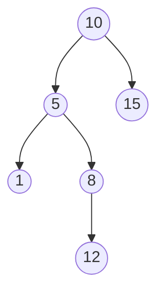
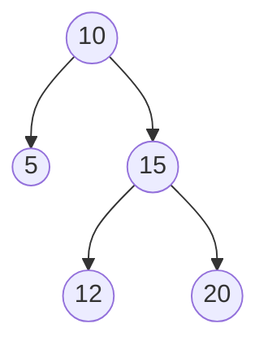
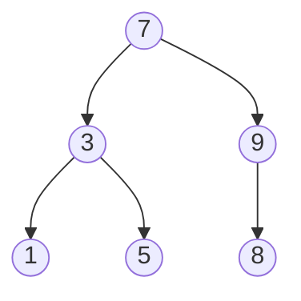
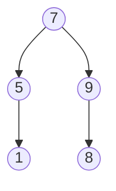

## Learning Objectives

- State the binary search tree invariant precisely, including that it applies to every descendant, not just immediate children.
- Implement search in a BST, and explain why each comparison eliminates an entire subtree from consideration.
- Implement insert in a BST, and explain why a new value's insertion point is uniquely determined by the invariant.
- Implement delete in a BST for all three structural cases (leaf, one child, two children), including finding an in-order successor or predecessor.
- Verify, given a tree, whether it satisfies the BST invariant, and identify precisely where a violation occurs if it does not.

## Context & Motivation

The previous two concepts built the vocabulary and traversal mechanics for binary trees in general — trees with no constraint on *what values* go where, only on *how many children* a node can have. A **binary search tree (BST)** takes that same node-and-pointer structure and adds exactly one more rule: for every node, everything in its left subtree is smaller, and everything in its right subtree is larger. That single ordering rule is what transforms a binary tree from "a shape for organizing data" into "a shape that makes searching fast" — the entire reason BSTs exist as a named, heavily used data structure rather than binary trees just being used directly for everything.

The payoff is direct and mirrors a technique already familiar from sorted arrays: binary search. Given a sorted array, you can find a target value by comparing it to the middle element and discarding half the remaining array on each comparison. A BST achieves the same halving-of-the-search-space idea, but without needing the data pre-sorted in contiguous memory and without the O(n) cost of inserting into the middle of an array to keep it sorted — each node's position *is* the record of a series of comparisons, and following those comparisons back down from the root is how search, insert, and delete all work. Recall from `tree-traversals` that an inorder traversal of a BST always yields sorted order with no extra sorting step; that fact was a forward-pointer to this concept, and it now has an explanation — the BST invariant is precisely the condition that makes "left subtree, then root, then right subtree" equivalent to "smaller values, then this value, then larger values," at every single node, recursively.

The three operations covered here — search, insert, delete — are not equally hard. Search and insert are close cousins: both walk a single path from the root, comparing the target against each node and moving left or right accordingly, until either the target is found (search) or an empty spot is reached to attach a new node (insert). Delete is where real care is required, because removing a node can leave a hole in the tree's structure that has to be patched without breaking the invariant for everyone else — and the honest treatment of all three ways a node can need to be removed (no children, one child, two children) is the part of this concept most worth slowing down for, since the two-child case is where most bugs in real BST implementations happen.

## Core Theory

### The BST invariant, stated precisely

For every node `n` in a binary search tree: every value in `n`'s left subtree is strictly less than `n`'s value, and every value in `n`'s right subtree is strictly greater than `n`'s value. The word doing the real work in that sentence is **every** — the rule applies to *all descendants*, arbitrarily deep, not merely to `n`'s immediate left and right children. A tree where a node's immediate children satisfy "left child < node < right child" but some deeper descendant violates the ordering relative to an ancestor further up is **not** a valid BST, even though every individual parent-child pair looks locally correct.



This tree looks locally fine at every parent-child pair (5 < 10, 15 > 10; 1 < 5, 8 > 5; 12 > 8) — but node 12 lives in node 10's *left* subtree (as a descendant of 5, which is 10's left child), and 12 is greater than 10. The invariant requires *everything* in 10's left subtree to be less than 10, and 12 violates that, even though 12's own immediate parent relationship (12 > 8) is locally correct. This is exactly the trap flagged in Common Misconceptions: checking only immediate parent-child pairs is not sufficient to verify a BST.

### Search: following one path down

```python
class Node:
    def __init__(self, value, left=None, right=None):
        self.value = value
        self.left = left
        self.right = right

def search(node, target):
    if node is None:                    # fell off the tree — not present
        return None
    if target == node.value:
        return node
    if target < node.value:
        return search(node.left, target)   # everything relevant is in the left subtree
    return search(node.right, target)      # everything relevant is in the right subtree
```

Each comparison against the current node's value tells you, by the invariant, which *entire* subtree could possibly contain the target — the other subtree is eliminated from consideration completely, not just deprioritized. This is exactly what makes search fast on a well-shaped tree: each step discards roughly half the remaining nodes, the same logarithmic-elimination idea as binary search on a sorted array, but realized through pointers instead of index arithmetic. (Precisely *how* fast this is in the worst case, and what "well-shaped" requires, is the subject of the next concept — search here is presented as a mechanism, its performance analyzed properly afterward.)

### Insert: the invariant uniquely determines where a new value goes

```python
def insert(node, value):
    if node is None:
        return Node(value)              # found the empty spot — attach here
    if value < node.value:
        node.left = insert(node.left, value)
    elif value > node.value:
        node.right = insert(node.right, value)
    # if value == node.value, a common convention is to do nothing (no duplicates)
    return node
```

Insert walks the exact same comparison path search would use to look for `value`, and when it falls off the tree (reaches `None`), that empty spot is the *only* place a new node with that value can go without breaking the invariant for every ancestor already visited — every ancestor along the way already committed to "smaller goes left of me, larger goes right of me," so the new node's position is forced, not a matter of choice.

### Delete: three structurally different cases

Deleting a node is more delicate because, unlike search or insert, it may need to remove a node with descendants that must remain correctly placed afterward.

**Case 1 — the node is a leaf (no children).** Simply remove it; nothing else in the tree references it, and no other node's subtree membership changes.

**Case 2 — the node has exactly one child.** Splice the node out by connecting its parent directly to its one child, taking the deleted node's place. This preserves the invariant because that child's entire subtree was already correctly positioned relative to everything above the deleted node (it was on the correct side of the deleted node, which was on the correct side of its own parent).

**Case 3 — the node has two children.** Neither child can simply take the deleted node's place (a node can have only one parent slot to fill, but there are two subtrees needing a new common parent). The standard technique: find the node's **in-order successor** — the smallest value in its right subtree (equivalently, the *next* value in sorted/inorder order) — copy that successor's value into the node being "deleted," then recursively delete the successor node from the right subtree, where it is guaranteed to be a Case 1 or Case 2 removal (the in-order successor, being the smallest in its subtree, can never have a left child, since a left child would be even smaller). An in-order *predecessor* — the largest value in the left subtree — works symmetrically and is an equally valid choice.

```python
def find_min(node):
    while node.left is not None:      # smallest value is the leftmost node
        node = node.left
    return node

def delete(node, target):
    if node is None:
        return None                    # target not found; nothing to do
    if target < node.value:
        node.left = delete(node.left, target)
    elif target > node.value:
        node.right = delete(node.right, target)
    else:
        # found the node to delete
        if node.left is None and node.right is None:      # Case 1: leaf
            return None
        if node.left is None:                              # Case 2: only right child
            return node.right
        if node.right is None:                              # Case 2: only left child
            return node.left
        # Case 3: two children — replace with in-order successor's value
        successor = find_min(node.right)
        node.value = successor.value
        node.right = delete(node.right, successor.value)   # remove successor from its old spot
    return node
```



Deleting 15 (two children: 12 and 20) here finds its in-order successor by going right once to 20, then left as far as possible — but 20 has no left child, so 20 itself is the successor. 15's value is overwritten with 20, and the old node holding 20 (now a leaf) is removed via Case 1.

## Worked Examples

### Example 1 — Building a BST by repeated insertion and reading it back sorted

**Problem:** Insert the values `7, 3, 9, 1, 5, 8` into an empty BST, one at a time, then confirm inorder traversal yields sorted order.

**Insert 7.** Tree is empty; 7 becomes the root.
**Insert 3.** 3 < 7, go left; left is empty, attach 3 as 7's left child.
**Insert 9.** 9 > 7, go right; right is empty, attach 9 as 7's right child.
**Insert 1.** 1 < 7, go left to 3; 1 < 3, go left; empty, attach 1 as 3's left child.
**Insert 5.** 5 < 7, go left to 3; 5 > 3, go right; empty, attach 5 as 3's right child.
**Insert 8.** 8 > 7, go right to 9; 8 < 9, go left; empty, attach 8 as 9's left child.



**Inorder check.** Left subtree of 7 (rooted at 3): inorder gives 1, 3, 5. Then 7. Then right subtree (rooted at 9): inorder gives 8, 9. Full sequence: `1, 3, 5, 7, 8, 9` — sorted, exactly as guaranteed by the BST invariant plus inorder's left-root-right order.

### Example 2 — Searching, and counting how many nodes a search actually touches

**Problem:** On the tree from Example 1, search for 5 and for 6, and list every node compared against in each case.

**Search for 5.** Start at 7: `5 < 7`, go left. At 3: `5 > 3`, go right. At 5: `5 == 5`, found. Nodes touched: 7, 3, 5 — three comparisons, and each one eliminated an entire subtree (comparing at 7 eliminated all of 9's subtree; comparing at 3 eliminated node 1's subtree).

**Search for 6.** Start at 7: `6 < 7`, go left. At 3: `6 > 3`, go right. At 5: `6 > 5`, go right; 5 has no right child — fall off the tree, target not found. Nodes touched: 7, 3, 5, then `None` — three real node comparisons before concluding absence, the same path length as a successful search for a value that *would* belong at that empty spot.

### Example 3 — Deleting a two-child node step by step

**Problem:** On the tree from Example 1 (`7` root, `3`/`9` children, `1`/`5` under 3, `8` under 9), delete 3.

**Identify the case.** Node 3 has two children (1 and 5) — Case 3.

**Find the in-order successor.** Go right from 3 to 5; 5 has no left child, so 5 itself is the smallest value in 3's right subtree — the in-order successor.

**Apply the replacement.** Copy 5's value into node 3's position (the node keeps its structural position and children pointers, but its value becomes 5). Then recursively delete 5 from 3's right subtree: 5 is a leaf there (no children), so Case 1 applies — simply remove it.



**Verify the invariant still holds.** Node 5 (formerly 3's position) has left child 1 (1 < 5, correct) and no right child (5's old right child, the original node holding value 5, was removed as part of the successor deletion). Inorder traversal now gives `1, 5, 7, 8, 9` — still sorted, confirming the invariant survived the deletion intact.

## Common Misconceptions & Pitfalls

- **"Checking that each node's immediate children are smaller/larger is enough to confirm a valid BST."** The Core Theory counterexample (node 12 sitting under 5, itself under 10, with 12 > 10) shows a tree where every immediate parent-child pair is individually correct but the tree is still not a valid BST, because 12 is a descendant of 10 through 10's left subtree while being larger than 10. The invariant is about *all descendants*, not just direct children — the only fully correct verification method is checking that inorder traversal yields a sorted sequence (or, equivalently, tracking a valid `[min, max)` range as you recurse down and shrinking it at every step).
- **"Deleting a node with two children just means picking either child to move up into its place."** Neither child alone can take over — the deleted node's *other* subtree would then have nowhere to attach, since a node has only one left slot and one right slot. The in-order successor (or predecessor) technique specifically finds a value that can validly replace the deleted node while preserving order for both remaining subtrees, and it is not an arbitrary choice of "some nearby node."
- **"The in-order successor of a two-child node might itself need complicated deletion logic."** By construction, the in-order successor (the leftmost node of the right subtree) can never have a left child — if it did, that left child would be smaller, contradicting that the successor was the leftmost, hence smallest, node in that subtree. So the successor's own removal is always a Case 1 (leaf) or Case 2 (one child, specifically only a right child) deletion, never another Case 3 — the recursion in the `delete` function bottoms out after at most one extra level for this reason.
- **"Searching for a value that isn't in the tree is somehow a different, more expensive operation than a successful search."** As Example 2 shows, an unsuccessful search follows exactly the same kind of single root-to-somewhere path a successful search does, simply terminating at an empty pointer (`None`) instead of an exact match — its cost is governed by the same path length as a successful search would have for a value that belongs at that same empty spot, not some separate, worse algorithm.

## Summary

A binary search tree adds one ordering invariant to a plain binary tree — every left-subtree value smaller, every right-subtree value larger, applying to *all* descendants, not just immediate children — and that invariant is exactly what makes inorder traversal produce sorted output and what makes search, insert, and delete all navigable by following a single root-to-target path. Search and insert are close cousins, both walking one comparison-driven path down from the root. Delete requires care across three distinct structural cases: a leaf is simply removed, a one-child node is spliced out by promoting its child, and a two-child node is handled by copying in its in-order successor's (or predecessor's) value and then removing that successor from its original spot, a removal guaranteed to be a simple Case 1 or Case 2. Verifying the invariant correctly requires checking all descendants, not just adjacent parent-child pairs — a subtlety Example 1 through 3 and the Misconceptions section both return to directly.

## Documentation Links

- [Sedgewick & Wayne — Algorithms, Part I (Princeton, Coursera)](https://www.coursera.org/learn/algorithms-part1) — doc
- [MIT 6.006 — Lecture Notes (OCW)](https://ocw.mit.edu/courses/6-006-introduction-to-algorithms-spring-2020/pages/lecture-notes/) — doc
